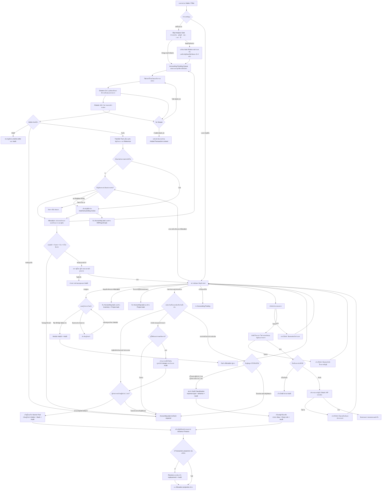

# Accounting Document Confirmation Flow

## คำอธิบาย

- Input: เอกสารบัญชีที่ผ่าน Intake/Filter, ชนิดเอกสาร, ผู้ขาย, รายการสินค้า, โครงการ/ไซต์, หมวดต้นทุนและบัญชี
- Output: Draft ที่แก้ต่อได้ หรือเอกสารยืนยันที่สร้าง Accounting/Stock/AP ตามชนิด โดยไม่ posting ซ้ำ
- State: `pending/needs_correction` → draft หรือ `confirmed`; เอกสารยืนยันแล้วแก้ชนิดได้เฉพาะ correction path ที่มี Audit
- Roles/permissions: เฉพาะ company `admin/manager` ที่ผ่าน RLS/RPC guard; tenant/company จาก active company เท่านั้น
- Integrations: `classify_accounting_document`, `save_accounting_document_classification`, `confirm_accounting_document`, purchase/stock/AP RPC และ Mutation Attempt Center
- Failure/retry: ต้องบอกขั้นตอนที่ล้มเหลวชัดเจนใกล้ปุ่มดำเนินการ; retry ใช้ document เดิมและ RPC idempotency/constraint ป้องกันรายการซ้ำ
- Audit: ทุก mutation ผ่าน `runWithMutationAttempt`; correction/confirmation เก็บผู้ทำ เวลา เหตุผล และ document id
- Owner: Accounting Admin/Manager; ทีมระบบเป็นเจ้าของ RPC, validation และ error contract
- Accounting Pending Queue แยก `สลิปโอนเงิน` ออกจาก `เอกสารบัญชีทั่วไป`; ยอดสลิปหลักไม่นับ duplicate, system/context หรือ non-slip และตัวกรองทุกตัวใช้รายการ projection ชุดเดียวกัน
- ทุกสลิปผ่าน `Slip Analysis Gate` เพื่อเสนอประเภทเงิน เหตุผล ความมั่นใจ คู่บัญชี ยอด เวลา รายการซ้ำ และปลายทางก่อนแสดงฟอร์ม Drawer; Drawer แสดงเฉพาะฟิลด์ที่ประเภทนั้นต้องใช้ พร้อมรายการ blocker แบบแก้เฉพาะจุด. เมื่อ Canonical truth ยืนยัน, postable และไม่มี blocker ระบบใช้ RPC/idempotency เดิมส่งต่ออัตโนมัติ; รายการที่ยังค้างจึงต้องมีเหตุผลให้คนยืนยันหรือแก้จริง
- Master Data mode `เติมเงินทดลองจ่าย` ยืนยันเฉพาะบุคคล/บัญชีและสร้างหรือเปิด Accounting destination task เดิมแบบ idempotent; Project ยังเป็น `awaiting allocation`. บัญชีต้องตรวจ Money Lineage ก่อนส่ง Advance Finance และไม่มีการ posting/ตัดยอด/ปิด Job จาก Master Data action นี้
- Master Data ต้องยืนยันคู่ผู้โอน–ผู้รับของสลิปเดียวกันก่อน: ผู้โอนเป็น `Company/Internal`, ผู้รับเป็น `Employee/Technician`, มี Master Bank Account แยกสองรายการและผูกกลับ Transaction/Message/Document เดิมผ่าน `master_data_transfer_party_reviews`. ถ้าฝั่งใดขาดชื่อหรือเลขท้ายบัญชีจะยังไม่สร้างผลสำเร็จครึ่งเดียวและไม่ส่งต่อบัญชี.
- Drawer ของสลิปอ่านไฟล์จาก Source Contract กลางและ Timeline จาก `document_flow_events`; ไม่คัดลอกไฟล์ ไม่สร้าง destination task ใหม่ และไม่แก้ raw source
- เมื่อเปิด Drawer ผ่าน deep link ที่มี `return_to`, ปุ่มกลับ ปุ่มปิด การกด backdrop และ Escape ต้องล้าง state ของรายการปัจจุบันแล้วกลับหน้าต้นทางด้วย `replace` โดยคง query context เดิม; รับเฉพาะ internal path และเมื่อไม่มี `return_to` ให้ปิดอยู่ใน Accounting Queue ตามเดิม
- Drawer แบ่ง 2 แท็บ: รูปต้นฉบับ/AI และตรวจแก้ข้อมูล; AI อ่านซ้ำด้วย `item_id` เดียวเท่านั้นและรักษา Flow บัญชีเดิม ส่วน Admin บันทึกผ่าน `review_transfer_slip_details` ซึ่งตรวจสิทธิ์/ข้อมูลบังคับและเขียน before/after Audit แบบ idempotent
- เลขบัญชีที่สลิปปกปิดเก็บเฉพาะเลขท้ายที่มองเห็นจริง 3–4 หลัก พร้อมชื่อและธนาคาร ห้ามเติมเลขที่สี่เอง; การจับคู่ที่กำกวมยังค้าง Accounting Review และข้อมูล OCR เดิมไม่ถูกเขียนทับ
- `ตั้งต้นกองเงิน/เติมกองให้ผู้ถือเงิน` คือวัตถุประสงค์ `advance_transfer` ส่วนแหล่งเงินต้องเลือกตามข้อเท็จจริง (`company_account`, กองเดิม, เงินส่วนตัวสำรองก่อน หรือ `borrowed_funds` เงินยืมจากบุคคล/กรรมการ)
- `borrowed_funds` บังคับชื่อผู้ให้ยืมและกำหนดคืน แล้วสร้าง `borrowed_fund_obligations` สถานะ `outstanding` เชื่อมสลิป, Money Lineage, Transaction และกองผู้ถือเงินในคำสั่งยืนยันเดียวกันแบบ idempotent; เงินก้อนนี้ไม่ใช่รายได้หรือค่าใช้จ่าย ค่าใช้จ่ายเกิดภายหลังเมื่อมีหลักฐานการใช้เงินจริง
- เมื่อแหล่งเงินเป็น `company_account` หรือ `personal_reimbursement` ระบบถือเป็นเงินตั้งต้น/เติมกอง: ผู้โอนเป็น Source Fact ไม่ต้องอยู่ทะเบียนผู้ถือเงิน ผู้รับต้องตรงผู้ถือเงินที่เปิดใช้งานหนึ่งรายและบัญชีรับต้องไม่ผูกกับบุคคลอื่น; Flow กองเดิมยังคงตรวจผู้โอนเป็นผู้ถือเงินและผู้รับเป็นพนักงานรายวัน
- Drawer ต้องเรียกแหล่งเงินตามทิศทางจริง: `company_account`/`personal_reimbursement` คือเงินใหม่ที่เข้ากองผู้รับ ส่วน `reserve_fund` คือการโอนต่อจากกองเดิมและผู้โอนต้องเป็นผู้ถือเงิน เมื่อ Admin เปลี่ยนแหล่งเงิน ระบบล้าง Error จาก Gate ก่อนหน้าทันทีเพื่อไม่แสดงข้อความค้าง
- ก่อนเชื่อมคู่ผู้โอน/ผู้รับ ระบบบันทึก Draft Classification ผ่าน `classify_transfer_slip_advance_draft_v1`; RPC ตรวจ Allocation, กันซ้ำด้วย event key และบันทึก Audit แล้วจึงเรียก Party Resolver
- Failure/retry: AI ล้มเหลวไม่แก้ routing และกดลองใหม่รายการเดิมได้; draft/ขอข้อมูลเพิ่มทำให้ Accounting task เป็น `recheck_required`; ยืนยันไม่ได้หากชื่อผู้โอน ผู้รับ ยอด หรือวันเวลาไม่ครบ
- ปลายทางแรกของสลิปยังเป็นบัญชีเสมอ ส่วนป้าย `เบิกล่วงหน้า`/`ค่าแรง` แสดงเส้นทางต่อเมื่อมี evidence ใน candidate department หรือข้อมูลธุรกรรมเท่านั้น
- `transfer_slip_money_lineages` เก็บเส้นทางเงินที่ Admin ตรวจแล้วแยกจาก Raw/OCR: แหล่งเงิน, รหัสกองเงิน, ผู้ถือเงิน, ผู้จ่ายจริง, ผู้รับสุดท้าย, โครงการ/ไซต์, ยอดตั้งต้น/จ่าย/คืน/คงเหลือ และทอดการส่งทั้งหมด โดยมีหนึ่ง projection ต่อ Document Flow Item
- `review_transfer_slip_money_lineage` บันทึกข้อมูลสลิปและสายเงินใน transaction เดียว ใช้ `event_key` ป้องกันคำสั่งซ้ำ และสร้างงานต่อเฉพาะตอน `confirm`: ค่าแรง→HR, วัสดุ→Inventory+Project, ค่าใช้จ่ายโครงการ→Project, ค่าใช้จ่ายทั่วไป→Accounting Posting, เงินสำรอง→Advance Case เมื่อจับคู่ผู้ถือเงินได้
- เงินสำรองที่ยังจับคู่ผู้ถือเงินไม่ได้จะคง Accounting task เป็น `recheck_required`; ระบบไม่เดาชื่อ ไม่สร้าง Advance ซ้ำ และไม่ถือว่าเดินทางถึงปลายทางแล้ว
- เงินเบิกล่วงหน้าที่ผู้โอนเป็นผู้ถือเงินสำรองจ่ายและผู้รับเป็นพนักงาน จะตรวจสองฝั่งจาก Transaction เดียวกัน: ชื่อผู้โอน/alias ต้องตรงผู้ถือเงินเพียงหนึ่งคน และชื่อผู้รับ/alias ต้องตรงพนักงานรายวันเพียงหนึ่งคน เมื่อ Admin ยืนยัน ระบบเชื่อมเลขท้ายบัญชีกับ Master Bank Account ทั้งสองฝั่ง บันทึก `transfer_slip_advance_party_links` และ Audit แล้วดำเนิน RPC เดิมต่อทันที; หากไม่พบ หลายคน หรือเลขบัญชีชนเจ้าของอื่น จะค้างเฉพาะเหตุผลนั้นและไม่สร้างข้อมูลครึ่งเดียว
- Money Lineage v2 แยก `Transfer Fact` (ข้อเท็จจริงจากสลิป) ออกจาก `transfer_slip_money_allocations` (วัตถุประสงค์/จำนวน/โครงการ/ผู้รับผิดชอบ) สลิปหนึ่งใบจึงแบ่งค่าแรง วัสดุ ผู้รับเหมา หรือหลายโครงการได้ โดยไม่แก้ Raw/OCR
- Allocation ที่ยืนยันเป็น `payroll` หรือ `advance_transfer` จะลองจับคู่ชื่อผู้รับกับพนักงานรายวันของบริษัทแบบ exact normalized name หรือ alias ที่เคยยืนยันเท่านั้น เมื่อพบหนึ่งคนพอดีจะสร้าง Employee Money Holding Ledger แบบ idempotent; ถ้าไม่พบ/พบหลายคน/สลิปซ้ำจะคง Match Queue พร้อมเหตุผล และไม่สร้าง Payroll Line
- Holding Ledger แยก `wage_paid` ออกจาก `advance_issued`; รายการเริ่มที่ `matched_pending_review` และการแก้ผิดใช้ Reject/Reversal/Adjustment แบบ append-only จึงย้อนเส้นทางเงินภายหลังได้โดยไม่เปลี่ยน Transfer Fact
- เมื่อ Allocation projection ถูกสร้างหลัง Transaction projection เดิมของเงินก้อนเดียวกัน Trigger จะ Reverse เฉพาะแถวเดิมโดยไม่ลบข้อมูล เก็บ `replaced_by_entry_id`/Allocation ใน snapshot และเขียน Ledger Audit; รายงานจึงนับ Active Ledger เพียงหนึ่งรายการ ส่วนข้อมูลเก่าซ่อมแบบระบุ ID หลังตรวจคู่ Transaction/พนักงาน/ประเภท/ยอดตรงกันเท่านั้น
- `root_lineage_id` และ `parent_lineage_id` เชื่อมสลิปคนละใบเป็นสายเงินเดียวกัน เช่น บริษัท → ผู้ถือเงิน → ช่าง/ร้านค้า/โครงการ → เงินคืน; สลิปเติมเงินสำรองต้องเป็น Allocation เดียว ส่วนการใช้เงินจริงเชื่อมเป็นสลิปลูกเพื่อไม่คาดเดาการใช้เงินล่วงหน้า
- ยืนยันและส่งปลายทางได้ต่อเมื่อ `ยอดตามสลิป = รวม Allocation + ยอดคืน + ยอดยังไม่จัดสรร` และยอดยังไม่จัดสรรเป็นศูนย์; หากไม่ครบยังบันทึก Draft/ขอข้อมูลเพิ่มได้และ Accounting task ไม่ถูกปิด
- Allocation ที่แก้ไขไม่ถูกลบ: เวอร์ชันก่อนถูกทำเครื่องหมาย `superseded` และ `document_flow_events` เก็บ before/after, actor, เวลา, Root/Parent และยอดกระทบทั้งหมดด้วย `event_key` เดิม
- กรณีจ่ายร้านค้าจากบัญชีบุคคล ให้แยก `payer_name`/ผู้ถือเงินออกจาก `vendor_id`/ร้านค้าจริงเสมอ: เลขภาษีเป็นหลักฐานตรงที่สุด, บัญชีธนาคารใช้ได้ต่อเมื่อเป็น alias ที่ Admin ยืนยัน, ส่วนชื่อหรือบริบทอย่างเดียวเป็นเพียง Candidate. การยืนยัน `vendor_payment` จะถูกฐานข้อมูลปฏิเสธถ้ายังไม่มี Vendor Match ที่มีหลักฐาน

## Change record

| Version | Date | Rationale | Impact | Migration | Verification | Rollback |
| --- | --- | --- | --- | --- | --- | --- |
| v2.8 | 31/8/2569 | ปุ่มปิด Drawer จาก Advance Holder ล้างรายละเอียดแต่ค้างหน้า Accounting ทำให้ผู้ใช้เสียบริบทต้นทาง | ใช้ safe internal `return_to` ร่วมกันสำหรับปุ่มกลับ ปุ่มปิด backdrop และ Escape; คง Holder/Transaction query และ fallback อยู่ Accounting Queue | ไม่มี migration และไม่เขียนข้อมูลธุรกิจ | navigation/security contract, Accounting transfer-slip tests, typecheck, lint, build และ authenticated round-trip smoke | revert utility/close navigation; Source, Lineage, Allocation และ Audit ไม่เปลี่ยน |
| v2.7 | 31/8/2569 | รองรับเงินยืมจากบุคคล/กรรมการเป็นต้นทางกองเงิน | เพิ่ม Source Gate, เจ้าหนี้, วันครบกำหนด, ยอดคงค้าง, RLS และ Audit ก่อนส่ง Advance Finance | `20260831072537_borrowed_fund_obligations.sql` | contract, typecheck, lint, build, migration dry-run/apply และ authenticated Drawer smoke | ปิดตัวเลือกและ revoke RPC; คง Lineage/ภาระหนี้/Audit เพื่อ recovery |
| v2.6 | 31/8/2569 | Admin could select the old-holder fund source for a new starting-fund slip and keep seeing a stale gate error | Rename source choices by money direction, warn on the old-holder path and clear stale gate feedback when the source changes | None | starting-fund UI contract, typecheck/lint/build and authenticated Drawer smoke | Revert UI commit; no confirmed data or Audit is changed |
| v2.5 | 31/8/2569 | Starting-fund slip was incorrectly validated as holder-to-daily-worker transfer | Route company/personal starting funds through recipient-holder gate; preserve payer as source fact and link only the receiving holder account | `20260831064514_starting_fund_recipient_holder_gate.sql` | starting-fund/legacy/idempotency/security contracts, migration dry-run, typecheck/lint/build and authenticated Drawer smoke | Revoke v1 RPC and restore manual review; preserve source, party link, bank fact and Audit |
| v2.4 | 31/8/2569 | Admin had to search again after selecting an unresolved holder movement | Accept exact Transaction review deep links, provide a safe return to the same holder context, and reject suspicious transfer dates from the auto-route gate | No migration or financial write | analysis/realtime contracts, typecheck, lint, build and authenticated round-trip smoke | Revert UI/helper commit; source Transaction, Allocation, destination and Audit remain unchanged |
| v2.1 | 28/8/2569 | ป้องกันสลิปวัสดุที่เลือกโครงการแล้วถูก RPC รุ่นเก่ารายงานว่าขาด `project_id` | ซิงก์ project/site จาก Allocation แรกที่มีขอบเขตโครงการไปยัง legacy lineage payload โดย Allocation v2 ยังเป็น source of truth | ไม่มี | transfer lineage regression, typecheck, lint, build และ Accounting Drawer smoke | revert helper/payload mapping; Allocation และ Audit เดิมไม่เปลี่ยน |
| v2.3 | 27/8/2569 | Transaction projection เดิมและ Allocation projection ที่ยืนยันแล้วทำให้ยอด 400 บาทถูกนับซ้ำ | Trigger Reverse projection เดิมแบบไม่ลบข้อมูล พร้อม replacement metadata/Ledger Audit; ซ่อมรายการเก่าเฉพาะ ID หลังตรวจเงื่อนไขครบ | `20260827004227_reconcile_employee_money_projection_scope.sql`, `20260827004553_fix_projection_reversal_contract.sql` | active count=1, Ledger/Flow Audit, trigger/constraint contract, test/typecheck/lint/build และ authenticated Advance smoke | ปิด Trigger; ใช้ Audit before_data คืนสถานะแถวเดิมเฉพาะเมื่อ Allocation ใหม่ถูก Reverse ก่อน ห้ามลบ Ledger/Audit |
| v2.1 | 27/8/2569 | สลิปเงินเบิกล่วงหน้ามีข้อมูลผู้โอนและผู้รับครบ แต่ Drawer ยังบังคับกรอกผู้ถือเงินและไม่เชื่อมบัญชีพนักงาน | ตรวจสองฝั่ง, เติมผู้ถือเงินอัตโนมัติ, เชื่อมบัญชีทั้งสองฝั่งเมื่อ Admin ยืนยัน และเดิน Flow เดิมต่อแบบ idempotent พร้อม conflict gate/Audit | `20260827003009_transfer_slip_advance_party_auto_link.sql` | preview/apply/conflict/idempotency contract, migration/RLS, typecheck/lint/build และ authenticated Accounting/Advance smoke | revoke RPC/ซ่อน panel; คง Party Link, Bank Fact, Alias, Source และ Audit เพื่อ recovery |
| v2.0 | 27/8/2569 | รายการเบิกล่วงหน้าของช่างรายวันที่มีสิทธิ์ ณ วันโอนค้าง Accounting เมื่อช่างลาออกภายหลังหรือชื่อสลิปมีคำนำหน้า `น.ส.` | ใช้สิทธิ์ตามวันโอน, สร้างบัญชีพัก, ปิด Accounting Task และส่ง Employee Money Review พร้อม Audit; ไม่ใช้ทะเบียนผู้ถือเงินรายเดือน | `20260826235253_reconcile_daily_employee_advance_routing.sql`, `20260826235415_fix_daily_employee_advance_destination.sql` | temporal/name/route contract, Production reconciliation, typecheck/lint/build และ authenticated Accounting/Advance smoke | ปิด reconcile trigger/คืน RPC; คง Ledger/Audit และ Source เดิม |
| v1.9 | 27/8/2569 | แก้ RPC v2 ที่ใช้ชื่อตัวแปร Project/Site ซ้ำกับคอลัมน์จน Draft/Confirm หยุดด้วย PostgreSQL 42702 | เปลี่ยนเฉพาะชื่อตัวแปรภายใน; Gate, Allocation, Route, Audit และข้อมูลเดิมคงเดิม | `20260826233010_fix_transfer_slip_allocation_project_ambiguity.sql` | RPC contract, Draft/Confirm runtime, typecheck/lint/build และ authenticated Drawer | restore function definition ก่อนหน้า; ไม่ลบ Source/Lineage/Allocation/Audit |
| v1.8 | 27/8/2569 | ทำให้ Admin เห็นตัวเลือกกรณีเงินสำรองจ่ายซื้อจากร้านค้าที่รับผ่านบัญชีบุคคลโดยตรง | เปลี่ยนป้าย `vendor_payment` เป็น `จ่ายผู้ขายผ่านบัญชีบุคคล (เงินสำรองจ่าย)` และแสดงคำแนะนำแยกเจ้าของบัญชีกับ Vendor Master; routing/data contract เดิมไม่เปลี่ยน | ไม่มี | analysis-gate contract, typecheck, lint, build และ Production Drawer | revert label/help text; Vendor Match/Lineage/Audit เดิมไม่เปลี่ยน |
| v1.6 | 26/8/2569 | Require a reviewed two-party transfer pair before Master Data routes advance funding to Accounting | Sender/recipient Master references share one source transaction; atomic v2 command prevents half-saved parties and duplicate tasks | `20260826223000_master_data_transfer_party_review.sql` | pair/RLS/idempotency contract, lint/typecheck/build and Master Data → Accounting smoke | Revoke v2 RPC/use v1 command; retain pair/account/audit rows for reconciliation |
| v1.6.1 | 26/8/2569 | Production confirmation returned `function min(uuid) does not exist` before saving the reviewed advance pair | Replace UUID `min()` matching with deterministic ordered `array_agg()` selection; no business-flow or source-data change | `20260826224000_fix_master_advance_uuid_min.sql` | UUID-fix contract, migration dry-run/apply, typecheck/lint/build and authenticated Drawer error-path smoke | Restore the prior RPC definition; retain all source, candidate, pair, task, lineage and Audit rows |
| v1.5 | 26/8/2569 | รับรายการเติมเงินทดลองจ่ายจาก Master Data โดยไม่บังคับ Project และไม่ข้ามการตรวจบัญชี | สร้าง/reopen Accounting Pending task เดิม, ผูก Advance Finance lineage และเก็บ Project รอจัดสรร; ไม่ posting | `20260826190500_master_data_employee_advance_funding.sql` | RPC/idempotency/source/audit contract, lint/typecheck/build และ Accounting queue smoke | Revoke RPC/restore gate; retain source, Accounting task, lineage and Audit |
| v1.0 | 23/8/2569 | ลงทะเบียน flow จริงและคืน error ที่ระบุขั้นตอน หลัง regression ทำให้เหลือข้อความรวม | AccountingDocuments error feedback และ regression contract | ไม่มี | focused test, lint, build และ dialog feedback | คืนข้อความรวมได้โดยไม่เปลี่ยนข้อมูลหรือ RPC |
| v1.1 | 23/8/2569 | ผู้ใช้ไม่เห็นสลิปที่ส่งบัญชี เพราะสลิปยังเป็นงานรอตรวจใน destination task ไม่ใช่ `accounting_documents` | เพิ่ม Accounting Pending Queue แบบอ่านอย่างเดียวจาก `document_flow_destination_tasks` + `document_flow_items` + `financial_transactions`; ไม่รวม/เขียนทับเอกสารที่ยืนยันแล้ว | ตรวจ count จาก Production, typecheck/lint/build และ smoke หน้าเอกสารบัญชี | ถอนส่วนคิวใหม่ได้โดยไม่แตะ raw/task/audit; เอกสารบัญชีเดิมยังใช้ query เดิม |
| v1.2 | 23/8/2569 | แยกคิวสลิปให้ทีมบัญชีเห็นหลักฐาน สถานะ และงานต่อเนื่องโดยไม่ปะปนเอกสารทั่วไป | เพิ่ม Tab สลิป/เอกสารทั่วไป, count และ filter กลาง, คอลัมน์ธุรกรรม/Source/ปลายทาง, Drawer รูปจริงและ Audit; query เดิมยังเป็น read-only | ไม่มี | contract test, typecheck, lint, build, Local และ Production authenticated smoke | ถอน Tab/Drawer/helper ได้โดยไม่แตะ raw, task, transaction หรือ audit |
| v1.2.1 | 23/8/2569 | Production smoke พบชื่อคอลัมน์ duplicate ใน query ไม่ตรง schema จริง | เปลี่ยน projection เป็น `financial_transactions.duplicate_of` ทำให้ข้อมูลธุรกรรมและ count แสดงตามข้อมูลจริง | ไม่มี | authenticated Production smoke ต้องไม่มี schema alert และ count duplicate ต้องตรงรายการ | คืน query ก่อนหน้าได้แต่จะทำให้รายละเอียดสลิปโหลดไม่สำเร็จ จึงควร rollback ทั้ง v1.2 แทน |
| v1.3 | 23/8/2569 | ให้ทีมบัญชีแก้ค่าที่ AI อ่านไม่ได้และสั่งอ่านใหม่จากรูปเดียวกันโดยไม่หลุด Flow | Drawer 2 แท็บ, single-item AI reread, manual draft/confirm/request info และ before/after Audit | `20260823111848_transfer_slip_drawer_review.sql`; deploy `reprocess-transfer-slips` | review contract, queue test, typecheck, lint, build และ authenticated page smoke | ซ่อน action/UI, ถอน EXECUTE RPC และ rollback Edge Function; raw source/task/audit เดิมไม่ถูกลบ |
| v1.4 | 23/8/2569 | ติดตามว่าเงินมาจากกองใด ผ่านใครบ้าง และส่งงานต่อหลังบัญชียืนยัน | เพิ่ม Money Lineage, balance gate, multi-hop route, project/site และ idempotent destination routing | `20260823122135_transfer_slip_money_lineage_routing.sql` | money-lineage/review/queue tests, migration query, lint/typecheck/build และ authenticated page smoke | ปิดปุ่มยืนยันและส่งต่อ, revoke RPC/ตัด UI; เก็บ Raw, transaction, lineage และ audit เพื่อ recovery |
| v1.5 | 26/8/2569 | สลิปหนึ่งใบอาจแบ่งหลายวัตถุประสงค์/หลายโครงการ และการใช้เงินหลายใบต้องย้อนกลับถึงกองเงินต้นทางได้ | แยก Transfer Fact กับ Allocation, เพิ่ม Root/Parent Lineage, balance gate และ multi-destination routing แบบ idempotent | `20260826220000_transfer_slip_money_allocations_v2.sql` | allocation/lineage contracts, migration dry-run, lint/typecheck/build และ authenticated Accounting Drawer smoke | ปิด RPC/UI v2 แล้วกลับใช้ RPC v1; เก็บ Allocation/Root/Parent/Audit ที่เกิดแล้วเพื่อ recovery ห้ามลบ Raw/OCR |
| v1.6 | 26/8/2569 | แยกบัญชีบุคคลผู้จ่ายจากร้านค้าจริง ป้องกันการจับคู่ด้วยชื่ออย่างเดียว และค้างรายการคลุมเครือก่อนยืนยัน | เพิ่ม Vendor Match/บัญชี alias, ด่าน DB และช่องจับคู่ใน Drawer; ไม่แก้ Raw/OCR/Source | `20260826044252_transfer_slip_vendor_payment_matching.sql`, `20260826044610_revoke_transfer_slip_vendor_match_trigger_execute.sql` | matching contract, schema/RLS review, typecheck/lint/build และ Accounting Drawer smoke | ปิด trigger/RPC/controls; คง lineage, source, match และ Audit เดิม |
| v1.7 | 26/8/2569 | ให้สลิปค่าแรง/เงินเบิกล่วงหน้าที่ชื่อช่างรายวันตรงทะเบียนมีบัญชีพักก่อน Payroll และรองรับแก้ย้อนหลังโดยไม่ลบหลักฐาน | เพิ่ม exact-name/alias gate, Match Queue, Employee Money Ledger, append-only adjustment และหน้า Summary ใน Advance Settlements | `20260826231000_employee_money_ledger.sql`, `20260826231500_employee_money_legacy_backfill.sql` | name/duplicate/date/math/adjustment contracts, typecheck/lint/build และ authenticated Advance smoke | ปิด projection trigger/RPC และซ่อน Summary; เก็บ Source/Ledger/Audit เพื่อ recovery และไม่เปลี่ยน Payroll เดิม |
## Canonical Operational Truth v1

- ทุก Module ต้องอ่านสลิปโอนเงินผ่าน `transfer_slip_operational_truth_v1` เป็นแหล่งข้อมูลใช้งานจริงเพียงจุดเดียว
- `canonical_*` ใช้คำนวณ ลงบัญชี ส่งต่อ และทำรายงานได้เฉพาะเมื่อ `truth_status=confirmed` และ `is_postable=true`
- `evidence_*` คือรูปสลิป/ค่าที่ AI หรือ OCR อ่านได้ ใช้ตรวจสอบและ Audit เท่านั้น ห้ามใช้เป็นผู้จ่าย ผู้ถือเงิน ผู้รับ หรือยอดธุรกิจโดยตรง
- รายการ `needs_review`, `needs_information` และ `duplicate` ต้องไม่เปิดให้ลงบัญชี แม้หลักฐานจะมีชื่อหรือยอดครบ
- Raw, OCR, Source, Document ID, Message ID และ Audit ไม่ถูกลบ เพื่อให้ตรวจย้อนหลังได้ แต่ไม่ถือเป็น Master/Operational data อีกชุด
- หน้า Accounting Pending Queue และรายงานเงินสำรองต้องไม่สร้าง fallback logic ของตนเอง หากยังไม่มี Canonical ให้แสดงว่า `ยังไม่ยืนยัน` เท่านั้น
