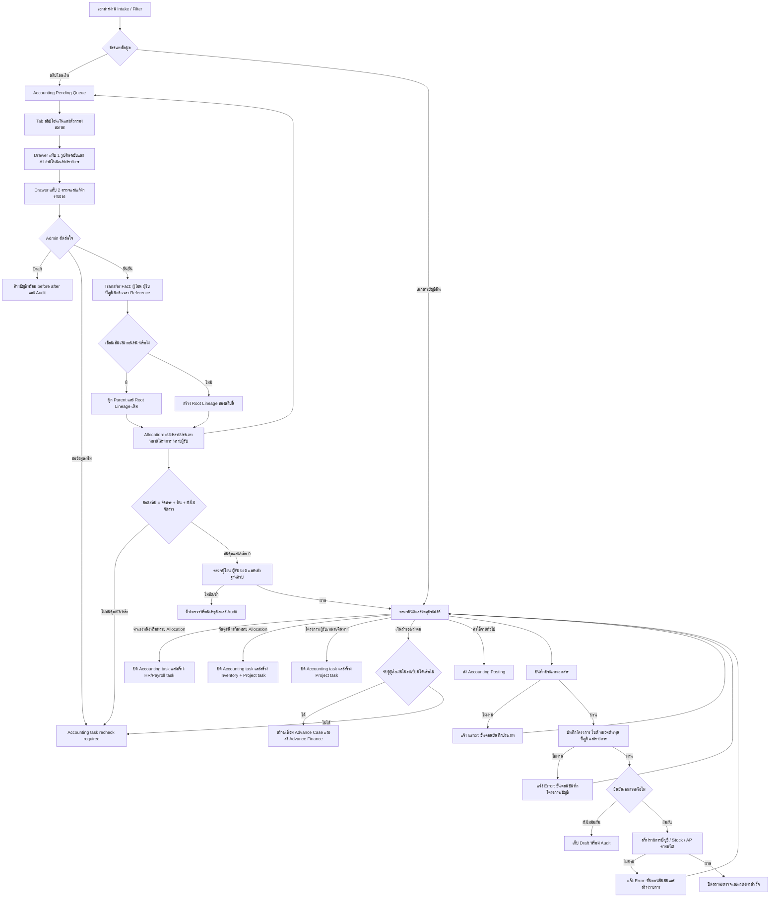

# Accounting Document Confirmation Flow

## คำอธิบาย

- Input: เอกสารบัญชีที่ผ่าน Intake/Filter, ชนิดเอกสาร, ผู้ขาย, รายการสินค้า, โครงการ/ไซต์, หมวดต้นทุนและบัญชี
- Output: Draft ที่แก้ต่อได้ หรือเอกสารยืนยันที่สร้าง Accounting/Stock/AP ตามชนิด โดยไม่ posting ซ้ำ
- State: `pending/needs_correction` → draft หรือ `confirmed`; เอกสารยืนยันแล้วแก้ชนิดได้เฉพาะ correction path ที่มี Audit
- Roles/permissions: เฉพาะ company `admin/manager` ที่ผ่าน RLS/RPC guard; tenant/company จาก active company เท่านั้น
- Integrations: `classify_accounting_document`, `save_accounting_document_classification`, `confirm_accounting_document`, purchase/stock/AP RPC และ Mutation Attempt Center
- Failure/retry: ต้องบอกขั้นตอนที่ล้มเหลวชัดเจนใกล้ปุ่มดำเนินการ; retry ใช้ document เดิมและ RPC idempotency/constraint ป้องกันรายการซ้ำ
- Audit: ทุก mutation ผ่าน `runWithMutationAttempt`; correction/confirmation เก็บผู้ทำ เวลา เหตุผล และ document id
- Owner: Accounting Admin/Manager; ทีมระบบเป็นเจ้าของ RPC, validation และ error contract
- Accounting Pending Queue แยก `สลิปโอนเงิน` ออกจาก `เอกสารบัญชีทั่วไป`; ยอดสลิปหลักไม่นับ duplicate, system/context หรือ non-slip และตัวกรองทุกตัวใช้รายการ projection ชุดเดียวกัน
- Master Data mode `เติมเงินทดลองจ่าย` ยืนยันเฉพาะบุคคล/บัญชีและสร้างหรือเปิด Accounting destination task เดิมแบบ idempotent; Project ยังเป็น `awaiting allocation`. บัญชีต้องตรวจ Money Lineage ก่อนส่ง Advance Finance และไม่มีการ posting/ตัดยอด/ปิด Job จาก Master Data action นี้
- Master Data ต้องยืนยันคู่ผู้โอน–ผู้รับของสลิปเดียวกันก่อน: ผู้โอนเป็น `Company/Internal`, ผู้รับเป็น `Employee/Technician`, มี Master Bank Account แยกสองรายการและผูกกลับ Transaction/Message/Document เดิมผ่าน `master_data_transfer_party_reviews`. ถ้าฝั่งใดขาดชื่อหรือเลขท้ายบัญชีจะยังไม่สร้างผลสำเร็จครึ่งเดียวและไม่ส่งต่อบัญชี.
- Drawer ของสลิปอ่านไฟล์จาก Source Contract กลางและ Timeline จาก `document_flow_events`; ไม่คัดลอกไฟล์ ไม่สร้าง destination task ใหม่ และไม่แก้ raw source
- Drawer แบ่ง 2 แท็บ: รูปต้นฉบับ/AI และตรวจแก้ข้อมูล; AI อ่านซ้ำด้วย `item_id` เดียวเท่านั้นและรักษา Flow บัญชีเดิม ส่วน Admin บันทึกผ่าน `review_transfer_slip_details` ซึ่งตรวจสิทธิ์/ข้อมูลบังคับและเขียน before/after Audit แบบ idempotent
- Failure/retry: AI ล้มเหลวไม่แก้ routing และกดลองใหม่รายการเดิมได้; draft/ขอข้อมูลเพิ่มทำให้ Accounting task เป็น `recheck_required`; ยืนยันไม่ได้หากชื่อผู้โอน ผู้รับ ยอด หรือวันเวลาไม่ครบ
- ปลายทางแรกของสลิปยังเป็นบัญชีเสมอ ส่วนป้าย `เบิกล่วงหน้า`/`ค่าแรง` แสดงเส้นทางต่อเมื่อมี evidence ใน candidate department หรือข้อมูลธุรกรรมเท่านั้น
- `transfer_slip_money_lineages` เก็บเส้นทางเงินที่ Admin ตรวจแล้วแยกจาก Raw/OCR: แหล่งเงิน, รหัสกองเงิน, ผู้ถือเงิน, ผู้จ่ายจริง, ผู้รับสุดท้าย, โครงการ/ไซต์, ยอดตั้งต้น/จ่าย/คืน/คงเหลือ และทอดการส่งทั้งหมด โดยมีหนึ่ง projection ต่อ Document Flow Item
- `review_transfer_slip_money_lineage` บันทึกข้อมูลสลิปและสายเงินใน transaction เดียว ใช้ `event_key` ป้องกันคำสั่งซ้ำ และสร้างงานต่อเฉพาะตอน `confirm`: ค่าแรง→HR, วัสดุ→Inventory+Project, ค่าใช้จ่ายโครงการ→Project, ค่าใช้จ่ายทั่วไป→Accounting Posting, เงินสำรอง→Advance Case เมื่อจับคู่ผู้ถือเงินได้
- เงินสำรองที่ยังจับคู่ผู้ถือเงินไม่ได้จะคง Accounting task เป็น `recheck_required`; ระบบไม่เดาชื่อ ไม่สร้าง Advance ซ้ำ และไม่ถือว่าเดินทางถึงปลายทางแล้ว
- Money Lineage v2 แยก `Transfer Fact` (ข้อเท็จจริงจากสลิป) ออกจาก `transfer_slip_money_allocations` (วัตถุประสงค์/จำนวน/โครงการ/ผู้รับผิดชอบ) สลิปหนึ่งใบจึงแบ่งค่าแรง วัสดุ ผู้รับเหมา หรือหลายโครงการได้ โดยไม่แก้ Raw/OCR
- `root_lineage_id` และ `parent_lineage_id` เชื่อมสลิปคนละใบเป็นสายเงินเดียวกัน เช่น บริษัท → ผู้ถือเงิน → ช่าง/ร้านค้า/โครงการ → เงินคืน; สลิปเติมเงินสำรองต้องเป็น Allocation เดียว ส่วนการใช้เงินจริงเชื่อมเป็นสลิปลูกเพื่อไม่คาดเดาการใช้เงินล่วงหน้า
- ยืนยันและส่งปลายทางได้ต่อเมื่อ `ยอดตามสลิป = รวม Allocation + ยอดคืน + ยอดยังไม่จัดสรร` และยอดยังไม่จัดสรรเป็นศูนย์; หากไม่ครบยังบันทึก Draft/ขอข้อมูลเพิ่มได้และ Accounting task ไม่ถูกปิด
- Allocation ที่แก้ไขไม่ถูกลบ: เวอร์ชันก่อนถูกทำเครื่องหมาย `superseded` และ `document_flow_events` เก็บ before/after, actor, เวลา, Root/Parent และยอดกระทบทั้งหมดด้วย `event_key` เดิม

## Change record

| Version | Date | Rationale | Impact | Migration | Verification | Rollback |
| --- | --- | --- | --- | --- | --- | --- |
| v1.6 | 26/8/2569 | Require a reviewed two-party transfer pair before Master Data routes advance funding to Accounting | Sender/recipient Master references share one source transaction; atomic v2 command prevents half-saved parties and duplicate tasks | `20260826223000_master_data_transfer_party_review.sql` | pair/RLS/idempotency contract, lint/typecheck/build and Master Data → Accounting smoke | Revoke v2 RPC/use v1 command; retain pair/account/audit rows for reconciliation |
| v1.6.1 | 26/8/2569 | Production confirmation returned `function min(uuid) does not exist` before saving the reviewed advance pair | Replace UUID `min()` matching with deterministic ordered `array_agg()` selection; no business-flow or source-data change | `20260826224000_fix_master_advance_uuid_min.sql` | UUID-fix contract, migration dry-run/apply, typecheck/lint/build and authenticated Drawer error-path smoke | Restore the prior RPC definition; retain all source, candidate, pair, task, lineage and Audit rows |
| v1.5 | 26/8/2569 | รับรายการเติมเงินทดลองจ่ายจาก Master Data โดยไม่บังคับ Project และไม่ข้ามการตรวจบัญชี | สร้าง/reopen Accounting Pending task เดิม, ผูก Advance Finance lineage และเก็บ Project รอจัดสรร; ไม่ posting | `20260826190500_master_data_employee_advance_funding.sql` | RPC/idempotency/source/audit contract, lint/typecheck/build และ Accounting queue smoke | Revoke RPC/restore gate; retain source, Accounting task, lineage and Audit |
| v1.0 | 23/8/2569 | ลงทะเบียน flow จริงและคืน error ที่ระบุขั้นตอน หลัง regression ทำให้เหลือข้อความรวม | AccountingDocuments error feedback และ regression contract | ไม่มี | focused test, lint, build และ dialog feedback | คืนข้อความรวมได้โดยไม่เปลี่ยนข้อมูลหรือ RPC |
| v1.1 | 23/8/2569 | ผู้ใช้ไม่เห็นสลิปที่ส่งบัญชี เพราะสลิปยังเป็นงานรอตรวจใน destination task ไม่ใช่ `accounting_documents` | เพิ่ม Accounting Pending Queue แบบอ่านอย่างเดียวจาก `document_flow_destination_tasks` + `document_flow_items` + `financial_transactions`; ไม่รวม/เขียนทับเอกสารที่ยืนยันแล้ว | ตรวจ count จาก Production, typecheck/lint/build และ smoke หน้าเอกสารบัญชี | ถอนส่วนคิวใหม่ได้โดยไม่แตะ raw/task/audit; เอกสารบัญชีเดิมยังใช้ query เดิม |
| v1.2 | 23/8/2569 | แยกคิวสลิปให้ทีมบัญชีเห็นหลักฐาน สถานะ และงานต่อเนื่องโดยไม่ปะปนเอกสารทั่วไป | เพิ่ม Tab สลิป/เอกสารทั่วไป, count และ filter กลาง, คอลัมน์ธุรกรรม/Source/ปลายทาง, Drawer รูปจริงและ Audit; query เดิมยังเป็น read-only | ไม่มี | contract test, typecheck, lint, build, Local และ Production authenticated smoke | ถอน Tab/Drawer/helper ได้โดยไม่แตะ raw, task, transaction หรือ audit |
| v1.2.1 | 23/8/2569 | Production smoke พบชื่อคอลัมน์ duplicate ใน query ไม่ตรง schema จริง | เปลี่ยน projection เป็น `financial_transactions.duplicate_of` ทำให้ข้อมูลธุรกรรมและ count แสดงตามข้อมูลจริง | ไม่มี | authenticated Production smoke ต้องไม่มี schema alert และ count duplicate ต้องตรงรายการ | คืน query ก่อนหน้าได้แต่จะทำให้รายละเอียดสลิปโหลดไม่สำเร็จ จึงควร rollback ทั้ง v1.2 แทน |
| v1.3 | 23/8/2569 | ให้ทีมบัญชีแก้ค่าที่ AI อ่านไม่ได้และสั่งอ่านใหม่จากรูปเดียวกันโดยไม่หลุด Flow | Drawer 2 แท็บ, single-item AI reread, manual draft/confirm/request info และ before/after Audit | `20260823111848_transfer_slip_drawer_review.sql`; deploy `reprocess-transfer-slips` | review contract, queue test, typecheck, lint, build และ authenticated page smoke | ซ่อน action/UI, ถอน EXECUTE RPC และ rollback Edge Function; raw source/task/audit เดิมไม่ถูกลบ |
| v1.4 | 23/8/2569 | ติดตามว่าเงินมาจากกองใด ผ่านใครบ้าง และส่งงานต่อหลังบัญชียืนยัน | เพิ่ม Money Lineage, balance gate, multi-hop route, project/site และ idempotent destination routing | `20260823122135_transfer_slip_money_lineage_routing.sql` | money-lineage/review/queue tests, migration query, lint/typecheck/build และ authenticated page smoke | ปิดปุ่มยืนยันและส่งต่อ, revoke RPC/ตัด UI; เก็บ Raw, transaction, lineage และ audit เพื่อ recovery |
| v1.5 | 26/8/2569 | สลิปหนึ่งใบอาจแบ่งหลายวัตถุประสงค์/หลายโครงการ และการใช้เงินหลายใบต้องย้อนกลับถึงกองเงินต้นทางได้ | แยก Transfer Fact กับ Allocation, เพิ่ม Root/Parent Lineage, balance gate และ multi-destination routing แบบ idempotent | `20260826220000_transfer_slip_money_allocations_v2.sql` | allocation/lineage contracts, migration dry-run, lint/typecheck/build และ authenticated Accounting Drawer smoke | ปิด RPC/UI v2 แล้วกลับใช้ RPC v1; เก็บ Allocation/Root/Parent/Audit ที่เกิดแล้วเพื่อ recovery ห้ามลบ Raw/OCR |
