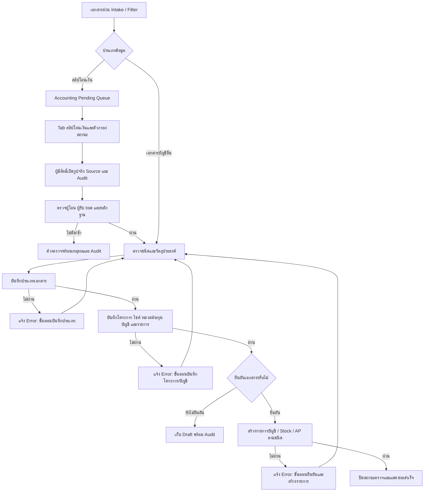

# Accounting Document Confirmation Flow

## คำอธิบาย

- Input: เอกสารบัญชีที่ผ่าน Intake/Filter, ชนิดเอกสาร, ผู้ขาย, รายการสินค้า, โครงการ/ไซต์, หมวดต้นทุนและบัญชี
- Output: Draft ที่แก้ต่อได้ หรือเอกสารยืนยันที่สร้าง Accounting/Stock/AP ตามชนิด โดยไม่ posting ซ้ำ
- State: `pending/needs_correction` → draft หรือ `confirmed`; เอกสารยืนยันแล้วแก้ชนิดได้เฉพาะ correction path ที่มี Audit
- Roles/permissions: เฉพาะ company `admin/manager` ที่ผ่าน RLS/RPC guard; tenant/company จาก active company เท่านั้น
- Integrations: `classify_accounting_document`, `save_accounting_document_classification`, `confirm_accounting_document`, purchase/stock/AP RPC และ Mutation Attempt Center
- Failure/retry: ต้องบอกขั้นตอนที่ล้มเหลวชัดเจนใกล้ปุ่มดำเนินการ; retry ใช้ document เดิมและ RPC idempotency/constraint ป้องกันรายการซ้ำ
- Audit: ทุก mutation ผ่าน `runWithMutationAttempt`; correction/confirmation เก็บผู้ทำ เวลา เหตุผล และ document id
- Owner: Accounting Admin/Manager; ทีมระบบเป็นเจ้าของ RPC, validation และ error contract
- Accounting Pending Queue แยก `สลิปโอนเงิน` ออกจาก `เอกสารบัญชีทั่วไป`; ยอดสลิปหลักไม่นับ duplicate, system/context หรือ non-slip และตัวกรองทุกตัวใช้รายการ projection ชุดเดียวกัน
- Drawer ของสลิปอ่านไฟล์จาก Source Contract กลางและ Timeline จาก `document_flow_events`; ไม่คัดลอกไฟล์ ไม่สร้าง destination task ใหม่ และไม่แก้ raw source
- ปลายทางแรกของสลิปยังเป็นบัญชีเสมอ ส่วนป้าย `เบิกล่วงหน้า`/`ค่าแรง` แสดงเส้นทางต่อเมื่อมี evidence ใน candidate department หรือข้อมูลธุรกรรมเท่านั้น

## Change record

| Version | Date | Rationale | Impact | Migration | Verification | Rollback |
| --- | --- | --- | --- | --- | --- | --- |
| v1.0 | 23/8/2569 | ลงทะเบียน flow จริงและคืน error ที่ระบุขั้นตอน หลัง regression ทำให้เหลือข้อความรวม | AccountingDocuments error feedback และ regression contract | ไม่มี | focused test, lint, build และ dialog feedback | คืนข้อความรวมได้โดยไม่เปลี่ยนข้อมูลหรือ RPC |
| v1.1 | 23/8/2569 | ผู้ใช้ไม่เห็นสลิปที่ส่งบัญชี เพราะสลิปยังเป็นงานรอตรวจใน destination task ไม่ใช่ `accounting_documents` | เพิ่ม Accounting Pending Queue แบบอ่านอย่างเดียวจาก `document_flow_destination_tasks` + `document_flow_items` + `financial_transactions`; ไม่รวม/เขียนทับเอกสารที่ยืนยันแล้ว | ตรวจ count จาก Production, typecheck/lint/build และ smoke หน้าเอกสารบัญชี | ถอนส่วนคิวใหม่ได้โดยไม่แตะ raw/task/audit; เอกสารบัญชีเดิมยังใช้ query เดิม |
| v1.2 | 23/8/2569 | แยกคิวสลิปให้ทีมบัญชีเห็นหลักฐาน สถานะ และงานต่อเนื่องโดยไม่ปะปนเอกสารทั่วไป | เพิ่ม Tab สลิป/เอกสารทั่วไป, count และ filter กลาง, คอลัมน์ธุรกรรม/Source/ปลายทาง, Drawer รูปจริงและ Audit; query เดิมยังเป็น read-only | ไม่มี | contract test, typecheck, lint, build, Local และ Production authenticated smoke | ถอน Tab/Drawer/helper ได้โดยไม่แตะ raw, task, transaction หรือ audit |
