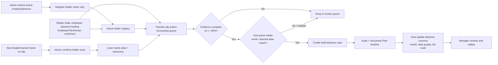

# Advance Holder Registry Flow

## Purpose

Maintain the approved people who may receive a company advance. Admin registers only a holder name; bank/account evidence stays on each source slip, and confirmed variant names are learned as aliases.

## Inputs, outputs, permissions and safeguards

- Input: active employee/person, optional learned alias, and active flag. The system reads bank/account evidence from each slip; Admin does not preconfigure it.
- Output: one source-of-truth holder record plus aliases; eligible transfer slips create only a draft `employee_advance_case`.
- In `employee_advance_funding` mode, Master Data may register/link the holder only when the normalized recipient resolves to exactly one active employee/person in the same company. Missing or ambiguous identity still goes to Accounting review; the system never guesses a person. Project is intentionally left awaiting allocation until spending/settlement.
- Only company admin/manager can create, update, activate, or deactivate a holder through central RPCs. Direct client mutations are revoked; all changes write an append-only audit row.
- Auto-match requires one active holder and a complete normalized recipient name/learned-alias match. Normalization removes Thai person/company titles (`นาย`, `นาง`, `นางสาว`, `น.ส.`) and whitespace, then lowercases the remaining name. A first-seen English/variant name stays in review until Admin chooses its holder once; then the alias is learned and historical slips are reprocessed. Missing, ambiguous, duplicate, dismissed, or low-confidence slips remain in review.
- A daily employee is not created as a standalone sub-advance by this matching rule. A sub-advance always requires a selected parent advance and retains that parent route.

## Failure, retry and rollback

- Inactive person, cross-company reference, duplicate alias, or missing permission is rejected without writing a holder or advance.
- If the name suggestion is wrong or not confident, Admin leaves it unconfirmed; no case is created from uncertainty.
- Correct the holder registry or reprocess the original slip; matching is idempotent because each financial transaction can fund only one root advance case.
- Activity timestamps are presentation-validated before display. Invalid, unparsable, or future-dated values are shown as `วันที่ผิดปกติ`; the original timestamp remains unchanged for audit and review.
- Rollback: disable the auto-match trigger and hide the registry UI. Existing records, source slips, cases, and audit/timeline remain for traceability.

## Change record

| Version | Date | Rationale / impact | Migration | Verification | Rollback |
|---|---|---|---|---|---|
| v1.5 | 26/8/2569 | Link a confirmed employee advance-funding receipt to the existing holder registry only on one exact employee match; send Accounting first and defer Project allocation | `20260826190500_master_data_employee_advance_funding.sql` | Advance-funding contract, exact/ambiguous holder scenarios, lint/typecheck/build and route smoke | Revoke the RPC/hide mode; retain holder, transaction, task, lineage and Audit |
| v1.0 | 21/8/2569 | Establish approved holder/alias/account fingerprint registry for safe advance matching | `20260821045518_advance_holder_registry.sql` | schema/RLS/RPC/trigger, lint/build/test and production page | Disable triggers/UI; retain source/audit/cases |
| v1.1 | 21/8/2569 | Reprocess historical slips through the same idempotent match rule whenever a holder or alias is added/changed | `20260821050826_advance_holder_match_reprocess.sql` | trigger presence and auto-case count after approved reprocess | Disable reprocess triggers; retain source/audit/cases |
| v1.2 | 21/8/2569 | Simplify registration to holder name only; move bank/account evidence to each slip and add a one-time learned-alias confirmation for English/variant names | `20260821053404_simplify_advance_holder_learning.sql` | migration/RPC/trigger, lint/build/test and production inspection | Restore bank fields as optional display metadata; retain aliases/audit/cases |
| v1.3 | 21/8/2569 | Show the matching method, source quality, and full source route automatically on the advance case without changing extracted slip facts | No migration; reads central audit/case/flow data | lint/build/test and protected-route inspection | Hide UI projection; retain data/audit |
| v1.4 | 21/8/2569 | Normalize Thai titles in central holder/alias matching and safely reprocess qualified historical slips | `20260821071722_normalize_advance_holder_titles.sql`, `20260821072004_fix_advance_holder_name_regex.sql` | normalize function and created draft cases verified | Disable auto-match/reprocess; retain source, cases, and audit |
| v1.7 | 6/9/2569 | Prevent future or malformed activity timestamps from being presented as valid dates in Advance Holders while preserving source evidence | No migration; shared `formatAdvanceHolderDate` presentation guard | `test:advance-holder-realtime`, typecheck, lint, build, and Preview smoke | Revert the presentation/test commit; original timestamp and audit data remain unchanged |
