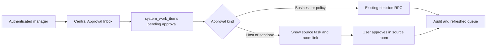

# Central Approval Inbox Flow

## Purpose

The authenticated manager inbox gathers pending business and policy decisions
from `system_work_items` without creating a second approval state. Host or
sandbox permission requests are displayed as read-only waiting items because
the application does not expose a cross-thread Codex approval API.

## Inputs, outputs and states

- Inputs: active company context, pending `system_work_items`, approval scope,
  risk, evidence and existing audit/RPC results.
- Output: an approval decision through `decide_system_work_item_approval`, or a
  clear source-room handoff for host/sandbox permission requests.
- States: pending -> approved/rejected for business decisions; waiting ->
  allowed/denied/expired only when the source host reports that state.

## Roles, permissions and integrations

Only the existing Admin/Manager approval path may decide business work items.
Tenant/RLS and the existing RPC remain authoritative. Remembered approval is
not stored or auto-applied by this UI; no broad command prefix or secret is
accepted. Cross-thread host approval is explicitly unsupported by the current
Codex API, so no fake Allow button is rendered.

## Failure, retry, audit and owner

Query errors remain visible with the page error state; retry reloads the same
tenant-scoped projection. RPC decisions are idempotent and use the existing
mutation-attempt and work-item audit path. A denied or expired host request is
recovered in its source room. Owner: Platform Operations.

## Change record

- Version: v1.0, 2026-09-08.
- Rationale: centralize business/policy approvals while keeping host security
  boundaries explicit.
- Migration: none.
- Verification: inbox contract, existing approval contracts, typecheck, lint,
  build and authenticated role smoke.
- Rollback: remove the inbox tab; source records and Audit remain unchanged.
