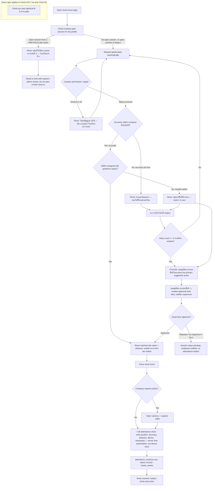

# Attendance Clock GPS & Geofence Flow

## Status of this document

New Flow document (v1.0) registering a module that previously had no dedicated flow — the GPS/geofence decision logic was only implied inside `TIME_TRACKING_FLOW.md`'s single `location_checked` state. This document is written **before any code change**, per the Workflow Change Standard, and reflects the redesigned mobile clock-in/out UX (mockups reviewed 12/9/2569) plus fixes for gaps found during that review. Code implementation follows this document, not the other way around.

## Purpose

Defines exactly how the clock-in/out page acquires and validates device location, decides whether an employee is inside their assigned site's geofence, and what happens in every non-happy-path case (no signal, inaccurate position, outside geofence, an unclosed prior session) — so GPS-related support complaints have one authoritative reference instead of being re-litigated per bug report.

## Inputs and outputs

- **Inputs:** device geolocation (position + accuracy), assigned site + its radius (`project_sites`), company GPS-accuracy threshold and `stale_after_shift_minutes`/reminder settings (`workforce_rule_settings`), existing open `attendance_sessions` row for the profile (if any), optional selfie capture, action `clock_in`/`clock_out`.
- **Outputs:** `attendance_sessions` row (`normal`/`needs_review`), an outside-geofence approval work item when requested, every attempt (success and failed retries) logged with position/accuracy/distance/device/timestamp for audit.
- **No mutation** happens until a clock action is actually pressed and passes validation — checking location alone never writes attendance data.

## States

`checking_prior_session → requesting_location → (no_signal | inaccurate | outside_geofence | in_geofence) → [outside_geofence only: awaiting_approval → approved|rejected] → capturing_photo (if required) → recording → recorded | needs_review | failed`

This refines `TIME_TRACKING_FLOW.md`'s single `location_checked` state into the sub-states above; `TIME_TRACKING_FLOW.md` remains the master flow and links here for the detail.

## UI content rules (from the reviewed mockup)

**Removed from the main screen:** the literal text "GPS พร้อม", any count like "พบ 2 ไซต์", and the selfie button/prompt before a clock action is pressed (camera only opens after clock-in/out is pressed, and only if the company requires it).

**Kept/added:** only the system-auto-selected site is shown (no manual site picker), a clear in/out-of-geofence status, a "ตรวจ GPS อีกครั้ง" button, distance in meters when outside geofence, an outside-geofence approval request path, and today's clock-in/clock-out time on the same screen.

## Roles and permissions

- Employee: uses their own device location and assigned site only; cannot widen a site's radius or override an accuracy failure themselves — the only self-service path around a geofence miss is the approval request.
- Supervisor/manager: receives and decides the outside-geofence approval request (existing approval-queue UI, same one shown for leave/expense/OT requests); decision and reason are audited like other approvals.
- Backend `attendance-clock`: authoritative check of company/employment/assignment/existing-open-session/GPS/accuracy/geofence/duplicate before any write — the client-side states above are UX guidance, not the security boundary.

## Fixes this document specifies (from mockup review, 12/9/2569) — see verification note below before implementing any of these

1. **Existing open session from a previous day.** Before showing "ready to clock in," check for an open (`clock_out_at is null`) session for this profile from an earlier day. If found, do not offer a fresh clock-in — route to a clear message and the existing time-edit/review path. (`attendance-clock` already rejects overlapping sessions server-side per `ATT-VALIDATE-001`; this adds the client-side message so the employee sees why, instead of a generic error.)
2. ~~**Bounded GPS retry.**~~ **RETRACTED — see verification note.** No unbounded retry loop exists in the real code to bound.
3. **Distinct "no signal" vs "inaccurate" messaging.** No GPS signal (permission denied or location services off) gets its own message ("เปิด Location") separate from low accuracy ("ออกไปที่โล่ง") — they need different employee actions.
4. **Clock-out gets the same rigor as clock-in.** The identical geofence/accuracy/retry/approval path applies to the clock-out action, not only clock-in.
5. ~~**Company-configurable accuracy threshold.**~~ **RETRACTED — see verification note.** Already exists as `attendance_system_settings.max_gps_accuracy_meters` (company-scoped, editable in the app today). No new column needed.
6. **Server time is authoritative.** `attendance-clock` stamps time server-side; device clock is never trusted for the recorded time (confirm-only — this already appears to be the existing behavior, called out here so it stays true after this change).

## Verification against real code (13/09/2569) — read in full before this run's implementation

Before writing any code for this flow, `src/pages/TimeTracking/index.tsx` (the real clock-in/out page, 52KB) and `supabase/functions/attendance-clock/index.ts` (the real backend, 28KB) were read in full for the first time (the v1.0 draft above was written from the reviewed mockup images plus `TIME_TRACKING_FLOW.md`, not from these files). Result: **most of "fixes 1-6" already exist in production, verified by file/line, not by assumption:**

- **#1 (prior-open-session check) — already implemented.** `attendance-clock/index.ts` blocks a same-day duplicate clock-in with a clear Thai message ("วันนี้คุณลงเวลาเข้าแล้ว กรุณาลงเวลาออกจากรายการเดิม"), and auto-flags a cross-day stale open session to `needs_review`/`missing_clock_out` with an explicit `review_reason` — this is what the dashboard's overdue card (below) surfaces. Client-side, `TimeTracking/index.tsx` also tracks `isStaleOpenSession`/`staleOpenSessions`. **No code change needed.**
- **#2 (bounded retry) — retracted.** There is no retry-count loop in the real flow at all: on inaccurate/outside-geofence GPS, `prepareAttendance()` immediately accepts the attempt and sets a "ระบบจะรับรายการไว้ก่อน และส่งให้ผู้มีสิทธิ์ตรวจสอบ GPS" message rather than blocking the worker with retries — server-side this becomes `status:'needs_review'`. This is a different (accept-and-flag, not retry-and-block) design than the mockup implied, and it is already arguably better UX than a bounded-retry promotion. Nothing to fix.
- **#3 (distinct no-signal vs inaccurate messaging) — already implemented.** `getLocation()`/`prepareAttendance()`'s catch branch maps `GeolocationPositionError` codes to distinct `permission_denied` / `position_unavailable` / `location_timeout` / `gps_unsupported` / `gps_unavailable`, each with its own Thai detail message, separate from the in-range "inaccurate" branch above. **No code change needed.**
- **#4 (clock-out parity) — already implemented.** Clock-in and clock-out call the same `clock(action:'clock_in'|'clock_out')` function and the same `attendance-clock` edge function with an `action` field — one code path, not two. **No code change needed.**
- **#5 (configurable accuracy threshold) — retracted.** Already exists today as `attendance_system_settings.max_gps_accuracy_meters` (per-company, alongside `allow_outside_site_for_review`, `shared_devices_allowed`, `stale_session_mode`), editable from this same page's admin settings section. The planned `workforce_rule_settings` migration in this document's original Change Record is **cancelled** — it would have duplicated an existing setting on the wrong table.
- **#6 (server-authoritative time) — already implemented.** `attendance-clock/index.ts` computes `const now = new Date()` server-side once per request and stamps every `clock_in_at`/`clock_out_at`/`review_requested_at` from it; the client-supplied device time is never used for the recorded timestamp. **No code change needed.**

**Net conclusion: this flow does not need a code change right now.** The real gap this review surfaced was never in the GPS/geofence logic itself — it was the dashboard visibility gap described below, which is a separate, genuinely new page (see `MOBILE_ADMIN_OVERVIEW_DASHBOARD_FLOW.md`, now implemented). This document stays registered as the authoritative reference for how the clock flow works today; it is corrected in place rather than superseded, per the Workflow Change Standard's requirement to keep the Flow Registry accurate before/instead of writing code against a stale gap analysis.

## Related module — dashboard overdue-clock-out visibility

Investigation of a live incident (5-day open session, `needs_review`, only surfaced via the Telegram health-monitor escalation) found that the reminder and auto-flagging automation (`attendance-reminders`, `health-monitor`) already works correctly — the gap was that nobody was watching the escalation channel. Recommended companion change: add a 5th stat card ("ค้างลงเวลาออกเกินกำหนด") to the mobile home/admin overview screen, sourced from the same `needs_review`/stale query `attendance-reminders` already computes, so this is visible the moment an admin opens the app rather than only via Telegram. **Note:** that overview/home screen does not currently have its own registered Flow document (it is not the same page as `PROJECT_DASHBOARD_FLOW.md`, which covers the cost/finance dashboard). Recommend registering a short Flow document for it before adding the card — flagging this as an open item rather than skipping the registry requirement.

## Failure and recovery

- Any Edge Function/network failure during the location or clock-action steps: no partial `attendance_sessions` row is written; the user restarts from the current step, not from scratch.
- Approval request that is rejected or times out: no attendance is recorded; the employee sees the outcome and can retry from a valid location or re-request.
- Everything above is additive UX/validation ordering — it does not change `attendance-clock`'s existing authoritative server-side checks.

## Audit and integrations

- Every clock attempt — including failed GPS/geofence retries, not only successful ones — is recorded with position, accuracy, distance-from-site, device, and timestamp, so support/investigation has full context (this extends current practice of only logging successful writes).
- Integrates with the existing approval-queue UI/backend (same mechanism as leave/expense/OT approvals) for outside-geofence requests — no new approval subsystem is introduced.
- `attendance-reminders` and `health-monitor` are unchanged by this document; the dashboard card above only reads their existing output.

## Owner and change record

- **Owner:** Workforce/Attendance module owner (frontend `TimeTracking`/clock UI); Platform for `attendance-clock` backend checks.
- **Version:** v1.1 — corrected after reading the real source in full; v1.0's gap analysis (from mockup + assumption only) is retracted where it conflicted with verified code. No code change shipped for this flow.
- **Date:** v1.0 12/09/2569; v1.1 correction 13/09/2569.
- **Rationale (v1.1):** the Workflow Change Standard requires the Flow doc to reflect ground truth before code changes; reading `TimeTracking/index.tsx` and `attendance-clock/index.ts` in full showed fixes #2 and #5 were based on a wrong assumption (no such gaps exist) and #1/#3/#4/#6 were already implemented. Correcting the document in place avoids implementing redundant or conflicting logic against a system that already works.
- **Impact:** none — no code change. The genuinely new, verified gap (dashboard visibility of overdue clock-outs) is implemented separately; see `MOBILE_ADMIN_OVERVIEW_DASHBOARD_FLOW.md` v1.1.
- **Migration:** none (the v1.0-planned `workforce_rule_settings` column is cancelled — superseded by the existing `attendance_system_settings.max_gps_accuracy_meters`).
- **Verification:** re-verified by direct source read (file/line citations above), not by test run (no code changed).
- **Rollback:** not applicable — no code changed.
