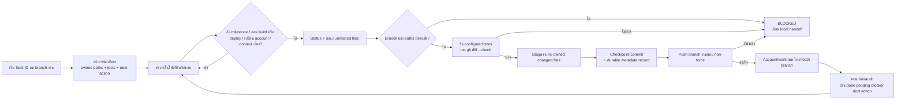

# Auto Checkpoint Guard

## Purpose

รักษาบริบทและ source checkpoint ของงานพัฒนาเมื่อ session ยาว, มี usage warning, context compaction, tool ไม่เสถียร หรือจำเป็นต้องเปลี่ยน Codex Account โดยไม่ปะปนไฟล์ของห้องอื่นและไม่เก็บ secret ใน repository

ระบบนี้เป็น developer workflow เท่านั้น ไม่แก้ข้อมูลธุรกิจ, Raw, Audit ธุรกิจ, สิทธิ์, migration หรือ Production runtime

## Durable Record

แต่ละ Task ID เก็บใน `.task-checkpoints/<task-id>/`:

- `manifest.json`: task identity, objective, branch/base/checkpoint commit, remote name, explicit `owned_paths`, status, done/pending/blocker/next action, test result/time และ actor
- `handoff.md`: เอกสารอ่านง่ายสำหรับคนและ Codex Account ใหม่ พร้อมคำสั่ง resume
- `events.jsonl`: append-only lifecycle events ของ checkpoint guard

ค่าที่ห้ามบันทึกทุกจุด: password, token, API key, private key, credential และเนื้อหา `.env`/`.env.local`

## Commands

เริ่ม Task บน branch งาน:

```powershell
npm run checkpoint:init -- --task-id INTAKE-PROJECT-FIRST-001 --title "Intake Project-first gate" --module intake --objective "Route new Intake evidence through Project-first validation." --owner-room intake-primary --actor codex --path "src/pages/DocumentFlows/index.tsx" --path "scripts/intake-project-first.test.ts" --test "npm run test:intake-project-first" --next-action "Inspect the existing Intake project gate before editing."
```

ตรวจสถานะและ guard contract โดยไม่แก้ Git:

```powershell
npm run checkpoint:status -- --task-id INTAKE-PROJECT-FIRST-001
npm run checkpoint:check -- --task-id INTAKE-PROJECT-FIRST-001
```

บันทึก handoff แล้ว checkpoint/push branch งาน:

```powershell
npm run checkpoint:handoff -- --task-id INTAKE-PROJECT-FIRST-001 --done "Mapped current source and validation flow." --pending "Implement the Project-first gate." --next-action "Add the gate without changing raw Intake evidence."
npm run checkpoint:checkpoint -- --task-id INTAKE-PROJECT-FIRST-001
```

Account/worktree ใหม่:

```powershell
git fetch origin codex/intake-project-first
git switch codex/intake-project-first 2>$null; if ($LASTEXITCODE -ne 0) { git switch --track origin/codex/intake-project-first }
npm run checkpoint:resume -- --task-id INTAKE-PROJECT-FIRST-001
npm run checkpoint:audit -- --task-id INTAKE-PROJECT-FIRST-001
```

## Guard Rules

- Branch ต้องไม่ใช่ `main`/`master` และต้องตรงกับ manifest
- Stage เฉพาะ changed files ที่ match explicit `owned_paths`; unrelated dirty files แสดงแต่ไม่ถูกแตะ
- ถ้ามี unrelated file ถูก stage ไว้แล้ว guard ปฏิเสธ commit เพื่อไม่ให้ไฟล์นั้นหลุดเข้า checkpoint
- ปฏิเสธ absolute/parent-traversal paths, `.env*`, secret-like filenames, cache, `dist`, `node_modules`, `.codex*` และ worktree folders
- Configured tests ห้ามเป็น deploy, migration apply, Git push/merge/rebase/reset, delete command หรือคำสั่งปิดธุรกรรม
- Checkpoint รัน tests และ `git diff --check` ก่อน commit; push เฉพาะ branch ใน manifest และไม่ใช้ force
- Test/push fail จะสร้าง local blocked handoff; เรียกซ้ำเมื่อไม่มี owned change จะไม่สร้าง empty commit
- `checkpoint_commit` อ้าง content checkpoint จริง ส่วน branch HEAD มี metadata record ที่บันทึก hash นั้นแบบ durable

## Inputs, Outputs, Owner, Audit, and Recovery

- Input: Task ID, branch งาน, base commit, explicit paths, test commands และ next action ที่ไม่ใช่ secret
- Output: source checkpoint commits, pushed work branch, manifest/handoff/events และ resume command
- Owner: ห้องเจ้าของงานระบุใน `owner_room`; actor ของแต่ละ update อยู่ใน manifest/event
- Failure: branch/path/test/diff/push error เปลี่ยน local manifest เป็น `blocked`; ไม่มี force push หรือการแตะ unrelated files
- Recovery: fetch branch, switch branch, รัน `checkpoint:resume` และ `checkpoint:audit`; ถ้ายัง push ไม่ได้ local commits/handoff ยังคงอยู่ใน worktree เดิม
- Idempotency: ไม่มี owned changes เท่ากับ `NO_CHANGES` และไม่มี commit ใหม่

## Intake Project-first Example

ตัวอย่าง manifest อยู่ที่ `docs/examples/auto-checkpoint/intake-project-first.manifest.json` ใช้ข้อมูลสมมติ ไม่มี Document ID, employee, finance record, token หรือ environment value จริง ผู้ใช้ต้องสร้าง manifest จริงด้วย `checkpoint:init`; ห้าม copy ค่า commit ตัวอย่างไปใช้แทน Git state ปัจจุบัน

## Rollback

1. หยุดเรียก npm scripts ของ checkpoint guard
2. Revert commit ที่เพิ่ม CLI, policy, docs และ tests บน branch งาน
3. เก็บหรือ archive `.task-checkpoints/<task-id>` ของงานที่ยังต้อง resume; อย่าลบก่อนตรวจว่า branch/commit ถูก push แล้ว

ไม่มี database rollback, migration หรือ Production deployment สำหรับระบบนี้

## Change Record

| Version | Date | Rationale | Impact | Migration | Verification | Rollback |
| --- | --- | --- | --- | --- | --- | --- |
| v1.0 | 25/8/2569 | ป้องกัน source/context หายเมื่อ session, usage limit หรือ account เปลี่ยน | Developer task manifest, isolated staging, checkpoint/handoff/resume policy | ไม่มี | Contract tests, targeted lint, typecheck, build และ self-hosted checkpoint บน branch งาน | Revert source/docs/scripts; ไม่กระทบข้อมูลธุรกิจหรือ Production |
