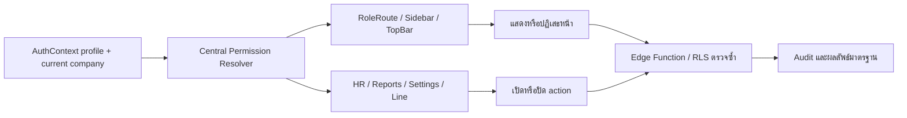

# Central Permission Resolver Flow

## Version 1.1 — 20/8/2569

หน้าเว็บทุกโมดูลต้องใช้ `src/utils/permissions.ts` เป็นตัวแปลงสิทธิ์จุดเดียว โดยใช้ `profiles.role` เป็นค่าหลักจากฐานข้อมูล และรองรับ `platform_role` เฉพาะข้อมูลเก่าชั่วคราวเท่านั้น

- Inputs: profile role, company membership role, current company
- Outputs: `isPlatformAdmin`, `isCompanyAdmin`, `canManageCompany`
- States: loading → resolved → allowed/denied
- Failure: ถ้าไม่มี profile หรือบริษัทปัจจุบัน ให้ปฏิเสธสิทธิ์และไม่ส่ง mutation
- Security: ตัวตรวจหน้าเว็บเป็น UX guard เท่านั้น; Edge Function/RLS ต้องตรวจซ้ำ
- Owner: Platform Access + ทุกโมดูลที่มี action เปลี่ยนข้อมูล
- Rollback: คืนการเรียก helper เดิมได้โดยไม่เปลี่ยนข้อมูลในฐานข้อมูล

## Backend alignment

Edge Functions ที่ตรวจสิทธิ์บริษัทต้องยึดกติกาเดียวกัน: `profiles.role = 'admin'` เป็น Platform Admin; ผู้ใช้อื่นต้องมี `company_members.active = true`, วันสิ้นสุดยังไม่หมด และบทบาทอยู่ในรายการของ action นั้น ๆ ฐานข้อมูล/RLS ยังเป็นด่านบังคับสุดท้ายเสมอ

ฟังก์ชันที่ปรับแล้ว: `telegram-admin`, `attendance-reminders`, `health-monitor` ส่วน `review-employee-intake` และ `drawing-ai-benchmark` ปรับใน source แล้วแต่การ Deploy ถูกหยุดเพื่อขออนุมัติขอบเขตข้อมูล/การประมวลผลเพิ่มเติม
