# CHAT ATTENDANCE BRIDGE FLOW — HR Event Stream → ห้องแชต

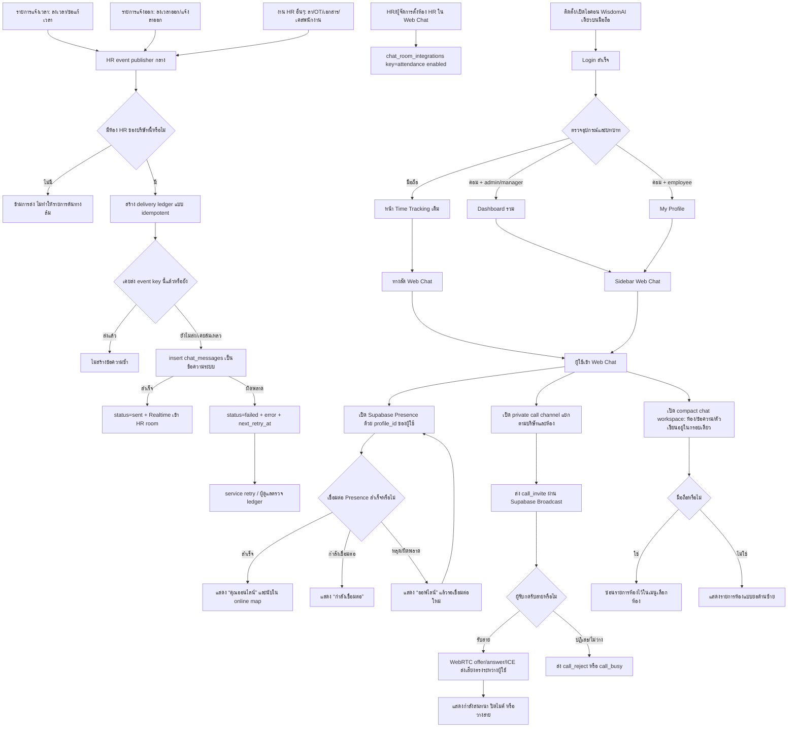

กราฟนี้สรุปภาพรวมใหม่ของห้อง HR: ผู้ใช้มือถือเปิดจากไอคอน WisdomAI เดียวแล้วเข้า Time Tracking เดิม ส่วนคอมพิวเตอร์จะไป Dashboard รวมเมื่อเป็น admin/manager หรือไป My Profile เมื่อเป็น employee จากนั้นผู้ใช้เปิด Web Chat ผ่านทางลัดหรือ Sidebar และทุก event ที่เป็นงาน HR จะถูกส่งผ่าน publisher กลางไปยังห้องเดียวกัน โดยใช้ delivery ledger กันข้อความซ้ำและเก็บ error/retry แยกจากข้อมูลต้นทาง ขณะเดียวกัน Web Chat จะเปิด Presence ของผู้ใช้ แสดงสถานะออนไลน์ เปิด private call channel ตามบริษัท/ห้องสำหรับโทรเสียง 1 ต่อ 1 ผ่าน WebRTC และใช้พื้นที่สนทนาแบบ compact เพื่อให้ข้อความเป็นศูนย์กลาง โดยเฉพาะบนมือถือจะซ่อนรายการห้องไว้ในเมนูเลือกห้อง

## วัตถุประสงค์

ให้ HR เลือกห้องแชตภายในบริษัทเป็น “ห้องรับ Log/งาน HR” แล้วให้ระบบส่งเหตุการณ์สำคัญเข้าไปโดยอัตโนมัติ ได้แก่ รายการแจ้งเวลา, รายการแจ้งออก และงาน HR อื่น ๆ โดยไม่คัดลอกข้อมูลข้ามบริษัท ไม่ทำให้รายการต้นทางล้มถ้าส่งข้อความไม่ได้ และไม่สร้างข้อความซ้ำเมื่อมี retry หรือ Realtime update

## Module ที่ได้รับผลกระทบ

- Chat Web Room (`src/pages/Chat/index.tsx`, `chat_rooms`, `chat_messages`)
- Application Launcher / PWA shell (`src/pages/AppLauncher/index.tsx`, `index.html`, `public/manifest.webmanifest`, `public/branding/wisdom-ai-app-icon-*.png`)
- Workforce Attendance (`attendance_sessions`, `attendance_correction_requests`)
- Workforce HR Requests (`employee_leave_requests`, `employee_overtime_assignments`, `employee_document_requests`, `employee_lifecycle_cases`, `employee_employment_records`)
- Supabase Database trigger/RLS และ audit delivery ledger (`chat_attendance_delivery_events`, `chat_hr_delivery_events`)

## Attendance Flow เดิม

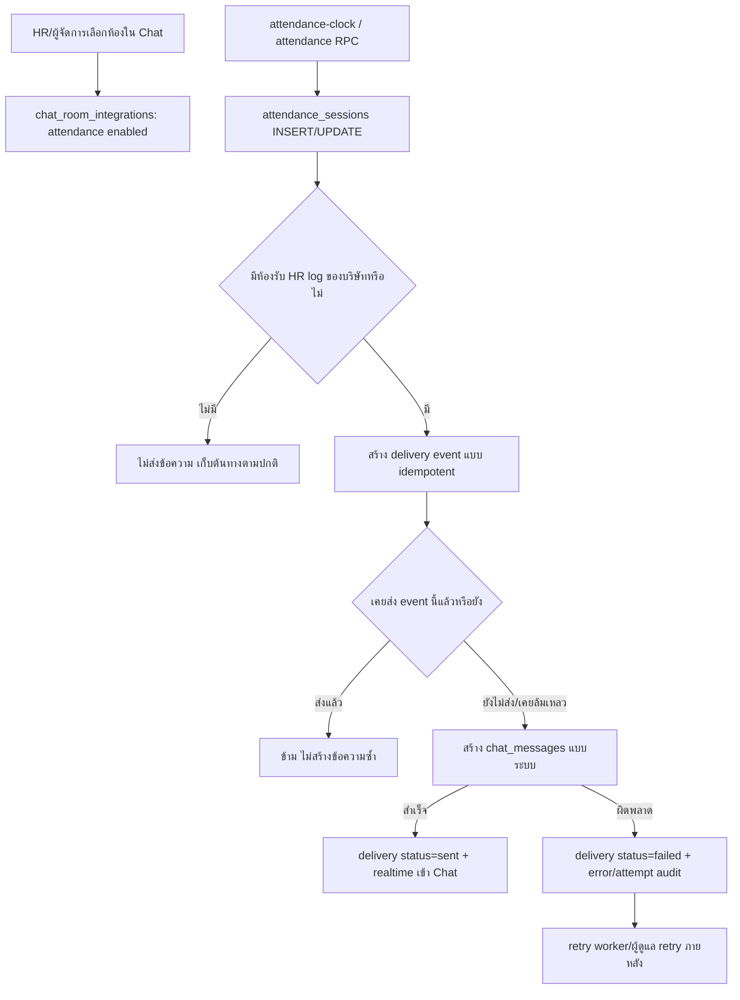

## Input / Output

- Input: `attendance_sessions` ที่สร้างใหม่ (`clock_in`) หรือเปลี่ยนจากยังไม่มี `clock_out_at` เป็นมีเวลาออก (`clock_out`), `attendance_correction_requests`, `employee_leave_requests`, `employee_overtime_assignments`, `employee_document_requests`, `employee_lifecycle_cases` และ `employee_employment_records` ที่มี resignation status
- Configuration input: ผู้จัดการบริษัทเลือก `chat_rooms` หนึ่งห้องและเปิด integration key `attendance`
- Output: ข้อความสรุปภาษาไทยใน `chat_messages` (`sender_profile_id = null`, `message_type = text`) และ Realtime update ของห้อง HR
- Delivery output: `chat_attendance_delivery_events` สำหรับลงเวลาเข้า/ออก และ `chat_hr_delivery_events` สำหรับงาน HR อื่น ๆ ระบุ `pending/sent/failed`, จำนวนครั้ง, ข้อความที่สร้าง และ error ล่าสุด

## States

- Integration: `enabled=false` หรือ `enabled=true`
- Delivery: `pending` → `sent`; หากฐานข้อมูล/ห้องไม่พร้อมเป็น `failed` และ retry ได้โดยใช้ event key เดิม
- Idempotency key: `<attendance_session_id>:<clock_in|clock_out>` ต่อบริษัทสำหรับ attendance และ `<source_id>:<event_type/status>` สำหรับงาน HR อื่น ๆ

## Roles / Permissions

- Company admin, executive, manager และ room owner ที่มีสิทธิ์จัดการห้อง: ตั้ง/เปลี่ยน/ปิดห้องรับ log
- สมาชิกห้อง: อ่าน log เมื่อถูกเชิญเข้าห้องตาม RLS ของ Chat
- พนักงานผู้ลงเวลา: ไม่สามารถเปลี่ยนปลายทางของ log และไม่เห็น delivery ledger ของบริษัทอื่น
- Database trigger: ทำงานภายใต้สิทธิ์ฐานข้อมูลเพื่อเขียนข้อความระบบ แต่ตรวจ `company_id` และ `room_id` ให้ตรงกันทุกครั้ง

## Integrations

- `attendance_sessions` → database trigger `publish_attendance_session_to_chat`
- `attendance_correction_requests` → database trigger `publish_attendance_correction_to_hr_chat`
- `employee_leave_requests` → database trigger `publish_leave_request_to_hr_chat`
- `employee_overtime_assignments` → database trigger `publish_overtime_assignment_to_hr_chat`
- `employee_document_requests` → database trigger `publish_document_request_to_hr_chat`
- `employee_lifecycle_cases` → database trigger `publish_lifecycle_case_to_hr_chat`
- `employee_employment_records.resignation_status` → database trigger `publish_resignation_to_hr_chat`
- `chat_room_integrations` เป็น mapping บริษัท → ห้อง
- `chat_messages` เป็นข้อความปลายทางและใช้ Supabase Realtime ที่มีอยู่
- `chat_attendance_delivery_events` และ `chat_hr_delivery_events` เป็น audit/retry ledger

## Failure / Retry

- ไม่มี integration ที่เปิดใช้งาน: ไม่ถือเป็นความผิดพลาดและไม่สร้างข้อความ
- ห้องถูกลบ/บริษัทไม่ตรง/insert ข้อความล้มเหลว: บันทึก `failed`, `error_message`, `attempt_count` และไม่ทำให้การลงเวลาต้นทางล้มเหลว
- การ retry ใช้ event key เดิม จึงไม่สร้าง duplicate; เมื่อส่งสำเร็จแล้วการ retry จะข้าม
- หากผู้ใช้ปิด integration ภายหลัง ข้อความเดิมและ audit เดิมไม่ถูกลบ

## Audit Events

- `attendance_chat_integration_enabled`
- `attendance_chat_integration_disabled`
- `attendance_chat_delivery_pending`
- `attendance_chat_delivery_sent`
- `attendance_chat_delivery_failed`
- `attendance_chat_delivery_duplicate_skipped`
- `hr_chat_delivery_pending`
- `hr_chat_delivery_sent`
- `hr_chat_delivery_failed`
- `hr_chat_delivery_duplicate_skipped`

## Owner

HR/ผู้จัดการบริษัทเป็น owner ของการเลือกห้องและสมาชิกห้อง; ทีมระบบเป็น owner ของ trigger, migration และ retry path

## Attendance Approval MSG v3.3 — 23/8/2569

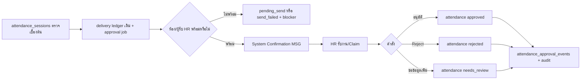

ข้อความ MSG แสดงช่าง, เข้า/ออก, วันเวลา, โครงการ/ไซต์, รหัสรายการเดิม, ผลตรวจซ้ำ และสถานะส่ง/ผู้รับ/เวลาส่ง งานทุกชิ้นใช้ `chat_attendance_approval_jobs` เป็น ledger กลางและใช้ `request_code` เดิมเพื่อกันซ้ำ หากไม่มีห้องหรือผู้รับจะค้าง `pending_send`; หาก insert ข้อความล้มเหลวจะเป็น `send_failed` และยังไม่ถือว่างานปิด ผู้จัดการ/HR รับงานแล้วจึงเลือกอนุมัติ, Reject หรือขอข้อมูลเพิ่มได้ โดยทุกจุดเขียน `chat_attendance_approval_events` และ `attendance_audit_logs`.

ปลายทางของ Program Loop มีเฉพาะห้องต้นทาง/ห้องงานของรายการ, ห้อง HR หลัก และห้องเงินสำรองจ่ายตามการตั้งค่าระบบ โดยใช้ `request_code`/`event_key` เดิมร่วมกันทุกปลายทาง ห้อง 00 ของ Codex เป็นช่องติดตามและสรุประดับระบบเท่านั้น ไม่ถูกสร้างเป็น Web Chat room, ไม่รับ MSG และไม่ถูกใช้เป็นปลายทางหรือทำ duplicate notification

ข้อความที่สร้างโดยระบบถูกติด `message_class=system_confirmation` และ Omni intake ข้ามข้อความ class นี้ จึงไม่สร้างรายการลงเวลา/Intake ซ้ำจากการยืนยันของระบบ

## Chat command / voice path (v1.1)

ผู้ใช้ส่งคำสั่งสั้นในห้อง เช่น `แจ้งเข้างาน`, `ลงเวลาเข้า`, `แจ้งออกงาน` หรือกดปุ่มไมโครโฟนเพื่อพูดภาษาไทย ระบบถอดเสียงเป็นข้อความและตรวจเจตนาแบบ vocabulary ที่กำหนดไว้ หากไม่ตรงคำสั่งจะเก็บเป็นข้อความรอให้ผู้ใช้กดส่งตามปกติ คำสั่งที่ตรงจะเปิดหน้าต่างยืนยัน โดยไม่บันทึกข้อความคำสั่งดิบลงห้องซ้ำ

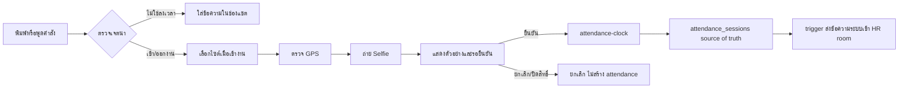

- **Input:** ข้อความ/เสียงภาษาไทย, action `clock_in|clock_out`, ไซต์ที่ได้รับมอบหมาย, GPS, Selfie และคำยืนยันสุดท้าย
- **Output:** `attendance_sessions` พร้อมสถานะ `normal` หรือ `needs_review`; ข้อความผลลัพธ์ในห้อง HR จาก bridge เดิม
- **States:** `draft → collecting → validating → awaiting_confirmation → recording → recorded|needs_review|failed`; เสียงที่อ่านไม่ได้กลับไปเป็น `draft` และให้พิมพ์แทน
- **Permission:** ต้องเป็นสมาชิกบริษัทและมีไซต์ที่ได้รับมอบหมาย; browser ต้องได้รับสิทธิ์ GPS/กล้อง; backend `attendance-clock` ตรวจซ้ำทุกเงื่อนไข
- **Failure/retry:** GPS อ่านไม่ได้จะส่ง `gpsErrorCode` เพื่อเข้ากระบวนการตรวจสอบ; กล้อง/อัปโหลด/Edge Function ล้มเหลวไม่สร้าง attendance และลบ Selfie ที่อัปโหลดค้าง; ผู้ใช้เริ่มขั้นตอนใหม่ได้
- **Audit events:** `chat_attendance_command_received`, `chat_attendance_confirmation_requested`, `chat_attendance_confirmed`, `chat_attendance_rejected`, `chat_attendance_recorded`
- **Owner:** ผู้ใช้ยืนยันรายการของตนเอง; HR/ผู้จัดการตรวจรายการ `needs_review`; ระบบเป็น owner ของการบันทึกและการส่งข้อความปลายทาง

## Read state / Presence path (v1.4)

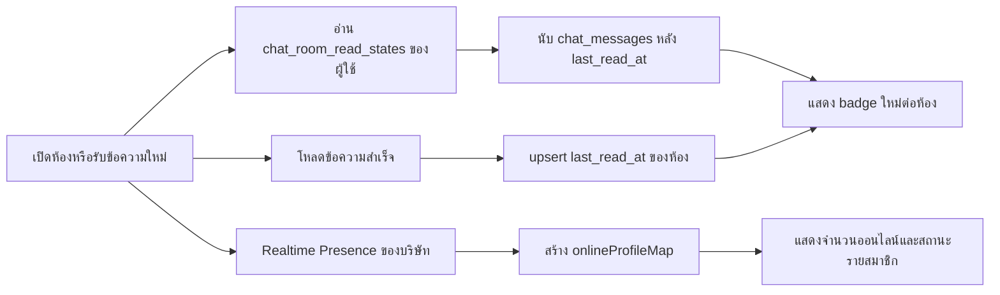

- **Input:** `profile_id` ที่ login, ห้องที่ผู้ใช้เป็นสมาชิก/ผู้จัดการเข้าถึงได้, `chat_messages.created_at`, Presence metadata ของสมาชิกในบริษัท
- **Output:** unread count ต่อห้อง, badge รวม “ใหม่”, จำนวนออนไลน์ในรายการ/หัวห้อง และสถานะ “ออนไลน์/ออฟไลน์” ในหน้าจัดสมาชิก
- **States:** `unread → selected/loading → read` สำหรับ cursor; Presence `SUBSCRIBED → synced → joined|left`; cursor เป็นรายผู้ใช้และไม่แชร์ read position ให้สมาชิกคนอื่น
- **Roles / Permission:** อ่าน/เขียน cursor ได้เฉพาะ `auth.uid()` ของตนเองและต้องอยู่ในบริษัท/ห้องตาม RLS; Presence ใช้สำหรับการแสดงผลเท่านั้น ไม่เป็นสิทธิ์อนุมัติหรือเปิดเผยข้อมูลห้อง
- **Integrations:** `chat_room_read_states` ผ่าน Supabase PostgREST/RLS; Supabase Realtime `postgres_changes` สำหรับข้อความและ Realtime Presence สำหรับสถานะออนไลน์
- **Failure / Retry:** อ่าน cursor ล้มเหลวให้คง badge รอบก่อนและแจ้ง error แบบผู้ใช้; upsert อ่านแล้วล้มเหลวไม่ลบข้อความ; Presence หลุดให้แสดง 0 ออนไลน์จนกว่าจะ reconnect/subscription ใหม่
- **Audit events:** การอ่านแล้วเป็น cursor data ที่แก้ไขได้เฉพาะเจ้าของ; ข้อความและ delivery audit เดิมยังเป็นหลักฐานหลัก ไม่สร้าง audit event ใหม่จาก Presence
- **Owner:** ผู้ใช้เป็น owner ของ read cursor ของตนเอง; ทีมระบบเป็น owner ของ RLS, migration และ Realtime subscription lifecycle

## Voice call path (v1.7)

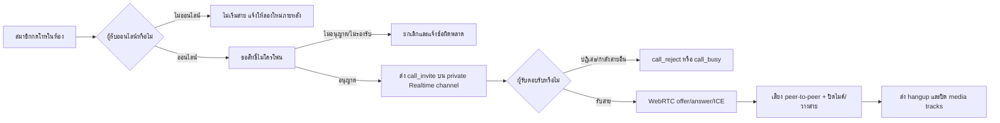

- **Input:** สมาชิกในห้องที่ออนไลน์, `room_id`, `profile_id` ของผู้โทร/ผู้รับ, สิทธิ์ไมโครโฟนของเบราว์เซอร์
- **Output:** สายเสียง 1 ต่อ 1, สถานะกำลังโทร/กำลังเชื่อมต่อ/สนทนา, ปุ่มปิดไมค์และวางสาย; MVP นี้ไม่เก็บไฟล์เสียงและไม่สร้าง call log ในฐานข้อมูล
- **States:** `idle → calling → connecting → connected → ended`; สายเข้าอยู่ใน `incoming` ก่อนผู้รับเลือก `accept` หรือ `reject`
- **Roles / Permission:** เรียกได้เฉพาะสมาชิกบริษัท/ผู้จัดการที่เข้าถึงห้อง; Realtime policy จำกัด private topic ด้วยบริษัทและสมาชิกห้อง; browser ต้องอนุญาตไมโครโฟน
- **Integrations:** Supabase Realtime Broadcast ใช้ส่ง `call_invite`, `call_accept`, `call_reject`, `call_busy`, `offer`, `answer`, `ice_candidate`, `hangup`; WebRTC ใช้ STUN สำหรับค้นหาเส้นทางสื่อ
- **Failure / Retry:** ผู้รับออฟไลน์/ระบบ signaling ยังไม่พร้อมจะไม่เริ่มสาย; ปฏิเสธ/ไม่ว่างจบสายทันที; ICE หรือ peer connection ล้มเหลวปิด media tracks และแจ้งให้โทรใหม่; การส่งสัญญาณไม่มีการ retry ซ้ำเพื่อป้องกัน SDP/ICE ค้าง
- **Audit events:** MVP ใช้สัญญาณชั่วคราวตาม event ข้างต้นเป็นหลักฐานใน session เท่านั้น ยังไม่มี persistent call history; ระยะถัดไปสามารถเพิ่มตารางประวัติสายได้โดยไม่เก็บเสียง
- **Owner:** สมาชิกเป็นผู้เริ่ม/รับ/วางสายของตนเอง; ทีมระบบเป็น owner ของ RLS Realtime, WebRTC lifecycle และ TURN configuration สำหรับ production

## Application launcher and mobile attachment path (v1.9)

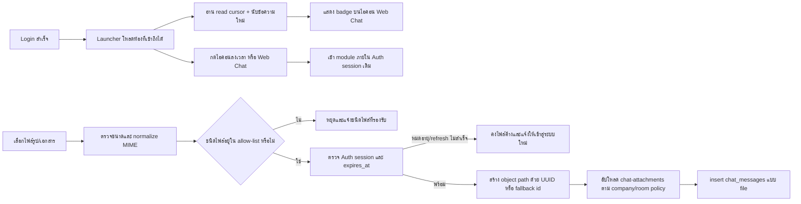

- **Input:** `company_id`, `profile_id`, ห้องที่ RLS ให้เห็น, `chat_room_read_states`, `chat_messages.created_at`, ไฟล์จาก `<input type=file>` และ MIME/นามสกุลไฟล์
- **Output:** launcher icon สองรายการ, badge จำนวนข้อความค้าง, หรือ `chat_messages` แบบ file พร้อม signed URL สำหรับสมาชิกห้อง
- **States:** `loading → ready|unread_error`; ไฟล์ `selected → validated → session_checked → uploaded → message_recorded|failed`; ถ้า session หมดอายุและ refresh ไม่สำเร็จจะคงไฟล์ไว้เพื่อ retry หลัง login ใหม่; HEIC/HEIF/AVIF/TIFF ถูก normalize ก่อนตรวจ allow-list
- **Roles / Permission:** launcher ใช้ Auth session; unread query จำกัดบริษัท/ห้องตาม RLS; upload ใช้ `storage.objects` policy โดยสมาชิกบริษัทต้องเป็นสมาชิกห้อง และ company manager ใช้สิทธิ์ผู้จัดการตาม policy ที่มีอยู่; bucket ยังคง private
- **Integrations:** `/` Application Launcher, `src/services/chatUnread.ts`, Supabase PostgREST/Realtime, Storage bucket `chat-attachments`, `chat_messages` และ signed URL
- **Failure / Retry:** unread อ่านไม่ได้ให้คงไอคอนไว้และ retry ทุก 30 วินาที/เมื่อมี Realtime insert; MIME/ขนาดไม่ผ่านหยุดก่อน upload; ตรวจ `expires_at` และ refresh session ก่อน upload; ถ้า Storage ตอบ 401/RLS จะ refresh แล้วลอง upload ซ้ำหนึ่งครั้ง หาก refresh ไม่สำเร็จให้คงไฟล์ไว้และให้ login ใหม่; Storage หรือ insert ล้มเหลวลบ object ค้างและแจ้งผู้ใช้ โดยแยก session หมดอายุออกจากสิทธิ์ห้อง
- **Audit events:** การเปลี่ยน route เป็น navigation event; การส่งไฟล์อยู่ใน `chat_messages` และ mutation attempt `send-file-message`; ไม่บันทึกไฟล์ซ้ำเมื่อ insert ล้มเหลว
- **Owner:** ผู้ใช้เป็น owner ของการเลือก module/แนบไฟล์; ทีมระบบเป็น owner ของ unread service, Storage allow-list, RLS และ cleanup path

## Mobile file-send reliability (v1.10)

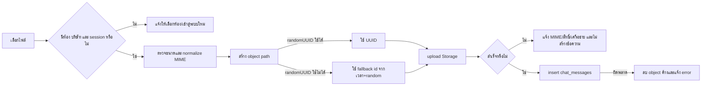

- **เหตุผล:** บนมือถือหรือ URL ที่ไม่ใช่ secure origin บาง browser ไม่มี `crypto.randomUUID()` หรือเรียกแล้ว throw ก่อนถึงขั้น upload ทำให้ผู้ใช้เลือกไฟล์แล้วไม่มีข้อความส่งออก
- **ผลกระทบ:** `src/pages/Chat/index.tsx` ใช้ UUID เมื่อพร้อมและ fallback id เมื่อไม่พร้อม, ตรวจ session/ห้องก่อนเริ่ม, disable ปุ่มส่งเมื่อ auth context ยังไม่พร้อม และแปล error ของ Storage เป็นข้อความที่แก้ไขได้
- **States:** `selected → ready|blocked → validated → path_ready(uuid|fallback) → uploaded → message_recorded|failed`; เมื่อ insert ล้มเหลวจะ cleanup object ตามเดิม
- **Roles / Permission:** ต้องมี Auth session, company context และเป็นสมาชิกห้อง; Storage/RLS เดิมไม่เปลี่ยน
- **Integrations:** browser File API, Supabase Storage `chat-attachments`, `chat_messages`, `runWithMutationAttempt`
- **Failure / Retry:** ไม่มี session/ห้องให้แก้บริบทก่อน; MIME/ขนาดไม่ผ่านหยุดก่อน upload; Storage permission/MIME/network แสดงคำแนะนำ; insert ล้มเหลวลบไฟล์ค้างและกดส่งใหม่ได้
- **Audit events:** mutation attempt `send-file-message` เก็บสถานะ success/error; object path ใช้ UUID หรือ fallback id ที่ไม่บรรจุข้อมูลส่วนตัว
- **Owner:** ทีมระบบเป็น owner ของ client compatibility, Storage policy และ cleanup; สมาชิกห้องเป็น owner ของการส่งไฟล์

## Room selection persistence and Realtime auth (v1.11)

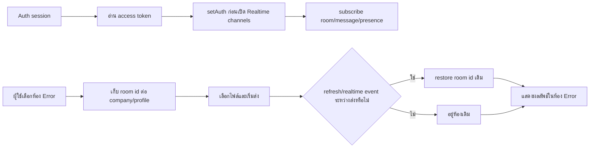

- **เหตุผล:** เมื่อ Realtime เปิดก่อนมี JWT จะเกิด websocket `401` และ refresh รายการห้องอาจเลือกห้องแรก (HR) แทนห้องที่ผู้ใช้กำลังใช้งาน
- **ผลกระทบ:** Chat ขอ access token แล้วเรียก `supabase.realtime.setAuth(token)` ก่อน subscribe; เก็บห้องล่าสุดใน `sessionStorage` ต่อบริษัท/ผู้ใช้ และให้ `loadRooms`/file send ใช้ห้องเดิม
- **States:** `auth_pending → realtime_ready|realtime_offline`; ห้อง `selected → persisted → restored|fallback`; การส่งไฟล์ไม่เปลี่ยนห้องจาก refresh event
- **Roles / Permission:** Realtime ยังใช้ private/authenticated channel เดิม; room selection key ไม่ให้สิทธิ์เพิ่มและไม่ใช้แทน RLS
- **Integrations:** Supabase Auth session, Realtime channels, `chat_rooms`, `chat_messages`, browser `sessionStorage`
- **Failure / Retry:** ไม่มี token จะไม่เปิด channel และแสดง offline; storage ถูกบล็อกยังใช้ in-memory selection; room หายจาก RLS จึง fallback ตามรายการที่เข้าถึงได้
- **Audit events:** ไม่บันทึกเนื้อหาใน storage key; request/error telemetry เดิมยังบันทึก websocket/API failure
- **Owner:** ทีมระบบเป็น owner ของ auth hand-off และ selection persistence; Supabase เป็น owner ของ JWT/RLS authorization

## Explicit mobile attachment send state (v1.12)

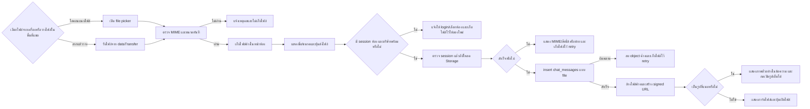

## Web Chat Attendance Approval + Close 100% (v2.4)

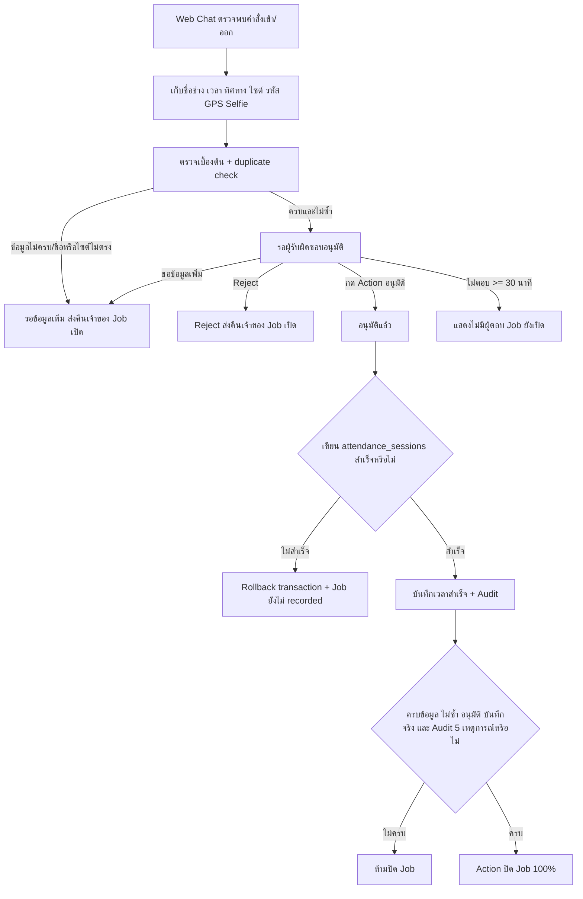

- **Input:** ผู้ส่ง, ชื่อจากโปรไฟล์, `clock_in|clock_out`, เวลา, โครงการ/ไซต์, GPS, Selfie, room และ `request_code` เดิมจากหน้าต่าง Web Chat
- **Output:** `attendance_sessions` จะถูกสร้าง/ปิดเวลาหลัง Action อนุมัติเท่านั้น; Job ปิดเมื่อ close gate ผ่านครบ
- **States:** `detected → prechecked → pending_approval → approved → recorded → closed`; ทางแยก `needs_more_info|rejected` ไม่ปิด Job และส่ง owner กลับเป็นผู้ร้องขอ
- **Roles/permissions:** ผู้ใช้สร้าง Job ของตนในห้องที่เป็นสมาชิก; company manager เป็นผู้กด Approve/Reject/Request more/Close; RPC ตรวจ tenant และสิทธิ์ซ้ำ
- **Integrations:** `chat_attendance_approval_jobs`, `chat_attendance_approval_events`, RPC create/review/close และ `attendance_sessions`; `request_code` เป็น idempotency key ต่อบริษัท
- **Failure/retry:** request code เดิมคืน Job เดิม; duplicate attendance ส่งกลับ `needs_more_info`; การเขียนเวลาล้มเหลว rollback approval ใน transaction; ไม่มีผู้ตอบแสดง warning แต่ไม่เปลี่ยนหรือปิดสถานะ
- **Audit:** `data_detected`, `precheck_completed`, `approval_requested`, `approval_granted`, `attendance_recorded`, `job_closed_100_percent`; Reject/request-more/duplicate มี event แยก
- **Owner:** ผู้ร้องขอรับผิดชอบข้อมูลที่ขาด; manager รับผิดชอบการตัดสินใจและปิด Job; ระบบรับผิดชอบ idempotency, atomic write และ audit gate

### Change record v2.4 — 23/8/2569

- เหตุผล: ห้าม Web Chat เขียนเวลาจริงทันทีโดยไม่มีผู้รับผิดชอบอนุมัติ และนิยามปิด Job ให้ตรวจครบ 100%
- ผลกระทบ: หน้า Chat, ตาราง Job/Audit, RPC create/review/close และ Flow Registry
- Migration baseline ที่ตรงกับ Production: `20260823031549_web_chat_attendance_approval_jobs.sql`; ไม่มีการแก้รายการเดิมย้อนหลัง
- Verification: contract scenarios ปกติ/ซ้ำ/ชื่อไม่ตรง/ข้อมูลไม่ครบ/Reject/request-more/no-response, lint, build และหน้า `/chat`
- Rollback: ปิด UI approval, คืน submit ไป `attendance-clock`, แล้ว drop RPC/table ใหม่ได้; ไม่ลบ `attendance_sessions` ที่บันทึกสำเร็จแล้ว

- **เหตุผล:** flow เดิมเริ่มอัปโหลดทันทีใน `onChange` ของ file input ทำให้ผู้ใช้มือถือไม่เห็นว่าไฟล์ถูกเลือกแล้ว และเมื่อ session/ห้องยังไม่พร้อมอาจดูเหมือนเลือกไฟล์แล้วหายไป
- **ผลกระทบ:** `src/pages/Chat/index.tsx` รองรับทั้ง file picker และลากไฟล์มาวางในพื้นที่แชต; เปลี่ยนเป็น `selected → pending → sending → uploaded → message_recorded|failed`; ผู้ใช้เห็นชื่อ/ขนาดไฟล์และกด `ส่งไฟล์` เอง; input ใช้ visually-hidden style แทน `hidden` เพื่อให้ file picker บน mobile ทำงานสม่ำเสมอ
- **Input / Output:** File picker หรือ `dataTransfer.files` + session/ห้อง/บริษัท → pending attachment card; เมื่อสำเร็จได้ object ใน `chat-attachments`, `chat_messages` แบบ `file` และ signed URL
- **Roles / Permission:** ยังใช้ Auth session, company membership, room membership และ Storage/RLS เดิม; company manager ใช้ policy ที่มีอยู่; UI ไม่มีการเพิ่มสิทธิ์
- **Integrations:** browser File API, Supabase Auth/Storage/PostgREST, `chat_messages`, `runWithMutationAttempt`
- **Failure / Retry:** drop ที่ไม่มีไฟล์หรือไม่มีห้องจะไม่ upload; MIME/ขนาดหยุดก่อนเก็บไฟล์; session หมดอายุ/Storage 403/network แสดงข้อความและคงไฟล์ไว้ให้กดส่งซ้ำ; insert ล้มเหลวลบ object แล้วคงไฟล์ไว้
- **Audit events:** ส่งสำเร็จ/ล้มเหลวใช้ mutation attempt `send-file-message`; object จะถูกลบเมื่อบันทึกข้อความไม่สำเร็จ
- **Owner:** ผู้ส่งเป็น owner ของการกดส่ง/ยกเลิก; ทีมระบบเป็น owner ของ validation, error mapping และ cleanup

## Inline image preview in Chat (v1.17)

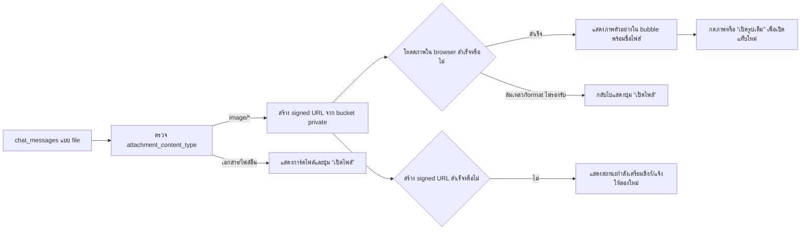

- **เหตุผล:** ผู้ใช้ต้องการเห็นรูปที่ส่งในห้อง Chat ทันที ไม่ต้องเปิดลิงก์ทีละไฟล์ ขณะที่เอกสารและไฟล์ที่ browser แสดงไม่ได้ยังต้องดาวน์โหลดได้ตามเดิม
- **ผลกระทบ:** `src/pages/Chat/index.tsx` ใช้ signed URL เดิมของไฟล์ private แล้วแสดง `image/*` เป็นภาพตัวอย่างแบบ responsive ใน message bubble; คลิกภาพหรือปุ่ม `เปิดรูปเต็ม` เพื่อเปิดแท็บใหม่; ถ้า browser โหลดภาพไม่ได้จะ fallback เป็นปุ่ม `เปิดไฟล์`; PDF/Word/Excel/text ไม่เปลี่ยนรูปแบบ
- **Input / Output:** `chat_messages.attachment_content_type`, bucket/path และ signed URL → inline image preview หรือ file card/link; ไม่มีการเปิด bucket เป็น public และไม่มีการคัดลอกไฟล์ใหม่
- **States:** `message_recorded → signed_url_pending → preview_visible|file_link|preview_failed`; signed URL หมดอายุยังใช้ flow เปิดไฟล์/สร้างลิงก์ใหม่เดิม
- **Roles / Permission:** ใช้สิทธิ์อ่าน Storage/RLS เดิมของสมาชิกห้องหรือผู้จัดการเท่านั้น; preview ไม่เพิ่มสิทธิ์และไม่ทำให้ URL ถาวร
- **Integrations:** Supabase Storage `createSignedUrl`, browser ``, `chat_messages` และ Chat Realtime/message loader
- **Failure / Retry:** signed URL error แสดงสถานะเตรียมลิงก์; image decode/network error ซ่อน preview ที่เสียและ fallback เป็น file link; ผู้ใช้เปิดไฟล์เต็มเพื่อ retry ตามสิทธิ์เดิม
- **Audit events:** ไม่มีการสร้างข้อความหรือ object เพิ่ม; การเปิด signed URL เป็น request ของ Storage ตาม access log เดิม และการส่งไฟล์ยัง audit ผ่าน `send-file-message`
- **Owner:** ทีมระบบเป็น owner ของ signed URL/preview fallback และ responsive UI; สมาชิกห้องเป็น owner ของการเข้าถึงไฟล์ตามสิทธิ์ห้อง

## LINE attendance command path (v1.2)

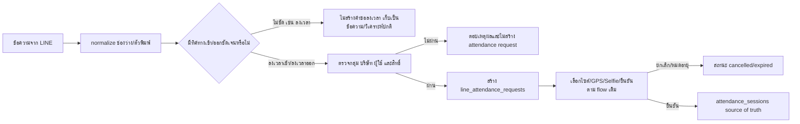

ข้อความ LINE ที่มีเพียงคำกำกวม `ลงเวลา`, `ลงเวลาทำงาน`, `บันทึกเวลา` หรือ `บันทึกเวลาทำงาน` จะไม่เปิดปุ่มเลือกเข้า/ออกและไม่สร้าง `line_attendance_requests` อีกต่อไป ผู้ใช้ต้องระบุทิศทาง เช่น `ลงเวลาเข้า` หรือ `ลงเวลาออก`; คำสั่งที่มีทิศทางชัดเจนยังใช้ flow ตรวจสิทธิ์และยืนยันเดิมต่อได้

- **Input:** LINE text message จากกลุ่ม/ผู้ใช้ที่ผูกบริษัท หรือข้อความที่มีคำสั่งทิศทางเข้า/ออกชัดเจน
- **Output:** กรณีกำกวมเป็นข้อความปกติ/งานวิเคราะห์เดิม; กรณีชัดเจนเป็น `line_attendance_requests` และผลลงเวลาใน `attendance_sessions`
- **States:** `received → normal_text|attendance_request → awaiting_employee_confirmation → pending_approval → approved|rejected|cancelled|expired`; คำกำกวมจบที่ `normal_text` โดยไม่มี side effect ด้าน attendance
- **Roles / Permission:** ต้องเป็นกลุ่ม LINE ที่ผูกบริษัท, ผู้ส่งต้องผูกโปรไฟล์ และ backend ตรวจสมาชิก/บทบาท/ไซต์ก่อนสร้างคำขอ; การเปลี่ยน parser ไม่เพิ่มสิทธิ์
- **Integrations:** `supabase/functions/line-webhook`, `line_attendance_requests`, `line_attendance_events`, `attendance-clock`/attendance RPC และ trigger ส่ง Log เข้า HR Chat
- **Failure / Retry:** parser ไม่ชัดเจนไม่ retry เป็น attendance; กลุ่ม/โปรไฟล์/ไซต์ไม่ผ่านตอบเหตุผลและไม่เขียนคำขอ; LINE redelivery ใช้ webhook idempotency เดิม; คำขอค้างเดิมไม่ถูกลบหรือเปลี่ยนสถานะโดยอัตโนมัติ
- **Audit events:** `line_ingestion_events` เก็บ `text_analysis` หรือ `line_attendance_request` ตามผล parser; คำขอที่สร้างใช้ `line_attendance_events` เดิม; ไม่มี event attendance ใหม่สำหรับคำว่า `ลงเวลา` แบบกำกวม
- **Owner:** ทีมระบบเป็น owner ของ parser/Edge Function; HR/ผู้จัดการเป็น owner ของการอนุมัติคำขอที่สร้างแล้ว; ผู้ใช้เป็น owner ของการยืนยันข้อมูลตนเอง

## Change Record

### v1.0 — 21/8/2569

- เหตุผล: ให้ HR ส่ง log ลงเวลาช่างเข้าห้อง Chat กลางที่กำหนดได้
- ผลกระทบ: เพิ่ม integration mapping, delivery audit, trigger จาก attendance และปุ่มตั้งค่าบน Chat
- Migration: `20260821040239_chat_attendance_bridge.sql` + `20260821040539_chat_attendance_bridge_hardening.sql`
- Verification: migration/schema, TypeScript, lint, build, attendance/chat tests และตรวจหน้า `/chat` จริง
- Rollback: ปิด integration หรือ drop trigger/function; ไม่ลบ `attendance_sessions`, `chat_messages` หรือ delivery audit ที่เกิดแล้ว

### v1.1 — 21/8/2569

- เหตุผล: ให้ช่างแจ้งเข้างาน/ออกงานจากห้องแชตได้ทั้งพิมพ์และเสียง โดยยังคงให้ผู้ใช้ตรวจ GPS และยืนยัน Selfie ก่อนบันทึก
- ผลกระทบ: เพิ่ม command parser, Thai Web Speech input, confirmation dialog และเรียก `attendance-clock` จาก Chat; schema/trigger เดิมใช้ต่อ
- Migration: ไม่มี migration ใหม่ (ใช้ `attendance_sessions`, `attendance-selfies` และ bridge v1.0 เดิม)
- Verification: `npm run build`, `npm run lint`, attendance/communication tests และตรวจ redirect/auth ของหน้า `/chat` ใน browser
- Rollback: ปิดการใช้งานปุ่ม/เส้นทาง command ใน `src/pages/Chat/index.tsx`; การลงเวลาจากหน้า Time Tracking และ bridge ไม่ได้รับผลกระทบ

### v1.2 — 21/8/2569

- เหตุผล: แก้ปัญหาสร้างห้องไม่ได้จาก RLS ที่ซ่อนห้องก่อนสร้าง owner membership และการเชิญสมาชิกพร้อม owner ใน statement เดียว
- ผลกระทบ: ผู้สร้างห้องอ่านห้องของตนเองได้ระหว่าง handshake; สร้าง owner ก่อนแล้วจึงเพิ่ม invitee; แก้ policy อ่านสมาชิกให้ scope ตามห้องจริง
- Migration: `20260821060000_chat_room_create_rls_fix.sql` + `20260821060001_chat_room_member_read_rls_fix.sql`
- Verification: Supabase authenticated rollback transaction สร้างห้อง + owner + invitee สำเร็จ, `npm run build`, `npm run lint` และ command test
- Rollback: revert policy สองชุดและกลับไป insert membership แบบเดิมได้ โดยไม่ลบข้อมูลห้องที่มีอยู่

### v1.3 — 21/8/2569

- เหตุผล: ให้ `/chat` เป็นหน้าจอเฉพาะของ Web Chat ลดปุ่มที่ไม่เกี่ยวข้อง และให้กลับไปหน้าลงเวลาได้ชัดเจนบนมือถือ
- ผลกระทบ: เปลี่ยน header เป็น Web Chat toolbar ที่มีปุ่มไอคอนกลับ `/time-tracking` เพียงปุ่มเดียว; ย้ายสร้างห้องเป็นปุ่ม `+` ในรายการห้อง
- Migration: ไม่มี
- Verification: `npm run build`, `npm run lint` และตรวจ route/navigation ของ Chat
- Rollback: คืน PageHeader เดิมและปุ่มสร้างห้องด้านบนได้โดยไม่กระทบข้อมูลหรือสิทธิ์ห้อง

### v1.4 — 21/8/2569

- เหตุผล: ให้ผู้ใช้เห็นข้อความใหม่และสถานะสมาชิกในห้องได้ทันทีแบบเดียวกับ Web Chat ที่ใช้งานจริง
- ผลกระทบ: เพิ่ม unread badge ต่อห้องจาก read cursor ของผู้ใช้, แสดงจำนวนออนไลน์ในรายการ/หัวห้อง และแสดงออนไลน์/ออฟไลน์รายสมาชิกผ่าน Supabase Realtime Presence
- Migration: `20260821060002_chat_read_states.sql` เพิ่ม `chat_room_read_states` พร้อม RLS ให้อ่าน/เขียนได้เฉพาะ cursor ของตนเองในห้องที่เข้าถึงได้
- Verification: ตรวจ table/RLS บน Supabase (3 policies), `npm run build`, `npm run lint`, chat/attendance/communication tests และตรวจ flow การ mark-read ตอนเปิดห้อง
- Rollback: หยุด Presence และซ่อน badge ได้โดยไม่ลบ `chat_messages`; หากต้อง rollback schema ให้ drop `chat_room_read_states` หลังถอดการอ่าน/เขียน cursor จาก Chat

### v1.5 — 21/8/2569

- เหตุผล: ให้เจ้าของห้องหรือผู้จัดการบริษัทแก้ชื่อห้องได้จากหน้าจัดการสมาชิก โดยไม่ต้องสร้างห้องใหม่
- ผลกระทบ: เพิ่มช่องชื่อห้องและปุ่มบันทึกใน Dialog จัดการสมาชิก; update จะตรวจบริษัทและสิทธิ์เจ้าของ/ผู้จัดการก่อนบันทึก
- Migration: `20260821060003_chat_room_rename_owner_rls.sql` แก้ `chat_rooms` update policy ให้ owner ผ่าน `WITH CHECK` ได้เช่นเดียวกับ `USING`
- Verification: ตรวจ policy บน Supabase, `npm run lint`, Vite build และทดสอบ mutation path ผ่าน `runWithMutationAttempt`
- Rollback: ซ่อนช่องแก้ชื่อและ revert policy ได้; ชื่อห้องที่แก้แล้วคงอยู่ ไม่ลบข้อความ สมาชิก หรือ delivery audit

### v1.6 — 22/8/2569

- เหตุผล: ให้ผู้ใช้เห็นสถานะของตัวเองทันทีหลังเข้า Web Chat ไม่ต้องอนุมานจากตัวเลขออนไลน์ในห้อง
- ผลกระทบ: เพิ่ม status chip บนแถบ Web Chat เป็น `คุณออนไลน์`, `กำลังเชื่อมต่อ` หรือ `ออฟไลน์`; Presence track สำเร็จจึงนับผู้ใช้เข้า online map
- Migration: ไม่มี schema migration; ใช้ Supabase Realtime Presence channel เดิม
- Verification: `npm run lint`, `npm run build`, Vite output และทดสอบ Chat command/communication พร้อมตรวจสถานะ subscription/track path
- Rollback: ถอด status chip ได้โดยไม่กระทบข้อความ, unread cursor, สมาชิก หรือ attendance bridge

### v1.7 — 22/8/2569

- เหตุผล: ให้สมาชิกในห้องโทรเสียงหากันได้โดยไม่ต้องออกจาก Web Chat
- ผลกระทบ: เพิ่ม directory โทรสมาชิก, สายเข้า, รับ/ปฏิเสธ/ไม่ว่าง, ปิดไมค์, วางสาย และ WebRTC signaling แยกตามบริษัท/ห้อง; ไม่บันทึกเสียงหรือประวัติสายใน MVP
- Migration: `20260821211226_chat_voice_calls_realtime.sql` เพิ่ม RLS policy บน `realtime.messages` ให้ private broadcast ผ่านได้เฉพาะสมาชิก/ผู้จัดการของห้องนั้น
- Verification: Supabase policy/advisor verification, `npm run lint`, `npm run build`, chat/communication tests และตรวจ route `/chat` ใน browser
- Rollback: ถอดปุ่มโทรและ call signaling effect ได้; ลบ policy Realtime migration ได้โดยไม่กระทบข้อความ, unread, Presence หรือ attendance bridge

### v1.8 — 22/8/2569

- เหตุผล: ลดความหนาแน่นของข้อความและคำอธิบายบนหน้าจอ Chat ให้ผู้ใช้โฟกัสที่ห้องและบทสนทนาได้ทันที
- ผลกระทบ: `src/pages/Chat/index.tsx` เปลี่ยนเป็น compact chat workspace, ย่อแถบหัวเรื่อง/รายการห้อง, เปลี่ยน action ห้องเป็น icon พร้อม tooltip, จำกัดพื้นที่ข้อความให้ scroll ภายในกรอบ และบนมือถือเปิดรายการห้องผ่านเมนูเลือกห้อง
- Migration: ไม่มี schema หรือข้อมูลใหม่; เป็นการปรับ presentation และ responsive interaction เท่านั้น
- Verification: ตรวจ responsive layout ใน route `/chat`, `npx eslint src/pages/Chat/index.tsx`, `npm run test:chat-attendance-command`, `npm run test:communication-event-feed` และ `npm run build`
- Rollback: คืน layout เดิมได้โดย revert เฉพาะ JSX/SX ของ Chat; ข้อความ, unread, Presence, voice call, attendance และ HR delivery ไม่เปลี่ยน

### v1.9 — 22/8/2569

- เหตุผล: ให้ผู้ใช้เข้าถึง Web Chat และลงเวลาจากจุดเดียว และแก้รูปจากมือถือที่แนบไม่ได้เพราะ MIME type ไม่อยู่ใน bucket allow-list
- ผลกระทบ: เพิ่ม Application Launcher ที่ route `/` พร้อมไอคอน Web Chat/ลงเวลาและ unread badge; เพิ่ม `src/services/chatUnread.ts`; เปลี่ยนทางลัด Web Chat/ลงเวลาเป็น icon; เพิ่มการรองรับ `image/heic`, `image/heif`, `image/avif`, `image/tiff` และ normalize MIME จากนามสกุลไฟล์ก่อน upload
- Migration: `20260822003747_chat_attachment_mobile_images.sql` ขยาย allow-list ของ bucket `chat-attachments` โดยยังคง bucket private และ policy สมาชิกห้องเดิม
- Verification: query ตรวจ bucket/policy/migration บน Supabase, targeted ESLint, `npm run build`, chat/communication tests และตรวจ route `/`/`/chat` ใน browser
- Rollback: revert route/launcher/icon และถอด MIME ใหม่จาก bucket ได้; ข้อความ/ไฟล์เดิมไม่ถูกลบ และ policy ห้องไม่เปลี่ยน

### v1.10 — 22/8/2569

- เหตุผล: แก้อาการเลือกไฟล์บนมือถือแล้วส่งไม่ออกเมื่อ browser ไม่มี `crypto.randomUUID()` หรือ auth/ห้องยังไม่พร้อม
- ผลกระทบ: เพิ่ม fallback object id, guard ก่อนส่ง และข้อความ error เฉพาะ MIME/สิทธิ์/เครือข่าย; ไม่เปลี่ยน schema หรือ Storage policy
- Migration: ไม่มี
- Verification: `npm run test:chat-launcher-attachment`, targeted ESLint, `npm run lint`, `npm run build` และตรวจ route `/chat` หลัง Login
- Rollback: revert helper/guard/error mapping ใน `src/pages/Chat/index.tsx`; ไฟล์และข้อความที่ส่งสำเร็จแล้วไม่ถูกลบ

### v1.11 — 22/8/2569

- เหตุผล: ป้องกันการเด้งจากห้อง Error ไปห้อง HR ระหว่าง file send/room refresh และแก้ Realtime websocket 401 จากการ subscribe ก่อนส่ง JWT
- ผลกระทบ: เพิ่ม explicit Realtime auth hand-off, gate channel subscription จนพร้อม และจำห้องล่าสุดต่อ company/profile; ไม่เปลี่ยน Storage bucket, RLS หรือ chat payload
- Migration: ไม่มี
- Verification: `npm run test:chat-launcher-attachment`, targeted ESLint, `npm run lint`, `npm run build`; API logs ก่อนแก้พบ websocket `401` และไม่มี request ไป `chat-attachments`, หลัง deploy ต้องตรวจซ้ำและลองแนบไฟล์ในห้อง Error จริง
- Rollback: ยกเลิก gate/persistence ได้โดยไม่ลบห้อง ข้อความ หรือไฟล์

### v1.12 — 23/8/2569

- **เหตุผล:** ผู้ใช้มือถือเลือกไฟล์แล้วไม่เห็นสถานะ/ปุ่มส่งที่ชัดเจน เพราะระบบเริ่ม upload ทันทีจาก file input; เมื่อบริบท auth/ห้องยังไม่พร้อมจึงเหมือนแนบไม่สำเร็จ
- **ผลกระทบ:** เพิ่ม pending attachment card, ปุ่ม `ส่งไฟล์`, session preflight, MIME-normalized upload body และคงไฟล์ไว้ retry; ไม่เปลี่ยน bucket, policy, schema หรือสิทธิ์
- **Migration:** ไม่มี
- **Verification:** `npm run test:chat-launcher-attachment`, targeted ESLint, `npm run lint`, `npm run build` และทดสอบหน้า `/chat` ด้วยบัญชีสมาชิกห้องจริง
- **Rollback:** revert pending state/explicit send/session preflight ใน `src/pages/Chat/index.tsx`; ไม่ลบห้อง ข้อความ หรือไฟล์ที่ส่งสำเร็จ

### v1.13 — 23/8/2569

- **เหตุผล:** Production log พบ `auth refresh 400` ตามด้วย Storage RLS error ทำให้ session หมดอายุถูกแปลเป็น “ไม่มีสิทธิ์แนบไฟล์” ทั้งที่ผู้ใช้ยังเป็นสมาชิกห้อง
- **ผลกระทบ:** `src/pages/Chat/index.tsx` ตรวจ `session.expires_at` ก่อน upload, refresh token ที่ใกล้หมดอายุ, retry 401/RLS ด้วย token ใหม่หนึ่งครั้ง และแยกข้อความ session/สิทธิ์ห้อง/UUID ผิด; ไฟล์ที่เลือกยังคงค้างเพื่อส่งซ้ำหลัง login ใหม่; ใช้ Storage policy ผู้จัดการที่มีอยู่จาก `20260822194037_chat_attachment_manager_storage_policy.sql` โดยไม่ขยายสิทธิ์เพิ่มใน v1.13
- **Migration:** ไม่มี migration ใหม่; policy ผู้จัดการจาก `20260822194037_chat_attachment_manager_storage_policy.sql` ถูก deploy อยู่แล้ว
- **Verification:** `npm run test:chat-launcher-attachment`, targeted ESLint, `npm run lint`, `npm run build`, ตรวจ Supabase API/Postgres log และทดสอบ upload จริงด้วย session ที่ยังใช้งานได้/หมดอายุ
- **Rollback:** revert session freshness/error mapping ใน `src/pages/Chat/index.tsx`; ไม่ลบห้อง ข้อความ หรือไฟล์ที่ส่งสำเร็จ

### v1.14 — 23/8/2569

- เหตุผล: ผู้ใช้บางเครือข่ายเข้า `wisdomai.pages.dev` ซึ่งเป็น Cloudflare fallback แต่รุ่นแก้ไข attachment ถูกปล่อยเฉพาะ Vercel ทำให้ยังใช้ flow upload เก่าและแสดง RLS/session error เดิม
- ผลกระทบ: Vercel และ Cloudflare ใช้ frontend artifact จาก commit `a722ea3` แล้ว; ไม่เปลี่ยน schema, bucket, policy หรือข้อมูลห้อง/ข้อความ
- Migration: ไม่มี; release parity ของทั้งสอง host ผ่านก่อน authenticated UAT
- Verification: `npm run test:chat-launcher-attachment`, `npm run lint`, `npm run build`, Vercel deployment `dpl_GQfXKkqeun7kXqSL2RSgpMQTEd4q` READY/ไม่มี error log; Cloudflare HTML `index-C9ZXTxHX.js` และ Chat bundle `Chat-CboekurR.js` พบ `ส่งไฟล์`, `refreshSession` และ `chat-attachments`; ต้องยืนยัน upload จริงในห้องด้วยบัญชีผู้ใช้
- Rollback: rollback artifact ของทั้งสอง host ไป release ก่อนหน้าได้; ไม่ลบ object, message หรือ audit ที่ส่งสำเร็จ

### v2.0 — 22/8/2569

- เหตุผล: ให้ห้อง HR รับข้อความงานที่ต้องทำทั้งหมด ไม่ใช่เฉพาะลงเวลาเข้า/ออก ได้แก่ รายการแจ้งเวลา, รายการแจ้งออก และงาน HR อื่น ๆ
- ผลกระทบ: เพิ่ม `chat_hr_delivery_events`, central delivery function, retry function และ trigger จาก leave/correction/OT/document/lifecycle/resignation โดยยังใช้ห้อง HR เดิมจาก `chat_room_integrations`
- Migration: `202608220001_hr_chat_work_event_stream.sql`
- Verification: migration contract test, Supabase schema/function/trigger verification, lint, build และตรวจหน้า `/chat`/`/flow-registry`
- Rollback: drop trigger/function/table `chat_hr_delivery_events` ได้โดยไม่ลบ `chat_messages` หรือข้อมูลต้นทาง; attendance bridge เดิมยังทำงานต่อ

### v2.1 — 22/8/2569

- เหตุผล: ให้ผู้ใช้มือถือมีไอคอนโปรแกรม WisdomAI เพียงตัวเดียว และเมื่อเปิดจากหน้าจอมือถือให้เข้าจุดรวม `/` ก่อนเลือก Web Chat หรือ ลงเวลา
- ผลกระทบ: เพิ่มไอคอน PNG ขนาด 32/180/192/512 และ master ใน `public/branding`; manifest เปลี่ยน `start_url` เป็น `/`; `index.html` เพิ่ม favicon/Apple touch icon; Application Launcher แสดงไอคอนแบรนด์
- Migration: ไม่มี schema หรือข้อมูลธุรกิจใหม่; เป็น static asset/manifest change
- Verification: ตรวจขนาดและภาพจริงของ PNG, ตรวจ manifest/HTML links, `npm run lint`, `npm run build` และตรวจ route `/` หลังเปิดจาก PWA
- Rollback: คืน `start_url` เป็น `/time-tracking`, ถอด icon links และซ่อน avatar บน Launcher ได้; ไม่กระทบข้อความ ห้อง สมาชิก ลงเวลา หรือ delivery audit

### v2.2 — 23/8/2569

- เหตุผล: ให้จุดเข้าโปรแกรมเลือกหน้าแรกตามอุปกรณ์และบทบาท ลดการให้ผู้ใช้ทุกคนผ่าน Launcher ก่อน
- ผลกระทบ: `authRouting`, `Login`, `ProtectedRoute`, `AppLauncher` และเอกสาร Navigation/Time Tracking; mobile ไป Time Tracking, desktop manager/admin ไป Dashboard, desktop employee ไป My Profile
- Migration: ไม่มี schema/data migration
- Verification: auth-routing test, lint, build, route guard และตรวจทางเข้า Web Chat จาก Sidebar/ทางลัด
- Rollback: คืนการเปิด Launcher เป็นค่าเริ่มต้นได้ โดยไม่ลบข้อความ ห้อง Presence voice call หรือ attendance/HR delivery

### v2.3 — 23/8/2569

- เหตุผล: ยกเลิกการตรวจจับคำกำกวมจาก LINE ที่มีเพียง `ลงเวลา` เพื่อไม่ให้ระบบเปิดคำขอหรือเลือกเข้า/ออกโดยไม่ได้ระบุทิศทาง
- ผลกระทบ: `supabase/functions/line-webhook/attendance-command.ts`, `supabase/functions/line-webhook/index.ts`, parser regression test และ Flow Registry; `ลงเวลาเข้า`/`ลงเวลาออก` และคำที่มีทิศทางชัดเจนยังทำงานเหมือนเดิม
- Migration: ไม่มี schema/data migration; ตรวจ Production แล้วไม่พบ `line_attendance_requests` หรือ `line_task_commands` ที่มาจากข้อความ generic เหล่านี้ จึงไม่มีรายการค้างให้ลบ/ยกเลิก
- Verification: parser test สำหรับ generic/directional commands, targeted lint, build, Edge Function deploy และ query ตรวจรายการค้าง/สถานะบน Production
- Rollback: คืน parser เดิมและ deploy `line-webhook` รุ่นก่อนหน้าได้; ข้อมูลคำขอ/attendance ที่มีอยู่ก่อนการเปลี่ยนไม่ถูกลบหรือแก้ย้อนหลัง
