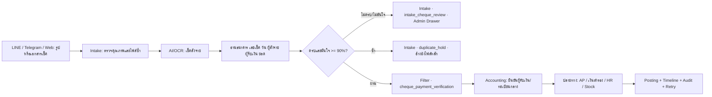

# Cheque Payment Intake Flow

## วัตถุประสงค์

รับรูปหรือเอกสารเช็คเข้าจุดกลางเดียว แยกตัวตนของผู้สั่งจ่ายและผู้รับเงินออกจากผู้ส่งในแชต จากนั้นจึงตรวจความครบถ้วน กันซ้ำ และส่งเฉพาะรายการที่ผ่านไป Filter/บัญชี

## Input และข้อมูลที่จัดเก็บ

- ต้นทาง: LINE, Telegram หรือ Web พร้อมห้อง ผู้ส่ง เวลา และไฟล์ต้นฉบับ
- OCR/AI: ธนาคาร, เลขเช็ค, วันที่เช็ค, ผู้สั่งจ่าย, ผู้รับเงิน, ยอด และความมั่นใจ
- เลขบัญชีเก็บได้เพียง 4 หลักท้าย; ไม่ใช้ชื่อผู้ส่งแชตแทน drawer/payee

## สถานะและเส้นทาง

- ข้อมูลไม่ครบหรือความมั่นใจต่ำกว่า 90%: `intake_cheque_review` / `needs_correction` ให้ Admin เปิดไฟล์และแก้ไขก่อนส่งต่อ
- เลขเช็ค ธนาคาร วัน และยอดตรงกับรายการเดิม: `duplicate_hold`; เก็บรายการแรกเป็นหลักและประทับรายการหลังว่าเป็นรายการซ้ำ
- ผ่าน Intake: `filter_cheque_verification` สำหรับ Accounting ยืนยันผู้รับเงินกับทะเบียนกลางก่อนสร้างงานปลายทาง

## สิทธิ์และการเชื่อมต่อ

- ผู้ใช้งานเห็นตามบริษัทและสิทธิ์ Document Flow; การตรวจหรือส่งต่อใช้ Admin/Accounting ตามสิทธิ์เดิม
- เชื่อม `financial_transactions`, `document_flow_items`, `document_flow_events` และ destination tasks ผ่าน Flow กลางเท่านั้น

## ความล้มเหลว การกู้คืน และ Audit

- การอ่านไม่ครบไม่หลุดออกจาก Intake; เก็บ issue code `cheque_data_incomplete`
- การซ้ำไม่ลบหลักฐาน: มี `duplicate_of`, `review_status=duplicate` และหมายเหตุอ้างอิงรายการหลัก
- ทุกการเปลี่ยนเข้า Filter สร้าง event `cheque_payment_routed_to_filter`; Admin ใช้ Timeline ตรวจย้อนหลังและส่งกลับ Intake ได้

## เจ้าของ

เจ้าของกระบวนการ: Accounting Manager; เจ้าของจุดคัดกรอง: Admin Intake; ผู้รับผิดชอบการบันทึก: Accounting/ปลายทางตามประเภทค่าใช้จ่าย

## Change record

| Version | Date | Change | Verification | Rollback |
| --- | --- | --- | --- | --- |
| 1.0 | 2026-08-23 | เพิ่ม cheque evidence, dedupe และ Intake→Filter routing | migration SQL + TypeScript/lint/build + flow contract | ถอน trigger/functions/columns ด้วย migration กลับรายการ โดยไม่ลบหลักฐาน |
