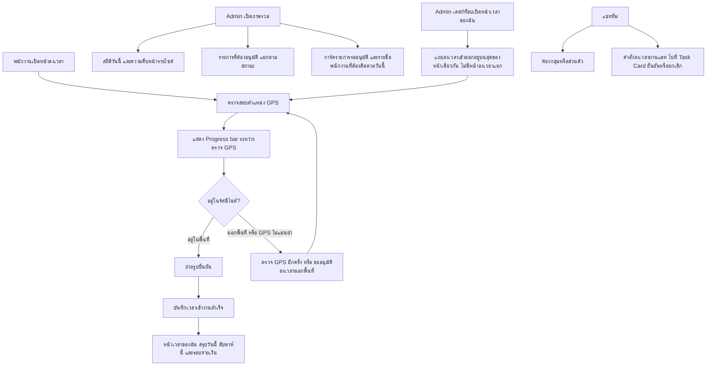

# Clock-In / Admin / Chat UI Flow (Design Review)

## Status of this document

**v1.2 — Design approved (13/09/2569); corrected after automated review on PR #84.** Supersedes
v1.1 and v1.0. The reviewer (project owner) told Claude directly, in chat, that the design is
approved — this is the actual authorization per the "Approval mechanism" section below, given both
by clicking "อนุมัติเป็นต้นแบบ" on the review Artifact (`approved: true`,
`approvedAt: 2026-09-12T20:54:04.917Z`) and by explicitly confirming in chat afterward
("ทำไงต่อ อนุมัตแล้ว", then choosing to start implementation).

**Implementation into the real WisdomAI-React codebase has not started yet.** This document
records what was approved and corrects the screen inventory to match the final reviewed design.
v1.2 additionally corrects four inaccuracies an automated reviewer (`chatgpt-codex-connector`)
found in v1.1 on PR #84 — a claimed in-app review surface and screenshot set that were never built,
a reference to a flow document that does not exist in this repository, a missing operational
contract, and an impossible rollback claim. See Changelog. A separate follow-up implementation flow
document is still expected before code changes land, per "Next step after approval" below — this
revision is a design-record correction, not that follow-up document.

Existing behavior is still unchanged: `TIME_TRACKING_FLOW.md` (ลงเวลาบนมือถือ, เขียนผ่าน
`attendance-clock` เข้า `attendance_sessions`) and `CHAT_ATTENDANCE_BRIDGE_FLOW.md` (คำสั่งลงเวลาผ่าน
แชท + การส่ง log เข้าห้อง HR) — the two real, committed flow documents that already cover the
attendance write path — plus the existing `Chat` page and the existing mobile/desktop admin screens,
all keep working exactly as they do today until an implementation flow document authorizes real
code changes.

## Purpose

Give the team a single reviewable place to see every screen (mobile and desktop) of three related
features before development starts:

1. **ลงเวลาเข้างาน (GPS clock-in)** — home → GPS check (now with a progress bar while GPS resolves)
   → in-site/out-of-site branch → photo confirmation → success.
2. **แอดมิน (Admin overview/approvals)** — today's stats, per-site progress, and a categorized
   approvals list (mobile and desktop), now including "รายการรออนุมัติ" mini-cards and a
   "พนักงานที่ต้องติดตามวันนี้" list on the desktop overview.
3. **แชททีม (Team chat)** — room list / thread views, including the attendance-command task card
   pattern (confirm/cancel a clock-in reported through chat).

## Where to review

**Corrected in v1.2:** v1.1 described an in-app review route (`/flow-registry/clockin-admin-chat`)
and a screenshot directory (`public/flow-review/clockin-admin-chat/*.png`) as though they already
existed. Neither does — the router only exposes `/flow-registry` today, and no such directory or
screenshots were ever added to this repository. The actual review happened entirely on two hosted
Claude Artifacts, which remain the real record:

- **Clickable prototype:** https://claude.ai/code/artifact/10c96722-af45-490c-a9e0-256fa595d45e —
  4 artboards (พนักงาน, Admin, แชท, Desktop) on one canvas, every control wired to real state
  transitions. (Version 9 — reflects the D-03 merge.)
- **Standalone review record:** https://claude.ai/code/artifact/6087932a-cbd7-476d-8d7b-9c259cdf79b3
  (Version 33) — 24 review comments, all addressed except the two open items under "Still open,"
  with the 18 reviewed screenshots hosted as part of that page, not in this repository.

Building a matching in-app `/flow-registry/clockin-admin-chat` review route (with the same 18
screenshots copied into `public/flow-review/...`) was an idea raised during design but was never
implemented and is **not required or assumed by this approval** — it can be scoped as its own item
in the follow-up implementation flow document if the team still wants it, but until then this
document must not claim it exists.

## Screen inventory (corrected — see Changelog)

| ID | Screen | Notes |
| --- | --- | --- |
| M-01 | ลงเวลา — หน้าหลัก / ตรวจ GPS / ถ่ายรูป / สำเร็จ | full clock-in flow, mobile. Home-screen messaging contradiction fixed (M-01a); progress bar added during the GPS check (M-01b). |
| M-02 | เวลาของฉัน — วันนี้ / สัปดาห์นี้ / รอบจ่ายเงิน | hours summary, ring chart, days-worked headline stat, 3-column day rows (เข้า/วันที่/ออก), weekly bar chart, history. "เดือนนี้" reframed as "รอบจ่ายเงิน" (pay-cutoff period) with prev/next controls. |
| M-03 | แอดมิน — ภาพรวม / อนุมัติ / เมนู | mobile admin, 3 tabs. The GPS clock-in write path already has written, code-verified flow docs (`TIME_TRACKING_FLOW.md`, `CHAT_ATTENDANCE_BRIDGE_FLOW.md`); this admin screen itself has no separate flow spec yet. |
| M-04 | แชท — รายการห้อง / สนทนา | mobile chat, incl. attendance task card |
| D-01 | ภาพรวม (Dashboard) | desktop admin dashboard. Added "รายการรออนุมัติ" mini-cards and "พนักงานที่ต้องติดตามวันนี้" list. A proposed tabbed second view ("มุมมองของหัวหน้างาน" / supervisor's view) is **not** part of this approval — still undefined, see "Still open." |
| D-02 | รายการที่ต้องอนุมัติ | desktop approvals table |
| D-03 | เวลาของฉัน (รวมลงเวลา) | **Corrected from v1.0.** No longer a separate desktop clock-in page. The standalone clock-in card was removed; the clock-in status + "ลงเวลาเข้า" button now live as a compact row at the top of the "เวลาของฉัน" page, above the ring chart / weekly bar chart / history table. One screen instead of two. |
| D-04 | แชท (Split View) | desktop two-pane chat. A persistent chat-notifier widget concept was proposed and **deferred** by the reviewer ("เก็บไว้ก่อน โฟกัสงานเดิมให้เสร็จ") — not designed, not part of this approval. |

## Design reference used

- Color/typography tokens taken from `src/theme.ts` (primary `#A65940`, dark `#71392C`, background
  `#F8F6F5`, divider `#E5DFDC`, Inter font, 12px radius) — same tokens the review page itself uses.
- Desktop sidebar/topbar matched to `Sidebar.tsx` / `TopBar.tsx` (dark `#333333` sidebar, active item
  `rgba(166,89,64,.72)` + `#FABFB2` left accent bar, white topbar with bottom border).
- Chat visual language (gradients, card borders, shadows) is intentionally more polished than a
  strict pixel match, per explicit direction during design review — the real `Chat` page's feature
  set (rooms, voice notes, location share, attendance-command task cards) is the functional
  reference, since no desktop split-view chat existed to match pixel-for-pixel.
- Brand mark cropped/alpha-keyed from `public/branding/wisdom-power-system-logo-transparent.png`.
  The live app does not render a logo image anywhere else in-UI (confirmed by code search) — this
  mark is used only on the mobile mockups' top bar per the reviewed design.

## Operational contract (added in v1.2)

AGENTS.md requires every flow document to cover inputs, outputs, states, roles/permissions,
integrations, failure/retry behavior, audit events, and owner. This document proposes UI/screen
changes only — it does not change the underlying data or write path, which is already fully
specified in two real, committed flow documents. Rather than restate (and risk drifting from) that
contract, this section inherits it by reference and states only what these new screens add on top.

- **Inputs:** unchanged from `TIME_TRACKING_FLOW.md` — current company/user, assigned site, GPS
  fix, selfie photo, and the `clock_in`/`clock_out` action; plus, for the chat path, a parsed Thai
  attendance command (`parseChatAttendanceCommand`, e.g. "แจ้งเข้างาน"/"ลงเวลาออก") per
  `CHAT_ATTENDANCE_BRIDGE_FLOW.md`'s attendance-approval-job flow in `src/pages/Chat/index.tsx`.
  M-01b (this document) only adds a progress indicator while the existing GPS check runs — no new
  input.
- **Outputs:** unchanged — `attendance_sessions` rows with status `normal|needs_review|failed`,
  delivered to the HR chat room via `chat_attendance_delivery_events`. M-02/D-03 (this document)
  only add a read-only summary presentation (days-worked stat, weekly bars, pay-cutoff framing) of
  data that already exists; D-01 (this document) adds a read-only "pending approvals" / "employees
  to follow up" view over existing approvals data. None of these screens write new fields.
- **States:** unchanged attendance state machine (`ready → location_checked → selfie_captured →
  awaiting_confirmation → recording → recorded|needs_review|failed`, per `TIME_TRACKING_FLOW.md`)
  and delivery states (`pending → sent`, or `failed` with retry, per `CHAT_ATTENDANCE_BRIDGE_FLOW.md`).
- **Roles/permissions:** unchanged — employees clock in/out for themselves only; managers/admins
  configure GPS/site policy and see company-wide approvals; the backend (`attendance-clock` edge
  function, and the chat-attendance database triggers) enforces company/employment/assignment
  checks regardless of what the client UI shows. The D-01 "pending approvals" and "follow-up" cards
  this document adds are additive read views for the existing manager/admin role — they do not
  introduce a new role or change who can approve.
- **Integrations:** unchanged — Time Tracking UI → Supabase Storage `attendance-selfies` →
  Edge Function `attendance-clock` → `attendance_sessions` → Chat Attendance Bridge → HR chat room
  via `chat_room_integrations`.
- **Failure/retry:** unchanged — incomplete GPS/camera/upload/edge-function calls never create a
  partial attendance row and require restarting the step; HR chat delivery failures are retried
  independently via the delivery ledger and never fail the underlying attendance write.
- **Audit/owner:** unchanged — attendance audit via `mutation_attempts`; employees own their own
  confirmations, HR/managers own policy and review, the platform team owns routing and the bridge.

## Approval mechanism

The review page's approve/comment state (the standalone review Artifact's own `approved` flag) is a
lightweight visual marker only — it is **not** the system of record. The actual authorization to
start implementation is the reviewer telling Claude directly (in the `00 | Program Development`
chat room) that the design is approved, same as every other change on this project. That statement
was given on 13/09/2569 (see "Status of this document" above), which is what makes this revision,
and the implementation work it authorizes, legitimate — not the button click alone.

## Still open — not covered by this approval

1. **D-01 (ภาพรวม) — tabbed dashboard, 2nd view undefined.** The reviewer wants to discuss what the
   proposed second tab ("มุมมองของหัวหน้างาน" / supervisor's view) actually shows before this gets
   designed. Do not build a second dashboard view until that is resolved.
2. **D-04 (แชท) — persistent chat-notifier widget concept. Deferred** by explicit reviewer choice.
   Do not design or build until raised again.

## Next step after approval

A follow-up implementation flow document (superseding this one) is still required before code
changes land, per the Flow Registry rule this document opened with. The "Operational contract"
section above already grounds the write path in the two real, committed flow documents
(`TIME_TRACKING_FLOW.md`, `CHAT_ATTENDANCE_BRIDGE_FLOW.md`) rather than deferring it — the
follow-up document should instead specify: which of the mobile admin/chat screens are net-new pages
versus visual refreshes of existing ones (`MobileOverview`, `Chat`, `TimeTracking`, `Dashboard`),
and a build/test/rollout plan per the Flow Registry's standard closing checklist. Because this
session has no shell access on the developer's machine, lint/build/test for that implementation
work must be run and confirmed by the developer themselves after each change is staged — this
document does not claim that verification has happened.

## Changelog

### v1.2 — 2026-09-13 (13/09/2569) — Corrections from automated PR review

- **Rationale:** `chatgpt-codex-connector` reviewed v1.1 on PR #84 and raised four findings, all
  confirmed against a fresh read-only clone of this repository. This revision fixes all four before
  merge, rather than merging known-inaccurate documentation.
- **What changed:**
  1. "Where to review" no longer claims an in-app `/flow-registry/clockin-admin-chat` route or a
     `public/flow-review/clockin-admin-chat/*.png` screenshot set exist — neither was ever built.
     The section now names the two Claude Artifacts as the actual review record and says building
     the in-app route is an unbuilt idea, not a claim.
  2. Every reference to `ATTENDANCE_CLOCK_GPS_GEOFENCE_FLOW.md` (a document that does not exist
     anywhere in this repository's history) is replaced with the two real, committed flow documents
     that actually cover this write path: `TIME_TRACKING_FLOW.md` and `CHAT_ATTENDANCE_BRIDGE_FLOW.md`.
  3. Added an "Operational contract" section covering inputs, outputs, states, roles/permissions,
     integrations, failure/retry, and audit/owner, grounded in those two real documents and scoped
     to what this document's screens actually add (read-only presentation/UI, no new writes) —
     previously this document deferred that contract entirely to a future document, which does not
     meet AGENTS.md's requirement that every flow document cover it.
  4. The rollback entry below is corrected — v1.0 was never committed to git, so "revert to v1.0"
     was not an executable rollback. See the corrected entry.
- **Impact:** documentation only; same as v1.1.
- **Migration:** none.
- **Verification:** each of the four corrections was checked against a fresh read-only clone of
  `github.com/paramonjong-afk/WisdomAI` (all branches fetched) — confirmed `ATTENDANCE_CLOCK_GPS_GEOFENCE_FLOW.md`
  does not exist on any branch; confirmed the router exposes only `/flow-registry` (no
  `clockin-admin-chat` sub-route) and no `public/flow-review/` directory exists; confirmed
  `TIME_TRACKING_FLOW.md` and `CHAT_ATTENDANCE_BRIDGE_FLOW.md` do exist and contain the write-path
  detail now cited; confirmed this document itself (added in commit `f9fb0da`) has no prior tracked
  revision. No build/lint/test applicable to a docs-only change.
- **Rollback:** this document was added new in commit `f9fb0da` — there is no earlier tracked
  revision in git (v1.0 and v1.1 both existed only as an uncommitted local file before this PR).
  Rolling back means reverting that commit, which removes this flow record entirely, not restoring
  an earlier version. If code implementation has begun under this document's authorization by the
  time a rollback is needed, that code's own flow document governs its rollback separately — this
  entry only covers reverting the documentation record itself.

### v1.1 — 2026-09-12 (13/09/2569) — Design-record correction, approval recorded

- **Rationale:** v1.0 was registered before the design review finished; by the time the reviewer
  approved the prototype, 24 review comments had been addressed and the design itself had changed
  (most notably D-03), leaving v1.0's screen inventory stale relative to what was actually approved.
  This revision brings the document in line with the approved design before any implementation
  flow document is written against it.
- **What changed:** screen inventory corrected for D-03 (single merged "เวลาของฉัน" screen, was two
  screens), M-01 (messaging fix + GPS progress bar), M-02 (days-worked stat, 3-column day rows,
  "รอบจ่ายเงิน" reframing), D-01 (approvals mini-cards + follow-up list); added the "Still open"
  section for the two items this approval does not cover (D-01 tabbed view, D-04 widget); added this
  Changelog and an explicit approval record.
- **Flowchart:** updated to show the GPS-check progress bar, the desktop "เวลาของฉัน" entry point
  into the same clock-in flow (replacing the old separate desktop clock-in screen), and the D-01
  admin mini-cards. The underlying process (GPS check → photo → success; admin approvals; chat)
  is unchanged — this update reflects screen-level consolidation and additive UI, not a new process,
  which is why no routing/permissions/integration change is recorded below.
- **Impact:** documentation only. No code, data, routing, or permissions changed by this revision.
  The real app (`TIME_TRACKING_FLOW.md`, `ATTENDANCE_CLOCK_GPS_GEOFENCE_FLOW.md`, existing `Chat`,
  `MobileOverview`, `Dashboard`, `TimeTracking` pages) is unaffected until a follow-up implementation
  flow document and actual code changes are approved and merged.
- **Migration:** none (no data or schema affected).
- **Verification:** reviewed against the live review Artifact state (24 comments, `approved: true`,
  `approvedAt: 2026-09-12T20:54:04.917Z`) and the Design-canvas prototype (Version 9) at the time of
  writing; no build/lint/test applicable to a docs-only change.
- **Rollback:** revert this file to v1.0 via git if the corrected screen inventory or changelog is
  disputed; this does not touch any other file, so rollback is a single-file revert with no
  side effects.

### v1.0 — pending approval (original)

Registered before any production code was written, per the Flow Registry rule ("ก่อนแก้ทุก Module
ต้องตรวจว่ามี Flow หรือไม่; หากไม่มีต้องสร้าง Flow ก่อนเริ่มแก้"). Described the initial mockup
screen inventory, since corrected above.
