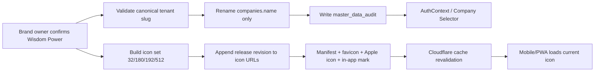

# Company Branding and Tenant Identity Flow

Flow นี้แยกชื่อแสดงและไฟล์แบรนด์ออกจากตัวตน tenant บริษัทหลักยังใช้ Company ID และ slug `wisdomai-default` เดิมทุกจุด การเปลี่ยนชื่อไม่ย้ายสมาชิก ห้อง เอกสาร หรือรายการเงิน ส่วน App Icon ใช้ W สีส้มและสายฟ้าสีดำบนพื้นขาว และ mobile web header ใช้ mark เดียวกันบนพื้นโปร่งใส

## Input / Output / State

- **Input:** คำยืนยัน Brand Owner, canonical slug, icon master และ release revision
- **Output:** `companies.name = 'Wisdom Power'`, App Icon/manifest/favicon/Apple icon/Login/Launcher/Sidebar/Top Bar ที่สอดคล้องกัน
- **State:** `pending → tenant_validated → renamed_and_audited → release_built → deployed → runtime_verified`
- **ไม่เปลี่ยน:** Company ID, slug, membership, RLS, Chat/Attendance/Accounting/HR data และ route permission

## Roles / Integrations

- Brand Owner อนุมัติชื่อและรูป; Platform/Release Owner ดูแล migration, build, deploy และ runtime smoke
- Supabase: `companies`, `get_my_companies()`, `master_data_audit`
- Web/PWA: Vite release manifest, `manifest.webmanifest`, favicon, Apple touch icon, Login, Launcher, Sidebar และ Top Bar

## Failure / Retry / Audit

- ชื่อเดิมไม่ตรงค่าที่อนุญาต: migration หยุดทั้ง transaction
- mobile cache เก่า: URL มี release revision และ Cloudflare ใช้ `no-cache/must-revalidate`; ปิด/เปิดหรือ refresh หนึ่งครั้งเพื่อรับ manifest ใหม่
- OS launcher บางรุ่นยังคงภาพเก่าหลัง browser รับ manifest แล้ว: ถอดและเพิ่ม PWA กลับเป็น recovery ขั้นสุดท้าย ไม่กระทบข้อมูล
- Audit: `company_display_name_renamed`/`company_display_name_rename_noop`, migration history, Git commit, Production revision และ authenticated runtime smoke

## Owner / Rollback

Owner คือ Wisdom Power Brand Owner ร่วมกับ Platform / Tenant Administration. Rollback เปลี่ยนเฉพาะชื่อของ slug เดิมกลับพร้อม Audit ใหม่ และ revert frontend commit; ห้ามเปลี่ยน Company ID/slug หรือ delete ข้อมูล

## Change record

| Version | Date | Rationale | Migration | Verification | Rollback |
| --- | --- | --- | --- | --- | --- |
| v1.2 | 31/8/2569 | ใช้ Wisdom Power และให้ App Icon เปลี่ยนตาม release โดยไม่ติด cache | `20260831074502_rename_default_company_to_wisdom_power.sql` applied | migration/Audit, tests, typecheck, lint, build artifact, revision และ runtime | audited tenant rename rollback + revert release commit |
