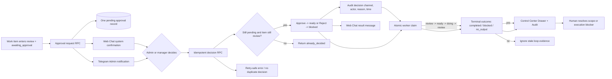

# Cross-Channel Work Approval Flow

## Purpose

ให้คำขออนุมัติงานจากศูนย์สั่งงานใช้คำขอเดียวกันระหว่าง Web Chat และ Telegram ไม่สร้าง approval ซ้ำ และไม่เปิดทางให้การกดจากช่องทางที่สองย้อนผลการตัดสินใจเดิม

## Inputs and outputs

- Input: `system_work_items` ที่อยู่ `review` และมี `production_status` ระบุว่ารออนุมัติ
- Output: approval record เดียว, การ์ด Web Chat, ปุ่ม Telegram, สถานะงานใหม่ และ audit ที่ระบุช่องทาง
- Source work item, detail, evidence และประวัติเดิมไม่ถูกเขียนทับโดยการสร้างคำขอ

## States and actions

- Approval: `pending` -> `approved` หรือ `rejected`
- Work item: `ready` -> `review` เมื่อส่งขอตรวจ, `review` -> `ready` เมื่ออนุมัติ หรือ `blocked` เมื่อไม่อนุมัติ
- การตัดสินใจครั้งที่สองเป็น no-op และคืน `already_decided` พร้อมช่องทางเดิม
- งานที่อนุมัติแล้วแต่ `production_status` ค้าง จะกู้ได้เฉพาะ Admin/Manager ผ่าน RPC ที่ตรวจ role, company, approval fingerprint, lease, และ attempt cap; ไม่ reset retry budget และไม่แก้ scope/business record

## Roles and permissions

- Admin ใช้กับงานระดับ platform (`company_id` เป็น null)
- Company manager ใช้กับงานของบริษัทตนเอง
- Web Chat ใช้ session ผู้ใช้; Telegram ใช้ Edge Function ที่ตรวจบัญชี Admin ที่ผูกไว้
- RLS อนุญาตให้อ่าน approval เฉพาะ Admin/Manager และห้าม client insert/update/delete ตรง

## Integrations

- Database trigger/request RPC สร้างคำขอและ broadcast ไปห้องงานมาตรฐาน
- Health Monitor ส่ง Telegram ตาม rate limit เมื่อพบงานรออนุมัติ
- `telegram-admin` และ Web Chat เรียก `decide_system_work_item_approval` ตัวเดียวกัน

## Failure and retry

- การส่งข้อความล้มเหลวไม่ทำลาย approval record; รอบถัดไปตรวจ pending และ retry ตาม rate limit
- unique partial index กัน pending ซ้ำ
- row lock และเงื่อนไขสถานะกัน race ระหว่าง Telegram/Web Chat
- หากงานไม่อยู่ `review` หรือ approval ถูกตัดสินใจแล้ว จะไม่เปลี่ยนสถานะซ้ำ
- Health Monitor อ่าน event history ย้อนหลัง 24 ชั่วโมงเพื่อตรวจ `review -> ready -> doing -> review` และแจ้งก่อน retry cap; fingerprint ของรอบล่าสุดทำให้ไม่แจ้งซ้ำสำหรับ loop เดิม
- ก่อนแจ้ง loop จะอ่านสถานะงานปัจจุบันซ้ำและข้ามรายการ `done` เพื่อไม่ส่ง escalation จาก event เก่าหลังงานเสร็จ
- ทุก worker dispatch ต้องจบด้วย outcome พร้อมเหตุผล: `acknowledged`, `claimed`, `blocked`, `completed`, หรือ `no_output`; stale heartbeat ถูกบันทึกเป็น `no_output` ก่อนคืนคิว

## Audit and owner

Approval เก็บผู้ขอ เวลา ผู้ตัดสินใจ ช่องทาง เหตุผล และสถานะ; การเปลี่ยน `system_work_items` ใช้ evidence/current_step เดิมและ trigger audit ของงานกลาง ระบบทีมเป็นเจ้าของ flow ส่วน Admin/Manager เป็นผู้ตัดสินใจธุรกิจ

## Change record

| Version | Date | Rationale | Migration | Verification | Rollback |
|---|---|---|---|---|---|
| v1.0 | 7/9/2569 | ใช้ approval record เดียวระหว่าง Web Chat และ Telegram พร้อมกันการกดซ้ำ | `202609070001_cross_channel_work_approval.sql` | migration dry-run/apply, RPC/idempotency/permission tests, typecheck, lint, build และ authenticated Web/Telegram smoke | ปิด trigger/RPC/UI ใหม่และคง approval/audit ไว้เพื่ออ่านย้อนหลัง; revert frontend โดยไม่ลบ work item เดิม |
| v1.2 | 7/9/2569 | ให้ผู้ดูแลส่งแจ้งเตือนของงานที่เปิดดูอยู่เพียงรายการเดียวจากศูนย์สั่งงาน โดยไม่เรียก bulk escalation | ไม่มี schema migration; `src/pages/WorkCommandCenter/index.tsx` | targeted UI contract, typecheck, lint, build และ authenticated runtime smoke | ซ่อนปุ่มเฉพาะงาน; approval, notification และ audit เดิมคงอยู่ |
| v1.3 | 7/9/2569 | ตรวจ approval loop จาก event ledger ก่อน retry cap และแสดงรอบ/เหตุผลใน Control Center | ไม่มี migration; `health-monitor`, Work Command Center detector | sequence, dedupe, UI contract, typecheck, lint, build และ authenticated smoke | revert detector source โดยเก็บ event/notification/audit เดิม |
| v1.3 | 7/9/2569 | ปิด approval/execution stall และบังคับ outcome ของ worker ทุกครั้ง | `20260907130000_control_plane_stall_recovery.sql`, `automation-worker`, local runner และ Control Center Drawer | contract, typecheck, lint, build, migration CI และ authenticated smoke | revert source ด้วย PR แก้ไข โดยเก็บ approval/outcome/audit เดิมไว้ |

