```mermaid
flowchart LR
  A[Source message + transfer slip] --> B[Intake ID / Document Flow Item]
  B --> C[AI extracts transfer facts]
  C --> MD{Admin records as\nemployee advance funding?}
  MD -->|Yes: both transfer parties + amount + source complete| MP[Review sender Company/Internal\nand recipient Employee/Technician]
  MP --> MA[Master Data confirms both Master Accounts\nProject allocation awaiting]
  MP -->|Missing/conflict| R
  MA --> MQ[Accounting Pending Queue first]
  MQ --> ML
  MD -->|No| D
  D -->|No| R[Accounting review queue\nmark missing fields]
  R --> ML[Admin confirms Money Lineage\nsource fund + holder + multi-hop balance]
  ML -->|Holder registry matched| ML2[สร้าง Root Lineage ของเงินสำรอง]
  ML2 --> F
  ML -->|Missing or unmatched| R
  D -->|Yes| E{Recipient exact-matches\nactive monthly employee?}
  E -->|Yes| F[Auto-create Advance Case: draft]
  E -->|No| G{Recipient exact-matches\nactive daily employee?}
  G -->|Yes| H[HR + Accounting queue\nawait parent advance]
  G -->|No| X[Normal accounting route]
  F --> V[Auto-update case projection\nmatching status + source quality + route]
  V --> W[Click case row or amount\nopen Advance Detail Drawer]
  W --> K[Issue technician sub-advance]
  K --> L[Technician uses money + evidence]
  L --> L2[สลิปการใช้เงินผูก Parent/Root เดิมและแบ่ง Allocation]
  L2 --> M{Allocation + คืน + คงเหลือ = เงินรับ และคงเหลือ 0?}
  M -->|Yes| F[Parent settlement lines + evidence]
  M -->|No| L
  F --> G{HR/Accounting review}
  G -->|Returned| F
  G -->|Approved| H[Reconcile received - approved use - returned/offset]
  H -->|Balance = 0| I[Closed + audit]
  H -->|Balance != 0| J[Settlement required]
  K --> N[Program Loop: queue System Confirmation]
  N --> O[Ensure standard rooms: source when verified / HR / Finance]
  O --> P[Web Chat delivery ledger: queued to sent to delivered]
  P -->|Failure| Q[room_setup_failed or failed; advance pending_retry]
  P -->|Success| R[Audit + close notification Job]
```

# Employee Advance & Settlement Flow

## Purpose

Track money transferred to a monthly employee for company disbursements, then reconcile each downstream use without losing the original Intake/document route.

## Data, roles, and route

- `employee_advance_cases` is the advance header. A root case references one financial transaction and its original `document_flow_items` row; it never creates another Intake ID or source file. A technician sub-advance references its parent case instead, so the complete source route is inherited rather than copied.
- Master Data may explicitly confirm a qualifying transfer as `employee_advance_funding` before a Project is known. The command confirms the sender `Company/Internal` bank reference and recipient `Employee/Technician` bank reference as one reviewed Transfer Party Pair, stores `project_allocation=awaiting`, creates/reopens one Accounting task and records the Advance Finance money lineage. It does not approve an advance case, post an accounting entry or close a balance. Project/work scope is assigned to the later expense/settlement lines.
- `employee_advance_settlement_items` splits one advance into daily-wage payments, material purchases, travel, other expense, returned cash, or payroll offset. Every line retains project/WBS, payee, date, evidence reference, and approval state.
- Accounting verifies the funding slip and final reconciliation. HR verifies daily-worker wage lines. Managers create/submit/approve/return/cancel according to company permission.
- A holder may issue one or more technician sub-advances. Each is recorded as an approved `employee_advance` line on the parent and creates a child case; a parent cannot close until every child is closed. A technician closes only after their actual spending/return exactly offsets their child advance.
- Automatic creation is allowed only for a non-duplicate/non-dismissed slip with an amount, complete recipient identity, AI confidence at least 90%, a registered account pair, an Accounting destination queue state, and one exact active **monthly** holder match in the same company. Name comparison removes Thai titles and whitespace and accepts a previously confirmed alias. It creates a `draft` advance case only; it never approves, closes, or posts an accounting journal.
- Accounting confirmation now also records a Money Lineage projection. A reserve/advance transfer must identify its funding source and holder and reconcile the paid amount with the slip. Only a holder-registry match creates or links the draft Advance Case; otherwise the Accounting task remains `recheck_required` with a visible reason.
- The advance funding slip is the Root Lineage. Each later wage/material/vendor/project/refund slip is a child through `parent_lineage_id` and inherits the same `root_lineage_id`; the child can contain multiple reviewed allocations without rewriting or copying the source slip.
- An advance transfer/onward transfer must be exclusive to one funding slip. Actual wage/material/project uses are recorded from their own evidence slips and reconciled against the root, preventing the system from guessing future spending at the time money is handed to the custodian.
- An exact daily-worker match does not create a standalone technician advance because a sub-advance must always have a parent advance. It remains a shared HR/Accounting queue item until an authorised holder and parent advance are selected.
- Every extracted source/destination field is presented independently. A missing field is recorded as `missing`/`needs_review`, never filled by inference.
- Reconciliation is fixed: `amount_received - approved expenses/sub-advances - cash return - payroll offset = outstanding_balance`. A case cannot close while the outstanding balance is non-zero or an item is still pending/rejected.
- Every central command uses an event key, version check, audit row, and linked Document Flow event. Duplicate commands do not create duplicate cases/items.
- The advance table is a read-only projection of the central records: it shows the standardized holder, how the name was matched (`auto`, `Admin confirmed`, or legacy), source-data completeness, current reconciliation state, and the complete route. It never overwrites fields extracted from the original slip.
- Opening a case shows its source slip, current central flow state, and an automatic timeline from `employee_advance_audit`. The same source route is retained for a technician sub-advance through its parent case.
- Clicking a case row or any received/approved-use/outstanding amount opens the same right-side Advance Detail Drawer. It lists every payment/evidence line, the source-slip facts, route and audit timeline; it is a read-only detail view until an authorised user uses one of its explicit actions.
- After a case is written and its creation audit succeeds, the Program Loop creates an idempotent `employee_advance_message_deliveries` projection. It reuses the same `Advance ID` and base `event_key` for each destination and derives a destination-specific `delivery_key` so retries cannot duplicate a message. The standard destinations are the verified source room/self context, `hr_primary` only when the case has an employee/payroll condition, and `finance_primary` for the accountable financial owner. Codex room 00 is never a destination.
- `ensure_advance_confirmation_room` first resolves a canonical `room_key`; when absent it creates `hr_primary`, `finance_primary`, or a verified `source_room` inside a company-scoped lock, adds only the allowed role members, records room ID/key/creator/time/reason and the Advance event in Audit, then permits delivery. It never falls back to an unrelated room.
- A confirmation is labelled `SYSTEM MSG CONFIRM` and `message_class=system_confirmation`; Omni Intake ignores it, so the notification cannot be interpreted as a new advance. The message includes Advance ID/Document ID, technician, date, amount, project/site, saved status, recorder, and time. Delivery is tracked as `queued`, `sent`, `delivered`, `failed`, or `room_setup_failed`; failures update the case to `pending_retry` and remain visible to the retry worker.

## Failure and retry

- No source Flow/company, recipient/account evidence missing, recipient not a matching active monthly employee, invalid amount, duplicate source, version conflict, or missing approval produces a recoverable user error and leaves data unchanged. A missing Project blocks Project-scoped expense evidence but does not block the strict employee-advance-funding receipt; it remains visibly awaiting allocation.
- Reopening/correction creates an audit trail; source slips, Intake ID, attached files, accounting/HR tasks, and previously approved lines are never deleted by the workflow.
- Owner: Accounting is accountable for final close; HR owns daily-wage validation; company admin/manager owns exception approval.
- Room owners: Finance primary owns `finance_primary`; HR owns `hr_primary`; the source/self room is created only from a verified Document Flow source context. The Codex tracking room is outside the Web Chat delivery graph.

## Change record

| Version | Date | Rationale / impact | Migration | Rollback |
|---|---|---|---|---|
| v2.0 | 26/8/2569 | Persist both sender and recipient of an advance-funding slip before Accounting/Advance continuation; prevent one-sided or half-saved Master references | `20260826223000_master_data_transfer_party_review.sql` | Revoke v2 RPC and revert Drawer; retain pair/account/audit/source records for reconciliation |
| v1.9 | 26/8/2569 | Add a strict Master Data intake path for company advance top-ups: employee/account first, Accounting pending first, Advance Finance lineage next, and Project allocation deferred to actual use/settlement | `20260826190500_master_data_employee_advance_funding.sql` | Revoke RPC/restore Project gate and hide recording mode; retain source, task, lineage, Master data and Audit |
| v1.0 | 21/8/2569 | Create a central advance/settlement registry linked to the source slip and Document Flow for reports and traceability | `20260820233529_employee_advance_settlement_flow.sql` | Disable UI/RPCs; retain source routes, evidence and audit |
| v1.1 | 21/8/2569 | Add traceable technician sub-advances; parent funding route is inherited, and parent close is blocked until all child advances close | `20260821001815_employee_sub_advance_flow.sql` | Hide sub-advance action/RPC; retain linked cases, audit and source route |
| v1.2 | 21/8/2569 | Add safe automatic advance eligibility: complete high-confidence monthly-recipient slip creates only a draft parent advance; daily employee remains HR/Accounting review until linked to an authorised parent | `20260821010500_safe_transfer_slip_advance_automation.sql` | migration/RLS/trigger verification, lint/build/test and production inspection | Disable trigger/UI; retain source, cases and audit |
| v1.3 | 21/8/2569 | Surface the central automatic match, source quality, and document route as columns and a case-detail timeline without changing source slip or settlement data | No migration; derives from central cases, source transaction, Flow item, and audit | lint/build/test and production protected-route inspection | Hide projection columns/drawer sections; source, case, and audit remain |
| v1.4 | 21/8/2569 | Repair title-insensitive holder matching and reprocess only the same idempotent safe rule; four qualified drafts were created from existing source slips | `20260821071722_normalize_advance_holder_titles.sql`, `20260821072004_fix_advance_holder_name_regex.sql` | RPC normalization and draft-case count verified | Disable trigger/function; retain all source/audit/cases |
| v1.5 | 22/8/2569 | Replace the centered case detail dialog with a right-side Drawer and make received/used/outstanding amounts direct detail entry points; payment/evidence list remains central read-only data until an explicit action is chosen | No migration | TypeScript, lint, build, pipeline test and protected-route inspection | Restore centered Dialog; no case, payment, source or audit data changes |
| v1.6 | 23/8/2569 | Add Program Loop System Confirmation after a successful advance write: canonical room ensure/create, source/HR/Finance routing, shared Advance event key plus destination delivery key, delivery/retry ledger, and no Omni re-intake | `20260823035155_employee_advance_confirmation_outbox.sql` (Production baseline; includes resolved room-variable ambiguity fix) | Migration contract/scenario tests, schema/RPC/trigger inspection, lint, typecheck, build, and protected-page verification | Disable the confirmation trigger/integration and retry worker; retain advance cases, chat messages, rooms, and Audit for reconciliation; do not delete financial source records |
| v1.7 | 23/8/2569 | Harden the SECURITY DEFINER room-provisioning helper: only authenticated managers (or internal system callers) may invoke it; anonymous/PUBLIC execution is revoked while authenticated/service-role execution remains available | `20260823035600_fix_advance_confirmation_room_scope.sql`, `20260823041021_lock_advance_confirmation_room_rpc.sql` (Production baseline; supersedes local timestamp `20260823035700`) | Production privilege query confirms `anon=false`, `authenticated=true`, `service_role=true`, manager guard present; contract tests, lint, typecheck, and build pass | Revoke the helper grants and disable confirmation provisioning if rollback is required; retain existing rooms, messages, deliveries, and Audit |
| v1.8 | 23/8/2569 | Require reviewed fund source, custodian and multi-hop balance before an Accounting slip can continue to Advance Finance | `20260823122135_transfer_slip_money_lineage_routing.sql` | Money-lineage contract, RPC/schema checks, lint/typecheck/build and Accounting Drawer smoke | Disable lineage routing RPC/UI; existing source slip, Advance Case and audit remain recoverable |
| v1.9 | 26/8/2569 | Link every downstream spending/refund slip back to the original advance and allow project/purpose splits without duplicating Intake evidence | `20260826220000_transfer_slip_money_allocations_v2.sql` | allocation balance/root-parent/idempotency contracts, migration dry-run, lint/typecheck/build and Accounting/Advance smoke | Disable v2 allocation RPC/UI; retain source, root/parent links, allocation versions and audit for recovery |
