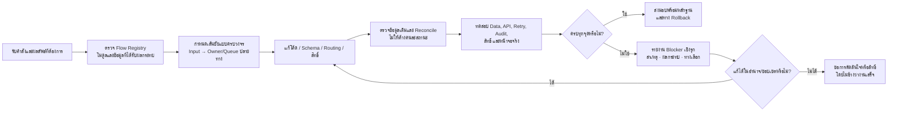

# มาตรฐานทำงานให้จบกระบวนการ (End-to-End Completion Gate)

## วัตถุประสงค์

มาตรฐานนี้ป้องกันงานที่ดูเหมือนเสร็จเฉพาะจุด เช่น กดปุ่มได้หรือสถานะเปลี่ยน แต่ข้อมูลไม่ไปถึงคิวหรือผู้รับผิดชอบปลายทาง, คนไม่มีสิทธิ์เห็นงาน, จำนวนไม่ตรงกัน, หรือข้อมูลเดิมค้างอยู่ในสถานะเก่า

## ขอบเขตและเจ้าของ

| หัวข้อ | มาตรฐาน |
| --- | --- |
| Input | ตรวจต้นทาง ช่องทาง ผู้สร้าง และข้อมูลเดิมที่เกี่ยวข้อง |
| Output | ต้องระบุปลายทาง, Queue/Role เจ้าของงาน, สถานะสุดท้าย และสิ่งที่ผู้ใช้เห็น |
| State | ระบุทุก transition, เงื่อนไขผ่าน/ไม่ผ่าน, สถานะค้าง และสถานะย้อนกลับ |
| สิทธิ์ | ตรวจผู้ส่ง ผู้อนุมัติ ผู้รับปลายทาง และผู้ดู Audit ตาม tenant/company |
| Integration | ตรวจการส่งผ่านจุดกลาง, schema/RPC/Edge Function/trigger ที่เกี่ยวข้อง และ idempotency |
| Failure/Retry | มีข้อความผิดพลาดที่บอกสาเหตุ, retry/recover และไม่สร้างรายการซ้ำ |
| Audit | บันทึกใครทำอะไร เมื่อไร จากไหน และ trace จากต้นทางถึงปลายทางได้ |
| Owner | เจ้าของการแก้คือผู้พัฒนา; เจ้าของการตัดสินใจธุรกิจหรือสิทธิ์ใหม่คือ Admin/ผู้มีอำนาจที่ระบุ |

## นิยามคำว่า “เสร็จ”

จะปิดงานได้ต่อเมื่อพิสูจน์ได้ครบทุกข้อที่เกี่ยวข้อง:

1. ต้นทางสร้าง/อ่านข้อมูลได้ถูกต้อง และข้อมูลเดิมไม่ขัดกับกติกาใหม่
2. การตรวจสอบและการเปลี่ยนสถานะทำงานถูกต้อง รวมถึงกดซ้ำแล้วไม่สร้างข้อมูลซ้ำ
3. งานไปถึงห้องหรือ Queue ปลายทางที่ถูกต้อง พร้อมผู้รับผิดชอบเห็นและดำเนินการได้
4. ข้อมูล การนับจำนวน สิทธิ์ การค้นหา/กรอง และ UI ของบทบาทที่เกี่ยวข้องสอดคล้องกัน
5. Audit, error, retry/recovery และ rollback ถูกกำหนดและตรวจได้
6. รัน migration (ถ้ามี), test, lint, build และตรวจหน้าจอจริงแล้ว

## Release completion gate

งานที่ต้องขึ้น Production ต้องทำตาม `docs/RELEASE_INCIDENT_PLAYBOOK.md`: ใช้ GitHub `main` → GitHub verification → Cloudflare Git Integration เป็นเส้นทางหลัก ตรวจ `release.json` ให้ตรง commit และทำ authenticated runtime smoke ของหน้า/ปลายทาง/Intake/Audit ก่อนปิดงาน ห้ามถือว่า local Token `401`, push สำเร็จ หรือ CI ผ่านอย่างเดียวเป็นผล deploy สุดท้าย

## ขั้นตอนเมื่อพบจุดติดขัด

ห้ามรอให้ผู้ใช้พบปัญหาเอง ให้รายงานทันทีในรูปแบบนี้:

```text
สถานะ: Blocked / Partially complete
จุดที่ติด: [ขั้นตอนหรือโมดูล]
หลักฐาน: [error / query / test / จำนวนข้อมูล]
สาเหตุ: [root cause]
ผลกระทบ: [ข้อมูล, ผู้ใช้, ปลายทางที่ยังไปไม่ถึง]
สิ่งที่ทำแล้ว: [การตรวจหรือการกู้คืนที่ปลอดภัย]
ข้อเสนอแนะ: [ทางเลือกที่แนะนำ]
ต้องการการตัดสินใจ/สิทธิ์: [ระบุชัดเจน หรือ “ไม่ต้องการ”]
```

ถ้าแก้ได้ในขอบเขตคำสั่ง ให้แก้และตรวจซ้ำจนจบ ไม่รายงานว่าเสร็จก่อนครบเส้นทาง

## Command Contract สำหรับสั่งงาน

ใช้ข้อความนี้ได้กับทุกงานที่มีการแก้ไข:

```text
ตรวจ Flow Registry, Flow document, โค้ด, schema และข้อมูลที่เกี่ยวข้องทั้งหมดก่อนแก้
ทำการแก้ไขจริงแบบ end-to-end ตั้งแต่ต้นทาง → validation → บันทึกข้อมูล → เปลี่ยนสถานะ → คิว/ผู้รับผิดชอบปลายทาง → UI → audit/retry
อย่าถือว่างานเสร็จเมื่อแค่ปุ่มกดได้, API สำเร็จ หรือสถานะเปลี่ยน
ตรวจข้อมูลเดิมและ reconcile หากมีรายการค้างหรือจำนวนไม่ตรง
หากติดปัญหา ให้แจ้งเชิงรุกพร้อมหลักฐาน สาเหตุ ผลกระทบ ทางเลือกที่แนะนำ และสิ่งที่ต้องการจากผม; ห้ามรอให้ผมตรวจเจอเอง
เมื่อเสร็จ ให้รัน migration ที่เกี่ยวข้อง, test, lint, build และตรวจหน้าจอจริงของบทบาทที่เกี่ยวข้อง
สรุปการส่งมอบเป็น: สิ่งที่จบครบเส้นทาง, หลักฐานการตรวจ, ปัญหาคงค้าง (ถ้ามี), และแนวทาง rollback/recovery
อัปเดต Mermaid Flowchart, คำอธิบาย Flow, Flow Registry protocol และ version/change log ทุกครั้งที่เปลี่ยนพฤติกรรมข้อมูลหรือเส้นทางงาน
```

## Change record

| Version | Date | Rationale | Impact | Migration | Verification | Rollback |
| --- | --- | --- | --- | --- | --- | --- |
| v1.0 | 22/8/2569 | ยกระดับการส่งมอบจากการแก้เฉพาะจุดเป็นการรับผิดชอบครบเส้นทาง | ใช้กับทุก Module และทุกงานที่เปลี่ยน workflow/data/routing/permissions | ไม่มี | ตรวจเอกสารมาตรฐาน, TypeScript, lint, build และ test ที่เกี่ยวข้อง | ลบ/ย้อนข้อความมาตรฐานได้โดยไม่กระทบข้อมูลหรือ runtime |
