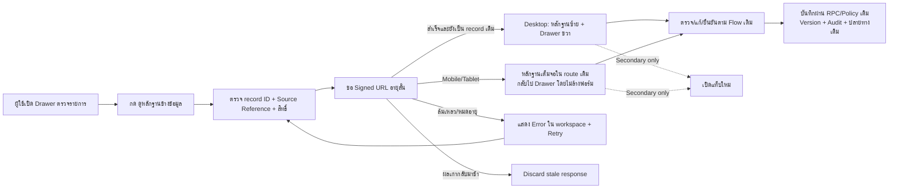

# Evidence Split Review Standard

## วัตถุประสงค์

Drawer ที่ต้องเทียบรูปหรือ PDF กับข้อมูลต้องใช้ workspace หน้าเดิมเป็นค่าเริ่มต้น เพื่อให้ผู้ใช้เห็นหลักฐานและแก้ข้อมูลพร้อมกันโดยไม่สูญเสียค่าในฟอร์ม, Tab, scroll, Candidate หรือสถานะคิวจากการเปิดหน้าใหม่ ปุ่มเปิดแท็บใหม่ยังมีได้ในฐานะทางเลือกสำรองเท่านั้น

## Inputs / Outputs

- Input: record/candidate ID, Source Reference, storage bucket/path, file name, MIME type, สิทธิ์ผู้ใช้ และ state ของ Drawer ที่กำลังแก้
- Output: Signed URL อายุสั้นที่แสดงเฉพาะกับ record เดิม, preview รูป/PDF, Drawer เดิมที่ยัง mounted และ Action/Validation/ปลายทางเดิมของ Module
- Viewer ห้ามเปลี่ยน Raw/OCR, Source Reference, Candidate, Project, Transaction หรือ Audit ของงานธุรกิจ

## Layout และ Responsive

- Desktop (`md` ขึ้นไป): หลักฐานอยู่ซ้ายและพื้นที่ตรวจข้อมูลอยู่ขวาใน overlay เดียวกัน; รองรับ zoom/reset สำหรับรูป และ inline PDF
- Tablet/Mobile: แสดงหลักฐานเต็มพื้นที่ใน route เดิม ปุ่ม “กลับไปตรวจข้อมูล” ซ่อน preview เท่านั้น; review pane ยัง mounted จึงไม่ล้างค่าที่กรอก
- ปิด preview ไม่เท่ากับปิด Drawer และปิด Drawer ต้องยกเลิก request preview ที่ยังไม่เสร็จ
- ปุ่มหลักทุกจุดใช้คำว่า “ดูหลักฐานข้างข้อมูล” หรือ “ดูรูป/เอกสารข้างข้อมูล”; `เปิดในแท็บใหม่` อยู่ใน toolbar ของ viewer เท่านั้น

## State และ Isolation

- States: `closed → loading → ready | error → retry`; เปลี่ยน record หรือปิด Drawer ต้องกลับ `closed`
- Preview state ต้องมี `recordId`; ผล async ใช้ request sequence/abort guard และเขียน state ได้เมื่อ request กับ record ปัจจุบันตรงกันเท่านั้น
- การเปิด preview ห้าม reset form, Tab, reason, correction, Project/Work Package หรือ one-shot action lock
- Signed URL หมดอายุหรือไฟล์ไม่รองรับต้องแสดงเหตุผลใน workspace พร้อม Retry/ทางเลือกเปิดภายนอก ไม่ปิด Drawer และไม่แจ้ง success เท็จ

## Roles / Permissions / Integrations

- ใช้ role, company scope, RLS และ secure Storage gateway ของ Module เดิม; ห้ามใช้ public URL หรือแสดง storage path ดิบ
- Admin/Manager/เจ้าของงานเห็นหลักฐานตามสิทธิ์เดิมเท่านั้น การมี Drawer ไม่เพิ่มสิทธิ์เอกสาร
- Integration หลัก: Source Reference Gateway → Supabase private Storage Signed URL → Evidence Split Review Workspace → RPC/Flow ของ Module เดิม
- Viewer เป็น presentation boundary กลาง ไม่ย้ายข้อมูลหรือเปลี่ยน destination queue

## Failure / Retry / Recovery

- Source ไม่ครบ: แสดง Document/Message/Intake ID ที่มี พร้อมข้อความว่าไฟล์ใดขาด ห้ามเดาไฟล์อื่น
- Signed URL fail/expired: Retry ขอ URL ใหม่สำหรับ record เดิม; ผล request เก่าถูกทิ้ง
- เปลี่ยนรายการเร็ว: เพิ่ม request sequence และล้าง preview ก่อนเปิดรายการใหม่ เพื่อไม่ให้รูปเก่าข้าม Drawer
- Viewer ไม่รองรับ MIME: คง Drawer/state เดิมและเสนอเปิดแท็บใหม่เป็น fallback
- Rollback UI: คืนปุ่มเปิดแท็บใหม่เดิมได้โดยไม่แก้ฐานข้อมูล, Raw/OCR, Version หรือ Audit

## Audit และ Owner

- การตรวจ/แก้/ยืนยันยังใช้ event key, Version และ Audit ของ Module เดิมทุกครั้ง; Viewer ไม่สร้าง Candidate หรือ business event ซ้ำ
- Module ที่มี secure-preview audit ต้องบันทึก `preview_requested/preview_failed` ตาม policy เดิม โดยห้ามเก็บ Signed URL หรือ storage secret ลง Audit
- Source/Document/Message/Intake ID ที่แสดงต้องมาจาก Source Reference object เดียวกับตารางและ Drawer
- Owner ของมาตรฐาน: Platform UX / Security; Owner ของข้อมูลและการตัดสินใจยังเป็น Module Owner เดิม

## การนำไปใช้กับหน้าอื่น

เมื่อมีการแก้ Drawer ที่ต้องดูภาพหรือ PDF ให้ใช้ `src/components/EvidenceSplitReviewWorkspace.tsx` และ contract นี้ก่อนเพิ่ม viewer เฉพาะหน้า หาก Module มีข้อกำหนดเพิ่มเติมให้ต่อยอดรอบ component กลาง แต่ห้ามเปลี่ยน default กลับเป็นเปิดแท็บใหม่

## Change record

| Version | Date | Rationale | Impact | Migration | Verification | Rollback |
| --- | --- | --- | --- | --- | --- | --- |
| v1.0 | 26/8/2569 | กำหนดรูปแบบกลางให้ตรวจหลักฐานและแก้ Drawer ในหน้าเดียว ลด state หายและรูปเก่าข้ามรายการ | Shared component, Master Data Drawer, Flow Registry และมาตรฐานทุก Drawer ในอนาคต | ไม่มี | contract, lint, typecheck, build, Desktop/Tablet/Mobile browser smoke และ authenticated Master Data smoke | Revert component/Drawer integration; Signed URL, Raw/OCR, Candidate, Version และ Audit เดิมไม่เปลี่ยน |

