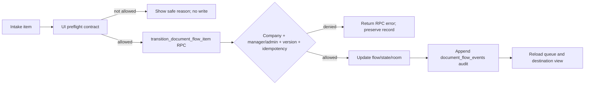

# Filter Orchestrator Runtime Contract — v1.0

## Purpose

The client contract gives the Intake UI the same transition vocabulary and basic state checks as the deployed `transition_document_flow_item` RPC. It is a usability guard only. The security-definer RPC remains the authority for tenant scope, role, confirmed accounting documents, optimistic versioning, idempotency, and append-only audit.

## Inputs and outputs

- Input: document-flow item, requested action, expected version, non-empty event key, and optional action note.
- Actions: `route_filter`, `request_classification`, `request_correction`, `ready_posting`, `approve`, `reject`, `retry`, `dead_letter`, and `recover`.
- Output: a rejected preflight without a write, or the RPC result with a new version and an audit event. Intake passes the persisted `duplicate_state` into preflight so duplicate records are blocked consistently in the queue, Drawer, and RPC path.
- `retry` only accepts `failed` or `rejected`; `recover` only accepts `dismissed`. No client action invents `gateway_posted` or `gateway_failed` states.

## Roles, ownership, and integrations

- Any screen may run the local preflight, but only the RPC permits a platform admin or manager in the item company.
- The RPC verifies a confirmed accounting document before `ready_posting`; it records the approver only for `approve`.
- `document_flow_events` is the audit destination and `event_key` is the idempotency key. Duplicate events return the existing item rather than creating another transition.
- Intake Room calls `documentFlowGateway.transitionWithContract`; the gateway then calls the existing RPC. No business record, source document, or task is created by preflight.

## Failure, retry, and recovery

- Client preflight errors are shown before a write and must not be treated as authorization.
- RPC errors, stale versions, permission failures, or duplicate event keys remain authoritative and are shown by the existing error handling.
- `dead_letter` retains the record in `intake_dead_letter_room`; `recover` returns it to Intake manual review. `retry` returns a posting item to approval, or other failed/rejected items to Filter validation.

## Change record

| Version | Date | Rationale | Impact | Migration | Verification | Rollback |
| --- | --- | --- | --- | --- | --- | --- |
| 1.0 | 2026-09-07 | Close FILTER-001 runtime gap found by QA. | Intake action availability now imports the canonical contract. | None; existing RPC is unchanged. | `test:filter-runtime-contract`, typecheck, lint, build. | Revert this UI/service/test/documentation commit; the RPC and existing records remain unchanged. |
| 1.1 | 2026-09-07 | Prevent duplicate records from appearing routable when the queue row has `duplicate_state=duplicate`. | Intake maps the source field, filters duplicate view correctly, shows a Drawer warning, and blocks route preflight/action before the existing RPC guard. | None; existing RPC remains authoritative. | Duplicate-state contract regression, typecheck, lint, build. | Revert the UI/test/documentation commit; no business records change. |
