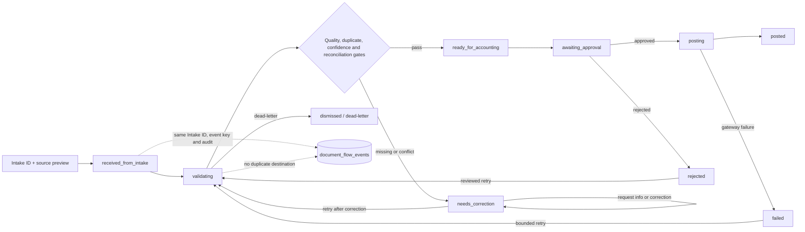

# Filter Flow Orchestrator (FILTER-001)

## Purpose

FILTER-001 is the canonical orchestration contract between Intake Flow (Flow 1),
Filter Flow (Flow 2), and Posting Flow (Flow 3). It coordinates existing
`document_flow_items` and `document_flow_events` records. It must not copy the
source image, create a second Intake ID, post accounting entries, or change raw
OCR evidence.

## Canonical state contract

The persisted ledger remains backward-compatible with the existing database
states. The user-facing canonical names map as follows:

| Canonical state | Existing ledger state | Owner/queue | Entry condition | Exit condition |
| --- | --- | --- | --- | --- |
| `received_from_intake` | `received` | Intake | A source message and Intake ID exist | Filter route is requested |
| `validating` | `validating` | Filter | Same source reference is routed to Filter | Gates pass, correction is needed, or validation fails |
| `needs_correction` | `needs_correction` | Filter Human Review | Missing/low-confidence/conflicting evidence | Corrected and revalidated, request-info, reject, or dead-letter |
| `ready_for_accounting` | `ready_for_posting` | Accounting queue | All Filter gates pass | Posting approval is requested |
| `awaiting_approval` | `awaiting_approval` | Posting approval | Accounting preview is complete | Approved or rejected |
| `posting` | `posting` | Posting gateway | Approval is recorded | Posted or failed |
| `posted` | `posted` | Accounting/AP/Stock/PO | Gateway commits successfully | Terminal; corrections use reversal/correction flow |
| `rejected` | `rejected` | Filter or Posting review | Authorized rejection with reason | Reviewed retry or terminal archive |
| `failed` | `failed` | Responsible gateway owner | Recoverable integration failure | Bounded retry or dead-letter |
| `dead_letter` | `dismissed` | Intake/Platform review | Retry budget or policy gate is exhausted | Explicit recovery creates a new transition on the same source |

The UI may show the canonical names while the ledger keeps the existing enum
values. No migration is implied by this document.

## Transition rules

- Every transition carries the original Intake ID, source message/preview
  reference, expected version, event key, actor, reason, and resulting version.
- The existing `transition_document_flow_item` RPC is the transaction boundary
  for manager-approved state changes. Repeating an event key returns the prior
  result and must not create a second event or destination task.
- A version conflict is a safe retry signal; the caller must reload the row and
  present the current state rather than overwrite it.
- `ready_for_accounting` and `awaiting_approval` do not create accounting,
  payroll, Stock, AP, or PO postings. Posting is a separate approval-gated flow.
- `posted` is terminal for this orchestrator. Corrections after posting use an
  append-only correction or reversal contract and retain the original event.
- Legacy records are read through their existing Flow projection. Reconciliation
  reports mismatched source/state/version rather than silently rewriting them.

## Roles and permissions

- Authenticated company managers and platform administrators can read the
  company-scoped queue, preview, and audit timeline.
- Only the authorized manager/admin transition path may request correction,
  reject, retry, approve, or recover. RLS and the RPC company guard remain the
  source of truth.
- Raw source files, OCR facts, and prior audit events are immutable from this
  flow. Cross-company reads and transitions fail closed.
- Posting roles cannot bypass Filter gates or create downstream entries before
  approval.

## Failure, retry, and recovery

- Validation issues go to `needs_correction` with structured issue codes.
- Recoverable gateway failures go to `failed`; retry keeps the same source and
  uses a new event key linked to the prior failure, never a copied document.
- Duplicate event keys are idempotent. Duplicate business documents remain in
  the existing duplicate hold path for review.
- Dead-letter is explicit and auditable. Recovery requires an authorized action
  and does not delete the source, preview, or prior events.
- If a destination or required field is unavailable, the flow remains visible
  in its current queue with a reason and next action.

## Audit and integrations

The audit trail is `document_flow_events` plus the existing mutation-attempt
and destination ledgers. Each event records the source item, company, event
key, from/to flow and state, room, note, payload, actor, and timestamp. The
orchestrator integrates with Intake source/preview, Filter rule packs,
Accounting confirmation, and the Posting approval/gateway. It does not own
Payroll or Advance business ledgers.

## Verification and rollback

Required checks are state transition, version conflict, duplicate event,
tenant isolation, low confidence, duplicate hold, retry/dead-letter, legacy
reconciliation, typecheck, lint, build, and authenticated queue/audit smoke.
The first implementation is source/PR-only. Rollback is a code/document revert;
existing source, ledger, destination, and audit rows remain untouched.

## Change record

| Version | Date | Rationale | Migration | Verification | Rollback |
| --- | --- | --- | --- | --- | --- |
| v1.0 | 2026-09-07 | Establish the canonical Filter orchestrator contract on existing Intake/Accounting ledger primitives | None | Contract tests, typecheck, lint, build, PR checks and authenticated queue/audit smoke | Revert the source/PR changes; no data rollback |
