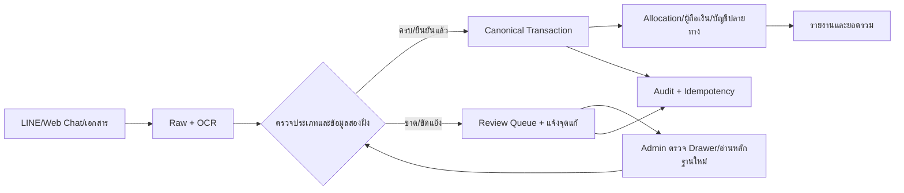

# Financial Transaction Center Flow v1.0

## วัตถุประสงค์

ศูนย์กลางสำหรับตรวจสอบสลิปและรายการเงินจากทุกช่องทาง โดยใช้ข้อมูลที่ยืนยันแล้วเป็นข้อมูลหลัก ไม่ใช้ชื่อจาก OCR ที่ยังไม่ยืนยันไปสร้างยอดหรือรายการซ้ำ

## หน้าจอและข้อมูล

- `/financial-summary` เป็นหน้ารวมรายการธุรกรรมของบริษัท และใช้รูปแบบตารางมาตรฐานเดียวกับ Employee
- ตารางค้นหาได้จากชื่อ วันที่ จำนวนเงิน เลขอ้างอิง Document/Message ID และกรองประเภทเงิน สถานะ ผู้โอน ผู้รับ โครงการ และรายการขาดข้อมูล
- Drawer แสดงหลักฐานต้นฉบับ, ข้อมูลที่บันทึกใน Canonical, ผล AI/OCR เพื่อเปรียบเทียบ, เส้นทางเงิน และ Audit; AI ห้ามเขียนทับข้อมูลยืนยันแล้ว
- ข้อมูลธุรกรรมมีสองฝั่งเสมอ: ผู้โอน/ผู้จ่าย และผู้รับ/ผู้รับประโยชน์ โดยแต่ละฝั่งมีชื่อ ธนาคาร เลขบัญชี 4 ตัวท้าย และลิงก์ Master Data เมื่อมี

## Gate และสถานะ

`raw → needs_review → rechecked → confirmed → allocated → destination_complete`

ข้อมูลวันที่ จำนวนเงิน ชื่อสองฝั่ง ธนาคาร/เลขบัญชี (ถ้ามีในหลักฐาน) และเลขอ้างอิงต้องผ่านการตรวจรูปแบบและ duplicate ก่อนยืนยัน หากไม่ครบให้ค้าง `needs_review` พร้อมเหตุผลและปุ่มอ่านหลักฐานใหม่/ขอข้อมูลเพิ่ม

## การจัดประเภทและปลายทาง

- ค่าแรงงาน → HR/Payroll
- เงินทดรอง/เบิกล่วงหน้า → Advance พร้อมผู้ถือเงินและผู้รับประโยชน์
- วัสดุ/อุปกรณ์ → Inventory/Project
- ค่าใช้จ่ายทั่วไป/ผู้ขาย/ภาษี → Accounting Posting
- รายการกำกวม → Accounting Review จนกว่าจะยืนยันประเภท

รายการหนึ่งรายการอาจมีหลาย Allocation แต่ยอดรวม Allocation + คืนเงิน + ยังไม่จัดสรรต้องเท่ากับยอดสลิป และห้ามสร้าง Transaction/Allocation ซ้ำ

## สิทธิ์และ Audit

Admin/Manager ตรวจและยืนยัน, ผู้ปฏิบัติงานเห็นรายการตามบริษัท, ผู้ดูแลระบบแก้ไข/ย้อนรายการทดสอบได้เท่านั้น การยืนยัน ปฏิเสธ ขอข้อมูล อ่านใหม่ ผูกบัญชี จัดสรร และ Reverse ต้องบันทึก actor, เวลา, before/after, source และ event key

## ความผิดพลาดและการกู้คืน

การกดซ้ำใช้ idempotency key เดิมและต้องคืนผลเดิม ไม่สร้างแถวใหม่; หากปลายทางล้มเหลวให้ค้างสถานะพร้อม retry; การแก้รายการที่ยืนยันแล้วใช้ Adjustment/Reverse อ้างรายการเดิม ห้ามลบ Raw/OCR/Audit

## Change record

| Version | Date | Rationale | Impact | Migration | Verification | Rollback |
| --- | --- | --- | --- | --- | --- | --- |
| v1.0 | 27/8/2569 | รวมมาตรฐานศูนย์ธุรกรรมและ Drawer ให้สอดคล้องกับข้อมูลยืนยันจริง | `/financial-summary`, Accounting/Advance routing และ audit contract | ไม่มี | typecheck, lint, build และ financial/advance contract tests | revert เอกสารและ UI ที่เพิ่ม โดยคง Canonical/Raw/Audit เดิม |
