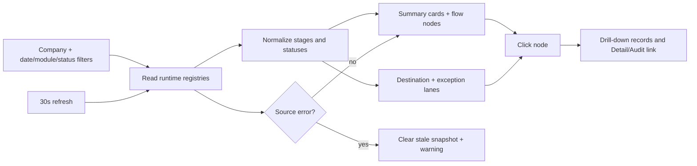

# Flow Registry Active Dashboard

## Purpose

The admin-only Flow Registry page is a live monitoring surface. It reads the same runtime registries used by Intake, Filter, OutTake, attendance approval, and employee advance delivery. Related task and delivery rows are reconciled to the source task instead of counted as separate work items. It does not invent fallback numbers when a source is unavailable.

## Inputs and filters

- Current company from the authenticated company context.
- Date range based on `created_at`.
- Module: Omni/Intake, attendance/HR, or employee advance.
- Status: open, waiting, error, closed.
- Source/Document ID and owner text filters apply before aggregation and drill-down.

## Outputs and interaction

Summary cards show received, under review, waiting, forwarded, SLA breach (>24 hours), and successful close. Nodes show count and maximum age. Destination and exception lanes are clickable; the dialog lists one canonical Task row with source/evidence/audit references, owner, SLA, next action, blocker, timestamps, and error text, then links to the relevant Detail/Audit page with task/source/audit query IDs.

## Source and status rules

`omni_intake_sources`, `omni_filter_tasks`, `omni_outtake_delivery_events`, `chat_attendance_approval_jobs`, `employee_advance_cases`, and (when migrated) `employee_advance_message_deliveries` are the only sources. Missing optional schemas are shown as warnings. A failed read clears the snapshot so stale counts are never presented as current.

## Roles, ownership, and recovery

The route remains admin-only through the existing router. Supabase RLS/company scope controls row visibility. Auto-refresh runs every 30 seconds and can be disabled. Rollback is to remove the dashboard component/service and retain the original registry cards; no business data is mutated.

## Local UAT

In development only, `/flow-registry?local_test_data=1` bypasses the repository's existing local-test guards, including `ProtectedRoute` and the role gate, then dynamically loads `flowRegistryLocalFixture`. The screen is marked `LOCAL FIXTURE`, never queries Supabase, and production builds do not activate this loader. The fixture covers canonical rows, module/status/source/owner filters, destinations, exceptions, SLA, drill-down evidence/audit, count reconciliation, and simulated refresh.

## Change record

- Version: v1.0
- Date: 23/08/2569
- Rationale: make the Flow Registry an actionable command-center view with real counts and drill-down.
- Impact: read-only UI/service; no business Flow or permission change.
- Verification: dashboard contract test, targeted lint/typecheck/build, and browser page check.
- Migration: none.
