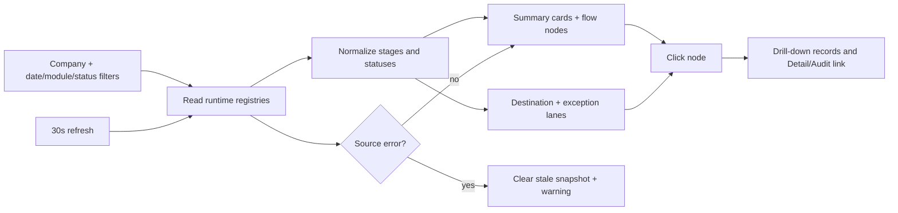

# Flow Registry Active Dashboard

## Purpose

The admin-only Flow Registry page is a live monitoring surface. It reads the same runtime registries used by Intake, Filter, OutTake, attendance approval, and employee advance delivery. It does not invent fallback numbers when a source is unavailable.

## Inputs and filters

- Current company from the authenticated company context.
- Date range based on `created_at`.
- Module: Omni/Intake, attendance/HR, or employee advance.
- Status: open, waiting, error, closed.

## Outputs and interaction

Summary cards show received, under review, waiting, forwarded, SLA breach (>24 hours), and successful close. Nodes show count and maximum age. Destination and exception lanes are clickable; the dialog lists real IDs, status, owner, timestamps, and error text, then links to the relevant Detail/Audit page.

## Source and status rules

`omni_intake_sources`, `omni_filter_tasks`, `omni_outtake_delivery_events`, `chat_attendance_approval_jobs`, `employee_advance_cases`, and (when migrated) `employee_advance_message_deliveries` are the only sources. Missing optional schemas are shown as warnings. A failed read clears the snapshot so stale counts are never presented as current.

## Roles, ownership, and recovery

The route remains admin-only through the existing router. Supabase RLS/company scope controls row visibility. Auto-refresh runs every 30 seconds and can be disabled. Rollback is to remove the dashboard component/service and retain the original registry cards; no business data is mutated.

## Change record

- Version: v1.0
- Date: 23/08/2569
- Rationale: make the Flow Registry an actionable command-center view with real counts and drill-down.
- Impact: read-only UI/service; no business Flow or permission change.
- Verification: dashboard contract test, targeted lint/typecheck/build, and browser page check.
- Migration: none.
