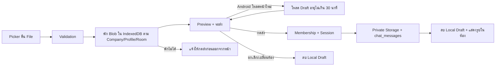
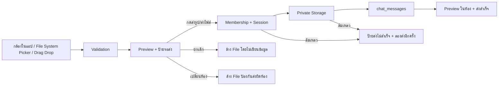
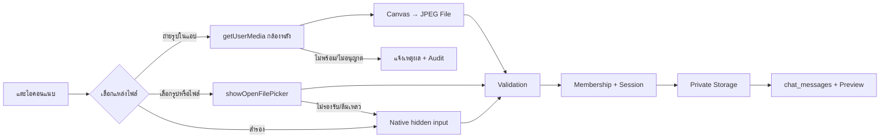
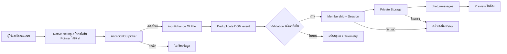

# Flow Registry Update Protocol

## 2026-08-31 — Web Chat Reload-Safe Attachment Draft v3.2

- **เหตุผล/หลักฐาน:** Android revision `870e033` บันทึก `file_received` และ `waiting_confirmation` แต่รุ่นนั้นยังไม่มี persistent draft จากนั้นเกิด `session_start` ใหม่ในประมาณ 0.35 วินาที จึงล้าง React memory ก่อนผู้ใช้เห็น Preview; Storage/RLS ยังไม่ถูกเรียก
- **Input/Output/States:** File ที่ผ่าน validation ถูกเก็บแบบ origin-local Blob → ready/รอส่ง; reload กู้ File/Preview; ส่งสำเร็จหรือยกเลิก/เปลี่ยนห้องลบ draft; expired เกิน 30 นาทีลบอัตโนมัติ
- **Roles/Permissions:** draft key แยก company + profile + room และอยู่ใน IndexedDB ของ origin/device เท่านั้น; server mutation ยังเริ่มเมื่อกดส่งและตรวจ membership/session เดิม
- **Integrations:** camera/File System Picker/native input/drag-drop → IndexedDB draft → Preview → Supabase Auth/private Storage/chat_messages/Realtime
- **Failure/Retry:** IndexedDB ไม่พร้อมยังแสดง Preview ใน memory พร้อมเตือน; draft restore error ไม่ส่งข้อมูล; upload/message failure คง draft/Preview; message success cleanup local draft
- **Audit/Owner:** `chat_attachment_draft_persisted`, `chat_attachment_draft_restored` และ `waiting_confirmation.metadata.draft_persisted`; telemetry ไม่เก็บชื่อหรือ bytes เจ้าของ Web Chat/Application Platform
- **Impact/Migration/Legacy:** ไม่มี database migration; เพิ่ม IndexedDB v1 ฝั่ง browser; ข้อความ/ไฟล์เดิมไม่เปลี่ยน และ draft local ไม่มีสิทธิ์ข้ามผู้ใช้/ห้อง
- **Verification:** draft contract, attachment/Web Chat tests, typecheck, lint, build, revision parity และ Android read-back `file_received → draft_persisted → session_start → draft_restored → send_started → message_recorded`
- **Rollback/Recovery:** revert v3.2 กลับ memory-only v3.1; IndexedDB record ที่ไม่ได้ใช้หมดอายุเองใน 30 นาที และไม่มีผลต่อข้อมูล server

## 2026-08-31 — Web Chat Confirm-Before-Send Attachment v3.1

- **เหตุผล/หลักฐาน:** Android Production revision `b0d5a81` รับกล้องและ File System Picker สำเร็จจริง 3 รายการ (`camera` 1, `file_system` 2) ตั้งแต่ File → Storage → `chat_messages`; แต่ auto-send ทำให้ผู้ใช้ไม่เห็นจังหวะยืนยันและเข้าใจว่าไฟล์หาย จึงเปลี่ยนเป็น Preview ค้างรอผู้ใช้กดส่ง
- **Input/Output/States:** selected → `ready`/รอส่ง → `uploading` → message recorded หรือ `failed`/ลองส่งอีกครั้ง; cancel และ room change ไม่เขียนข้อมูล
- **Roles/Permissions:** คง login/company/room/membership และ owner-only เดิม; ปุ่มส่งเป็นจุดเริ่ม mutation ที่ชัดเจน และไฟล์ที่เลือกผูกกับ room id เพื่อกันส่งผิดห้อง
- **Integrations:** กล้องในแอป, File System Picker, native fallback และ drag/drop ใช้ Preview เดียวกัน ก่อนต่อ Supabase Auth/private Storage/chat_messages/Realtime
- **Failure/Retry:** validation ไม่ผ่านล้างไฟล์พร้อมเหตุผล; membership/session/Storage/message ล้มเหลวคง Preview พร้อมสถานะ failed; เปลี่ยนห้องล้างไฟล์ pending; message insert ล้มเหลวยัง cleanup object เดิม
- **Audit/Owner:** เพิ่ม `chat_attachment_waiting_confirmation`; `send_started` เกิดเฉพาะเมื่อผู้ใช้กดส่ง; telemetry ไม่เก็บชื่อไฟล์ เจ้าของ Web Chat/Application Platform
- **Impact/Migration/Legacy:** เปลี่ยนเฉพาะ UI/state; ไม่มี migration; รูป 3 รายการที่ auto-send สำเร็จก่อน v3.1 คงอยู่และไม่สร้างซ้ำ
- **Verification:** attachment contract, Web Chat test, typecheck, lint, build, Production parity และ Android E2E selected → waiting_confirmation → send_started → message_recorded → image preview
- **Rollback:** revert v3.1 เพื่อคืน auto-send; ไฟล์/ข้อความที่บันทึกสำเร็จแล้วไม่ถูกลบ

## 2026-08-31 — Web Chat In-App Camera + File System Picker v3.0

- **เหตุผล/หลักฐาน:** Android revision `217c798` เปิด picker ได้สองครั้ง แต่ทุกครั้งหน้า `/chat` เริ่ม session ใหม่ทันทีหลังกลับจากกล้อง/แกลเลอรี และไม่มี `file_received`; Chromium มีปัญหา Media Picker/การคืนหน้า mobile ที่อาจทำให้ File handle สูญหาย จึงต้องมีเส้นทางที่ไม่สลับไปแอปกล้องภายนอก
- **Input/Output/States:** ผู้ใช้เลือก camera/file-system/native fallback → `File` → received/validated/uploading/message_recorded → image/file card; cancel เป็น no-op, camera permission/picker/validation error แสดงเหตุผลและไม่สร้างข้อความ
- **Roles/Permissions:** ต้อง login, มี company/room, เป็นสมาชิกห้อง และ Program Development ยังคง owner-only; ไม่เปลี่ยน RLS, private bucket หรือ allow-list
- **Integrations:** `getUserMedia` + Canvas สำหรับกล้องในแอป, `showOpenFilePicker` สำหรับไฟล์, native input เป็น fallback, จากนั้นใช้ Supabase Auth/Storage/chat_messages/Realtime/preview เดิม
- **Failure/Retry:** กล้องไม่พร้อมหรือ permission ถูกปฏิเสธหยุด stream และแจ้งผู้ใช้; File System Picker ไม่รองรับใช้ native fallback; upload/message failure คง Preview และ cleanup object ตาม flow เดิม
- **Audit/Owner:** เพิ่ม `chat_attachment_camera_ready`, source `camera|file_system`, reason `camera_unavailable|picker_failed`; telemetry ไม่เก็บชื่อไฟล์ เจ้าของคือ Web Chat/Application Platform
- **Impact/Migration:** เปลี่ยน UI แนบเป็นตัวเลือกสามทางและเพิ่มกล้องในแอป; ไม่มี schema migrationและไม่แก้ข้อมูลเดิม
- **Verification:** attachment contract, camera/file picker mocks, typecheck, lint, build, release parity และ authenticated Android E2E ทั้ง camera กับ gallery/file
- **Rollback:** revert v3.0 เป็น v2.9 ผ่าน Git integration; ไฟล์/ข้อความ/Audit เดิมคงอยู่ และ native fallback ยังเป็น recovery path

## 2026-08-31 — Web Chat Direct Native Input Overlay v2.9

- **เหตุผล:** Android Production หลัง v2.8 ยังมีเพียง `chat_attachment_picker_opened` โดยไม่พบ Storage/message; การ forward click จาก MUI label ยังเป็นจุดเสี่ยง และ telemetry เดิมเกิดหลัง validation จึงแยกไม่ได้ว่าไม่ได้รับ File หรือถูกปฏิเสธก่อนส่ง
- **Input/Output/States:** รับ `File` จาก native input หรือ drag/drop → `received` → `validated` → `uploading` → `message_recorded`; ยกเลิกเป็น no-op และ validation/auth/Storage ล้มเหลวคง flow แจ้งเตือน/Retry เดิม
- **Roles/Permissions:** ผู้ส่งต้อง login, อยู่ใน company/room และเป็นสมาชิกห้อง; ห้อง Program Development ยัง owner-only; ไม่ขยาย RLS, Storage policy หรือ allow-list
- **Integration:** native browser picker → Supabase Auth/session → private bucket `chat-attachments` → `chat_messages` → signed preview/Realtime ตาม flow เดิม
- **Failure/Retry:** input/change ที่ browser ยิงซ้ำถูก deduplicate ใน memory; ไฟล์เกิน 50 MB, MIME ไม่รองรับ และสถานะห้องไม่พร้อมบันทึก reason แยก; upload/message failure คงไฟล์ให้ลองใหม่และ cleanup object เมื่อ message insert ล้มเหลว
- **Audit/Owner:** telemetry `picker_opened`, `file_received`, `selection_blocked`, `file_selected`, `send_started`, `message_recorded` ไม่เก็บชื่อไฟล์; owner คือ Web Chat/Application Platform
- **Impact/Migration:** แก้เฉพาะตัวรับไฟล์และ telemetry หน้า Chat; ไม่มี schema migration และไม่เปลี่ยนข้อมูลเดิม
- **Verification:** attachment contract, targeted/full lint, typecheck, build, Git/release parity และ authenticated Android read-back ครบ File → Storage → message → preview
- **Rollback:** revert v2.9 เป็น v2.8 ผ่าน Git integration; ไฟล์/ข้อความ/Audit ที่สำเร็จแล้วคงอยู่ และใช้ telemetry แยกสาเหตุเพื่อ recovery

## 2026-08-31 — Web Chat Android Picker Change Recovery v2.8

- **เหตุผล:** Production Android มี `chat_attachment_picker_opened` แต่ไม่มี `file_selected`, Storage object หรือ message หลังผู้ใช้เลือกรูป จึงยืนยันว่าจุดขาดอยู่ระหว่าง native picker กลับมาและ input `change`
- **Flow:** แตะไอคอน → pointer-down ล้าง selection เดิม → native picker → เลือกรูป → input change คง File → Preview/membership/session → Storage → `chat_messages` → รูปในห้อง
- **สิทธิ์/ข้อมูล:** ไม่เปลี่ยน RLS, membership, private bucket, allow-list หรือข้อมูลเดิม; telemetry ไม่เก็บชื่อไฟล์
- **Failure/Retry:** ยกเลิก picker ไม่สร้างข้อมูล; validation/session/Storage ล้มเหลวยังคงไฟล์และ retry ตาม flow เดิม; ถอด reset จาก input click เพื่อไม่ล้าง File หลัง Android picker กลับมา
- **Migration:** ไม่มี
- **การตรวจสอบ:** attachment contract, targeted ESLint, typecheck, lint, build, release parity และ authenticated Android read-back ของ telemetry/Storage/message/preview
- **Rollback:** revert v2.8 แล้ว deploy ผ่าน Git integration; ไฟล์และข้อความเดิมไม่ถูกลบ

## 2026-08-31 — Cache-busted Logout Navigation v1.11

- **เหตุผล:** Production Android Logout/Login รอบ 11:37 กลับ `/chat` และ session telemetry ไม่มี `release_revision` ยืนยันว่าเครื่องยังอยู่ใน SPA รุ่นเก่าซึ่งไม่ได้โหลด routing fix
- **Flow:** กด Logout → บันทึก offline/session end → Supabase sign out → full document replace ไป `/login` พร้อม release/timestamp → โหลด bundle ปัจจุบัน → Login → มือถือ `/` Launcher
- **สิทธิ์/ข้อมูล:** URL อยู่ same-origin, ไม่มี token/email/company data; ไม่เปลี่ยน Auth/RLS/role และยัง revoke local session ผ่าน Supabase signOut ก่อน navigation
- **Migration:** ไม่มี
- **การตรวจสอบ:** auth-routing/cache-bust contract, typecheck, lint, build, Production revision/bundle และ Android session telemetry ต้องมี release metadata พร้อม page `/`
- **Rollback:** revert hard navigation เป็น client navigation; session/logout records และข้อมูลเดิมไม่ถูกแก้

## 2026-08-31 — Mobile Fresh Login Launcher v1.10

- **เหตุผล:** Logout จาก `/chat` อาจทำให้ ProtectedRoute จำ `from=/chat`; Login เดิมคืน path นี้ทันที จึงข้าม Launcher สองไอคอนบน Android
- **Flow:** Logout/Session expiry → Login → ตรวจ device → มือถือบังคับ `/` Launcher → ผู้ใช้เลือก Web Chat หรือ ลงเวลา; Desktop ยังคืน safe internal requested path หรือให้ Launcher ส่งตาม role
- **สิทธิ์/ข้อมูล:** ไม่เปลี่ยน Auth, role, route guard, company scope, unread หรือข้อมูลธุรกิจ; ปฏิเสธ external/protocol-relative redirect ตามเดิม
- **Migration:** ไม่มี
- **การตรวจสอบ:** auth-routing contract สำหรับ remembered `/chat`/`time-tracking`, invalid redirect, typecheck, lint, build, revision parity และ authenticated Android logout/login
- **Rollback:** revert `getLoginNavigationTarget` แล้วคืน safe requested route ทุก device; route/สิทธิ์/ข้อมูลเดิมคงอยู่

## 2026-08-31 — Runtime Release Freshness Guard v1.4

- **เหตุผล:** Android Login และเข้า `/chat` สำเร็จ แต่ไม่มี Attachment picker telemetry ของ Production revision ล่าสุด แสดงว่า browser/PWA ยังคง JavaScript SPA รุ่นเก่าในหน่วยความจำแม้ deploy สำเร็จ
- **Flow:** เริ่ม/กลับเข้าแอป → อ่าน `release.json` แบบ no-store → เทียบ runtime revision → ตรงแล้วทำงานต่อ; ไม่ตรงให้เพิ่ม `__release` และ replace URL หนึ่งครั้ง → โหลด HTML/JavaScript ล่าสุด → ทำงาน/Attachment ต่อ
- **สิทธิ์/ข้อมูล:** manifest เป็นข้อมูล public และไม่มี token/ข้อมูลบริษัท; telemetry เพิ่มเฉพาะ `release_revision`/`release_host`; ไม่แก้ Auth, RLS, Storage หรือข้อมูลธุรกิจ
- **Failure/Retry:** offline/manifest error ไม่บล็อก Login หรือ workflow; retry เมื่อ online/visible/รอบถัดไป และใช้ session guard 2 นาทีป้องกัน reload วน
- **Migration:** ไม่มี
- **การตรวจสอบ:** release freshness, chunk recovery และ attachment contract, typecheck, lint, build, Production revision parity และ authenticated Android telemetry/upload
- **Rollback:** revert guard/telemetry; เปิด URL แบบ `?__release=<revision>` เพื่อบังคับ navigation ได้ และข้อมูลเดิมไม่ถูกกระทบ

## 2026-08-31 — Web Chat Native Mobile Picker v2.7

- **เหตุผล:** Production Android เปิด `/chat` และอ่านห้องได้ แต่ attempt หลังเลือกไฟล์ไม่มีคำขอ `chat-attachments`; จุดขาดอยู่ก่อน membership/Storage ไม่ใช่ bucket/RLS
- **Flow:** แตะปุ่มแนบแบบ native label → เปิด Android/iOS picker → reset input ก่อนเปิด → เลือกไฟล์โดยคง File handle → Preview → membership/session → Storage → `chat_messages`; telemetry ระบุแต่ละขั้นโดยไม่เก็บชื่อไฟล์
- **สิทธิ์/ข้อมูล:** ไม่เปลี่ยน RLS/private bucket/allow-list/member permission หรือข้อมูลเดิม; telemetry เก็บ step, room id, MIME และขนาดเท่านั้น
- **Migration:** ไม่มี
- **การตรวจสอบ:** contract tests, typecheck, lint, build, revision parity, authenticated Android upload และ read-back Storage/message/telemetry
- **Rollback:** revert native-label/reset/telemetry patch; ไฟล์และข้อความที่ส่งสำเร็จแล้วคงอยู่

## 2026-08-31 — Web Chat Attachment One-Step Send v2.6

- **เหตุผล:** Production ยืนยันว่า bucket, allow-list, RLS และ membership ของเจ้าของระบบพร้อม แต่ไม่มี Storage upload request หลังเลือกไฟล์ เพราะ UI เดิมรอการกด `ส่งไฟล์` รอบที่สอง
- **Flow:** เลือก/ลากไฟล์ → Preview → ตรวจสมาชิกห้อง → ตรวจ session/MIME/ขนาด → Upload อัตโนมัติ → สร้าง `chat_messages` → แสดงรูป; หากล้มเหลวคง Preview และ Retry โดยไม่สร้างข้อความหลอก
- **สิทธิ์/ข้อมูล:** ไม่ขยาย RLS และไม่แก้ข้อมูลเดิม; ต้องเป็นสมาชิกห้องจริง, bucket ยัง private, object path ยังผูก company/room และ cleanup object เมื่อ message insert ล้มเหลว
- **Migration:** ไม่มี; ใช้ `20260822003747_chat_attachment_mobile_images.sql` และ `20260822194037_chat_attachment_manager_storage_policy.sql` ที่ Production มีอยู่
- **การตรวจสอบ:** Production schema/policy/membership/log evidence, attachment contract, typecheck, lint, build และ authenticated `/chat` smoke
- **Rollback:** revert auto-send/preview/membership preflight; ข้อความและไฟล์ที่ส่งสำเร็จแล้วคงอยู่

## 2026-08-31 — Mobile Unread Badge + Focused Time Tracking v1.9/v1.6

- **เหตุผล:** ให้พนักงานเห็นจำนวน Web Chat ค้างจากหน้ารวมมือถือ และลดหน้าลงเวลาให้เหลือข้อมูล/การกระทำที่จำเป็นโดยไม่วางไอคอน Chat ซ้ำภายใน
- **ผลกระทบ:** Launcher นับ unread เฉพาะห้องที่ผู้ใช้เป็นสมาชิก หลังเวลาเข้าห้อง/read state ไม่รวมข้อความตนเองหรือข้อความที่ลบ; แสดง badge+ข้อความ และซิงก์ไอคอน PWA เมื่ออุปกรณ์รองรับ ส่วน `/time-tracking` มือถือแสดงสถานะ เวลา ความพร้อม GPS/ไซต์/Selfie ปุ่มหลัก และสรุปเวลาเข้า–ออกวันนี้
- **Migration:** ไม่มี; ไม่เปลี่ยน Chat/Attendance schema, RLS, read state, `attendance-clock`, Selfie, HR bridge หรือ Audit ธุรกิจ
- **การตรวจสอบ:** chat launcher contract, attendance/tenant/session tests, typecheck, lint, build และ authenticated mobile smoke บน `/` กับ `/time-tracking`
- **Rollback:** revert `appBadge`, Launcher และ mobile Time Tracking UI; ข้อมูลข้อความ/read state/attendance/Selfie/Audit เดิมคงอยู่

## 2026-08-31 — Mobile Top Bar Brand Navigation v1.8

- **เหตุผล:** ลดไอคอนซ้ำบนมือถือและให้จุดเปิดเมนูสื่อแบรนด์ชัดเจน โดยใช้โลโก้ Wisdom แทนสัญลักษณ์สามขีด
- **ผลกระทบ:** โลโก้บนแถบบนมือถือกดเปิดเมนูนำทางเดิมได้ และนำปุ่มนาฬิกา/ลงเวลาแบบซ้ำออก; ปุ่มลงเวลาหลักบน Application Launcher, route และสิทธิ์เดิมไม่เปลี่ยน
- **Migration:** ไม่มี; ไม่มีการแก้ข้อมูลหรือ Audit ธุรกิจ
- **การตรวจสอบ:** auth-routing contract, typecheck, lint, build และ mobile browser smoke
- **Rollback:** คืนสัญลักษณ์สามขีดและปุ่มนาฬิกาใน `TopBar`; route `/time-tracking`, `/chat` และข้อมูลเดิมไม่เปลี่ยน

## 2026-08-31 — Admin Account Recovery Audit Hotfix v1.2.1

- **เหตุผล:** การยกเลิกการระงับสำเร็จ แต่ Audit insert ใช้ severity `critical` ซึ่งผิด constraint (`info/warning/error`) ทำให้ Edge Function ตอบ 500 และหน้าเว็บแสดงเพียง non-2xx
- **ผลกระทบ:** ใช้ severity `info` สำหรับ Admin recovery mutation และอ่าน error body จาก Edge Function เพื่อแสดงสาเหตุจริง
- **Migration:** ไม่มี; Edge Function `admin-account-recovery` v3
- **การตรวจสอบ:** ยืนยัน `auth.users.banned_until` เป็น null, contract/typecheck/lint/build และ authenticated retry
- **Rollback:** deploy Function v2 และ revert frontend ได้; สถานะบัญชีที่ยกเลิกการระงับแล้วไม่ย้อนกลับอัตโนมัติ

## 2026-08-31 — Admin Account Recovery v1.2

- **เหตุผล:** Route กู้คืนบัญชีถูก Merge แล้วแต่ไม่มีเมนู และ Action เดิมใช้ `generateLink` ซึ่งไม่ส่งอีเมลจริง
- **ผลกระทบ:** Admin เห็นเมนู “กู้คืนบัญชีผู้ใช้”; ต้องตรวจสถานะก่อน ยกเลิกการระงับและส่งอีเมลเป็นคนละ Action พร้อมเหตุผล/Audit
- **Migration:** ไม่มี; อัปเดต Edge Function `admin-account-recovery`
- **การตรวจสอบ:** account recovery contract, typecheck, lint, build, authenticated Admin smoke และตรวจอีเมล/redirect โดยไม่บันทึก token
- **Rollback:** revert frontend และ Edge Function เป็นรุ่นก่อน; Audit เดิมคงอยู่และไม่มีการลบ/แก้รหัสผ่านโดยตรง

## 2026-08-29 — Notification Center Type Filter and Scoped Mark-All v1.3

- **เหตุผล:** หน้า Notification Center มีรายการหลายประเภทและการอ่านทีละรายการใช้เวลานาน จึงต้องกรอง Type ได้ตรงจุดและทำเครื่องหมายอ่านแล้วแบบไม่กระทบงานต้นทางทั้งหมด
- **ผลกระทบ:** `/notifications` เพิ่ม Type filter ที่เก็บใน URL และปุ่ม `อ่านแล้วทั้งหมด` ซึ่งทำเฉพาะรายการยังไม่อ่านในแท็บ + Module + Type ปัจจุบัน; actionable count และสถานะงานต้นทางไม่เปลี่ยน
- **Migration:** ไม่มี; ใช้ `notification_read_states` เดิม พร้อม request key แบบ idempotent ต่อผู้ใช้และ notification
- **การตรวจสอบ:** notification-center contract (Type filter, scoped mark-all, partial failure/retry), typecheck, lint, build และ authenticated smoke หน้า `/notifications`
- **Rollback:** revert UI/filter/bulk handler; read state ที่บันทึกแล้วคงอยู่และไม่กระทบ event, งานต้นทาง หรือ Audit

## 2026-08-28 — Transfer Slip Project Scope Compatibility v2.1

- **เหตุผล:** Drawer บันทึกโครงการใน Allocation v2 แล้ว แต่ legacy lineage contract ยังตรวจ `project_id` ระดับ parent ทำให้รายการวัสดุยืนยันซ้ำไม่ผ่าน
- **ผลกระทบ:** ส่ง project/site จาก Allocation ที่มีขอบเขตโครงการไปยัง legacy payload พร้อมกัน โดย Allocation v2 ยังคงเป็นข้อมูลหลักและรองรับหลายโครงการ
- **Migration:** ไม่มี
- **การตรวจสอบ:** transfer lineage regression, typecheck, lint, build และ Accounting Drawer smoke
- **Rollback:** revert mapping; ไม่แก้ Raw/OCR/Canonical/Allocation/Audit ที่บันทึกแล้ว

## ล่าสุด: Payroll Summary Wage Day Override Alignment v1.2 — 27/8/2569

- **เหตุผล:** รายละเอียดรายวันของพัฒนรัตน์แสดง 22 ส.ค. เป็น 1 วันหลัง Admin แก้เวลา แต่ Summary ยังนับ `worked_minutes` เก่า 460 นาทีเป็น 0.5 วัน จึงแสดง 8.5 วัน/3,825 บาทผิดจากรายละเอียด
- **Flow:** Attendance รายวัน → รวมต่อวันที่ → คำนวณ `clock_out - clock_in - excluded` จากหลักฐานปัจจุบัน → อ่าน `employee_wage_day_overrides` → วันสุทธิ/ประมาณการค่าแรง → Summary และ Dialog จากผลคิดวันเดียวกัน
- **ข้อมูล/Audit:** เป็น read-model correction ไม่มี migration และไม่แก้ Attendance/Override/Audit เดิม; Clock correction และ Admin Override ที่มี Audit เป็น source of truth ตามลำดับ
- **Verification/Rollback:** fixture มี `worked_minutes` เก่า 460 แต่ Clock evidence ใหม่ 520 ต้องนับ 1 วัน พร้อมกรณี Override, payroll tests, typecheck/lint/build และ authenticated `/reports`; rollback revert utility/import โดยไม่แก้ข้อมูลธุรกิจ

## ล่าสุด: Employee Money Projection Scope Reconciliation v2.3 — 27/8/2569

- **เหตุผล:** สลิป 400 บาทมีทั้ง Transaction projection เก่าและ Allocation projection ที่ยืนยันแล้ว ทำให้รายงานมี Active Ledger สองแถวสำหรับเงินก้อนเดียวกัน
- **Flow:** สร้าง Allocation projection → ตรวจ company/transaction/employee/type/amount เดียวกัน → Reverse Transaction projection เดิม → เก็บ replacement metadata → Ledger Audit; ไม่ลบ Source, สลิป, Transaction, Allocation หรือ Ledger
- **ข้อมูลเดิม:** ซ่อมเฉพาะ Ledger `e0b6b451-8781-40a3-86f2-757d47677354` หลังตรวจคู่กับ Allocation Ledger `0e17121b-ae1e-4aa2-9f87-7406b577b5aa`; บันทึก Ledger Audit และ Document Flow Event อย่างละหนึ่งรายการ
- **Migration:** `20260827004227_reconcile_employee_money_projection_scope.sql`, `20260827004553_fix_projection_reversal_contract.sql`; function เป็น `security definer` และ revoke จาก client roles
- **Verification/Rollback:** Active Ledger ของ Transaction เหลือ 1, duplicate-active ทั้งระบบเหลือ 0, Audit/Trigger/constraint contract, test/typecheck/lint/build และ authenticated Advance page; rollback ปิด Trigger และคืนแถวเดิมจาก Audit เฉพาะหลัง Reverse Allocation ใหม่ โดยไม่ลบประวัติ

## ล่าสุด: Two-sided Advance Party Auto Link v2.2 — 27/8/2569

- **เหตุผล:** สลิปจ่ายเงินเบิกล่วงหน้าที่ผู้โอนมีทะเบียนผู้ถือเงินและผู้รับมีทะเบียนพนักงานครบ ยังแสดง blocker `กรอกผู้ถือเงิน` และบัญชีพนักงานไม่ถูกเชื่อมกลับ Master Data
- **Flow:** Preview แบบไม่เขียนข้อมูล → จับคู่ผู้โอนกับ Holder/alias หนึ่งคน + ผู้รับกับพนักงาน/alias หนึ่งคน → Admin ยืนยัน → เชื่อม/สร้าง Master Bank Account ทั้งสองฝั่ง → Party Link/Audit → Money Lineage/Employee Holding Ledger/Advance Finance เดิม; ไม่แก้ Raw/OCR
- **Failure/Retry:** ไม่พบ/พบหลายคน/เลขท้ายบัญชีชนเจ้าของอื่นจะค้างพร้อมเหตุผลเฉพาะจุด; `company_id + financial_transaction_id` และ `event_key` กันบันทึกซ้ำ
- **Migration:** `20260827003009_transfer_slip_advance_party_auto_link.sql`; ตารางใหม่เปิด RLS และอ่านได้เฉพาะ Admin/Manager/Accounting/HR ส่วน mutation ผ่าน RPC ที่ตรวจ tenant/role
- **Verification/Rollback:** fixture/contract, Production preview/apply, bank/party/ledger/task/audit counts, typecheck/lint/build และ authenticated Accounting/Advance page; rollback revoke RPC และซ่อน panel โดยเก็บ Link/Bank/Alias/Audit

## ล่าสุด: Daily Employee Advance Completion Reconciliation v2.1 — 27/8/2569

- **เหตุผล:** รายการเบิกล่วงหน้าของพนักงานรายวันซึ่งทำงานอยู่ในวันโอนยังค้าง Accounting หลังพนักงานลาออกภายหลัง และคำนำหน้า `น.ส.` ทำให้ชื่อจับคู่ไม่สำเร็จ
- **Flow:** Admin ยืนยัน Allocation → Canonical Transfer → จับคู่ชื่อโดยสิทธิ์ ณ วันโอน → Employee Money Holding Ledger → ปิด Accounting Task → `employee_money_review_queue`; ไม่บังคับทะเบียนผู้ถือเงินรายเดือนในกรณีช่างรายวัน
- **ข้อมูลเดิม:** Migration ไม่ทำ Bulk reprocess; รายการเดิมซ่อมแบบระบุ Source/Allocation ทีละรายการพร้อม Audit เท่านั้น และ Raw/OCR/สลิป/Allocation ไม่ถูกลบ
- **Migration:** `20260826235253_reconcile_daily_employee_advance_routing.sql`, `20260826235415_fix_daily_employee_advance_destination.sql`; Lineage ใช้ `advance_finance` ตาม enum ส่วน Flow Item ใช้คิว `employee_money_review_queue`
- **Verification/Rollback:** title/temporal eligibility, ledger/queue/task/audit counts, targeted test, typecheck, lint, build และ authenticated Accounting/Advance page; rollback ปิด trigger/คืน RPC definitions โดยเก็บ Ledger/Audit เพื่อ recovery

## ล่าสุด: Transfer Slip Allocation Project Reference Fix v1.9 — 27/8/2569

- **เหตุผล:** RPC จัดสรรสลิปใช้ตัวแปร `project_id`/`site_id` ชื่อเดียวกับคอลัมน์ ทำให้ Draft/Confirm หยุดด้วย PostgreSQL 42702 ก่อนบันทึก
- **ผลกระทบ:** เปลี่ยนชื่อตัวแปรภายใน RPC ให้แยกจากคอลัมน์ชัดเจน; Validation, Routing, Audit, RLS และข้อมูลเดิมไม่เปลี่ยน
- **Migration:** `20260826233010_fix_transfer_slip_allocation_project_ambiguity.sql`; ไม่แก้/ลบ Transaction, Allocation, Lineage, Task หรือ Audit เดิม
- **Verification/Rollback:** RPC definition contract, Draft/Confirm runtime, targeted test, typecheck, lint, build; rollback คืน function definition ก่อนหน้าโดยไม่ย้อนข้อมูลธุรกิจ

## ล่าสุด: Reserve-fund Vendor via Personal Account UI v1.8 — 27/8/2569

- **เหตุผล:** ประเภทเดิมชื่อ `จ่ายผู้ขาย` ทำให้ Admin ไม่ทราบว่าใช้กับกรณีเงินสำรองจ่ายซึ่งสลิปเข้าบัญชีบุคคลได้
- **ผลกระทบ:** Accounting Transfer Slip Drawer แสดง `จ่ายผู้ขายผ่านบัญชีบุคคล (เงินสำรองจ่าย)` และย้ำให้เลือกแหล่งเงิน `เงินสำรองจ่าย`; เจ้าของบัญชียังคงแยกจาก Vendor Master
- **Data/Migration:** ไม่มี schema change; คง `vendor_payment`, Vendor Match, Money Lineage, RLS/Audit/idempotency เดิม
- **Verification/Rollback:** UI contract, typecheck, lint, build และ Production Drawer; revert label/help text โดยไม่เปลี่ยนข้อมูล

## ล่าสุด: Confirmed Master Duplicate Group Reconciliation v3.5 — 27/8/2569

- **เหตุผล:** ยืนยัน Candidate หนึ่งต้นทางแล้ว แต่หลักฐานชื่อ+เลขท้ายเดียวกันที่เหลือยังคงสถานะเปิด ทำให้กลุ่มเดิมย้อนมาแสดงใน Review Queue
- **Flow:** Confirm/Approve/Lock canonical → หาเฉพาะบริษัท+ประเภท+normalized name+account last4 เดียวกัน → archived sibling + `duplicate_of` → Version/Audit → คิวและตัวเลขรีเฟรช; Raw/OCR/Source ไม่ถูกลบ
- **ข้อมูลเดิม:** migration reconcile กลุ่มที่มี canonical ยืนยันแล้วกับ sibling ที่ยังเปิด โดยเลือก canonical ล่าสุดและไม่แตะ confirmed/terminal อื่น
- **Migration:** `20260826233000_reconcile_confirmed_master_duplicate_groups.sql`; trigger function ไม่เปิดให้ client เรียกโดยตรง
- **Verification/Rollback:** group/status/audit/idempotency contract, dry-run/apply, Production counts และ authenticated `/master-data`; rollback drop trigger/function และ restore จาก Audit `before_data` แบบ audited correction

## ล่าสุด: Transfer Slip Analysis Gate + Adaptive Drawer v1.0 — 27/8/2569

- **เหตุผล:** Drawer เดิมแสดงฟิลด์ทุกประเภทพร้อมกันและไม่อธิบายว่ารายการค้างเพราะอะไร ทำให้ Admin ต้องตีความสลิปซ้ำ
- **Flow:** สลิปทุกใบ → วิเคราะห์ประเภทเงิน/คู่บัญชี/ยอด/เวลา/duplicate → เสนอปลายทางและฟิลด์เฉพาะประเภท → ครบทุก Gate จึงยืนยัน Canonical และ Auto route ด้วย event key เดิม; ถ้าไม่ครบค้างพร้อม blocker ที่แก้ได้ตรงจุด
- **ประเภท:** ค่าแรง, เงินเบิกล่วงหน้า/เงินสำรอง, ผู้ขาย, วัสดุ, โครงการ, เงินคืน, โอนภายใน, ภาษี/ค่าธรรมเนียม/ถอนเงิน และไม่ทราบ
- **Data/Security:** ไม่สร้างตารางใหม่ ไม่แก้ Raw/OCR; ใช้ `financial_transactions`, Canonical truth, Money Lineage/Allocation, destination tasks และ Audit/RLS/RPC เดิม
- **Verification/Rollback:** type fixture, blocker/auto-route contract, typecheck, lint, build และ authenticated Accounting Drawer; revert projection/UI โดยคง Transaction, Lineage, Allocation, Task และ Audit

## ล่าสุด: Master Data Transfer Slip Party Binding v3.4 — 27/8/2569

- **เหตุผล:** หน้า Project Gate ทำให้ Admin มองไม่เห็นขั้นตอนยืนยันบัญชีสองฝั่งของสลิปเงินเบิกล่วงหน้า แม้ระบบหลังบ้านรองรับแล้ว
- **ผลกระทบ:** Candidate จาก `financial_transactions` แสดงปุ่ม `เลือกและตรวจ 2 ฝั่ง`; สัญญาณ `transaction_purpose=advance_transfer` หรือ `expense_type=advance` เปิดโหมดเงินเบิกล่วงหน้าอัตโนมัติ ผู้โอนผูก `Company/Internal` และผู้รับผูก `Employee/Technician` คนละ Master Account
- **Migration:** ไม่มี ใช้ `master_data_transfer_party_reviews` และ `confirm_master_data_employee_advance_funding_v2` เดิม
- **Verification/Rollback:** targeted contract, typecheck, lint, build, Cloudflare revision และ authenticated `/master-data` Drawer; rollback UI/inference โดยไม่ลบ Raw/OCR, Candidate, Master Account, Party Review หรือ Audit

## ล่าสุด: Employee Bank All-source Search v3.3 — 27/8/2569

- **เหตุผล:** ค้นเลขท้ายจาก Master Account อย่างเดียวทำให้เอกสาร/สลิปที่มีข้อมูลแล้วถูกแจ้งว่าไม่พบ
- **ผลกระทบ:** ค้นเลขท้าย 4 ตัวรวม Master Account, Master Candidate/OCR, สลิปฝั่งผู้รับ/ผู้โอน และบัญชีผู้ขาย พร้อมชื่อ ธนาคาร แหล่งที่มาและสถานะ
- **Gate/Security:** company-scoped/masked; ผลจาก Source ใช้เป็นหลักฐานและห้ามผูกทันที ต้องยืนยันเป็น Master Account ก่อน; ชื่อไม่ตรงหรือผูกคนอื่นยังถูกบล็อก
- **Migration:** `20260826232500_employee_bank_all_source_last4_search.sql`; ไม่แก้หรือลบ Raw/OCR/สลิป/บัญชีเดิม
- **Verification/Rollback:** all-source contract, permission/source-only/name guard, typecheck/lint/build และ authenticated Employee Drawer smoke; rollback RPC เป็น v3.2 โดยคงข้อมูลทั้งหมด

## ล่าสุด: Employee Bank Last-4 Candidate Search v3.2 — 27/8/2569

- **เหตุผล:** Admin มีเลขท้ายบัญชี 4 ตัว แต่ Candidate เดิมค้นจากชื่อเท่านั้น จึงหาและนำบัญชีเดิมมาใช้ไม่ได้
- **ผลกระทบ:** Employee Drawer → บัญชี/ติดต่อ → เพิ่มบัญชี รองรับค้นหาเลขท้าย 4 ตัวและแสดงธนาคาร/ชื่อเจ้าของแบบปกปิด
- **Gate/Security:** ค้นเฉพาะบริษัทปัจจุบันและบทบาทที่จัดการข้อมูลธนาคารได้; ชื่อไม่ตรงหรือผูกบุคคลอื่นแสดงเพื่อทบทวนแต่เลือกผูกไม่ได้
- **Migration:** `20260826232000_employee_bank_candidate_last4_search.sql`; ไม่แก้ Raw/OCR เลขเต็ม หรือบัญชีเดิม
- **Verification/Rollback:** RPC contract, permission/name/linked guard, typecheck/lint/build และ authenticated Employee Drawer smoke; rollback โดย revoke RPC/ซ่อนช่องค้นหาและคงข้อมูลเดิม

## ล่าสุด: Master Data Manual Bank Account Entry v2.6 — 26/8/2569

- **เหตุผล:** เมื่อระบบยังไม่พบบัญชีของพนักงาน Admin ต้องเพิ่มข้อมูลที่ขาดได้จากทะเบียนกลาง โดยไม่เดาหรือยืนยันบัญชีให้อัตโนมัติ
- **ผลกระทบ:** `/master-data` รองรับการเลือกชื่อพนักงานเป็นคำแนะนำ แล้วระบุประเภทเจ้าของ ธนาคาร และเลขท้าย 4 หลัก; รายการที่บันทึกใหม่อยู่สถานะ `unverified`
- **Validation/Retry:** ตรวจ owner/type/bank/last-four ซ้ำก่อนบันทึก; ข้อมูลไม่ครบหรือซ้ำต้องคง Dialog ไว้พร้อมเหตุผลให้แก้แล้วลองใหม่
- **Security/Data:** ไม่แสดงหรือเก็บเลขบัญชีเต็มในหน้าทั่วไป, ไม่ auto-link/auto-verify และไม่แก้ Raw/OCR/Source Reference เดิม
- **Migration:** ไม่มี ใช้ทะเบียน `master_bank_accounts` และสิทธิ์ company-scoped เดิม
- **Verification:** Flow contract, typecheck, lint, build และ authenticated `/master-data` account-list smoke
- **Rollback:** revert UI/เอกสาร manual-entry; คง Master Account, Source และ Audit เดิมทั้งหมด

## ล่าสุด: HR Action Standard + Intake Evidence Split — 26/8/2569

- **HR:** `/employees` รวม Action เพิ่ม/รีเฟรช/กรอง/ค้นหา/ส่งออกไว้ที่ PageHeader และใช้ `StandardDataTable` เป็นเครื่องมือกลาง โดยคง Employee Drawer/Onboarding ล่าสุด
- **Intake → Accounting:** Drawer สลิปแสดง `หลักฐานเดิม → OCR/Derived → ข้อมูลธุรกิจที่ยืนยัน → Allocation/ปลายทาง` เพื่อไม่ให้ชื่อผู้โอนบนสลิปปนกับผู้จ่ายจริงหรือผู้ถือเงิน
- **Data rule:** รูป/Raw/Source Reference read-only; การแก้ Derived และข้อมูลธุรกิจต้องมี before/after, actor, เวลา และ Audit เดิม
- **Verification:** HR UI contract, Accounting transfer-slip contract, lint, typecheck, build และ authenticated Cloudflare smoke
- **Rollback:** revert UI release ได้โดยไม่ลบ Raw, Money Lineage, Allocation หรือ Audit

## ล่าสุด: Employee advance UUID matching fix — 26/8/2569

- **Scope:** Master Data → reviewed transfer parties → Accounting → Advance Finance.
- **Incident:** Confirmation failed before persistence because PostgreSQL does not provide `min(uuid)`.
- **Fix:** The canonical holder-match RPC now selects a deterministic first UUID from an ordered distinct array; no Raw/OCR/source or business routing behavior changes.
- **Migration:** `20260826224000_fix_master_advance_uuid_min.sql`.
- **Verification:** UUID-fix contract, migration dry-run/apply, typecheck, lint, build and authenticated Drawer error-path smoke.
- **Rollback:** Restore the previous RPC definition; retain all source, candidate, pair, task, lineage, version and Audit rows.

## ล่าสุด: Master Data Transfer Party Pair v2.4 — 26/8/2569

- **เหตุผล:** Drawer แสดงผู้โอนและผู้รับจากสลิปได้ แต่ RPC ยืนยันเฉพาะผู้รับ/ผู้ถือเงิน ทำให้ผู้โอนไม่มี Master reference และผู้ใช้อาจเข้าใจว่าตรวจครบแล้วทั้งที่บันทึกเพียงฝั่งเดียว
- **ผลกระทบ:** `/master-data` โหมดเงินทดลองจ่ายแก้และยืนยันผู้โอน `Company/Internal` กับผู้รับ `Employee/Technician` ในหน้าเดียว; ทั้งสอง Master Bank Account ผูกกับ Transaction/Message/Document เดิมผ่าน `master_data_transfer_party_reviews`
- **Gate/Route:** ชื่อและเลขท้ายบัญชีทั้งสองฝั่งต้องครบ; คำสั่ง v2 เขียนคู่โอน, Candidate, Accounting task, Money Lineage, Version และ Audit ใน transaction เดียว แล้วส่ง Accounting ก่อน Advance Finance โดย Project ยังรอจัดสรร
- **Security/Idempotency:** RLS อ่านเฉพาะ Company Manager, mutation ผ่าน SECURITY DEFINER ที่ `search_path=''`, revoke `PUBLIC/anon`; event key replay ไม่สร้าง Master/task/audit ซ้ำ และ Raw/OCR/financial source read-only
- **Migration:** `20260826223000_master_data_transfer_party_review.sql`
- **Verification:** two-party contract, migration/RLS/idempotency, targeted/full lint, typecheck, build, Local responsive browser, Production revision/accounting/audit smoke
- **Rollback:** revoke v2 RPC และ revert UI; คง pair/account/version/audit/source ทั้งหมดเพื่อ recovery ห้ามลบข้อมูลต้นฉบับ

## ล่าสุด: Daily Employee Money Holding Ledger v2.0 — 26/8/2569

- **เหตุผล:** สลิปค่าแรง/เงินเบิกล่วงหน้าของช่างรายวันมีชื่อผู้รับอยู่แล้ว แต่การส่งเพียง HR/Payroll queue ยังไม่ทำให้เห็นยอดยกเก่ารายช่าง และการลง Payroll ทันทีเสี่ยงตัดซ้ำเมื่อเส้นทางเงินยังไม่ครบ
- **ผลกระทบ:** หลัง Accounting ยืนยัน Allocation `payroll`/`advance_transfer` ระบบจับคู่ exact normalized name หรือ confirmed alias แล้วสร้างบัญชีพัก `matched_pending_review`; `/advance-settlements` แสดง Advance, ค่าแรงจ่ายแล้ว และยอดรอตรวจแยกรายช่าง โดยยังไม่เปลี่ยน Payroll Final
- **Gate/Math:** duplicate/dismissed ไม่เข้า ledger, ชื่อไม่ตรงหรือกำกวมเข้าคิวตรวจ, วันที่ผิดเป็น `unverified`; ค่าแรงสุทธิ = ค่าแรงเกิดจริง + เพิ่ม - หักอื่น - ค่าแรงจ่ายแล้ว - Advance recovery และ recovery ไม่เกินยอดที่ยังจ่ายได้
- **Data/Audit:** Source Transaction/OCR/Document ID คงเดิม; entry ใช้ `source_key`/`event_key` กันซ้ำ, Review เก็บ before/after และ correction สร้าง Adjustment ที่อ้างรายการเดิม ห้าม delete/rewrite
- **Migration:** `20260826231000_employee_money_ledger.sql`, `20260826231500_employee_money_legacy_backfill.sql`
- **Verification:** ledger math/name/duplicate/date/adjustment contract, migration checks, typecheck, lint, build และ authenticated Advance page smoke
- **Rollback:** ปิด allocation projection trigger และ revoke RPC/ซ่อนตารางสรุป; เก็บ ledger/audit/source ไว้เพื่อ recovery และไม่ย้อนหรือลบ Payroll/สลิปเดิม

## ล่าสุด: Accounting Money Allocation & Root/Parent Lineage v1.5 — 26/8/2569

- **เหตุผล:** Money Lineage เดิมเก็บวัตถุประสงค์เดียวต่อสลิปและหลายทอดใน JSON เดียว จึงแบ่งค่าแรง/วัสดุ/หลายโครงการหรือเชื่อมสลิปการใช้เงินกลับกองเงินต้นทางไม่ได้อย่างตรวจสอบได้
- **ผลกระทบ:** `/accounting-documents` แยก Transfer Fact ออกจาก Allocation; สลิปหนึ่งใบแบ่งหลาย Allocation/Project/Site ได้ และสลิปคนละใบเชื่อม `parent_lineage_id`/`root_lineage_id`; เงินสำรองยังต้องเป็น Allocation เฉพาะก่อนเชื่อมสลิปการใช้เงินจริงภายหลัง
- **Gate/Route:** ยืนยันได้เมื่อ `ยอดสลิป = รวม Allocation + ยอดคืน + ยอดยังไม่จัดสรร` และยอดยังไม่จัดสรรเป็นศูนย์; ค่าแรง→HR, วัสดุ→Inventory+Project, โครงการ/ผู้รับเหมา/เดินทาง→Project, ค่าใช้จ่ายทั่วไป/ผู้ขาย/ภาษี/ค่าธรรมเนียม→Accounting Posting, เงินสำรอง→Advance เมื่อจับคู่ผู้ถือเงินได้
- **Data/Audit:** Raw/OCR/Source ไม่ถูกแก้; Allocation ก่อนหน้าคงเป็น `superseded`, event เก็บ before/after, actor, time, Root/Parent, route และยอดกระทบ; RPC ใช้ event key ป้องกันคำสั่งซ้ำ
- **Migration:** `20260826220000_transfer_slip_money_allocations_v2.sql`
- **Verification:** allocation/root-parent/balance/advance-exclusive contracts, migration dry-run, targeted/full lint, typecheck, build และ authenticated Accounting/Project/HR/Advance smoke
- **Rollback:** revoke/ซ่อน RPC/UI v2 และกลับใช้ Money Lineage v1; เก็บ Allocation/Root/Parent/Audit เพื่อ recovery ห้ามลบ Raw/OCR/Document Flow Item

## ล่าสุด: Master Data Employee Advance Funding v2.3 — 26/8/2569

- **เหตุผล:** รายการเติมเงินทดลองจ่ายเป็นการมอบเงินให้พนักงานถือไว้ก่อนเกิดค่าใช้จ่าย จึงยังไม่มี Project ที่ถูกต้อง; การบังคับ Project ทำให้ผู้ใช้ต้องสร้าง Project เทียมและรายการค้างใน Master Data
- **ผลกระทบ:** `/master-data` เพิ่ม recording mode `เติมเงินทดลองจ่าย`; ยืนยัน Master เป็น `Employee/Technician`, เก็บ Project เป็น `awaiting allocation`, สร้าง/reopen Accounting Pending task ก่อน แล้วผูก Money Lineage ไป Advance Finance โดยยังไม่ posting/ตัดยอด/ปิด Job
- **Validation/Idempotency:** ใช้เฉพาะ candidate จาก `financial_transactions` ที่ไม่ซ้ำ มีจำนวนเงิน ผู้รับ/บัญชี และ Document Flow จริง; `event_key` เดิม replay ผลเดิม, การกดซ้ำไม่สร้าง task/lineage/audit ซ้ำ และ identity ที่คลุมเครือไม่ถูกเดา
- **Data/Audit:** Raw/OCR/Source Reference read-only; RPC append Master Audit, Candidate Version และ Document Flow Event พร้อม before/after, actor, reason, source และ route
- **Read projection:** หลังยืนยัน รายงานและ Drawer ใช้ `classification_type` ที่ persist แล้วเป็น source of truth; `employee_technician` ต้องแสดงเป็น `Employee/Technician` และห้ามถูก context เดิมทับกลับเป็น Company/Internal
- **Migration:** `20260826190500_master_data_employee_advance_funding.sql`; SECURITY DEFINER ใช้ fixed empty `search_path`, company/manager guard และ revoke `PUBLIC`/`anon`
- **Verification:** advance-funding contract, migration/schema/privilege checks, targeted/full lint, typecheck, build, Local fixture/browser persistence, Accounting queue และ authenticated Production revision parity
- **Rollback:** deploy UI ก่อนหน้า, revoke RPC และ restore Project-gate function; คง Raw/OCR, Master account, Candidate, Accounting task, Money Lineage, Version และ Audit เพื่อ recovery

## ล่าสุด: Employee Multiple LINE Accounts v2.9 — 26/8/2569

- **เหตุผล:** พนักงานอาจมี LINE ส่วนตัวมากกว่าหนึ่งบัญชี แต่ schema เดิมบังคับหนึ่งบัญชีต่อพนักงาน
- **ผลกระทบ:** `/employees` เพิ่ม LINE ที่ 2+ ได้ แยกบัญชีหลัก/รอง และยกเลิกเฉพาะบัญชี; Attendance/Sender/Audit sync ทุก identity
- **Migration:** `20260826190000_employee_multiple_line_accounts.sql`; เก็บบัญชีเดิมเป็นบัญชีหลักและไม่ลบ Raw/ข้อความ
- **Verification:** migration dry-run/apply, duplicate/idempotency/primary promotion/self-link, tests, typecheck, lint, build และ authenticated Production Drawer/Audit
- **Rollback:** revoke RPC/ซ่อน Action ใหม่; ต้อง reconcile หลายบัญชีก่อนคืน unique constraint

## ล่าสุด: Employee LINE Account Link v2.8 — 26/8/2569

- **เหตุผล:** Drawer แสดง LINE ที่ผูกแล้วได้ แต่ Admin ยังเลือก Candidate และยืนยันการผูกให้พนักงานไม่ได้
- **ผลกระทบ:** `/employees` เพิ่ม Dialog ผูก/เปลี่ยน/ยกเลิก LINE; sync Employee LINE, Attendance Identity, LINE Sender และ Workforce Audit ใน transaction เดียว
- **Data/Permission:** Manager/Admin บริษัทปัจจุบันเท่านั้น; Candidate ผิดบริษัทหรือผูกคนอื่นถูกปฏิเสธ; เปลี่ยนบัญชีเดิมต้องยืนยันและมีเหตุผล
- **Migration:** `20260826180000_employee_admin_line_account_link.sql`; ไม่ลบ Sender/ข้อความ/ประวัติเดิม
- **Verification:** contract, migration dry-run/apply, duplicate/idempotency/permission, typecheck, lint, build และ authenticated Production Drawer/Audit
- **Rollback:** revert UI/revoke RPC; unlink รายบุคคลพร้อมเหตุผลเพื่อปิด identity โดยคง Audit และ Raw LINE

## ล่าสุด: Evidence Split Review Standard + Master Data v2.2 — 26/8/2569

- **เหตุผล:** Drawer ที่เปิดหลักฐานด้วย Browser Tab ใหม่ทำให้ผู้ใช้หลุดจากงานเดิมและเสี่ยงเสีย form/Tab/scroll state รวมทั้งผล Signed URL เก่าอาจกลับมาหลังเลือก Candidate ใหม่
- **ผลกระทบ:** เพิ่ม `docs/EVIDENCE_SPLIT_REVIEW_STANDARD.md` และ `EvidenceSplitReviewWorkspace` กลาง; `/master-data` แสดงรูป/PDF ซ้ายและ Drawer ขวาบน Desktop ส่วน Tablet/Mobile สลับหลักฐานใน route เดิมโดยไม่ unmount ฟอร์ม
- **Security/State:** ใช้ private Storage Signed URL เดิม, ไม่แสดง path/secret, preview ผูก Candidate ID + request sequence, เปลี่ยน/ปิดรายการแล้วทิ้งผล async เก่า; Raw/OCR/Source/Audit ไม่ถูกแก้
- **Action:** ปุ่มหลักเปลี่ยนเป็น “ดูหลักฐานข้างข้อมูล”; เปิดแท็บใหม่เป็น fallback ใน viewer เท่านั้น
- **Migration:** ไม่มี
- **Verification:** evidence contract, Master Data contracts, targeted/full lint, typecheck, build, responsive Local browser และ authenticated Cloudflare Master Data smoke
- **Rollback:** revert shared workspace/Drawer integration; Candidate, Source Reference, Signed Storage policy, Version และ Audit เดิมคงอยู่

## ล่าสุด: Employee Drawer Information Hub v2.7 — 26/8/2569

- **เหตุผล:** Drawer เดิมเรียงทุก Section ต่อกันและไม่ดึง LINE/บัญชีธนาคาร ทำให้ยาวและแยกข้อมูลพร้อม/ขาดได้ยาก
- **ผลกระทบ:** `/employees` แบ่ง 4 Tabs: ภาพรวม, การจ้างงาน, บัญชี/ติดต่อ, เอกสาร; แสดงจำนวนข้อมูลขาดและ Next Action; อ่าน LINE/Bank ที่ผูกกับ Employee จริงในบริษัทปัจจุบัน
- **Data/Permission:** read-only projection ภายใต้ RLS เดิม; ข้อมูล Candidate/คลุมเครือไม่ auto-link และต้องไปยืนยันใน Line Monitor/Master Data/Intake
- **Migration:** ไม่มี schema migration
- **Verification:** Employee contract, Employee Intake, Storage tenant, LINE tenant, typecheck, lint, build และ authenticated Production Drawer ทุก Tab
- **Rollback:** revert Tabs/query mapping; Master, Candidate, Raw, Document และ Audit ไม่เปลี่ยน

## ล่าสุด: Master Data Two-Tab + Work Scope v2.1 — 26/8/2569

- **เหตุผล:** ขั้นตอนเดิมทำให้ผู้ใช้สับสนและบันทึก Correction ซ้ำทั้งที่ข้อมูลตรงกัน; Source Reference รวม UUID/Audit ไว้บรรทัดเดียวอ่านยาก และ Project เดิมยังไม่ระบุเนื้องาน
- **ผลกระทบ:** `/master-data` เหลือ 2 Tab (`ตรวจและเติมข้อมูล`, `สรุปและยืนยัน`), ผูก Project เดิมพร้อม Work Package, เพิ่มเนื้องานที่ขาดได้, เปรียบเทียบผู้โอน/ผู้รับและ Master เดิม, ข้าม Correction เมื่อข้อมูลตรง และแสดง ID/Audit เป็นช่องอ่าน/คัดลอกได้
- **Data/Audit:** `save_master_data_project_gate_v3` ตรวจ company/project/work-package จริง, ใช้ `event_key` กันซ้ำ และ append Work Scope ลง Version/Audit; Raw/OCR/Source เดิม read-only
- **Migration:** `20260826173000_master_data_two_tab_work_scope.sql`; idempotent, RLS/company-scoped และต้อง Apply ก่อนปล่อย UI v2.1
- **Verification:** contracts ของ 2 Tab, Project/Work Package, mismatch/direct-confirm, Source/Audit count, lint, typecheck, build, responsive Local browser, Production persistence probe และ authenticated Cloudflare smoke
- **Rollback:** deploy UI v2.0/call Gate v2 ก่อน แล้ว revoke v3 wrapperได้; ห้ามลบ Work Package, Candidate, Version, Audit หรือ Raw/OCR/Source

## ล่าสุด: Secure Employee Document Viewer v2.6 — 26/8/2569

- **เหตุผล:** Drawer แสดงเพียงชนิดเอกสารแต่เปิดต้นฉบับไม่ได้ ทำให้ HR ต้องย้อนค้นเองและตรวจหลักฐานไม่จบในจุดทำงาน
- **ผลกระทบ:** `/employees` เปิดภาพ/PDF จาก private Storage ด้วย Signed URL 10 นาที, ดาวน์โหลดแบบมีสิทธิ์, และมีลิงก์กลับไปค้นหา/แนบจาก Intake
- **Permission/Audit:** RPC ตรวจ Login, active company, manager/platform role, document/person tenant และ `available` ก่อนคืน reference; ทุก request บันทึก Workforce Audit โดยไม่เก็บ storage path ใน Audit
- **Migration:** `20260826000100_employee_document_secure_preview.sql`
- **Verification:** contract, migration dry-run/apply, RLS/RPC, typecheck, lint, build และ authenticated Drawer preview พร้อมตรวจ Audit
- **Rollback:** revert UI และ revoke/drop RPC; private Storage, Employee Document link, Raw และ Audit เดิมไม่เปลี่ยน

## ล่าสุด: Employee Drawer Duplicate-Site Guard v2.5.1 — 25/8/2569

- **เหตุผล:** RPC ป้องกันข้อมูลซ้ำแล้ว แต่ Drawer ยังแสดงไซต์เดิมและเปิดปุ่มให้กดซ้ำ จึงทำให้ผู้ใช้พบ Error ที่ควรป้องกันก่อนส่ง
- **ผลกระทบ:** `/employees` กรองไซต์ที่มี active assignment ออกจากตัวเลือก, reset ฟอร์มเมื่อเปิดพนักงาน และแสดงทางไปจัดการ lifecycle เมื่อไม่มีไซต์เหลือ
- **Data/Audit:** ไม่มี migration และไม่แก้ Assignment/Audit เดิม; RPC v2.5 ยังคงเป็น final duplicate gate
- **Verification:** contract, typecheck, lint, build และ authenticated Production Drawer ของพนักงานที่มีไซต์แล้ว
- **Rollback:** revert UI filter/reset; database duplicate protection ยังคงทำงาน

## ล่าสุด: Employee Drawer Site Assignment v2.5 — 25/8/2569

- **เหตุผล:** Admin ต้องมอบหมายไซต์จากจุดที่กำลังตรวจพนักงาน โดยไม่สร้างข้อมูลไซต์คนละชุดกับระบบลงเวลา
- **ผลกระทบ:** `/employees` Drawer, canonical `assign_employee_site`, assignment readiness, attendance scope และ immutable assignment audit
- **กติกา:** ตรวจ manager/company/site/policy/date/overlap ที่ RPC; UI ตรวจซ้ำเพื่อแจ้งเร็ว แต่ฐานข้อมูลเป็นด่านสุดท้าย; การย้าย/สิ้นสุดใช้ lifecycle เดิม
- **Migration:** `20260825231500_employee_drawer_site_assignment_audit.sql`
- **Verification:** contract, typecheck, lint, build, migration dry-run/apply, authenticated Drawer smoke และตรวจว่าไม่เกิด Assignment ซ้ำ
- **Rollback:** ซ่อนส่วน Drawer และคืน RPC definition ก่อนหน้า; คง Assignment/Event ที่สร้างแล้วสำหรับ audit/recovery

## ล่าสุด: Existing Employee Document Visibility v2.3 — 25/8/2569

- **เหตุผล:** เอกสารย้อนหลังเชื่อมกับ Employee Person/Profile เดิมแล้ว แต่ Drawer พนักงาน active ไม่แสดงทะเบียนเอกสาร ทำให้ HR ตรวจผลจากหน้าโปรแกรมไม่ได้
- **ผลกระทบ:** หน้า `/employees` อ่าน Employee Person ที่มี `profile_id` และแสดงชนิด/สถานะ `employee_person_documents` ในหัวข้อ “เอกสารประจำตัวและเอกสารย้อนหลัง” ของ Drawer
- **Data/permissions:** read-only ภายใต้ company RLS เดิม; ไม่เปิดไฟล์ Storage, ไม่เปลี่ยนสิทธิ์ และไม่เขียนข้อมูลเพิ่ม
- **Verification:** preboarding contract, typecheck, lint, build และ authenticated Drawer ของพนักงานเดิมที่มีเอกสารย้อนหลัง
- **Rollback:** ซ่อน section/query mapping; Employee Person, document reference, Raw และ Audit ไม่เปลี่ยน

## แผนงาน: Existing Employee Resolution Gate v0.2 — 25/8/2569

- **สถานะ:** `รอดำเนินการ`; เพิ่ม Contract ป้องกัน Intake เอกสารย้อนหลังสร้างพนักงานใหม่ซ้ำ
- **เหตุผล:** ชื่อบนเอกสารอาจไม่มีคำนำหน้า สะกดต่าง หรือใช้ชื่อเล่น ทำให้พนักงาน active ถูกสร้างเป็น Employee Master `preboarding` อีกคน
- **Flow:** เก็บ Raw → ค้น Candidate company-scoped → HR/Admin เลือก `update_existing/create_new/request_info` → เชื่อมเอกสารเดิมหรือสร้าง Preboarding → Audit/Reconcile
- **กติกา:** ห้าม auto-merge จาก fuzzy name; Candidate หลายคนหรือข้อมูลขัดแย้งต้อง Manual Review; update เดิมห้ามเปลี่ยน employment/rights/site โดยผลข้างเคียง
- **ผลกระทบที่วางแผน:** Employee Intake, Employee Identity/Alias, Document Registry, LINE/Web Intake, HR Onboarding queue และ Workforce Audit
- **Migration:** ยังไม่มี; ก่อน Apply ต้องตรวจ legacy preboarding เทียบ active Profile/Employment และทำ guarded reconcile ที่ไม่ delete Raw
- **Verification:** existing/new/ambiguous/name-variant/cross-company/duplicate/retry, RLS, audit, count ก่อน-หลัง, typecheck/lint/build และ authenticated Employee/Intake smoke
- **Rollback:** ปิด resolution action และกลับ Manual Review; link ที่ยืนยันผิดต้องคืนได้แบบ versioned โดยไม่ลบ Raw/Source/Audit

## ล่าสุด: Employee Onboarding Completed-Data State v2.2 — 25/8/2569

- **เหตุผล:** ข้อมูลก่อนเริ่มงานบันทึกและอนุมัติแล้ว แต่หน้า Employee อ่านเพียง `employee_people.employee_status=preboarding` จึงแสดงเหมือนข้อมูลยังค้างและยังเสนอปุ่มอัปเดตที่ใช้ไม่ได้กับ Intake `approved`
- **ผลกระทบ:** คิว HR Onboarding อ่าน `employee_intakes.status/missing_fields` และแสดง `รอข้อมูลเพิ่ม`, `ข้อมูลครบ · รอ Admin ยืนยัน`, หรือ `ข้อมูลครบและยืนยันแล้ว`; รายการที่อนุมัติแล้วเปลี่ยนเป็นขั้นตอนถัดไป “ตั้งค่าการจ้างงานและสิทธิ์”
- **Data/permissions:** เป็น read-only projection เพิ่มเติมภายใต้ RLS บริษัทเดิม; ไม่เปลี่ยน schema, RPC, สิทธิ์ หรือข้อมูล Production
- **Verification:** preboarding contract, typecheck, lint, build และ authenticated `/employees` smoke โดยเทียบ Employee Master กับ Intake จริง
- **Rollback:** revert query/label/action UI; Employee Master, Intake, เอกสารต้นฉบับและ Audit ไม่เปลี่ยน

## แผนงาน: Employee Identity & Completeness v0.1 — 25/8/2569

- **สถานะ:** `รอดำเนินการ`; บันทึก Contract แล้ว แต่ยังไม่มี schema/RPC/UI/Production behavior ใหม่
- **เหตุผล:** พนักงานอาจมีหลาย LINE/ชื่อเรียก และเอกสารหรือบัญชีธนาคารอาจเข้ามาภายหลัง จึงต้องเติมข้อมูลเดิมอย่างตรวจสอบได้แทนการสร้างพนักงานหรือไฟล์ซ้ำ
- **ผลกระทบที่วางแผน:** Employee Identity, LINE/Web Intake, Employee Drawer, Document Registry, Bank Master, Onboarding readiness, Payroll gate และ Audit
- **กติกา:** AI/OCR เสนอ Candidate เท่านั้น; HR/Admin บริษัทเดียวกันยืนยันก่อนผูกหรือแก้ Master; บัญชีหลายบัญชีได้แต่บัญชีรับค่าจ้างหลักมีหนึ่งบัญชีต่อบริษัท/ช่วงเวลา; เก็บ version และปกปิดเลขบัญชี
- **Migration:** ยังไม่มี; ก่อนเริ่มต้องตรวจ legacy `employee_line_accounts`, `employee_person_documents` และข้อมูลบัญชีเดิม พร้อมแผน reconcile ที่ไม่ลบ Raw
- **Verification ที่ต้องผ่าน:** duplicate/idempotency, multi-LINE/alias, document late-link, bank version/primary uniqueness, RLS สองบริษัท, missing-data queue, audit/retry/recovery, typecheck/lint/build และ authenticated real-page smoke
- **Rollback:** ปิด candidate/link action และคืน version verified ก่อนหน้า โดยคง Raw, source reference, เอกสารต้นฉบับและ Audit

## ล่าสุด: Employee Intake Preboarding Draft v1.0 — 25/8/2569

- **เหตุผล:** เอกสารบัตรประชาชนและเอกสารประกอบเข้าระบบแล้ว แต่ข้อมูลการจ้างยังไม่ครบ; HR ต้องเริ่มทะเบียนและเห็นไฟล์ทั้งหมดได้โดยไม่เดาข้อมูลหรือเปิดสิทธิ์เร็วเกินไป
- **ผลกระทบ:** เพิ่ม Flow สองขั้น: สร้าง Employee Master `preboarding` แบบไม่มี Login/ลงเวลา/ค่าแรง แล้วคง Intake เป็น `information_required`; อนุมัติสุดท้ายได้เมื่อข้อมูลครบเท่านั้น; Preview แสดงเอกสารทุกไฟล์
- **สิทธิ์/Audit:** Admin หรือ Company Manager บริษัทเดียวกันผ่าน Edge Function; RPC เปิดเฉพาะ service role; ใช้ Intake/document unique key กันซ้ำ และเขียน Workforce Audit
- **Migration:** `20260825203000_employee_intake_preboarding_draft.sql`; timestamp ต่อท้าย Production history จริง, ไม่ใช้ `--include-all`, ไม่ reset/drop และไม่ลบข้อมูลเดิม
- **Verification:** preboarding contract, employee intake, LINE HR routing, typecheck, lint, build, linked migration dry-run/apply, current Intake data reconciliation และ authenticated Cloudflare smoke; แก้ runtime preview guard ให้ Employee Intake เปิดไฟล์ได้โดยไม่ต้องมี `review_case_id`
- **Rollback:** revert frontend/Edge และปิด RPC; archive Employee Master ที่สร้างผิดได้โดยคง Intake, เอกสารต้นฉบับและ Audit เพื่อ recovery

## ล่าสุด: Master Data persistence/read-after-write v1.6 — 25/8/2569

- **เหตุผล:** Production action ของ Message `928d5df9-275e-467d-be72-5016a4f4e966` บันทึก `request_info` จริง แต่ UI ไม่อธิบายว่าเป็นเพียงรอข้อมูลเพิ่ม และการนับ `ข้อมูลใหม่ 55` เทียบกับ `รอตรวจ 56` ใช้คนละความหมาย
- **ผลกระทบ:** ทุก Project/Correction/Review action ต้อง await RPC, ต้องได้ Candidate เดิมกลับมา และต้อง refetch แล้วยืนยันสถานะจากฐานข้อมูลก่อนแสดง success; null/stale/error คง Drawer ไว้พร้อมเหตุผล. Dashboard ใช้ projection เดียวและแยก 56 รายการเป็นข้อมูลใหม่ 55 + รอตรวจ/รอข้อมูล 1 อย่างตรวจสอบได้
- **Data/Audit:** ไม่มี migration และไม่แก้ Raw/OCR/ข้อมูลธุรกิจย้อนหลัง; รายการจริงยังคง `needs_review` พร้อม Version/Audit จาก `request_info` และรอผู้ใช้ทำ Project → Correction → Confirm ต่อ
- **Verification:** exact-row/audit/RPC evidence แบบ read-only, projection/persistence regression, rollback-only RPC probe, typecheck, targeted/full lint, build, Local browser และ authenticated Cloudflare smoke
- **Rollback:** revert v1.6 frontend/service/projection; ข้อมูล Candidate, Version, Audit และ Source Reference ที่มีอยู่ไม่เปลี่ยน
## ล่าสุด: Master Data Project-first Gate v1.4 — 25/8/2569

- **เหตุผล:** Drawer เดิมแก้ค่าได้แต่ validation อยู่หลัง Drawer และรายการยังค้างโดยไม่บอกว่าต้องจำแนก Project ก่อนยืนยัน
- **ผลกระทบ:** เพิ่ม Project-first Gate ใน `/master-data`: ค้น/ผูก Project เดิมแบบ company-scoped หรือสร้าง Project Candidate ที่ข้อมูลขั้นต่ำครบ; Project Candidate ไม่สร้าง Project จริงอัตโนมัติ และรายการออกจาก pending เฉพาะ explicit confirm/lock สำเร็จ; ทุกคำสั่งใช้ `event_key` แบบ replay-safe และปฏิเสธ key ที่ขัดกับ Candidate อื่น
- **Data/Audit:** Raw/OCR/Source ไม่ถูกเขียนทับ; ทุก Project action append `master_data_audit` และ `master_data_candidate_versions` พร้อม before/after, actor, reason, source และ Project/Project Candidate
- **Migration:** `20260825105559_master_data_project_first_gate.sql` เป็น Local-first และยังไม่ Apply Production จนกว่า local gates + authenticated runtime smoke ผ่าน
- **Verification:** fixture 53→52 หลัง confirm หนึ่งรายการ, existing project/new candidate/missing fields/save-review-confirm/next-item/count reconciliation, RLS, targeted tests, typecheck, lint, build และ browser smoke
- **Rollback:** ก่อน apply ให้ revert source/migration; หลัง apply ให้ปิด Gate RPC/trigger และ revert frontend โดยเก็บ Project Candidate/Audit/Version เพื่อ recovery ห้ามลบ Raw/OCR

## ล่าสุด: HR Intake Obvious Non-HR Classification v1.4 — 25/8/2569

- **เหตุผล:** หลัง reconcile system output เหลือ Raw pending หนึ่งรายการที่เป็น UAT/งานพัฒนาชัดเจน ไม่ควรค้างใน HR Gate
- **ผลกระทบ:** ข้อความ keyword พัฒนา/UAT ที่ไม่มีคำ HR/ลงเวลาเข้าสถานะ `not_hr` พร้อม confidence, reason และ audit; ข้อความกำกวมไม่ถูกกลบ
- **Migration:** `20260825073707_classify_obvious_non_hr_intake.sql`; ไม่ลบ Raw/Chat/Attendance
- **Verification:** HR contract, dry-run/apply, count ก่อน-หลัง และ authenticated Cloudflare `/chat`
- **Rollback:** คืน trigger classifier เดิม; เก็บ audit ไว้และ reclassify รายการผ่าน RPC ได้โดยไม่ลบต้นฉบับ

## ล่าสุด: HR Intake System Output Reconciliation v1.3 — 25/8/2569

- **เหตุผล:** Production พบ system attendance notification ที่ไม่มี sender แต่ใช้ legacy `user_message` ถูกนับเป็น HR Raw pending และ Operational Task ผิดประเภท พร้อมทั้ง approval job ก่อนหน้า Bundle migration ไม่มี Bundle link
- **ผลกระทบ:** null-sender/System Result/System Confirmation เป็น context-only, ไม่เข้า Omni ซ้ำ; Raw เดิมเปลี่ยนจาก pending เป็น context พร้อม audit และ approval job ที่ยังไม่มี item ถูก sync เข้า Bundle แบบ idempotent
- **Migration:** `20260825065812_reconcile_hr_intake_system_outputs.sql`; ไม่มี delete/reset/drop และไม่แก้ attendance session เดิม
- **Verification:** HR/Operational contract tests, migration dry-run/apply, count ก่อน-หลัง, typecheck/lint/build และ authenticated Cloudflare `/chat`
- **Rollback:** คืน trigger/classifier ก่อนหน้า แต่เก็บ Raw audit/context และ Bundle evidence ที่ reconcile แล้วเพื่อไม่สร้างงานซ้ำ; attendance เดิมไม่ต้อง rollback

## 2026-08-25 — Production migration baseline reconciliation v1.0

- **เหตุผล:** Production มี migration ที่ถูกใช้จริงด้วย timestamp ใหม่ แต่ Repository ยังเก็บ SQL ชุดเดียวกันภายใต้ชื่อ local เก่า ทำให้ CLI เสนอ apply ซ้ำด้วย `--include-all`
- **ผลกระทบ:** เปลี่ยนเฉพาะชื่อไฟล์ baseline และ reference ใน Flow/tests ให้ตรง migration history จริง; schema, RLS, RPC, ข้อมูลธุรกิจ และสถานะงานไม่เปลี่ยน
- **Migration:** เก็บ 7 เวอร์ชัน Production จริง (`20260823043451`, `20260823052638`, `20260823122058`, `20260823122113`, `20260823122125`, `20260823122135`, `20260823122137`) และนำชื่อ local เก่าที่มี SQL ซ้ำ 6 ไฟล์ออก
- **Verification:** ตรวจ normalized SQL เท่ากัน, targeted contracts, lint, typecheck, build, `supabase migration list --linked` และ `supabase db push --linked --dry-run`
- **Rollback:** revert commit นี้เพื่อคืนชื่อเดิมได้ แต่ห้าม apply ชื่อเดิมขึ้น Production; ข้อมูลและ migration history ฝั่ง Productionไม่ต้องย้อน

## 2026-08-24 — Release Incident Playbook v1.0 / Release Parity v1.2

- **เหตุผล:** หลายห้องสนทนาพยายามแก้ deploy ด้วย local `CLOUDFLARE_API_TOKEN` ซ้ำ แม้ Production ใช้ Cloudflare Git Integration ทำให้เสียเวลาและรายงาน blocker ไม่ตรงเส้นทางจริง
- **ผลกระทบ:** ทุก Codex thread ต้องใช้ playbook กลาง: clean commit → GitHub main → verify workflow → Cloudflare Git Integration → revision parity → authenticated runtime smoke; manual Token เป็น fallback เท่านั้น
- **Migration:** ไม่มี; ไม่แก้ข้อมูลธุรกิจหรือฐานข้อมูล
- **Verification:** release contract test, typecheck, lint, build, GitHub workflow, Cloudflare `release.json` และ Chat/Intake runtime smoke
- **Rollback:** revert playbook/AGENTS/release docs; Production revision และข้อมูลเดิมไม่เปลี่ยน

## 2026-08-24 — Program Development room boundary hardening v1.2

- **เหตุผล:** ข้อความธุรกิจเก่าในห้อง `00 | Program Development` ถูกนำไปแสดงเป็น Operational Task Card ทำให้เห็นงานค้างที่ไม่ใช่งานพัฒนา
- **ผลกระทบ:** non-development message ใน `program_development_primary` ยังคงอยู่ใน Chat และ Audit แต่ไม่สร้าง Operational Card/ยอดค้าง; ห้องนี้แสดงเฉพาะ Command Inbox
- **Migration:** ไม่มี; ไม่แก้ `chat_messages`, development tasks, ธุรกิจจริง หรือ Audit เดิม
- **Verification:** Operational Core/Program Development contract tests, typecheck, lint, build และ authenticated Cloudflare Chat smoke
- **Rollback:** revert classifier/UI guard; ไม่มีข้อมูลต้อง rollback

## 2026-08-24 — Master Data v1.3.1 search/count reconciliation

- **เหตุผล:** Production UAT พบว่า Message ID search ลดตารางเหลือ 1 แถว แต่ป้ายจำนวนยังแสดงผลก่อน search
- **ผลกระทบ:** `StandardDataTable` รายงานจำนวนหลัง built-in search ให้หน้า Master Data; Review Queue และ Confirmed Data Reports ใช้จำนวนเดียวกับรายการที่มองเห็น
- **Migration:** ไม่มี; ไม่เปลี่ยน Raw/OCR, classification, permissions หรือ audit
- **Verification:** regression contract, typecheck, lint, build และ Admin smoke บน `/master-data`
- **Rollback:** revert commit ของ v1.3.1; ข้อมูล Production ไม่ได้รับผลกระทบ

## ล่าสุด: Web Chat Operational Core Local-first v1.0 — 23/8/2569

- **เหตุผล:** ทำให้ Web Chat มี Task Card/Thread/Evidence/Action มาตรฐานเดียวกันทุกข้อความสำคัญ โดยไม่ให้ข้อความ System Result วนกลับเป็นงานใหม่ และไม่ปะปนหลายรายการในห้องเดียว
- **ผลกระทบ:** `src/services/webChatOperationalCore.ts`, `src/pages/Chat/index.tsx`, `scripts/web-chat-operational-core.test.ts`, `docs/WEB_CHAT_OPERATIONAL_CORE_FLOW.md` และ Flow Registry card; เพิ่ม projection local-first, deterministic task/thread, owner/role guard, audit/idempotency, unread/read, SLA/exception และ daily summary โดยไม่เปลี่ยน business RPC, RLS, Storage หรือข้อมูล Production
- **Migration:** ไม่มี; ห้ามเชื่อม mutation/queue จริงจนกว่าจะผ่าน Local-first gate
- **การตรวจสอบ:** `npm run test:web-chat-operational-core`, typecheck, lint, build และ existing Chat/Program Development tests; Cloudflare runtime smoke ทำภายหลังตามเงื่อนไข Local-first
- **Rollback:** ถอด Operational Core panel/service/test/document card ได้โดยไม่แตะ `chat_messages`, ไฟล์แนบ, attendance, HR, advance หรือ development task เดิม

## ล่าสุด: HR Confirmation Operational Readiness v1.2 — 23/8/2569

- **เหตุผล:** ทำ HR Confirmation Bundle ให้เป็นงานปฏิบัติการจริง ไม่ใช่เพียงรายการรออนุมัติ โดยต้องมี Evidence, Owner, Next Action, SLA/Escalation และ Daily Summary ครบ
- **ผลกระทบ:** เพิ่ม `hr_confirmation_evidence`, Task Card fields บน Bundle, operational approve/close gate, assignment/escalation/daily-summary RPC และ UI ห้อง HR; Raw/Attendance เดิมไม่ถูกลบหรือเขียนซ้ำ
- **Migration:** Production baseline `20260823122137_hr_confirmation_operational_readiness.sql`; linked dry-run ยืนยันว่า remote up to date
- **การตรวจสอบ:** fixture/contract/integration, Evidence linkage, owner/company permission, idempotency, SLA escalation, close 100% gate, typecheck/lint/build และ Local browser; Cloudflare smoke ภายหลัง
- **Rollback:** ปิด operational triggers/RPC/UI และกลับไปอ่าน Bundle v1.1; เก็บ Evidence/Audit เดิมเพื่อย้อนตรวจ ห้ามลบ Raw หรือ Attendance

## ล่าสุด: Cloudflare Production Account Token Gate v1.1 — 23/8/2569

- **เหตุผล:** User API Token อาจตอบว่า valid แต่ไม่มีสิทธิ์ Account Pages และ clean worktree อาจไม่มี `.env` ทำให้ build ผ่านแต่หน้า Production ว่าง
- **ผลกระทบ:** เพิ่ม `npm run deploy:cloudflare` เพื่อตรวจ clean commit, Account Token, Pages project, `.env`/`.env.local`, release manifest และ runtime smoke ก่อนถือว่า deploy สำเร็จ; ไม่เก็บ Token ลง repository
- **Migration:** ไม่มี และไม่เปลี่ยนข้อมูล Production
- **การตรวจสอบ:** deploy contract test, lint, typecheck, build, remote `release.json`, `/login` และ authenticated Module UAT
- **Rollback:** deploy revision ก่อนหน้าที่ผ่าน smoke testด้วยคำสั่งกลาง; Token สามารถ revoke จาก Cloudflare Account API Tokens โดยไม่กระทบข้อมูลธุรกิจ

## ล่าสุด: Intake Classification Gateway 6 Modules v1.0 — 23/8/2569

- **เหตุผล:** ให้ Intake คัดแยก Web Chat/เอกสาร/สลิปเป็นโมดูลปลายทางด้วยกฎ deterministic, structured classifier และ policy gate ก่อนส่งต่อ
- **ผลกระทบ:** `src/services/intakeClassificationGateway.ts`, local precision/recall fixture contract และเอกสาร Intake flow; ไม่เขียน Production และไม่เปลี่ยน schema
- **Migration:** ไม่มี
- **การตรวจสอบ:** deterministic routing, low-confidence hold, duplicate idempotency, system-context, count reconciliation, typecheck/lint/build และ Local browser HR Pending
- **Rollback:** หยุดเรียก gateway/ซ่อน filter classification ได้ โดยเก็บ raw/source และ audit เดิมไว้

## ล่าสุด: HR Pending/Confirmation Bundle แยกจาก Document Queue v1.0 — 23/8/2569

- **เหตุผล:** แยกข้อมูล Web Chat ที่เกี่ยวกับ HR ออกจากคิวสลิป/Accounting และไม่ถือว่าเป็น HR ที่ยืนยันแล้วจนกว่าจะผ่าน HR Confirmation Gate
- **ผลกระทบ:** Document Flow มุมมอง `HR Confirmation`, local HR bundle fixture และ metadata gate candidate/system/duplicate/low-confidence; เก็บ raw/source/message ID และไม่เปลี่ยน schema หรือปลายทาง Production
- **Migration:** ไม่มี
- **การตรวจสอบ:** Local fixture วันที่ 22–23/8/2569, filter HR Pending, bundle detail/4 gate groups, ESLint, typecheck และ build
- **Rollback:** เอา `document_view=hr_confirmation` ออกจาก URL/ซ่อนตัวเลือกมุมมองได้ โดยไม่ลบ source, message หรือ audit

## ล่าสุด: HR Intake Gate + Confirmation Bundle v1.0 — 23/8/2569

- **เหตุผล:** เก็บ Web Chat Raw เป็น pending ก่อนคัด System/Daily Summary เป็น context, แยก duplicate/already-confirmed/not-HR/low-confidence และรวมเฉพาะ Candidate ที่ครบเป็นชุดตามบริษัท+ช่าง+วันที่ Bangkok+โครงการ
- **ผลกระทบ:** เพิ่ม Raw/Gate event ledger และ count ก่อน/หลัง พร้อม source/reason/duplicate link; เพิ่ม bundle/item/event ledger, validation คู่เข้าออก/ชื่อ/โครงการ/เวลา/duplicate/conflict, manager Action ยืนยัน/ขอข้อมูลเพิ่ม/ปฏิเสธ/ปิด 100%, System Confirmation หนึ่งข้อความต่อ bundle และใช้ approval RPC เดิมเขียน attendance
- **Migration:** Production baseline `20260823122113_hr_confirmation_bundle.sql`; linked dry-run ยืนยันว่า remote up to date
- **การตรวจสอบ:** fixture Raw จำนวนมากเหลือเฉพาะ candidate, context/duplicate/already-confirmed/not-HR/low-confidence, bundle normal/missing/conflict/reject/idempotency/RLS, targeted/full tests, typecheck/lint/build และ Cloudflare read-only smoke ภายหลัง
- **Rollback:** ปิด bundle trigger/RPC/UI และคืน individual confirmation projection; เก็บ ledger/audit และ attendance ที่บันทึกแล้ว ห้ามลบข้อมูลจริง

## ล่าสุด: Intake Local Test Fixture และ Filter Consistency v1.0 — 23/8/2569

- **เหตุผล:** แก้กรณีจำนวนหัว Tab ไม่ตรงกับแถวตาราง และทำให้ทดสอบ Intake ใน Local ได้โดยไม่ปะปนข้อมูล Production
- **ผลกระทบ:** `documentFlowLocalFixture`, `documentFlowGateway`, Document Flow/Intake UI และ dev-only `local_test_data=1`; ไม่เปลี่ยน schema, สิทธิ์ Production หรือข้อมูลจริง
- **Migration:** ไม่มี
- **การตรวจสอบ:** fixture contract, Bangkok date predicate, Local browser smoke สำหรับ count/filter/empty/clear/reload และ 2 มุมมอง, typecheck/lint/build
- **Rollback:** เอา `local_test_data=1` ออกจาก URL; fixture เป็นโค้ด Local read-only จึงไม่มีข้อมูลฐานข้อมูลให้ย้อน

## ล่าสุด: Document Flow Intake Backfill Entry Removed v1.0 — 23/8/2569

- **เหตุผล:** ปุ่ม/เมนู “แยกสลิปย้อนหลัง” บน Intake ทำให้ผู้ใช้สับสนและไม่อยู่ใน Flow ใหม่ จึงต้องถอดออกจากหน้าใช้งานโดยไม่แตะข้อมูลสลิปหรือ Audit เดิม
- **ผลกระทบ:** `src/pages/IntakeRoom.tsx`, regression test สำหรับ Document Flow และเอกสาร Intake Case; backend backfill และข้อมูลเดิมยังคงอยู่ถ้าต้องอ้างอิงย้อนหลัง
- **Migration:** ไม่มี
- **การตรวจสอบ:** lint, typecheck, test, build และตรวจหน้า `/document-flows` ว่าไม่มีปุ่ม/handler backfill แล้ว
- **Rollback:** คืนปุ่ม/handler เดิมได้โดยไม่ลบสลิป, Document Flow Item หรือ Audit

## ล่าสุด: Private Program Development Room v1.0 — 23/8/2569

- **เหตุผล:** แยกคำสั่งพัฒนาโปรแกรมออกจาก Web Chat ธุรกิจด้วยห้อง canonical `program_development_primary` ชื่อ `00 | Program Development` และไม่ให้ System Result วนกลับมาสร้างคำสั่งซ้ำ
- **ผลกระทบ:** `chat_rooms.room_key/is_private/room_purpose`, `development_tasks`, `development_task_dispatches`, `program_development_audit`, owner-only provisioning/route/status RPC และ membership/mutation guards; Program Loop เงินสำรองจ่าย/ลงเวลาไม่ target ห้องนี้
- **Migration:** `20260823035207_program_development_room.sql` (Production baseline); unique room key + advisory lock, owner membership เท่านั้น, development intent allow-list และ system_result guard
- **การตรวจสอบ:** `test:program-development-room`, targeted/full lint, typecheck/build และ protected Chat/Flow Registry route; UAT ต้องใช้ session เจ้าของระบบจริง
- **Rollback:** ปิด route trigger/RPC และซ่อน room card; เก็บ Chat, task, dispatch และ audit เดิมไว้ ไม่ลบข้อมูลธุรกิจ

## ล่าสุด: Employee Advance Program Loop → Web Chat Confirmation v1.6 — 23/8/2569

- **เหตุผล:** ให้รายการเบิกล่วงหน้าช่างส่ง System Confirmation ภายใน Program Loop หลังบันทึกและ Audit สำเร็จ โดยไม่ใช้ห้อง 00 ของ Codex เป็นปลายทาง และไม่เปิดทางให้ข้อความย้อนกลับมาสร้างรายการเบิกซ้ำ
- **ผลกระทบ:** `employee_advance_message_deliveries`, `employee_advance_cases.confirmation_delivery_status`, canonical `chat_rooms.room_key`, RPC `ensure_advance_confirmation_room`/`queue_employee_advance_confirmation`/`retry_employee_advance_confirmations`, trigger หลังสร้าง case, `chat_messages.message_class=system_confirmation`; ปลายทางมาตรฐานคือ `source_room` เมื่อ source context ยืนยันได้, `hr_primary` เมื่อมีเงื่อนไขพนักงาน/ค่าแรง, และ `finance_primary` สำหรับผู้รับผิดชอบการเงิน
- **Migration:** `20260823035155_employee_advance_confirmation_outbox.sql` (Production baseline); ใช้ company-scoped advisory lock และ unique `(company_id, room_key)`/`delivery_key`, เพิ่มสมาชิกเฉพาะ role ที่กำหนด, บันทึก room setup ใน `employee_advance_audit`, และสถานะ `room_setup_failed`/`pending_retry` เมื่อสร้างห้องหรือส่งไม่ได้
- **การตรวจสอบ:** advance confirmation contract/scenario test (ห้องเดิม/สร้างใหม่/duplicate/concurrent model/member permission/success/failure/retry), migration/RPC/trigger inspection, lint, typecheck, build และ protected `/advance-settlements`; production migration ต้องได้รับ approval เพิ่มเติมเพราะมีการสร้างห้อง/สมาชิกและ trigger ส่งข้อความ
- **Rollback:** ปิด trigger/integration/retry worker และซ่อนการแจ้งเตือนใน UI; เก็บ advance cases, chat messages, rooms และ audit ไว้เพื่อ reconcile ห้ามลบข้อมูลต้นทางการเงิน

## ล่าสุด: Web Chat Attendance Approval + Close 100% v2.4 — 23/8/2569

- **เหตุผล:** แยกการรับข้อมูลลงเวลาจากการบันทึกจริง ให้ผู้รับผิดชอบตัดสินใจผ่าน Action และห้ามปิด Job ก่อนข้อมูล/บันทึก/Audit ครบ
- **ผลกระทบ:** `src/pages/Chat/index.tsx`, `chat_attendance_approval_jobs`, event audit, RPC create/review/close, test และ Chat Attendance Flow; ใช้รหัสรายการเดิมกันซ้ำ
- **Migration:** `20260823031549_web_chat_attendance_approval_jobs.sql` (Production baseline; แทน timestamp local เดิม `20260823025922` ที่มี SQL เดียวกัน); ไม่ reconcile รายการ Web Chat เดิมเพราะรายการเดิมไม่มี approval job และยังคง attendance source เดิม
- **การตรวจสอบ:** scenario tests 7 กรณี, migration contract, targeted/full tests, lint, build และ real page `/chat`
- **Rollback:** คืน Web Chat submit เดิมและ drop เฉพาะ RPC/table approval ใหม่; ห้ามลบ attendance จริงหรือ audit ที่เกิดแล้ว

## ล่าสุด: Document Flow Two-View Center and Real Filter Drawer v1.19 — 23/8/2569

- **เหตุผล:** ลด Tab หลักให้เหลือ 2 มุมมอง และแก้ Filter Drawer ให้ควบคุมมุมมอง/ตัวกรองจริงจากจุดเดียว
- **ผลกระทบ:** Intake/Omni/Document Filter/คิวปลายทางย้ายเป็นตัวเลือกใน Drawer, เพิ่มข้อมูลปลายทางและรายละเอียดเส้นทาง; ไม่เปลี่ยน schema, สิทธิ์, gateway transition หรือข้อมูลเดิม
- **Migration:** ไม่มี
- **การตรวจสอบ:** targeted lint, TypeScript, Vite build, static responsive checks และ UAT หลัง sign-in; blocker คือ browser session ไม่มีบัญชีทดสอบจึงต้องทำ click UAT ภายหลัง
- **Rollback:** คืน tabs เดิมและถอดคอลัมน์สรุปได้ โดยไม่แก้ข้อมูลหรือ Audit

## ล่าสุด: Document Flow Single Tabset v1.20 — 23/8/2569

- **เหตุผล:** แก้การแสดง Tab ซ้อนสองชั้นจาก `DocumentFlowsPage` และ `IntakeRoomPanel` ให้ผู้ใช้เห็นชุด Tab เดียวที่มีเพียง 2 มุมมอง
- **ผลกระทบ:** `src/pages/DocumentFlows/index.tsx` คง Tabset กลาง 2 ตัว (`คิวเอกสาร`, `ข้อความและบริบท`) และเปลี่ยนตัวเลือกแผนกปลายทางเป็น Dropdown; `src/pages/IntakeRoom.tsx` เป็นตารางคิวโดยไม่มี Tabset ซ้ำ; search/filter/pagination/URL/state และสิทธิ์เดิมไม่เปลี่ยน
- **Migration:** ไม่มี
- **การตรวจสอบ:** `scripts/document-flow-single-tabset.test.ts`, targeted ESLint, TypeScript, Vite build และตรวจหน้า `/document-flows` บน Desktop/Tablet/Mobile; ต้องยืนยันว่า DOM มี Tabset เดียวและสลับ content ไม่ซ้ำ
- **Rollback:** คืนส่วนแสดง Tabset ของ Intake ได้โดยไม่แตะข้อมูล, routing, schema หรือ Audit แต่ไม่ควรเปิดซ้ำเพราะจะกลับมาเกิด UI ซ้อน

## ล่าสุด: Accounting/Payroll Regression Contract v1.0 — 23/8/2569

- **เหตุผล:** แก้ regression ที่ทำให้ Accounting แจ้ง Error ไม่ระบุขั้นตอน และ Reports ไม่ใช้ค่ารูปแบบเวลา/ค่าเฉลี่ยตาม requirement เดิม พร้อมปรับ test contract ที่ล้าสมัย
- **ผลกระทบ:** `docs/ACCOUNTING_DOCUMENT_CONFIRMATION_FLOW.md`, `docs/PAYROLL_REPORTING_FLOW.md`, AccountingDocuments, Reports และ regression tests 6 รายการ; ไม่เปลี่ยน schema/RLS หรือ Production
- **Migration:** ไม่มี
- **การตรวจสอบ:** test รายตัว 6 รายการ, full test suite, lint, build และตรวจ dialog/Reports จาก local build
- **Rollback:** คืน source/test patch ชุดนี้ได้; ไม่มีข้อมูลหรือ migration ต้องย้อน

## ล่าสุด: Intake Room Compact View and Drawer Isolation v1.18 — 23/8/2569

- **เหตุผล:** ลดข้อมูลซ้ำบนหน้า Intake และป้องกัน Drawer แสดงรูป/ข้อมูลจากรายการก่อนหน้าเมื่อผู้ใช้คลิกรายการใหม่เร็ว ๆ
- **ผลกระทบ:** ย้าย Source/วันที่ที่ซ้ำไป Filter Drawer, เหลือ Subtab มุมมองกับตาราง, ใช้ไอคอนสำหรับคำสั่งย้อนหลัง และเพิ่ม request guard/clear state ใน Drawer; ไม่เปลี่ยน Flow, state transition, destination, schema หรือสิทธิ์
- **Migration:** ไม่มี
- **การตรวจสอบ:** lint, TypeScript/Vite build, Intake/Document Flow targeted tests และ real-page check ของการสลับแถว/Filter Drawer; ตรวจว่า request เก่าถูกละทิ้ง
- **Rollback:** คืน UI แถวเดิมหรือถอด request guard ได้โดยไม่แก้ข้อมูล, Audit หรือเส้นทางงาน

## ล่าสุด: Web Chat Inline Image Preview v1.17 — 23/8/2569

- **เหตุผล:** ผู้ใช้ต้องการเห็นรูปที่ส่งในห้อง Chat แบบ inline โดยไม่ต้องเปิดลิงก์ทุกครั้ง
- **ผลกระทบ:** `src/pages/Chat/index.tsx`, `scripts/chat-launcher-attachment.test.ts`, `docs/CHAT_ATTENDANCE_BRIDGE_FLOW.md` และ Flow Registry card; ไฟล์ `image/*` แสดงภาพตัวอย่าง responsive และกดเปิดรูปเต็มได้, เอกสาร/ไฟล์อื่นยังใช้ปุ่มเปิดไฟล์, signed URL และสิทธิ์ Storage เดิมไม่เปลี่ยน
- **Migration:** ไม่มี schema/data migration และไม่มีการเปลี่ยน bucket จาก private เป็น public
- **การตรวจสอบ:** attachment regression, targeted ESLint, full lint/build, ตรวจ bundle ของ host ที่ deploy และ UAT ด้วยรูป JPG/PNG กับไฟล์ PDF/เอกสารเพื่อยืนยัน preview/fallback/สิทธิ์
- **Rollback:** revert เงื่อนไข inline preview และกลับไปแสดงปุ่ม `เปิดไฟล์` ได้โดยไม่ลบ `chat_messages`, Storage objects หรือ signed URL policy

## ล่าสุด: Web Chat Drag-and-Drop Attachment v1.16 — 23/8/2569

- **เหตุผล:** ผู้ใช้คอมพิวเตอร์ต้องการลากไฟล์จากเครื่องมาวางในห้องแชตโดยไม่ต้องเปิด file picker
- **ผลกระทบ:** `src/pages/Chat/index.tsx` รับ `dataTransfer.files`, แสดง drop overlay และนำไฟล์เข้า pending/send flow เดิม; validation, session, RLS, Storage และ `chat_messages` ไม่เปลี่ยน
- **Migration:** ไม่มี
- **การตรวจสอบ:** attachment regression, targeted ESLint, lint/build และ real-page drag/drop UAT; ตรวจ MIME/ขนาด, pending card, ส่งไฟล์, Storage object และ chat message
- **Rollback:** ถอด drag/drop handlers และ overlay ได้โดยไม่ลบไฟล์/ข้อความที่ส่งสำเร็จ

## ล่าสุด: Release Parity Gate v1.15 — 23/8/2569

- **เหตุผล:** Cloudflare fallback อาจตอบเร็วกว่าแต่เป็น frontend คนละ revision กับ Vercel ทำให้ผู้ใช้เห็นหน้าหรือ flow เก่าโดยไม่รู้ตัว
- **ผลกระทบ:** build สร้าง `release.json`/`release.js`; Smart Entry เลือก Cloudflare ได้เฉพาะเมื่อ revision ตรง Vercel, ปิดลิงก์ fallback ที่รุ่นไม่ตรง และ Top Bar แสดง host + revision; ไม่เปลี่ยนสิทธิ์, schema หรือข้อมูลธุรกิจ
- **Migration:** ไม่มี; ต้อง deploy Cloudflare จาก commit เดียวกับ Vercel เพื่อให้ fallback กลับมาใช้งานได้
- **การตรวจสอบ:** `scripts/release-indicator.test.ts`, `scripts/smart-entry-routing.test.ts`, lint/build, ตรวจ `release.json` ของทั้งสอง host และ deployment status หลัง deploy
- **Rollback:** rollback Vercel และ Cloudflare ไป revision เดียวกันเป็นทางเลือกหลัก; revert parity gate ได้ชั่วคราวแต่ไม่ควรเปิด fallback คนละรุ่น

## ล่าสุด: Web Chat Attachment Host Parity v1.14 — 23/8/2569

- **เหตุผล:** ผู้ใช้บางเครือข่ายเข้า `wisdomai.pages.dev` ซึ่งเป็น Cloudflare fallback แต่รุ่นแก้ไข attachment อยู่เฉพาะ Vercel จึงยังเห็น flow upload เก่าและข้อความ RLS/session เดิม
- **ผลกระทบ:** Vercel และ Cloudflare fallback ใช้ frontend artifact จาก commit `a722ea3` รุ่นเดียวกัน; ไม่เปลี่ยน schema, policy หรือข้อมูลเดิม
- **Migration:** ไม่มี; release parity ผ่านแล้ว เหลือ authenticated UAT upload จริง
- **การตรวจสอบ:** attachment regression, lint, build, Vercel deployment `dpl_GQfXKkqeun7kXqSL2RSgpMQTEd4q` READY/ไม่มี error log; Cloudflare `index-C9ZXTxHX.js`/`Chat-CboekurR.js` มี marker ของ attachment flow; UAT upload จริงยังต้องตรวจโดยผู้ใช้
- **Rollback:** rollback artifact ของทั้งสอง host ไป release ก่อนหน้าได้โดยไม่ลบไฟล์/ข้อความ

## ล่าสุด: Web Chat Attachment Session Recovery v1.13 — 23/8/2569

- **เหตุผล:** Production log พบ `auth refresh 400` ตามด้วย Storage RLS error ทำให้ session หมดอายุถูกแปลเป็น “ไม่มีสิทธิ์แนบไฟล์” ทั้งที่ผู้ใช้ยังเป็นสมาชิกห้อง
- **ผลกระทบ:** `src/pages/Chat/index.tsx`, `scripts/chat-launcher-attachment.test.ts`, `docs/CHAT_ATTENDANCE_BRIDGE_FLOW.md` และ Flow Registry card; ตรวจ `session.expires_at`, refresh ก่อน upload, retry 401/RLS ด้วย token ใหม่หนึ่งครั้ง และแยก error session/สิทธิ์ห้อง/UUID โดยคง pending file ไว้เมื่อ login ใหม่; ใช้ policy ผู้จัดการที่มีอยู่จาก `20260822194037_chat_attachment_manager_storage_policy.sql`
- **Migration:** ไม่มี migration ใหม่; policy ผู้จัดการเดิมถูก deploy อยู่แล้ว ไม่ขยายสิทธิ์เพิ่มใน v1.13
- **การตรวจสอบ:** targeted attachment test, ESLint, full lint/build, ตรวจ Supabase API/Postgres/Storage log และทดสอบ upload จริงด้วย session ที่ใช้งานได้/หมดอายุ
- **Rollback:** revert session freshness/error mapping ใน Chat; ไม่ลบข้อความหรือไฟล์เดิม

## ล่าสุด: Web Chat Explicit Mobile Attachment Send v1.12 — 23/8/2569

- **เหตุผล:** file input เดิมเริ่ม upload ทันที ทำให้บนมือถือไม่เห็นไฟล์ค้าง/ปุ่มส่ง และ session หรือห้องไม่พร้อมแล้วดูเหมือนแนบไม่สำเร็จ
- **ผลกระทบ:** `src/pages/Chat/index.tsx`, `scripts/chat-launcher-attachment.test.ts`, `docs/CHAT_ATTENDANCE_BRIDGE_FLOW.md` และ Flow Registry card; เพิ่ม pending attachment card, explicit `ส่งไฟล์`, session preflight และ retry โดยไม่เปลี่ยน Storage/RLS
- **Migration:** ไม่มี
- **การตรวจสอบ:** targeted attachment test, ESLint, full lint/build และทดสอบเส้นทางหน้า `/chat` ด้วยบัญชีสมาชิกห้องจริง
- **Rollback:** คืน flow upload อัตโนมัติได้โดยไม่ลบข้อความหรือไฟล์เดิม

## ล่าสุด: LINE Attendance Generic Command Disable v1.0 — 23/8/2569

- **เหตุผล:** ยกเลิกการตรวจจับข้อความกำกวมจาก LINE ที่มีเพียง `ลงเวลา`/`บันทึกเวลา` เพื่อไม่ให้ระบบสร้างคำขอลงเวลาโดยผู้ส่งไม่ได้ระบุเข้า/ออก
- **ผลกระทบ:** `supabase/functions/line-webhook/attendance-command.ts`, `supabase/functions/line-webhook/index.ts`, `scripts/line-attendance-command.test.ts`, `docs/CHAT_ATTENDANCE_BRIDGE_FLOW.md` และ Flow Registry card; คำสั่งทิศทางชัดเจนยังใช้ flow เดิม
- **Migration:** ไม่มี schema/data migration; Production query ไม่พบคำขอ `line_attendance_requests` หรือ `line_task_commands` ที่มาจากคำ generic จึงไม่ลบหรือเปลี่ยนรายการเดิม
- **การตรวจสอบ:** parser regression, lint, build, Edge Function deploy และตรวจสถานะ/รายการค้างบน Production
- **Rollback:** deploy `line-webhook` รุ่นก่อนหน้าและคืน parser เดิมได้ โดยไม่ลบ `attendance_sessions`, คำขอ, ข้อความ LINE หรือ audit

## ล่าสุด: Device and Role Entry Routing v1.0 — 23/8/2569

- **เหตุผล:** ลดความสับสนหลัง Login โดยให้มือถือเข้า Time Tracking เดิม และให้คอมพิวเตอร์ไปหน้าที่เหมาะกับบทบาท
- **ผลกระทบ:** `src/utils/authRouting.ts`, `src/pages/AppLauncher/index.tsx`, `src/pages/Login/index.tsx`, `src/router/ProtectedRoute.tsx`, `docs/NAVIGATION_FLOW.md`, `docs/TIME_TRACKING_FLOW.md`, `docs/CHAT_ATTENDANCE_BRIDGE_FLOW.md` และ Flow Registry card; mobile → `/time-tracking`, desktop admin/manager → `/dashboard`, desktop employee → `/my-profile`
- **Migration:** ไม่มี schema/data migration; เปลี่ยนเฉพาะ client routing และ fallback
- **การตรวจสอบ:** auth-routing test, targeted/full lint, build, route guard, ตรวจ manifest/route จริง และตรวจทางเข้า Web Chat จาก Sidebar/ทางลัด
- **Rollback:** คืน `getPostLoginDestination` เป็น `/`, ยกเลิก AppLauncher redirect และคืน Login post-auth fallback เป็น `/`; ข้อมูลลงเวลา ห้องแชต และ audit ไม่ถูกลบ
- **Local fixture note:** DEV-only `local_test_data=1` leaves `ProtectedRoute` and the role gate open for local UAT pages and does not change the Production login guard or role boundary.

## ล่าสุด: Mobile Launcher Dual Entry v1.0 — 23/8/2569

- **เหตุผล:** หลัง Login บนมือถือถูกส่งตรงไปหน้าลงเวลา ทำให้ปุ่มหลัก 2 รายการใน Launcher ไม่แสดง ผู้ใช้ต้องการเลือกลงเวลาหรือ Web Chat จากจุดเดียวโดยไม่ใช้ไอคอนซ้อน
- **ผลกระทบ:** `src/utils/authRouting.ts`, `scripts/auth-routing.test.ts`, `src/pages/FlowRegistry/index.tsx`, `docs/NAVIGATION_FLOW.md` และ `docs/TIME_TRACKING_FLOW.md`; มือถือคงอยู่ที่ `/` หลัง Login แล้วแสดงปุ่มระดับเดียวกัน 2 ปุ่มไป `/time-tracking` และ `/chat`; desktop role routing ไม่เปลี่ยน
- **Migration:** ไม่มี schema/data migration และไม่เปลี่ยนสิทธิ์หรือข้อมูลธุรกิจ
- **การตรวจสอบ:** auth-routing/launcher contract test, lint, typecheck, build และตรวจ route `/` ด้วย mobile viewport
- **Rollback:** คืน mobile destination เป็น `/time-tracking`; route `/` และปุ่มทั้งสองยังคงอยู่สำหรับการเข้าผ่าน PWA/เมนู

## ล่าสุด: WisdomAI PWA App Icon v1.0 — 22/8/2569

- **เหตุผล:** ให้ผู้ใช้มือถือมีไอคอนโปรแกรม WisdomAI เพียงตัวเดียว และเปิดเข้าสู่ Application Launcher ก่อนเลือก Web Chat หรือ ลงเวลา
- **ผลกระทบ:** `docs/NAVIGATION_FLOW.md`, `docs/CHAT_ATTENDANCE_BRIDGE_FLOW.md`, `src/pages/AppLauncher/index.tsx`, `src/pages/FlowRegistry/index.tsx`, `index.html`, `public/manifest.webmanifest` และไฟล์ไอคอน `public/branding/wisdom-ai-app-icon-*.png`; เปลี่ยน PWA `start_url` เป็น `/` โดยไม่เปลี่ยนสิทธิ์หรือข้อมูลธุรกิจ
- **Migration:** ไม่มี schema/data migration; เพิ่ม static assets และ manifest metadata
- **การตรวจสอบ:** ตรวจขนาด/ภาพจริงของไอคอน 32/180/192/512, ตรวจ manifest/HTML references, `npm run lint`, `npm run build` และตรวจ route `/` ใน browser/PWA
- **Rollback:** คืน `start_url` เป็น `/time-tracking`, ถอด favicon/Apple touch icon และซ่อน avatar บน Launcher; โลโก้หลักและข้อมูล runtime ไม่ถูกลบ

## ล่าสุด: Smart Entry Routing v1.0 — 22/8/2569

- **เหตุผล:** ผู้ใช้มือถือและคอมในเครือข่ายที่บล็อก `.app` ต้องมีลิงก์กลางซึ่งตรวจ Vercel/Cloudflare แล้วเลือกปลายทางที่ตอบได้เร็วกว่า
- **ผลกระทบ:** จุดเข้าใช้งาน `/start.html`, Login entry link และการเผยแพร่ QR/LINE; ไม่เปลี่ยนสิทธิ์หรือข้อมูลธุรกิจ
- **Migration:** ไม่มี
- **การตรวจสอบ:** targeted test, lint, build และ browser test ทั้งผลสำเร็จ/timeout
- **Rollback:** หยุดใช้ `/start.html`; URL Vercel และ Cloudflare เดิมยังทำงานแยกกัน

ทุกงานที่เปลี่ยน workflow, state, routing rule, source data, permission, action หรือ integration ต้องทำตามลำดับนี้ก่อนเริ่มงานและก่อนปิดงาน:

1. ระบุ Module ที่ได้รับผลกระทบ และตรวจใน Flow Registry ว่ามี Flow ของ Module นั้นหรือไม่
2. ถ้ายังไม่มี Flow: ต้องสร้าง Flow ใหม่ก่อนแก้โค้ด โดยเริ่มต้นด้วย **Flowchart แบบกราฟิก (Mermaid ที่ render ได้)** และมีคำอธิบายภาษาคนประกอบ จากนั้นระบุ input, output, state, สิทธิ์, integration, error/retry, audit และ owner
3. ถ้ามี Flow: อ่าน Flow ที่เกี่ยวข้องทั้งหมดก่อนแก้ และระบุผลกระทบของการเปลี่ยนแปลง
4. แก้ schema/API/UI/สิทธิ์ พร้อมอัปเดต **Flowchart แบบกราฟิกและคำอธิบาย** รวมถึงกติกาในเอกสารเดียวกัน ห้ามคง Flow เป็นข้อความล้วน
5. บันทึก version, วันที่, เหตุผล, ผลกระทบ, migration และแนวทางย้อนกลับ
6. รัน lint, build, test, migration และตรวจหน้าใช้งานจริง
7. ห้ามปิดงานหาก Flow Registry ไม่สะท้อนพฤติกรรมระบบหลังแก้

สำหรับ Intake ให้ใช้ `docs/INTAKE_CASE_FLOW.md` เป็นรายละเอียดอ้างอิง และหน้า `/flow-registry` เป็นจุดรวมสำหรับ Admin.

## ล่าสุด: Document Flow Scope v1.3 — 19/8/2569

- **เหตุผล:** Admin ต้องติดตามเอกสารชุดเดียวกันข้าม Intake → Filter → ปลายทาง โดยไม่ให้การแบ่งหน้าหรือการกรองฝั่งเว็บทำให้จำนวนต่างกัน
- **ผลกระทบ:** Document Flow Center, Intake Room, queue RPC และ Storage Preview
- **Migration:** `202608190014_document_flow_global_scope.sql`
- **การตรวจสอบ:** migration, lint, build, script tests, และตรวจ HTTP หน้า `/document-flows`
- **Rollback:** คืน UI/SDK ไปยัง parameter เดิมและใช้ migration `009/011`; migration นี้ไม่เปลี่ยนข้อมูลรายการหรือไฟล์

## ล่าสุด: Intake Preview Storage Policy v1.4 — 19/8/2569

- **เหตุผล:** ไฟล์ LINE อยู่ครบ แต่ signed URL ถูกบล็อก เพราะมีเฉพาะ restrictive Storage policy ไม่มี permissive policy ที่ผูกกับสิทธิ์ Document Flow
- **ผลกระทบ:** เปิดรูป/เอกสารจาก Intake, Filter และคิวปลายทาง
- **Migration:** `202608190015_line_attachment_preview_storage_policy.sql`
- **การตรวจสอบ:** ทดสอบ Storage SELECT ภายใต้ company admin, lint, build, และเปิด preview หน้าใช้งานจริง
- **Rollback:** ลบ policy ที่ migration เพิ่ม; ข้อมูลไฟล์และรายการไม่เปลี่ยน

## ล่าสุด: Project Work Package and Cash Receipt v1.5 — 19/8/2569

- **เหตุผล:** Filter ต้องแยก “บิลเงินสด” ได้ และผู้คัดแยกต้องผูกเอกสารเข้ากับโครงการหลัก/งานย่อยได้หลายระดับโดยไม่สร้างเอกสารซ้ำ
- **ผลกระทบ:** Document Flow Filter drawer, Accounting classification API, catalog ประเภทเอกสาร และทะเบียนงานโครงการ
- **Migration:** `202608190016_cash_receipt_and_work_packages.sql`
- **การตรวจสอบ:** migration, RPC schema, lint, build, script tests และ HTTP production
- **Rollback:** ปิด UI และหยุดสร้าง work package ใหม่; ไม่ลบ link/audit ที่สร้างแล้ว

## ล่าสุด: Multi-destination Document Tasks v1.6 — 19/8/2569

- **เหตุผล:** เอกสารหนึ่งใบอาจต้องให้บัญชีและสต็อกทำงานพร้อมกัน แต่ต้องไม่สร้าง Intake ID/ไฟล์ซ้ำ
- **ผลกระทบ:** Filter routing, คิวปลายทาง, สิทธิ์ตามแผนก, audit และเงื่อนไขปิดงาน
- **Migration:** `202608190017_document_flow_multi_destination.sql`
- **การตรวจสอบ:** migration, lint, build, script tests, production deployment/HTTP
- **Rollback:** ปิด UI route หลายปลายทางและหยุดสร้าง task ใหม่ โดยไม่ลบ task หรือ audit เดิม

## ล่าสุด: Compact Global Filters and Intake Visible Counts v1.7 — 19/8/2569

- **เหตุผล:** ประหยัดพื้นที่ตารางและห้ามแสดงจำนวน Intake ที่ผู้ใช้ไม่เห็นในตาราง
- **ผลกระทบ:** Document Flow Center header, global filter UX และ Intake tab count
- **Migration:** ไม่มี
- **การตรวจสอบ:** lint, build, script tests และ production HTTP
- **Rollback:** คืนแผงตัวกรองแบบเดิม; ไม่กระทบข้อมูลหรือ routing

## ล่าสุด: Data Review Status v1.8 — 20/8/2569

- **เหตุผล:** แยกความพร้อมของข้อมูลออกจากสถานะการเดินงาน เพื่อให้ทุกห้องรู้ทันทีว่าข้อมูลครบ, ไม่ครบ, แก้แล้วรอตรวจซ้ำ หรือผ่านตรวจซ้ำ
- **ผลกระทบ:** Document Flow Item, Intake/Filter/ปลายทางตารางและ Drawer, task ปลายทาง, Timeline และสิทธิ์ Manager
- **Migration:** `202608200001_document_flow_data_review_status.sql`
- **การตรวจสอบ:** migration, lint, build, script tests, production deployment/HTTP
- **Rollback:** ซ่อน UI และหยุดเปลี่ยน status ใหม่; ข้อมูลและ audit ที่บันทึกแล้วไม่ถูกลบ

## ล่าสุด: Direct Employee Resignation v1.9 — 20/8/2569

- **เหตุผล:** ให้ผู้ดูแลแจ้งลาออกจาก Drawer ของพนักงานได้โดยตรง ลดความสับสนกับการปิดใช้งาน/ลบข้อมูล
- **ผลกระทบ:** Employee Drawer, `manage-employee` action `resign`, employment lifecycle และ audit reason
- **Migration:** ไม่มี (ใช้ RPC/ตารางเดิม)
- **การตรวจสอบ:** TypeScript, lint/build และตรวจหน้า Employee ตามสิทธิ์
- **Rollback:** ซ่อนปุ่ม “แจ้งลาออก” และกลับไปใช้เมนูจัดการสถานะเดิม; ไม่กระทบข้อมูลที่บันทึกแล้ว

## ล่าสุด: HR Mutation Center Gateway v2.0 — 20/8/2569

- **เหตุผล:** รวมจุดเรียก Mutation ของ Modul HR และบังคับเส้นทาง Audit กลางให้สอดคล้องกัน
- **ผลกระทบ:** Employee create/dry-run/manage action และ Mutation Attempt Center
- **Migration:** ไม่มี (ใช้ RPC/Edge Function เดิม)
- **การตรวจสอบ:** TypeScript, lint, build และตรวจ flow document
- **Rollback:** คืนการเรียก Edge Function เดิมจากหน้า Employeeได้ โดยคง Audit ที่บันทึกแล้ว

## ล่าสุด: Platform Admin Boundary Repair v2.1 — 20/8/2569

- **เหตุผล:** แก้การลาออก/จัดการพนักงานของ Platform Admin ที่ถูก Trigger tenant ปฏิเสธโดยไม่จำเป็น
- **ผลกระทบ:** `enforce_company_reference_boundary`, HR manage action และ Platform Admin cross-company operations
- **Migration:** `202608200002_platform_admin_reference_boundary_fix.sql`
- **การตรวจสอบ:** Apply migration, ตรวจ PostgreSQL log, และทดสอบ HR manage action
- **Rollback:** คืนฟังก์ชัน Trigger เดิมที่ตรวจ membership ทุกกรณี

## ล่าสุด: Admin Employee Account Correction v2.2 — 20/8/2569

- **เหตุผล:** ให้ Platform Admin แก้ Email และตั้ง Password ใหม่ให้พนักงานกรณีคีย์ผิด
- **ผลกระทบ:** Employee Drawer, HR Mutation Gateway และ Edge Function `manage-employee-account`
- **Migration:** ไม่มี (ใช้ Auth Admin API และ Audit กลาง)
- **การตรวจสอบ:** ยืนยัน Password 2 ช่อง, ตรวจ Email, TypeScript, lint, build และ Deploy Edge Function
- **Rollback:** ซ่อนปุ่มและหยุดเรียก Function; บัญชีที่แก้แล้วไม่ถูกย้อนกลับอัตโนมัติ

## ล่าสุด: Multi-destination State Alignment v2.0 — 20/8/2569

- **เหตุผล:** RPC กลางของการส่งงานหลายปลายทางกำหนดสถานะ `destination_in_progress` ได้ถูกต้องตาม Flow แต่กฎตรวจสอบของทะเบียนกลางรุ่นเดิมไม่มีค่านี้ จึงปฏิเสธคำสั่งด้วย check constraint
- **ผลกระทบ:** การส่งจาก Filter ไปหลายแผนก, สถานะทะเบียนกลาง, Timeline/Audit และข้อความสถานะในหน้า Document Flow
- **Migration:** `20260820082024_document_flow_multi_destination_state_fix.sql`
- **การตรวจสอบ:** ตรวจ constraint และ RPC บนฐานข้อมูลจริง, lint, build, script tests, production deployment/HTTP และทดสอบหน้าใช้งานจริง
- **Rollback:** ปิด UI การส่งหลายปลายทางชั่วคราว; ไม่ลบ destination task, Intake ID, ไฟล์ หรือ Audit ที่ถูกสร้างแล้ว

## ล่าสุด: Shared Work Package Tree and Save Diagnostics v2.1 — 20/8/2569

- **เหตุผล:** งานหลัก/งานย่อยต้องเป็นทะเบียนกลางร่วมทุกแผนก และผู้ใช้ต้องทราบสาเหตุที่บันทึกไม่ได้แทน error ดิบจาก RPC
- **ผลกระทบ:** Filter Drawer, การเลือก/เพิ่ม Work Package และข้อความ recovery ของการบันทึก
- **Migration:** ไม่มี; ใช้ `project_work_packages` และ RPC กลางเดิม
- **การตรวจสอบ:** ตรวจจำนวนข้อมูลและ RPC บนฐานข้อมูลจริง, lint, build, script tests และหน้า production
- **Rollback:** คืน UI แบบรายการเลือกเดิม; ไม่เปลี่ยนข้อมูลหรือ routing ที่มีอยู่

## ล่าสุด: Complete Queue Counts and Intake Source Tabs v2.2 — 20/8/2569

- **เหตุผล:** ห้ามให้หัว Tap แสดงจำนวนจาก scope กว้างกว่าตาราง และต้องเห็นเส้นทางรับเข้า/บริบท LINE ก่อนเริ่มคัดแยก
- **ผลกระทบ:** Document Flow pagination/category mapping และ Intake source tabs/columns
- **Migration:** ไม่มี; อ่านผ่านทะเบียนกลางและ source message เดิม
- **การตรวจสอบ:** TypeScript, lint, script tests, ตรวจ count/row mapping และหน้า production
- **Rollback:** คืนรูปแบบ load ครั้งละหน้าและตาราง Intake เดิม; ไม่กระทบข้อมูลหรือ Audit

## ล่าสุด: Compact Queue Navigation v2.3 — 20/8/2569

- **เหตุผล:** ลดพื้นที่ที่ซ้ำกันระหว่าง Main Tap, ตัวเลือกคิวย่อย และตัวกรอง Intake เพื่อให้ตารางข้อมูลเป็นจุดสำคัญของหน้า
- **ผลกระทบ:** Document Flow Center และ Intake Room UI เท่านั้น
- **Migration:** ไม่มี; ไม่แก้ข้อมูล, routing, permission, integration หรือ audit
- **การตรวจสอบ:** TypeScript, lint, script tests, production deployment และตรวจหน้า `/document-flows`
- **Rollback:** คืน header, queue selector และ local filters เดิมได้โดยไม่ต้อง migration

## ล่าสุด: Department Destination Queues v2.4 — 20/8/2569

- **เหตุผล:** ผู้ทำงานปลายทางต้องเข้าคิวจากแผนกที่รับผิดชอบก่อน แล้วจึงกรองตามชนิดเอกสาร เพื่อไม่ให้เอกสารข้ามหน้าที่ทีม
- **ผลกระทบ:** Tap 3 ของ Document Flow Center และคอลัมน์ปลายทาง
- **Migration:** ไม่มี; อ่าน `target_department` และ `candidate_departments` จากทะเบียนกลางเดิม
- **การตรวจสอบ:** TypeScript, lint, script tests, production deployment และตรวจ Subtab/จำนวนบนหน้า `/document-flows`
- **Rollback:** ซ่อน Subtab แผนกและคืนตารางรวมเดิม; ไม่มีผลต่อ task, routing หรือ audit

## ล่าสุด: Standard Data Table Direct PDF Export v1.0 — 20/8/2569

- **เหตุผล:** การกด PDF เดิมเปิดหน้าสั่งพิมพ์และต้องให้ผู้ใช้เลือกบันทึกเอง จึงไม่ใช่การส่งออกไฟล์โดยตรง
- **ผลกระทบ:** `StandardDataTable` และทุกหน้าที่ใช้ปุ่ม PDF ของตาราง รวมถึง Document Flow Center
- **Migration:** ไม่มี; เพิ่ม browser-side dependencies `jspdf` และ `html2canvas` เท่านั้น
- **การตรวจสอบ:** TypeScript, lint, standard table regression, build และทดสอบดาวน์โหลด PDF ที่หน้า `/document-flows`
- **Rollback:** คืน `window.print()` implementation เดิมและถอน dependencies; ข้อมูลตารางและ audit เดิมไม่เปลี่ยน

## ล่าสุด: Direct PDF Render Visibility Fix v1.1 — 20/8/2569

- **เหตุผล:** renderer ของ browser อาจให้ภาพว่างเมื่อ report ชั่วคราวถูกวางนอก viewport
- **ผลกระทบ:** `StandardDataTable` PDF export ทุกหน้า
- **Migration:** ไม่มี
- **การตรวจสอบ:** TypeScript, lint, build และเปิดไฟล์ PDF ที่ดาวน์โหลดจาก `/document-flows`
- **Rollback:** คืนตำแหน่ง report เดิม; ไม่มีผลต่อข้อมูลหรือ audit

## ล่าสุด: Transfer Slip Payment Parties v2.7 — 20/8/2569

- **เหตุผล:** การจัดเส้นทางสลิปต้องอ้างข้อมูลคู่โอนจริง ไม่สับสนกับผู้ส่งไฟล์จาก LINE
- **ผลกระทบ:** Intake Room, `financial_transactions`, Document Flow gateway และ Edge Function `line-webhook`
- **Migration:** `20260820164102_transfer_slip_payment_parties.sql`
- **การตรวจสอบ:** apply migration, ตรวจ constraint, deploy `line-webhook`, TypeScript, lint, build, test และตรวจ Drawer Intake
- **Rollback:** หยุดอ่าน/บันทึก field ใหม่และซ่อนคอลัมน์; ไม่ลบข้อมูลสลิปเดิม

## ล่าสุด: Transfer Slip Historical Reprocessing v2.8 — 21/8/2569

- **เหตุผล:** สลิปเก่ามีอยู่ก่อนเพิ่มโครงสร้างคู่โอน จึงต้องอ่านจากไฟล์ต้นฉบับอีกครั้งโดยไม่สร้าง Intake ซ้ำหรือเดาข้อมูล
- **ผลกระทบ:** Intake Room, `financial_transactions`, `line_attachments`, `document_flow_events` และ Edge Function `reprocess-transfer-slips`
- **Migration:** ไม่มี; ใช้คอลัมน์ v2.7 และทะเบียนกลางเดิม
- **การตรวจสอบ:** deploy Function, เรียกผ่าน Admin session เป็น batch, ตรวจจำนวน updated/skipped/failed, ตรวจ field และ Timeline จากฐานข้อมูลจริง, TypeScript/lint/build และหน้า Production
- **Rollback:** ปิดปุ่ม/หยุด invoke Function ได้ทันที; ไม่ลบข้อมูลที่อ่านสำเร็จหรือ audit event

## ล่าสุด: Transfer Slip Automatic Route v2.9 — 21/8/2569

- **เหตุผล:** สลิปต้องไป Filter ตรวจสอบการโอนของบัญชีโดยอัตโนมัติ ไม่ค้างในเอกสารอ้างอิง/Admin
- **ผลกระทบ:** `financial_transactions`, `document_flow_items`, `document_flow_events`, Intake → Filter routing และคิว Accounting
- **Migration:** `20260820222343_transfer_slip_auto_routing.sql`; เพิ่มกฎ/trigger กลางและซ่อมรายการเดิมผ่านกฎเดียวกัน
- **การตรวจสอบ:** apply migration, ตรวจ trigger/function, ตรวจ 70 รายการบนฐานข้อมูลจริงว่าอยู่ `filter_payment_verification` / `accounting`, TypeScript/lint/build และหน้า Production
- **Rollback:** drop trigger/function หรือคืน route ที่ต้องการผ่าน workflow กลาง; ไม่มีการลบ Intake ID, ไฟล์ หรือ audit event

## ล่าสุด: Transfer Slip Automatic Accounting Dispatch v3.0 — 21/8/2569

- **เหตุผล:** ผู้ใช้กำหนดว่าสลิปที่ผ่าน Intake ต้องเข้าห้องบัญชีทันที ไม่ค้างให้ Filter รอการส่งต่อด้วยมือ
- **ผลกระทบ:** Filter → Tap 3 Accounting, `document_flow_destination_tasks`, `document_flow_items` และ `document_flow_events`
- **Migration:** `20260820223637_transfer_slip_auto_dispatch_accounting.sql`; เพิ่ม trigger กลาง, destination task และ dispatch สลิปเดิมผ่านกฎเดียวกัน
- **การตรวจสอบ:** apply migration, ตรวจ 70 Flow Items เป็น `destination_accounting_queue`, ตรวจ 70 Accounting tasks สถานะ `queued` และ 70 dispatch events, lint/build/test และหน้า Production
- **Rollback:** ปิด trigger/function และใช้ workflow กลางส่งรายการกลับ Filter; ไม่ลบ Intake ID, ไฟล์, task หรือ audit event

## ล่าสุด: Workforce Report Status Alignment v1.2 — 20/8/2569

- **เหตุผล:** โครงสร้าง `EmployeeSummary` ต้องสะท้อนสถานะจ้าง/ลาออกที่เพิ่มในทะเบียนจ้าง มิฉะนั้น TypeScript build ของทั้งระบบจะล้มเหลว
- **ผลกระทบ:** Workforce Reports อ่านข้อมูลจาก `employee_employment_records` เท่านั้น
- **Migration:** ไม่มี; ใช้คอลัมน์ที่มีอยู่แล้ว
- **การตรวจสอบ:** TypeScript, lint, build และรายงานพนักงาน
- **Rollback:** คืนค่า fallback ของ summary โดยไม่แก้ประวัติการจ้าง

## ล่าสุด: Payroll Period Overview Layout v1.3 — 20/8/2569

- **เหตุผล:** หน้า Reports ต้องตอบโจทย์ “ยอดค่าแรงงวดนี้จ่ายใครเท่าไร และปิดงวดได้ไหม” ไม่ใช่ให้การ์ดสรุปกินพื้นที่ก่อนเห็นรายชื่อ
- **ผลกระทบ:** Tap สรุปภาพรวมของ Reports, ตารางยอดค่าแรงรายคน, การซ่อนพนักงานลาออกที่ไม่มีผลกับงวด, dialog สรุปรายคน และปุ่มเปิด Tap รายวัน
- **Migration:** ไม่มี; ใช้ `employee_employment_records`, attendance และ payroll เดิม
- **การตรวจสอบ:** lint, build และตรวจหน้า `/reports`
- **Rollback:** คืนคอลัมน์รายงานเวลาเดิมและแสดงการ์ด summary ด้านบนได้ โดยไม่เปลี่ยนข้อมูลหรือ Audit

## ล่าสุด: Payroll Resignation Status Guard v1.4 — 20/8/2569

- **เหตุผล:** พบข้อมูลพนักงาน active แต่มี `terminated_on` ค้าง ทำให้ Reports ซ่อนพนักงานผิดจากสรุปงวด
- **ผลกระทบ:** Logic การแยกพนักงานลาออกในหน้า Reports และการซ่อมข้อมูล HR ของพนักงานรายบุคคล
- **Migration:** ไม่มี; ซ่อมข้อมูลเฉพาะ record ที่สถานะหลักเป็น active/none แต่ `terminated_on` ค้าง
- **การตรวจสอบ:** Query ฐานข้อมูลจริง, lint, build, workforce/report tests และตรวจหน้า `/reports`
- **Rollback:** คืนเงื่อนไขเดิมได้ แต่จะกลับมาเสี่ยงซ่อนพนักงาน active หากมี `terminated_on` ค้าง

## ล่าสุด: Individual Payroll PDF Print Guard v1.5 — 20/8/2569

- **เหตุผล:** ปุ่ม “พิมพ์ / บันทึก PDF รายบุคคล” อาจได้กระดาษเปล่า เพราะสั่ง print ทันทีหลัง `document.write()` ก่อน browser paint ตารางเสร็จ
- **ผลกระทบ:** หน้า Reports เฉพาะการเปิดหน้าพิมพ์/PDF รายบุคคล
- **Migration:** ไม่มี; แก้ client-side print generator
- **การตรวจสอบ:** lint, build และตรวจ production page `/reports`
- **Rollback:** กลับไปใช้ `document.write()` เดิมได้ แต่จะเสี่ยง PDF หน้าเปล่าใน Chrome อีก

## ล่าสุด: Standard Table Thai PDF Export v1.6 — 20/8/2569

- **เหตุผล:** `jsPDF.html()` ทำให้ภาษาไทยใน PDF ตารางแตกเป็น glyph/สัญลักษณ์ แม้ข้อมูลบนจอถูกต้อง
- **ผลกระทบ:** `StandardDataTable` export PDF ทุก module รวมถึง Reports summary
- **Migration:** ไม่มี; เปลี่ยน client-side export จาก direct HTML text เป็น html2canvas image slices ใน PDF
- **การตรวจสอบ:** lint, build และตรวจ production bundle ว่ามี html2canvas export path
- **Rollback:** คืน `pdf.html()` เดิมได้ แต่ภาษาไทยใน PDF จะเสี่ยงแตกอีก

## ล่าสุด: Payroll Period Close Flow v1.7 — 21/8/2569

- **เหตุผล:** ต้องมีขั้นตอนปิดรอบค่าแรงที่ล็อกข้อมูลงวด, กันรายการรอตรวจ, ออก Payslip และเก็บ Audit กลางแทนการแก้สถานะกระจายหลายจุด
- **ผลกระทบ:** Reports Tap “ปิดรอบ / Payslip”, `pay_periods`, `employee_payrolls`, `employee_payslips`, `employee_workforce_audit_logs`
- **Migration:** `202608210001_payroll_period_close_flow.sql`
- **การตรวจสอบ:** Apply migration บน Supabase Production, ตรวจ RPC จริง, lint, build, `test:workforce`, และ `test:function:payroll-attendance`
- **Rollback:** ซ่อนปุ่มปิดรอบใน Reports และ revoke/drop RPC `manage_pay_period_close_flow`; ข้อมูลงวดที่ปิดแล้วไม่ควรถูกย้อนอัตโนมัติ ให้ reopen/adjust ตามสิทธิ์

## ล่าสุด: Flow Registry Workforce UI v1.8 — 21/8/2569

- **เหตุผล:** เอกสาร Flow ถูกบันทึกแล้ว แต่หน้าโปรแกรม `/flow-registry` ยังไม่แสดง HR/Workforce Flow ให้ Admin เห็นจากระบบโดยตรง
- **ผลกระทบ:** หน้า “ทะเบียน Flow ระบบ” เพิ่มส่วน HR / Workforce Flow พร้อมการ์ดงานบุคคล Backbone และปิดรอบค่าแรง รวมถึงปุ่มลัดไปหน้าพนักงานและ Reports
- **Migration:** ไม่มี migration ฐานข้อมูล
- **การตรวจสอบ:** lint/build และตรวจหน้า `/flow-registry` หลัง deploy
- **Rollback:** ย้อนเฉพาะ section HR / Workforce Flow ใน `src/pages/FlowRegistry/index.tsx`

## ล่าสุด: Payroll Summary Net Day Drilldown v1.9 — 21/8/2569

- **เหตุผล:** ผู้ใช้ต้องตรวจที่มาของ “วันสุทธิ” จากหน้าสรุปภาพรวมได้ทันที โดยไม่ต้องย้าย Tap ก่อน
- **ผลกระทบ:** Reports Tap “สรุปภาพรวม” ช่อง “วันสุทธิ” เปิด Dialog รายงานรายละเอียดรายวันเต็ม; ช่อง “สุทธิจ่าย” ยังคงเปิดสรุปกระชับ
- **Migration:** ไม่มี migration ฐานข้อมูล
- **การตรวจสอบ:** lint/build และตรวจหน้า Reports สรุปภาพรวม
- **Rollback:** ให้ `วันสุทธิ` กลับไปเปิดสรุปกระชับเหมือน `สุทธิจ่าย`

## ล่าสุด: Payroll Close Review Filter Guard v2.0 — 21/8/2569

- **เหตุผล:** หน้า Reports นับรายการเวลา `clock_out_at` ว่างเป็นรอตรวจ แม้รายการนั้นถูก `rejected`/`excluded` แล้ว ทำให้ปุ่มปิดรอบถูกบล็อกผิด
- **ผลกระทบ:** Reports Tap “รอตรวจ” และ Tap “ปิดรอบ / Payslip” ให้ใช้กติกาเดียวกับ RPC กลาง ไม่ถือรายการที่ Admin ตัดออกแล้วเป็นรายการค้าง
- **Migration:** ไม่มี migration ฐานข้อมูล
- **การตรวจสอบ:** lint/build และตรวจ checklist ปิดรอบงวด `รอบ 1-15 08/2026`
- **Rollback:** กลับไปนับ `clock_out_at` ว่างทุกสถานะเป็นรอตรวจ แต่จะทำให้รายการ rejected/excluded บล็อกปิดรอบอีก

## ล่าสุด: Auth Password Reset Recovery Flow v1.1 — 21/8/2569

- **เหตุผล:** Reset password link บางกรณีกลับมาที่ `/` หรือ `/login` พร้อม Supabase recovery hash/error แทน `/reset-password` ทำให้ผู้ใช้ไม่ถึงหน้าตั้งรหัสใหม่หรือกดแล้วเจอ session missing
- **ผลกระทบ:** Login forgot password, ResetPassword page, Protected/Public route guard, Flow Registry System/Auth section
- **Migration:** ไม่มี migration ฐานข้อมูล
- **การตรวจสอบ:** lint/build, ตรวจ route guard รองรับ `type=recovery`, token hash, PKCE `code`, และ error `otp_expired/access_denied`
- **Rollback:** ลบ `authRecovery` route guard และกลับไปให้ `/reset-password` รับเฉพาะลิงก์ตรง แต่ reset link ที่กลับ root/login จะเสียอีก

## ล่าสุด: Advance Settlement Navigation v1.1 — 21/8/2569

- **เหตุผล:** หน้าเงินทดรอง/ปิดยอดมี route `/advance-settlements` แล้ว แต่ไม่มีเมนูซ้าย ทำให้ผู้ใช้หาไม่เจอ
- **ผลกระทบ:** Sidebar และ Navigation เพิ่มเมนู `การเงินและบัญชี → เงินทดรองและปิดยอด`
- **Migration:** ไม่มี migration ฐานข้อมูล
- **การตรวจสอบ:** lint/build และตรวจเมนูซ้ายหลัง deploy
- **Rollback:** เอา navigation item `/advance-settlements` และ icon mapping ออก

## ล่าสุด: Central Permission Resolver v1.0 — 20/8/2569

## ล่าสุด: Authentication Attempt Audit v1.0 — 20/8/2569

- **เหตุผล:** ให้ส่วนกลางเห็นทั้งการเข้าสู่ระบบสำเร็จและล้มเหลวก่อนเกิด Session โดยไม่เก็บอีเมลจริง
- **ผลกระทบ:** Login page, ตาราง `auth_login_attempts`, RPC `register_login_attempt`, สิทธิ์อ่านเฉพาะ Admin
- **Migration:** `202608200005_login_attempt_audit.sql`
- **การตรวจสอบ:** TypeScript, lint, build และตรวจ RPC/ตารางบนฐานข้อมูลจริง
- **Rollback:** หยุดเรียก RPC และลบ migration ได้โดยไม่กระทบบัญชีหรือ Session

- **เหตุผล:** หลายหน้าตรวจ `platform_role` แยกกัน ทั้งที่ฐานข้อมูลใช้ `profiles.role` เป็นค่าหลัก ทำให้สิทธิ์ Admin แสดงไม่ตรงกัน
- **ผลกระทบ:** RoleRoute, Sidebar, TopBar, Settings, Platform Control Center, Line Monitor และ Reports
- **Migration:** ไม่มี; เพิ่ม `src/utils/permissions.ts`
- **การตรวจสอบ:** TypeScript, lint, build และค้นหาการอ้างสิทธิ์ที่กระจายตัว
- **Rollback:** ถอด helper และคืน guard เดิมได้ โดยไม่กระทบข้อมูล

## ล่าสุด: Backend Permission Alignment v1.1 — 20/8/2569

- **เหตุผล:** Edge Functions บางตัวใช้ `platform_role` หรือบังคับ membership แม้ผู้ใช้เป็น Platform Admin ทำให้กติกาสิทธิ์ไม่ตรงกัน
- **ผลกระทบ:** Telegram Admin, Attendance Reminders, Health Monitor, Intake Review และ Drawing AI Benchmark
- **Migration:** ไม่มี; ปรับ authorization guard ใน Edge Functions
- **การตรวจสอบ:** Deploy และตรวจสถานะ `ACTIVE` สำหรับ `telegram-admin`, `attendance-reminders`, `health-monitor`; ฟังก์ชันที่มีขอบเขตข้อมูลเสี่ยงยังรออนุมัติ Deploy
- **Rollback:** Redeploy เวอร์ชันก่อนหน้า หรือปิด action ที่ได้รับผลกระทบ; ไม่ลบข้อมูล

## ล่าสุด: Same-scope Update Boundary v1.0 — 20/8/2569

- **เหตุผล:** Trigger เดิมบังคับ membership active แม้เป็น UPDATE แถวเดิมระหว่างลาออก ทำให้เกิด Cross-company profile reference denied
- **ผลกระทบ:** การลาออก/ปิดสถานะพนักงานที่มีประวัติไซต์งาน โดยยังห้าม INSERT หรือเปลี่ยน company/profile ข้ามบริษัท
- **Migration:** `202608200003_allow_same_scope_updates_for_resignation.sql`
- **การตรวจสอบ:** ตรวจ Trigger บนฐานข้อมูลจริง และทดสอบ Flow ลาออกผ่าน Production
- **Rollback:** คืนฟังก์ชัน Trigger เดิมได้ โดยไม่ลบข้อมูลพนักงานหรือประวัติการทำงาน

## ล่าสุด: Resignation Audit Ordering v1.0 — 20/8/2569

- **เหตุผล:** Audit log ถูกเขียนหลังปิด membership ทำให้ Trigger กลางตรวจ profile ที่ inactive และปฏิเสธการลาออก
- **ผลกระทบ:** Flow ลาออกของ HR เท่านั้น
- **Migration:** `202608200004_resignation_audit_before_membership_close.sql`
- **การตรวจสอบ:** ทดสอบ Production กับ นิติกร ไร่พิมาย และตรวจสถานะ/ไซต์งาน/Audit ในฐานข้อมูลจริง
- **Rollback:** คืนลำดับเดิมได้ แต่จะทำให้กรณี membership ถูกปิดก่อน Audit กลับมาเกิดปัญหาเดิม

## ล่าสุด: Employee Resignation Pending Lifecycle v1.1 — 20/8/2569

- **เหตุผล:** แยกวันสุดท้ายทำงาน, วันตัดสิทธิ์ และวันคิดเงินถึง เพื่อรองรับลาออกล่วงหน้า/ย้อนหลัง/ไม่แจ้งล่วงหน้า โดยไม่ตัดสิทธิ์ก่อนเวลาจริง
- **ผลกระทบ:** Employee Drawer, Edge Function `manage-employee`, RPC `resign_employee`, field cutoff สำหรับ Payroll และ Audit กลาง
- **Migration:** `202608200007_employee_resignation_pending_lifecycle.sql`
- **การตรวจสอบ:** TypeScript build, lint, apply migration แบบจำกัด, deploy Edge Function และตรวจ schema/RPC บนฐานข้อมูลจริง
- **Rollback:** คืน RPC `resign_employee` และ `generate_pay_period` รุ่นก่อนหน้า แล้วซ่อน field วันที่ใหม่ใน UI; ข้อมูลลาออกที่บันทึกแล้วไม่ถูกลบ

## ล่าสุด: Resigned Employee Profile Visibility v1.2 — 20/8/2569

- **เหตุผล:** หลังปิด membership แล้ว RLS ของ `profiles` ซ่อนพนักงานที่ลาออก ทำให้หน้า Employees ไม่แสดงในแท็บลาออก
- **ผลกระทบ:** หน้า Employees, filter รายชื่อปกติ/ลาออก/ทั้งหมด, RLS `profiles`, การตรวจสอบย้อนหลังของ Admin
- **Migration:** `202608200008_resigned_employee_profile_visibility.sql`
- **การตรวจสอบ:** Apply migration, ตรวจหน้า `/employees`, lint/build
- **Rollback:** คืน policy เดิมที่บังคับเห็นเฉพาะสมาชิก active; รายการลาออกจะถูกซ่อนจากหน้า UI อีกครั้ง

## ล่าสุด: Retroactive Resignation Constraint Guard v1.3 — 20/8/2569

- **เหตุผล:** การแจ้งลาออกย้อนหลังอาจทำให้ `company_members.ends_on` หรือ `employee_site_assignments.ends_on` ย้อนก่อน `starts_on` และชน check constraint ของฐานข้อมูล
- **ผลกระทบ:** RPC `resign_employee`, Employee resignation dialog, membership/site assignment technical close date และ Audit กลาง
- **Migration:** `202608200009_resignation_retroactive_membership_clamp.sql`
- **การตรวจสอบ:** Apply migration, ตรวจ constraint จริง, lint/build และทดสอบหน้า `/employees`
- **Rollback:** คืน RPC `resign_employee` รุ่นก่อนหน้า; เคสลาออกย้อนหลังที่วันที่สิ้นสภาพก่อนวันเริ่ม record จะกลับมาถูกปฏิเสธ

## ล่าสุด: Resignation Audit Before Close v1.4 — 20/8/2569

- **เหตุผล:** RPC รุ่นแก้ลาออกย้อนหลังย้าย Audit ไปหลังปิด membership ทำให้ trigger tenant เห็น profile เป็น inactive แล้วโยน `Cross-company profile reference denied` ทั้งที่ข้อมูลอยู่บริษัทเดียวกัน
- **ผลกระทบ:** RPC `resign_employee`, Audit log, trigger tenant boundary และข้อความ error ในหน้า Employees
- **Migration:** `202608200010_resignation_audit_before_retroactive_close.sql`
- **การตรวจสอบ:** Apply migration และตรวจ production function ว่า Audit เกิดก่อน `company_members` close พร้อมคง clamp วันที่ย้อนหลัง
- **Rollback:** คืน RPC รุ่น `202608200009`; แต่จะทำให้เคสลาออกย้อนหลังกลับมาเสี่ยง error cross-company ตอนเขียน Audit

## ล่าสุด: Transfer Slip Accounting Drawer v3.1 — 21/8/2569

- **เหตุผล:** สลิปที่ส่งเข้าคิวบัญชีอัตโนมัติยังมีรายละเอียดผู้โอน/ผู้รับอยู่ในทะเบียนธุรกรรม แต่ Drawer ปลายทางไม่อ่านข้อมูลนั้น จึงทำให้ทีมบัญชีต้องย้อนกลับ Intake
- **ผลกระทบ:** Document Flow Tap 3 Drawer และ `documentFlowGateway`; อ่าน `financial_transactions` ด้วย `source_message_id` จาก Flow item เดิม ภายใต้ RLS เดิม
- **Migration:** ไม่มี; ไม่ย้ายหรือคัดลอกข้อมูล และไม่มี routing/action/integration ใหม่
- **การตรวจสอบ:** TypeScript, lint, document pipeline test, build, production deployment และเปิดสลิปในคิวบัญชีจริงเพื่อยืนยันรายละเอียดคู่โอน/การปกปิดบัญชี
- **Rollback:** ซ่อน Paper รายละเอียดสลิปใน Drawer ได้ทันที; ไม่มีข้อมูลหรือ Audit ถูกแก้ไข

## ล่าสุด: Daily Employee Transfer Slip HR Route v3.2 — 21/8/2569

- **เหตุผล:** สลิปที่จ่ายให้พนักงานรายวันต้องให้ HR ตรวจความสัมพันธ์กับค่าจ้างด้วย แต่ต้องไม่ตัดคิวบัญชีหรือสร้าง Intake/ไฟล์ซ้ำ
- **ผลกระทบ:** `financial_transactions`, Document Flow destination tasks, Tap 3 HR/Accounting, Audit และ Workforce employee registry
- **Migration:** `20260820231427_transfer_slip_daily_employee_hr_routing.sql`; trigger กลางเทียบเฉพาะ `recipient_name` กับพนักงานรายวัน active ของบริษัทเดียวกันแบบ exact-normalized และเพิ่ม HR task แบบ idempotent
- **การตรวจสอบ:** apply migration, ตรวจจำนวน match/task/event บนฐานข้อมูลจริง, lint/build/document pipeline test และหน้า production Tap 3 ทั้งบัญชี/HR
- **Rollback:** ปิด trigger/function; task HR เดิมให้ cancel ตาม workflow กลาง ไม่ลบ source, Accounting task หรือ Audit

## ล่าสุด: Employee Advance & Settlement v1.0 — 21/8/2569

- **เหตุผล:** เงินที่โอนให้พนักงานรายเดือนเพื่อจ่ายแทนบริษัทต้องแตกยอด, แนบหลักฐาน, ตรวจ และปิดยอดได้โดยย้อนกลับถึงสลิป/Intake เดิม
- **ผลกระทบ:** Financial Summary, หน้าเงินทดรอง/ปิดยอด, Accounting/HR review, Document Flow event และ Workforce employee registry
- **Migration:** `20260820233529_employee_advance_settlement_flow.sql`; เพิ่ม case, settlement line, append-only audit และ RPC กลางสำหรับสร้าง/เพิ่มรายการ/เปลี่ยนสถานะ
- **การตรวจสอบ:** migration/schema/RLS/RPC, lint/build/document pipeline test และ production route `/advance-settlements`
- **Rollback:** ซ่อนหน้าและหยุด RPC; ไม่ลบสลิป, Intake ID, หลักฐาน, case หรือ Audit เดิม

## ล่าสุด: Employee Technician Sub-Advance v1.1 — 21/8/2569

- **เหตุผล:** เงินที่ผู้ถือเงินทดรองนำไปจ่ายให้ช่างต้องเป็น “เงินเบิกล่วงหน้า” ของช่าง ไม่ใช่ค่าแรงหรือค่าใช้จ่ายที่ปิดยอดทันที
- **ผลกระทบ:** Employee Advance & Settlement, settlement line, ผู้ถือเงินทดรอง, ช่าง/พนักงานรายวัน และเส้นทางตรวจสอบของบัญชี
- **Migration:** `20260821001815_employee_sub_advance_flow.sql`; เพิ่ม parent-child advance, RPC สร้างเงินเบิกช่าง, audit และกติกาปิดยอด parent หลัง child ทุกใบปิดแล้ว
- **การตรวจสอบ:** apply migration, ตรวจ constraint/RPC/audit, lint/build/document pipeline test และเปิดหน้าจริง `/advance-settlements` เพื่อสร้าง/ดูเงินเบิกช่าง
- **Rollback:** ซ่อนปุ่ม/หยุด RPC ใหม่; ไม่ลบ case, audit หรือความเชื่อมโยงกับสลิปเดิม

## ล่าสุด: Transfer Slip Account-Pair Registry v3.3 — 21/8/2569

- **เหตุผล:** สลิปที่ AI อ่านบัญชีต้นทางและปลายทางครบด้วยความมั่นใจสูง ต้องเข้าสู่ทะเบียนกลางโดยอัตโนมัติ เพื่อใช้ตรวจและ map บัญชีบริษัทในลำดับถัดไป
- **ผลกระทบ:** `financial_transactions`, ทะเบียนคู่บัญชีสลิป, Audit และ Intake/Accounting source trace; ไม่เปลี่ยนสถานะอนุมัติหรือสร้าง journal อัตโนมัติ
- **Migration:** `20260821004635_transfer_slip_account_pair_registry.sql`; เพิ่ม registry/audit แบบ RLS, trigger sync สำหรับสลิปใหม่ และ backfill เฉพาะคู่ที่ครบ/มั่นใจ ≥90%
- **การตรวจสอบ:** apply migration, นับคู่ที่ auto_registered เทียบกับสลิปเข้าเกณฑ์, lint/build/test และเปิดหน้า Production
- **Rollback:** ปิด trigger/function; ข้อมูลต้นทาง, registry และ audit ไม่ถูกลบ

## ล่าสุด: Transfer Slip Account-Pair Visibility v3.4 — 21/8/2569

- **เหตุผล:** คู่บัญชีที่ระบบรับเข้าอัตโนมัติอยู่ในทะเบียนกลาง แต่ผู้ใช้ยังไม่มีหน้าจอสำหรับตรวจรายการที่รับเข้า
- **ผลกระทบ:** Financial Summary เพิ่ม Tap คู่บัญชีอัตโนมัติ แสดงต้นทาง/ปลายทางแบบปกปิดเลขบัญชี, เวลาโอน, ความมั่นใจ และสถานะ
- **Migration:** ไม่มี; อ่านทะเบียนกลางเดิมตาม RLS
- **การตรวจสอบ:** lint/build/test และเปิดหน้า Production Financial Summary ยืนยันจำนวน/ตาราง
- **Rollback:** ซ่อน Tap; registry/audit และสลิปต้นทางไม่ถูกแก้ไข

## ล่าสุด: Transfer Slip Account-Pair Detail Timeline v3.5 — 21/8/2569

- **เหตุผล:** ตารางคู่บัญชีแบบรวมทำให้แยกผู้โอน/ผู้รับและธนาคารต้นทาง/ปลายทางได้ยาก และยังไม่เห็นลำดับเหตุการณ์ที่ระบบรับคู่บัญชีเข้าทะเบียนกลาง
- **ผลกระทบ:** Financial Summary Tap คู่บัญชีอัตโนมัติ แยกทุกข้อมูลต้นทาง/ปลายทางเป็นคอลัมน์ และเปิด Drawer รายละเอียดที่แสดงเวลาโอน, ความมั่นใจ, สถานะ และ Audit timeline แบบอ่านอย่างเดียว
- **Migration:** ไม่มี; อ่าน `financial_transaction_account_pairs` และ `financial_transaction_account_pair_audit` ผ่าน RLS เดิม
- **การตรวจสอบ:** lint, typecheck, document pipeline test, build และเปิดหน้า Production ด้วยบัญชีที่มีสิทธิ์บริษัทเพื่อตรวจตาราง/Drawer
- **Rollback:** คืนคอลัมน์รวมและซ่อน Drawer ได้ทันที; สลิป, registry และ Audit ไม่ถูกแก้ไข

## ล่าสุด: Safe Transfer Slip Advance Automation v3.6 — 21/8/2569

- **เหตุผล:** ข้อมูลสลิปที่อ่านได้ต้องเห็นแต่ละช่องแยกกัน และสลิปที่ยืนยันผู้รับพนักงานรายเดือนได้จริงควรสร้างเงินสำรองจ่ายฉบับร่างผ่านเส้นทางกลาง โดยไม่เดาหรือบันทึกจ่ายเอง
- **ผลกระทบ:** Financial Summary แยกผู้โอน/ธนาคาร/บัญชีต้นทางและผู้รับ/ธนาคาร/บัญชีปลายทาง พร้อมสถานะข้อมูลและปลายทางเงินสำรอง; เพิ่ม trigger กลางสร้าง `employee_advance_cases` เฉพาะสลิปที่ไม่ซ้ำ, มียอด, คู่บัญชีครบ, AI ≥90%, เข้าคิวบัญชีแล้ว และชื่อผู้รับ match พนักงานรายเดือน active เพียงหนึ่งคน
- **Migration:** `20260821040841_safe_transfer_slip_advance_automation.sql`; พนักงานรายวันยังคง HR/Accounting queue เพราะเงินเบิกช่างต้องมีเงินสำรองแม่ จึงไม่สร้าง child advance แบบเดา
- **การตรวจสอบ:** apply migration และ repair history, trigger 2 จุดมีอยู่จริง, ตรวจข้อมูลจริงพบสลิปเข้าเกณฑ์ AI 54 รายการแต่ monthly exact-match 0 รายการ จึงไม่สร้างเคสผิด, lint/typecheck/document-pipeline/build ผ่าน
- **Rollback:** ปิด trigger/function ใหม่และซ่อนคอลัมน์ปลายทาง; ไม่ลบสลิป, Intake, คู่บัญชี, advance case หรือ audit ที่สร้างแล้ว

## ล่าสุด: Advance Holder Registry v3.7 — 21/8/2569

- **เหตุผล:** ชื่อบนสลิปไม่ควรถูกเดาเป็นผู้ถือเงินสำรอง จึงต้องมีทะเบียนผู้รับที่อนุมัติ พร้อมชื่อ alias และลายนิ้วมือบัญชีปลายทาง เพื่อจับคู่สลิปได้อย่างปลอดภัย
- **ผลกระทบ:** เพิ่มหน้า `/advance-holders`, ทะเบียนผู้ถือเงิน/alias/audit, RPC กลางสำหรับ Manager และเปลี่ยน auto-advance ให้ใช้ทะเบียน active ที่ match ชื่อ+ธนาคาร+4 หลักท้ายเพียงหนึ่งรายการ
- **Migration:** `20260821045518_advance_holder_registry.sql`; เงินเบิกช่างยังต้องอ้าง parent advance และไม่สร้างจากสลิปโดยตรง
- **การตรวจสอบ:** apply migration/repair history, ตรวจ table/RPC จริง, lint/typecheck/document-pipeline/build; Production route ต้องเปิดด้วย session Manager เพื่อเพิ่มผู้ถือเงินจริง
- **Rollback:** ปิด trigger/function และซ่อน route; ไม่ลบสลิป, Intake, holder, case หรือ audit เดิม

## ล่าสุด: Advance Holder Historical Reprocess v3.8 — 21/8/2569

- **เหตุผล:** เพิ่มผู้ถือเงินหรือชื่อ alias แล้วต้องใช้ได้กับสลิปย้อนหลัง มิฉะนั้นระบบจับคู่ได้เฉพาะรายการใหม่และข้อมูลค้างไม่สอดคล้องกัน
- **ผลกระทบ:** trigger ที่ทะเบียนผู้ถือเงิน/alias เรียกกติกา auto-advance กลางกับสลิปของบริษัทเดียวกัน; กติกายังสร้างได้เพียง draft ที่ match แบบครบและไม่ซ้ำ
- **Migration:** `20260821050826_advance_holder_match_reprocess.sql`; ดำเนินการหลังได้รับอนุมัติ reprocess สลิปย้อนหลังจากผู้ใช้
- **การตรวจสอบ:** apply migration/repair history, พบ trigger holder+alias ครบ 2 จุด; ปัจจุบัน auto case = 0 เพราะยังไม่มี holder ลงทะเบียน จึงไม่มีการสร้างเคสผิด
- **Rollback:** ปิด trigger reprocess ได้โดยไม่กระทบ source, holder, case หรือ audit ที่มีอยู่

## ล่าสุด: Advance Holder Name Candidate Confirmation v3.9 — 21/8/2569

- **เหตุผล:** ช่วงเริ่มใช้งานยังไม่มั่นใจข้อมูลธนาคาร/บัญชีปลายทาง ระบบจึงควรเสนอผู้ถือเงินจากชื่อใกล้เคียง 2–3 คนก่อน แล้วให้ Admin ยืนยัน ไม่สร้างเคสจากชื่ออย่างเดียวอัตโนมัติ
- **ผลกระทบ:** Financial Summary คอลัมน์สำรองจ่าย/ตรวจสอบ, RPC `create_employee_advance_from_transaction_with_holder`, `employee_advance_cases`, `employee_advance_audit` และ Document Flow timeline
- **Migration:** `20260821052000_advance_admin_confirm_name_match.sql`; เพิ่ม RPC กลางที่รับ holder ที่ Admin เลือก explicit และยังตรวจบริษัท/สิทธิ์/พนักงานรายเดือน active
- **การตรวจสอบ:** apply migration, lint/build และตรวจหน้า `/financial-summary` ให้แสดง candidate และสร้าง draft advance หลัง Admin กดยืนยันเท่านั้น
- **Rollback:** ซ่อน candidate buttons และ revoke RPC ใหม่; เคสที่ Admin ยืนยันแล้วคงอยู่พร้อม audit

## ล่าสุด: Auth Reset Error Clarity v1.2 — 21/8/2569

- **เหตุผล:** ผู้ใช้ขอลิงก์ reset ซ้ำแล้วไม่มีอีเมลเข้า เพราะ Supabase Auth ตอบ `over_email_send_rate_limit` / HTTP 429 และบางบัญชีถูก `User is banned` แต่ข้อความหน้า Login ยังไม่อธิบายสาเหตุชัดเจน
- **ผลกระทบ:** Error Center กลาง, หน้า Login / Forgot Password และเอกสาร Auth Password Reset Flow
- **Migration:** ไม่มี; เป็นการเพิ่ม mapping error กลางเท่านั้น ไม่แก้ข้อมูล Auth หรือ password
- **การตรวจสอบ:** ตรวจ Supabase Auth logs พบ `/recover` 429 และ `User is banned`; ต้องรัน lint/build ก่อน deploy
- **Rollback:** ถอด mapping `AUTH_EMAIL_RATE_LIMIT` และ `AUTH_USER_BANNED`; ระบบจะกลับไปใช้ข้อความ fallback เดิม

## ล่าสุด: Auth Security Telegram Alert v1.3 — 21/8/2569

- **เหตุผล:** ปัญหา reset password สำคัญ เช่น email rate limit, banned user, expired/access denied link ไม่ถูกแจ้ง Admin/Telegram ทำให้ผู้ดูแลไม่รู้ทันที
- **ผลกระทบ:** หน้า Login, หน้า Reset Password, audit `auth_login_attempts`, Edge Function `health-monitor` และ Telegram Admin alert
- **Migration:** ไม่มี; ใช้ RPC audit เดิม `register_login_attempt` เพื่อหลีกเลี่ยงการเปิดช่อง anon ไปสั่ง Telegram โดยตรง
- **การตรวจสอบ:** lint/build, deploy `health-monitor`, ทดสอบบันทึก auth failure reason จำลอง และตรวจให้ Health Monitor เห็นเป็น Auth incident
- **Rollback:** ถอดการเรียก auth security audit ใน frontend และ redeploy `health-monitor` เวอร์ชันก่อนหน้า; audit login เดิมยังทำงานตามปกติ

## ล่าสุด: Central Error Capture Coverage v1.4 — 21/8/2569

- **เหตุผล:** Error บางกรณีถูกจับแล้วแสดงผู้ใช้ผ่าน `userError()` หรือ mutation runner แต่ไม่ถูกส่งเข้า `system_error_events` จึงไม่ขึ้นศูนย์ปัญหา/Health Monitor ครบถ้วน
- **ผลกระทบ:** `userError`, `centralErrorReporter`, `mutationAttemptRunner`, System Error Center และ SYS-004 Health Monitor
- **Migration:** ไม่มี; ใช้ RPC เดิม `register_client_error_event` และ dedupe ฝั่ง browser 2 นาที
- **การตรวจสอบ:** lint/build และตรวจว่า request/global/mutation/visible user error มีเส้นทางเข้าส่วนกลาง โดยไม่บันทึก password/token/secret
- **Rollback:** ถอด `reportCentralError` จาก `userError` และ `mutationAttemptRunner`; request/global telemetry เดิมยังทำงานต่อ

## ล่าสุด: Project Dashboard Payroll Accrual v1.0 — 21/8/2569

- **เหตุผล:** หน้า Dashboard รวมอ่านค่าแรงจาก `employee_payrolls` เป็นหลัก จึงอาจไม่ขึ้นค่าแรงเมื่อยังไม่ได้ generate/lock payroll แม้หน้า Reports มีค่าแรงเกิดขึ้นจริงจาก forecast แล้ว
- **ผลกระทบ:** Dashboard ศูนย์บริหารโครงการ, Tap ค่าแรงและกำลังคน, Flow Registry หน้าโปรแกรม และ `docs/PROJECT_DASHBOARD_FLOW.md`
- **Migration:** ไม่มี; อ่าน RPC เดิม `get_realtime_payroll_forecast(target_month)` และไม่เขียนข้อมูล
- **การตรวจสอบ:** lint, build, payroll forecast test และตรวจหน้า `/dashboard` หลัง deploy ให้เห็นยอดค่าแรงรวมพร้อมแหล่งที่มา Payroll/Forecast
- **Rollback:** ถอดการอ่าน forecast RPC และการ์ดค่าแรงเกิดขึ้นจริงออกจาก Dashboard; Reports/Payroll เดิมไม่ถูกกระทบ

## ล่าสุด: Manual Leave / Absence Record v1.0 — 21/8/2569

- **เหตุผล:** ช่างโทรแจ้งลา/ขาดงานกับ Admin แต่ไม่มีจุดบันทึกในระบบ ทำให้วันลาไม่เข้าสรุปรายงานและค่าแรง
- **ผลกระทบ:** Reports Tap “ขาด–ลา–สาย”, `employee_leave_requests`, Mutation Attempt Center และ `docs/WORKFORCE_BACKBONE_FLOW.md`
- **Migration:** ไม่มี; ใช้ตารางลาเดิมและบันทึกเป็น `approved` พร้อม `reviewed_by/reviewed_at`
- **การตรวจสอบ:** lint/build และตรวจหน้า Reports ว่ามีปุ่ม/ฟอร์มบันทึกลา Manual โดยไม่สร้าง attendance ปลอม
- **Rollback:** ซ่อนปุ่ม/ฟอร์ม Manual Leave; รายการลาที่บันทึกแล้วเป็นหลักฐาน HR ไม่ลบอัตโนมัติ

## ล่าสุด: Chat Attendance Bridge v1.0 — 21/8/2569

- **เหตุผล:** ให้ HR เลือกห้อง Chat เป็นปลายทางกลางสำหรับ log ลงเวลาเข้า/ออกของช่าง โดยยังคงใช้ `attendance_sessions` เป็นข้อมูลต้นทางเดียว
- **ผลกระทบ:** Chat Web Room, Workforce Attendance, Realtime message feed, mapping สิทธิ์บริษัท→ห้อง และ delivery audit/retry
- **Migration:** `20260821040239_chat_attendance_bridge.sql` + `20260821040539_chat_attendance_bridge_hardening.sql`; เพิ่ม `chat_room_integrations`, `chat_attendance_delivery_events`, RLS และ trigger/function idempotent พร้อม pin `search_path`
- **การตรวจสอบ:** ตรวจ schema/RLS/trigger, TypeScript, lint, build, attendance/chat tests และเปิดหน้า `/chat` จริงเพื่อเลือกห้องและรับข้อความจำลอง
- **Rollback:** ปิด integration ของบริษัทหรือ drop trigger/function; ไม่ลบ `attendance_sessions`, `chat_messages` หรือ delivery audit เดิม

## HR Morning Status Summary v1.0 (22/08/2569)

- **Flow:** `docs/HR_MORNING_STATUS_SUMMARY_FLOW.md`
- **ขอบเขต:** สรุปงานค้างของวันก่อนหน้าและความพร้อมข้อมูลพนักงานทุกวัน 07:30 Asia/Bangkok เข้า HR Web Chat
- **Migration:** `202608220003_hr_morning_status_summary.sql`
- **ผลกระทบ:** เพิ่มฟังก์ชัน `publish_hr_morning_status_summary`, cron `wisdomai-hr-morning-status-summary`, และใช้ delivery ledger กลางเดิม
- **การตรวจสอบ:** ตรวจ SQL function/cron, migration smoke, lint/build และตรวจข้อความในห้อง HR
- **Rollback:** unschedule cron/drop function; ไม่ลบข้อความหรือ audit ที่ส่งแล้ว

## ล่าสุด: Chat Attendance Command v1.1 — 21/8/2569

- **เหตุผล:** ให้ช่างเริ่มลงเวลาเข้า/ออกจากห้อง Chat ได้ทั้งการพิมพ์และการพูด โดยมี GPS, Selfie และ confirmation เป็นด่านก่อนบันทึก
- **ผลกระทบ:** `src/pages/Chat/index.tsx`, command parser, Web Speech input และเส้นทางเรียก `attendance-clock`; bridge/Realtime เดิมยังเป็นผู้ส่งผลเข้า HR room
- **Migration:** ไม่มี migration ใหม่; ใช้ `attendance_sessions`, `attendance-selfies` และ bridge schema v1.0 เดิม
- **การตรวจสอบ:** `npm run build`, `npm run lint`, `test:attendance-channel`, `test:attendance-tenant`, `test:communication-event-feed` และตรวจ auth redirect ของ `/chat` ใน browser
- **Rollback:** ปิด command/voice controls ใน Chat; หน้า Time Tracking และ trigger ส่ง log เดิมทำงานต่อได้

## ล่าสุด: Time Tracking → Web Chat Shortcut v1.1 — 21/8/2569

- **เหตุผล:** ให้ผู้ใช้เห็นทางเข้า Web Chat จากหน้าลงเวลาโดยตรง ลดความสับสนระหว่างการลงเวลาแบบฟอร์มกับการพูดคุย/แจ้งลงเวลาผ่าน Chat
- **ผลกระทบ:** `src/pages/TimeTracking/index.tsx`, React Router navigation และ Flow Registry; ไม่เปลี่ยน schema, GPS, Selfie หรือ `attendance-clock`
- **Migration:** ไม่มี
- **การตรวจสอบ:** targeted ESLint หน้า TimeTracking/Chat, Vite build และตรวจว่า route ปลายทางคือ `/chat` ภายใน session เดิม
- **Rollback:** ลบปุ่ม Web Chat และรายการ Flow Registry; การลงเวลาเดิมยังทำงานเหมือนเดิม

## ล่าสุด: Chat Room Create RLS Fix v1.2 — 21/8/2569

- **เหตุผล:** แก้ปุ่มสร้างห้องที่ล้มเหลว เพราะ RLS ไม่ให้ผู้สร้างอ่านห้องก่อนมี owner membership และไม่อนุญาต owner + invitee ใน statement เดียวสำหรับสมาชิกทั่วไป
- **ผลกระทบ:** `src/pages/Chat/index.tsx`, policy `chat_rooms`/`chat_room_members` และขอบเขตอ่านสมาชิกต่อห้อง
- **Migration:** `20260821060000_chat_room_create_rls_fix.sql` + `20260821060001_chat_room_member_read_rls_fix.sql`
- **การตรวจสอบ:** authenticated Supabase rollback transaction สร้างห้องพร้อม owner/invitee สำเร็จ, `npm run build`, `npm run lint` และ `test:chat-attendance-command`
- **Rollback:** revert policy และคืนลำดับ insert เดิม; ไม่ลบห้องหรือสมาชิกที่สร้างไว้แล้ว

## ล่าสุด: Web Chat Dedicated Shell v1.3 — 21/8/2569

- **เหตุผล:** ให้ผู้ใช้เห็นหน้า Web Chat ที่ชัดเจนหลังเข้าใช้งาน และมีทางกลับหน้าลงเวลาแบบไอคอนเดียว ลดความสับสนบนมือถือ
- **ผลกระทบ:** `src/pages/Chat/index.tsx` เปลี่ยน header เป็น Web Chat toolbar; ปุ่มสร้างห้องย้ายไปอยู่ข้างรายการห้อง; เพิ่ม navigation ไป `/time-tracking`
- **Migration:** ไม่มี
- **การตรวจสอบ:** `npm run build`, `npm run lint` และตรวจ route/navigation ของหน้า Chat
- **Rollback:** คืน header/ตำแหน่งปุ่มเดิมได้ โดยไม่กระทบ Chat data, RLS หรือ attendance bridge

## ล่าสุด: Web Chat Read State + Presence v1.4 — 21/8/2569

- **เหตุผล:** ให้ผู้ใช้เห็นห้องที่มีข้อความใหม่ และเห็นสมาชิกออนไลน์/ออฟไลน์แบบ Realtime บนมือถือและเดสก์ท็อป
- **ผลกระทบ:** `src/pages/Chat/index.tsx` แสดง unread badge, จำนวนออนไลน์ และสถานะรายสมาชิก; เพิ่ม Supabase Realtime Presence และ read cursor ต่อผู้ใช้
- **Migration:** `20260821060002_chat_read_states.sql`; ตารางมี RLS 3 policies สำหรับ select/insert/update เฉพาะ cursor ของผู้ใช้ในห้องที่มีสิทธิ์
- **การตรวจสอบ:** ตรวจ schema/RLS บน Supabase, `npm run build`, `npm run lint`, `test:chat-attendance-command`, `test:attendance-channel`, `test:attendance-channel-identity`, `test:attendance-tenant`, `test:communication-event-feed`
- **Rollback:** ถอด listener/indicator และการ mark-read จาก Chat ได้โดยไม่กระทบข้อความเดิม; ลบตาราง cursor เฉพาะเมื่อไม่มี client รุ่นที่ใช้งานอยู่แล้ว

## ล่าสุด: Web Chat Room Rename v1.5 — 21/8/2569

- **เหตุผล:** ให้ room owner หรือ company manager เปลี่ยนชื่อห้องได้จากหน้า Chat โดยไม่สร้างห้องใหม่
- **ผลกระทบ:** `src/pages/Chat/index.tsx` เพิ่มช่องแก้ชื่อใน Dialog จัดการสมาชิกและบันทึกผ่าน mutation attempt เดิม; การแสดงข้อความ/สมาชิก/Presence ใช้ room id เดิม
- **Migration:** `20260821060003_chat_room_rename_owner_rls.sql`; แก้ `chat_rooms` update policy ให้ owner ผ่านทั้ง `USING` และ `WITH CHECK` ภายใต้บริษัทปัจจุบัน
- **การตรวจสอบ:** ตรวจ migration/policy บน Supabase, `npm run lint`, Vite build และตรวจ mutation path ของ rename room
- **Rollback:** ซ่อนช่องแก้ชื่อและ revert policy ได้โดยไม่ลบชื่อที่บันทึกหรือข้อมูลในห้อง

## ล่าสุด: Web Chat Self Presence Indicator v1.6 — 22/8/2569

- **เหตุผล:** ให้ผู้ใช้เห็นสถานะของตัวเองหลังเข้า Web Chat ชัดเจนว่าออนไลน์ เชื่อมต่ออยู่ หรือออฟไลน์
- **ผลกระทบ:** `src/pages/Chat/index.tsx` เพิ่ม status chip บน toolbar และผูกสถานะกับผล `Realtime track`; online map จะเพิ่มตัวเองเมื่อ track สำเร็จเท่านั้น
- **Migration:** ไม่มี; ใช้ channel Presence ของบริษัทเดิม
- **การตรวจสอบ:** `npm run lint`, `npm run build`, `test:chat-attendance-command`, `test:communication-event-feed` และตรวจ subscription/track state path
- **Rollback:** ถอด chip และ state mapping ได้โดยไม่เปลี่ยน Chat data/RLS/attendance bridge

## ล่าสุด: Web Chat Voice Call v1.7 — 22/8/2569

- **เหตุผล:** ให้สมาชิกในห้องโทรเสียง 1 ต่อ 1 กันได้โดยไม่ออกจาก Web Chat
- **ผลกระทบ:** `src/pages/Chat/index.tsx` เพิ่ม directory โทร, สายเข้า, รับ/ปฏิเสธ/ไม่ว่าง, ปิดไมค์, วางสาย และ WebRTC lifecycle; สัญญาณแยก private channel ตามบริษัท/ห้อง และไม่เก็บเสียง/ประวัติสายใน MVP
- **Migration:** `20260821211226_chat_voice_calls_realtime.sql`; เพิ่ม Realtime `SELECT/INSERT` policies ที่ตรวจ `current_company_id()` และสมาชิก/ผู้จัดการของ `chat_rooms` ตาม topic
- **การตรวจสอบ:** ตรวจ policy/advisor บน Supabase, `npm run lint`, `npm run build`, `test:chat-attendance-command`, `test:communication-event-feed` และตรวจ route/auth ของ `/chat` ใน browser
- **Rollback:** ถอดปุ่มและ signaling effect จาก Chat แล้วลบ policies ของ migration ได้; ข้อความ, Presence, unread cursor และ attendance bridge ไม่ได้รับผลกระทบ

## ล่าสุด: Web Chat Compact Workspace v1.8 — 22/8/2569

- **เหตุผล:** หน้า Chat เดิมมีข้อความอธิบายและรายละเอียดซ้ำบนพื้นที่เดียวกัน ทำให้ผู้ใช้เห็นบทสนทนาไม่ชัด โดยเฉพาะบนมือถือ
- **ผลกระทบ:** `src/pages/Chat/index.tsx` ปรับเป็น workspace ที่ยึดข้อความเป็นศูนย์กลาง, ย่อรายการห้องและ action เป็น icon, ให้ข้อความ scroll ภายในกรอบ และซ่อนรายการห้องไว้ใน dialog บนมือถือเมื่อเลือกห้องแล้ว
- **Migration:** ไม่มี; ไม่เปลี่ยน schema, RLS, query, message payload, attendance, Presence หรือ call signaling
- **การตรวจสอบ:** `npx eslint src/pages/Chat/index.tsx`, `npm run test:chat-attendance-command`, `npm run test:communication-event-feed`, `npm run build` และตรวจ route `/chat` ใน browser (หน้าระบบ redirect ไป Login เมื่อไม่มี session)
- **Rollback:** revert เฉพาะ JSX/SX ของหน้า Chat ได้ทันที; ข้อมูลข้อความ, unread cursor, สมาชิก, attendance bridge และ HR delivery คงเดิม

## ล่าสุด: Application Launcher + Web Chat Unread Badge v1.0 — 22/8/2569

- **เหตุผล:** ผู้ใช้ต้องมีจุดเข้าด้านนอกสุดที่เห็น Web Chat และลงเวลาทันที โดยไม่ต้องผ่านปุ่มข้อความหลายชั้น
- **ผลกระทบ:** route `/` แสดง `AppLauncher`, ซ่อน Sidebar บน launcher, แสดงไอคอน Web Chat พร้อม unread badge จาก `chat_rooms`/`chat_room_read_states`/`chat_messages`, ไอคอนลงเวลา และ service `src/services/chatUnread.ts`; index route ไม่ redirect ไป Dashboard/Time Tracking โดยตรง
- **Migration:** ไม่มี schema ใหม่; ใช้ Auth/RLS และ Realtime/30-second refresh เดิม
- **การตรวจสอบ:** targeted ESLint, build, route check, unread query verification และตรวจ browser route `/`/`/chat`
- **Rollback:** คืน index route ไป `LandingRoute` และลบ launcher/service ได้โดยไม่กระทบข้อมูลข้อความหรือ attendance

## ล่าสุด: Web Chat Mobile Attachment MIME v1.9 — 22/8/2569

- **เหตุผล:** รูปจากมือถือที่เป็น HEIC/HEIF หรือ MIME ที่ browser รายงานไม่ครบถูก Storage bucket ปฏิเสธก่อนสร้าง `chat_messages`
- **ผลกระทบ:** normalize MIME จากนามสกุล, ตรวจขนาด/ชนิดไฟล์ก่อน upload, รองรับ HEIC/HEIF/AVIF/TIFF และแสดงข้อความผิดพลาดที่อ่านได้ใน `src/pages/Chat/index.tsx`
- **Migration:** `20260822003747_chat_attachment_mobile_images.sql` ขยาย allow-list bucket `chat-attachments`; bucket ยัง private และ policy สมาชิกห้องเดิม
- **การตรวจสอบ:** query bucket/policy/migration บน Supabase, targeted lint, build และ send-file regression path
- **Rollback:** ลบ MIME ใหม่จาก allow-listและคืน validation เดิมได้; ไฟล์เดิมและข้อความที่ส่งสำเร็จไม่ถูกลบ

## ล่าสุด: Web Chat Mobile File Send Reliability v1.10 — 22/8/2569

- **เหตุผล:** บาง mobile browser ไม่มี `crypto.randomUUID()` หรือเรียกแล้ว throw บน non-secure origin ทำให้เลือกไฟล์แล้วหยุดก่อน upload โดยไม่มีข้อความแจ้งผู้ใช้
- **ผลกระทบ:** `src/pages/Chat/index.tsx` เพิ่ม fallback object id, ตรวจ room/company/session ก่อนส่ง, disable composer เมื่อ auth context ยังไม่พร้อม และแปล Storage error เป็นคำแนะนำเรื่อง MIME/สิทธิ์/เครือข่าย
- **Migration:** ไม่มี; schema, bucket private และ storage.objects policy เดิมใช้ต่อ
- **การตรวจสอบ:** `npm run test:chat-launcher-attachment`, `npm run lint`, targeted ESLint, `npm run build` และตรวจ route `/chat` หลัง Login; ต้องทดสอบ upload จริงด้วยบัญชีสมาชิกห้องบนมือถือ
- **Rollback:** revert helper/guard/error mapping ใน Chat ได้โดยไม่ลบไฟล์หรือข้อความที่ส่งสำเร็จแล้ว

## ล่าสุด: Web Chat Room Selection + Realtime Auth v1.11 — 22/8/2569

- **เหตุผล:** ระหว่างเลือกไฟล์ในห้อง Error มีการ refresh/subscribe ใหม่ แล้ว state กลับไปห้องแรก (HR); logs ยังพบ Realtime websocket `401` เพราะ channel เปิดก่อนส่ง access token
- **ผลกระทบ:** `src/pages/Chat/index.tsx` เรียก `supabase.realtime.setAuth(accessToken)` ก่อน subscribe, gate channels จน auth พร้อม และจำ/restore room id ใน `sessionStorage` ต่อ company/profile
- **Migration:** ไม่มี; ไม่เปลี่ยน RLS, Storage policy หรือข้อมูลข้อความ
- **การตรวจสอบ:** `npm run test:chat-launcher-attachment`, targeted ESLint, `npm run lint`, `npm run build`; หลัง deploy ต้องตรวจ API log ว่า websocket ไม่เป็น `401` และลองแนบไฟล์ในห้อง Error จริง
- **Rollback:** revert auth gate/persistence ได้ทันที; ไม่ลบห้อง สมาชิก ข้อความ หรือไฟล์

## ล่าสุด: Time Tracking Icon Entry v1.2 — 22/8/2569

- **เหตุผล:** ลดความรกของปุ่มทางลัดบนมือถือและทำให้ Web Chat/ลงเวลาใช้ภาษาภาพเดียวกับ Application Launcher
- **ผลกระทบ:** `TimeTracking` และ `TopBar` ใช้ไอคอนพร้อม tooltip/aria-label แทนปุ่มข้อความ; ไม่เปลี่ยน attendance flow
- **Migration:** ไม่มี
- **การตรวจสอบ:** targeted lint, build และตรวจ route/navigation ภายใน Auth session
- **Rollback:** คืนปุ่มข้อความเดิมได้ทันทีโดยไม่กระทบ attendance data

## ล่าสุด: Advance Holder Name-only Learning v1.3 — 21/8/2569

- **เหตุผล:** ลดภาระ Admin ให้ลงทะเบียนผู้ถือเงินสำรองจ่ายด้วยชื่อพนักงานรายเดือนเพียงอย่างเดียว โดยใช้ข้อมูลบัญชีจากสลิปเป็นหลักฐาน และเรียนรู้ชื่อภาษาอังกฤษ/ชื่อสะกดต่างกันหลัง Admin ยืนยันครั้งแรก
- **ผลกระทบ:** `AdvanceHolders`, Financial Summary, `employee_advance_holders`, alias registry และเส้นทางสร้างเงินสำรองจ่ายฉบับร่างจากสลิป; ไม่มีการอนุมัติหรือบันทึกจ่ายอัตโนมัติ
- **Migration:** `20260821053404_simplify_advance_holder_learning.sql`; เปลี่ยนช่องบัญชีเป็น optional, เพิ่ม RPC name-only และให้การยืนยันผู้ถือเงินบันทึก alias พร้อม reprocess สลิปย้อนหลังผ่าน trigger เดิม
- **การตรวจสอบ:** ตรวจ schema/function/สิทธิ์ trigger, TypeScript, lint, build, pipeline test และตรวจหน้า protected route หลัง deploy
- **Rollback:** ปิด auto-match/reprocess trigger หรือซ่อน UI; ชื่อ alias, หลักฐานสลิป, audit และ draft เดิมคงอยู่เพื่อตรวจสอบ

## ล่าสุด: Advance Case Auto Projection v1.4 — 21/8/2569

- **เหตุผล:** เมื่อระบบสร้างหรือ Admin ยืนยันเงินสำรองจ่าย ต้องเห็นวิธีจับคู่, ความครบของสลิป และเส้นทางเอกสารทันที โดยไม่ต้องไล่ค้นหลายหน้า
- **ผลกระทบ:** หน้า `AdvanceSettlements` เพิ่มคอลัมน์ข้อมูลอัตโนมัติ และ Drawer แสดงสลิปต้นทาง, current flow และ Timeline; ไม่มีการแก้ค่าจาก OCR หรือยอดปิดยอดเดิม
- **Migration:** ไม่มี; อ่านข้อมูลจาก `employee_advance_cases`, `financial_transactions`, `document_flow_items` และ `employee_advance_audit` ที่เป็นศูนย์กลางเดิม
- **การตรวจสอบ:** TypeScript, lint, build, document-pipeline test และเปิด protected production route
- **Rollback:** ซ่อนคอลัมน์และส่วน Drawer ใหม่; ข้อมูลต้นทาง, audit, case และ route ไม่ถูกลบ

## ล่าสุด: Advance Holder Navigation v1.2 — 21/8/2569

- **เหตุผล:** ทะเบียนผู้ถือเงินสำรองจ่ายมี route แล้วแต่ไม่มีเมนูซ้าย ทำให้ผู้ใช้หาไม่พบ
- **ผลกระทบ:** Navigation registry และ Sidebar เพิ่ม `การเงินและบัญชี → ทะเบียนผู้ถือเงินสำรองจ่าย` สำหรับ Admin/Manager; route และสิทธิ์เดิมไม่เปลี่ยน
- **Migration:** ไม่มี
- **การตรวจสอบ:** lint, build และเปิด protected production route
- **Rollback:** ลบ navigation item/icon; route `/advance-holders` และข้อมูลทะเบียนเดิมคงอยู่

## ล่าสุด: Advance Holder Title-normalized Auto Route v1.5 — 21/8/2569

- **เหตุผล:** สลิปใช้คำนำหน้า `นาย/นาง/น.ส.` แต่ทะเบียนเก็บชื่อไม่มีคำนำหน้า ทำให้ชื่อคนเดียวกันไม่ match และไม่สร้างเงินสำรองจ่ายอัตโนมัติ
- **ผลกระทบ:** กติกา central auto-match และ reprocess สลิปย้อนหลัง; ไม่มีการแก้สลิปต้นทาง, OCR, ยอด, หรือการอนุมัติ/จ่ายเงินจริง
- **Migration:** `20260821071722_normalize_advance_holder_titles.sql` และ hotfix `20260821072004_fix_advance_holder_name_regex.sql`; normalize ชื่อให้ตัดคำนำหน้า/ช่องว่าง และ reprocess ด้วยกติกา idempotent เดิม
- **การตรวจสอบ:** normalize `นาย ทวีชัย ภรามร` ตรงกับชื่อทะเบียน, ตรวจ trigger/สิทธิ์ และพบ draft advance ใหม่ 4 เคส มูลค่า 52,922.39 บาท
- **Rollback:** ปิด auto-match/reprocess; คงสลิป, timeline, audit และ draft case เดิมไว้ตรวจสอบ

## ล่าสุด: HR Chat Work Event Stream v2.0 — 22/8/2569

- **เหตุผล:** ผู้ใช้ต้องการให้ “รายการแจ้งเวลา”, “รายการแจ้งออก” และ “งาน HR อื่น ๆ ทั้งหมด” ส่งข้อความเข้าห้อง HR กลาง เพื่อให้ทีมเห็นงานที่ต้องทำทันทีจากจุดเดียว
- **ผลกระทบ:** `docs/CHAT_ATTENDANCE_BRIDGE_FLOW.md`, `docs/WORKFORCE_BACKBONE_FLOW.md`, `src/pages/FlowRegistry/index.tsx`, `chat_hr_delivery_events`, delivery function/retry และ trigger จาก leave/correction/OT/document/lifecycle/resignation; attendance bridge เดิมยังทำงานเหมือนเดิม
- **Migration:** `202608220001_hr_chat_work_event_stream.sql`
- **การตรวจสอบ:** migration contract test, Supabase schema/function/trigger verification, `npm run lint`, `npm run build`, และตรวจหน้า `/chat`/`/flow-registry`
- **Rollback:** drop trigger/function/table `chat_hr_delivery_events` ได้โดยไม่ลบ `chat_messages`, `attendance_sessions` หรือข้อมูล HR ต้นทาง; ปิด integration ห้อง HR ได้ทันทีหากต้องหยุดข้อความใหม่

## ล่าสุด: Omni Channel Intake / OutTake v1.0 — 22/8/2569

- **เหตุผล:** LINE และ Web Chat ต้องเป็นทั้ง Intake/OutTake ได้ตาม config กลาง พร้อมแก้ปัญหา LINE ปลายทางเต็ม และกันเอกสาร/ข้อความซ้ำจากสองช่องทางก่อนส่งปลายทาง
- **ผลกระทบ:** `docs/OMNI_CHANNEL_INTAKE_OUTTAKE_FLOW.md`, `docs/INTAKE_CASE_FLOW.md`, `src/pages/FlowRegistry/index.tsx`, ตาราง `omni_channel_routes`, `omni_intake_sources`, `omni_filter_tasks`, `omni_outtake_delivery_events`, trigger จาก `line_messages` และ `chat_messages`
- **Migration:** `202608220002_omni_channel_intake_outtake.sql`
- **การตรวจสอบ:** migration contract test, Supabase schema/trigger verification, `npm run lint`, `npm run build`, และตรวจหน้า Flow Registry/Document Flow
- **Rollback:** ปิด trigger `omni_register_line_message_after_insert` และ `omni_register_chat_message_after_insert`; ข้อมูล LINE, Web Chat และ Document Flow เดิมไม่ถูกลบ

## ล่าสุด: Omni Filter UI v1.1 — 22/8/2569

- **เหตุผล:** Admin/Filter ต้องเห็นข้อมูลที่ศูนย์กลาง Omni วิเคราะห์และส่งต่อแล้วบนหน้าโปรแกรมจริง
- **ผลกระทบ:** `src/pages/DocumentFlows/index.tsx` เพิ่มแท็บ `Omni Filter`; `src/services/documentFlowGateway.ts` เพิ่ม gateway อ่าน `omni_filter_tasks` พร้อม source registry
- **Migration:** ไม่มี schema ใหม่เพิ่มเติมจาก `202608220002_omni_channel_intake_outtake.sql`
- **การตรวจสอบ:** migration contract test, lint, build และตรวจหน้า `/document-flows`
- **Rollback:** ซ่อนแท็บ `Omni Filter` และหยุดเรียก `loadOmniFilterTasks`; registry/trigger backend ยังทำงานต่อโดยไม่กระทบ workflow เดิม

## ล่าสุด: Advance Detail Drawer v1.6 — 22/8/2569

- **เหตุผล:** ผู้ใช้ต้องเปิดดูว่าเงินทดรองแต่ละยอดถูกจ่ายอะไรบ้างจากแถวหรือตัวเลขยอดเงิน โดยไม่เสียบริบทของตาราง
- **ผลกระทบ:** `AdvanceSettlements` เปลี่ยนรายละเอียดเคสจาก Dialog กลางเป็น Drawer ด้านขวา; ยอดรับมา, ใช้จ่ายอนุมัติ และคงค้างกดเปิดรายละเอียดเดียวกันได้
- **Migration:** ไม่มี; อ่าน `employee_advance_cases`, `employee_advance_settlement_items`, `financial_transactions`, route และ audit กลางเดิมเท่านั้น
- **การตรวจสอบ:** TypeScript, lint, build, document-pipeline test, deploy และตรวจ protected production route
- **Rollback:** คืน Dialog เดิมได้ทันที; ไม่เปลี่ยนยอด, รายการจ่าย, route, สิทธิ์ หรือ audit

## ล่าสุด: Master Data Governance v1.0 — 22/8/2569

- **เหตุผล:** ข้อมูลบุคคล ผู้ขาย ลูกค้า โครงการ งานย่อย และบัญชีธนาคารต้องใช้ซ้ำข้าม Module โดยไม่ให้ AI เขียนทับข้อมูลที่ยืนยันแล้ว หรือปล่อยข้อมูลรอตรวจค้างถาวร
- **ผลกระทบ:** เพิ่มศูนย์ข้อมูลกลาง `/master-data`, candidate inbox, account evidence registry, customer master, audit และกติกา archive; employee/vendor/project/work package เดิมยังเป็น source-of-truth

### Master Data Source Reference v1.2 — 24/8/2569

- ตารางและ Drawer ใช้ Source Reference object เดียวกัน โดย resolve `master_data_candidates.source_id` ตามชนิด source ก่อนเสมอ
- Candidate จาก `financial_transactions` ต้องผ่าน Transaction ID → Message ID → Document Flow/Intake → Attachment/Event/Audit; ห้ามนำ Transaction ID ไปแสดงเป็น Message ID
- Source ที่หาไม่ครบแสดงเหตุผลและค้างตรวจ โดยไม่แก้ raw data ไม่เดา identifier และไม่สร้าง candidate เพิ่ม

### Master Data Classification & Review v1.3 — 24/8/2569

- Classification กลางแยก Vendor, Employee/Technician, Customer, Company/Internal และ Unknown/Needs Review จากหลักฐานอย่างน้อยสองกลุ่ม; ห้ามใช้ชื่ออย่างเดียว
- `auto_verified` เป็นสถานะ Data Review ที่ยังไม่ Final/Locked และห้ามนำไปปิดบัญชี ตัดยอด ตัดเงินสำรอง ปิดค่าแรง หรือปิด Job
- Review Queue แยก pending/duplicate/mismatch/conflict/unknown; Confirmed Reports แยกตามประเภทพร้อม reviewer/date/source
- Admin correction แก้เฉพาะ derived candidate data แล้ว append before/after, actor, time, reason, Source Reference และ Version; Raw/OCR ไม่เปลี่ยนและรายการกลับ `admin_reviewed` เพื่อรอตรวจซ้ำ
- **Migration:** `20260824010000_master_data_classification_review.sql`
- **Verification:** five-type fixture, auto-verify gate, conflict/unknown/duplicate, confirmed report, correction audit/version, Source parity, typecheck/lint/build และ Cloudflare Admin smoke
- **Rollback:** ปิด trigger/RPC/UI classification และเปลี่ยน `auto_verified/admin_reviewed` กลับ `needs_review`; ห้ามลบ audit/version/source evidence ที่สร้างแล้ว
- **Migration:** `20260821211435_master_data_governance.sql`; สลิปโอนที่พบชื่อผู้รับและเลขท้ายบัญชีสร้าง candidate อัตโนมัติ, Admin/Manager ยืนยันหรือปฏิเสธผ่าน RPC กลาง
- **การตรวจสอบ:** apply migration, RLS/RPC/schema query, TypeScript, lint, build, document-pipeline test, deploy และตรวจ protected production route
- **Rollback:** ปิด UI/trigger/RPC ใหม่ได้โดยไม่ลบสลิป, master เดิม, candidate, account evidence หรือ audit ที่เกิดแล้ว

## ล่าสุด: Master Bank Account Person Link v1.1 — 22/8/2569

- **เหตุผล:** บัญชีที่ยืนยันจากสลิปต้องเป็นข้อมูลใช้งาน/ตรวจสอบในทะเบียนพนักงานหรือช่าง ไม่ใช่เพียงชื่อที่แยกขาดจากบุคคล
- **ผลกระทบ:** การ approve candidate บัญชีจะผูก `profile_id` หรือ `employee_person_id` เฉพาะเมื่อพบชื่อ normalized ที่ active ตรงกันเพียงคนเดียว; ชื่อคลุมเครือคง unlinked เพื่อให้ Admin ตัดสินใจ
- **Migration:** `20260821212940_master_bank_account_person_link.sql`
- **การตรวจสอบ:** function/backfill, RLS/schema, TypeScript, lint, build, pipeline test และ production route
- **Rollback:** คืน function review ก่อนหน้าได้ โดยไม่ลบ account evidence, candidate, person หรือ audit

## ล่าสุด: Employee Intake Approval and Attachment Registry v1.9 — 22/8/2569

- **เหตุผล:** คำสั่งอนุมัติ New Employee เดิมอาจสร้าง `employee_people` สำเร็จ แต่ค้าง `employee_intakes.status=pending_review`; การกดซ้ำตอบสำเร็จโดยไม่ซ่อมสถานะ และ HR ไม่เห็นว่าเอกสารใดแนบมากับพนักงาน
- **ผลกระทบ:** HR Intake approval, Employee Master, Employee page registry, private attachment references และ Workforce Audit
- **Migration:** `20260822001621_employee_intake_approval_document_link.sql` เพิ่ม `employee_person_documents`, ปรับ RPC ให้ idempotent แบบซ่อมสถานะ และ reconcile ข้อมูลเดิม
- **การตรวจสอบ:** Apply migration, ตรวจ Intake/Employee/attachment link/audit จริง, RLS/function privilege, deploy Function, TypeScript/lint/build และตรวจหน้า `/employees`
- **Rollback:** ซ่อน registry และคืน RPC ก่อนหน้าได้โดยไม่ลบ Employee Master, Intake, Audit หรือไฟล์ต้นฉบับ

## ล่าสุด: End-to-End Completion Gate v1.0 — 22/8/2569

- **เหตุผล:** ป้องกันการส่งมอบที่เสร็จเพียงปุ่ม, API หรือสถานะจุดเดียว แต่ข้อมูลไม่ไปถึงคิวปลายทาง ผู้รับผิดชอบไม่เห็นงาน หรือข้อมูลเดิมค้างไม่สอดคล้องกัน
- **ผลกระทบ:** เป็นมาตรฐานบังคับใช้ทุก Module: ต้องตรวจต้นทาง → validation → data write → state → destination/owner → UI → audit/retry/recovery และรายงาน blocker เชิงรุกพร้อมหลักฐาน
- **Migration:** ไม่มี; ไม่เปลี่ยน schema หรือข้อมูล runtime
- **การตรวจสอบ:** อ่านและบันทึกใน `AGENTS.md`, `docs/END_TO_END_CHANGE_EXECUTION_STANDARD.md`; รัน TypeScript, lint, build และ test ที่เกี่ยวข้อง
- **Rollback:** ย้อนข้อความมาตรฐานได้โดยไม่กระทบข้อมูล ระบบ หรือ Flow runtime

## ล่าสุด: HR Intake Approved Exit to Onboarding v3.5 — 22/8/2569

- **เหตุผล:** HR Intake ที่อนุมัติแล้วเคยยังถูก query และนับเป็น Intake ทำให้ผู้ใช้เห็นว่ารายการไม่ย้ายห้อง แม้ Employee Master ถูกสร้างแล้ว
- **ผลกระทบ:** Intake Room และ Main Tap นับเฉพาะสถานะที่ยังต้องดำเนินการ; รายการอนุมัติไปคิว HR Onboarding ผ่าน `employee_people.employee_status=preboarding` ที่หน้าพนักงาน
- **Migration:** `20260822005245_employee_intake_approved_exit_to_onboarding.sql` ปรับ central queue count และ reconcile legacy partial approvals แบบ idempotent
- **การตรวจสอบ:** apply migration, ตรวจ count/query ก่อน-หลัง, ตรวจว่า approved ไม่อยู่ Intake แต่ปรากฏใน Employee HR Onboarding, TypeScript/lint/build/employee-intake test และหน้าจอจริง
- **Rollback:** คืน central count/query ให้รวม approved ได้; ไม่ลบ Employee Master, เอกสารต้นทาง หรือ audit

## ล่าสุด: Supabase Migration Governance v1.0 — 22/8/2569

- **เหตุผล:** พบ history บน Production กับไฟล์ migration ในโครงการไม่ตรงกัน ทำให้ `supabase db push` ปฏิเสธงานใหม่ แม้ schema หลายส่วนมีอยู่จริงแล้ว
- **ผลกระทบ:** เพิ่ม Flow มาตรฐานและ Flow Registry card สำหรับการเทียบ local/remote history, schema evidence, historical no-op marker และ repair แบบปลอดภัย
- **Migration:** ไม่มี business schema ใหม่; ใช้ marker สำหรับ remote-only history และ mark applied เฉพาะ migration local ที่ยืนยัน schema บน Production แล้ว
- **การตรวจสอบ:** `supabase migration list --linked`, schema/function/policy query, `supabase db push --dry-run`, TypeScript/lint/build และตรวจหน้า Flow Registry
- **Rollback:** ลบ marker ใน local repository ได้; ห้าม revert remote history หรือ schema โดยไม่มี backup/หลักฐาน schema

## ล่าสุด: Attendance Approval MSG v3.3 — 23/8/2569

- **เหตุผล:** รายการลงเวลาที่ระบบตรวจพบต้องแจ้ง HR ผ่าน MSG จุดกลาง พร้อมให้รับงานและตัดสินใจได้ โดยไม่สร้างรายการลงเวลาซ้ำจากข้อความยืนยันระบบ
- **ผลกระทบ:** `chat_attendance_approval_jobs` เพิ่มสถานะการส่ง/ผู้รับ/เวลารับงาน, `chat_messages.message_class`, delivery projection และ Omni trigger; `attendance_sessions` ยังเป็น source of truth
- **Migration:** `20260823031549_web_chat_attendance_approval_jobs.sql` (Production baseline); เพิ่ม RLS/metadata, System Confirmation MSG และ fallback `pending_send` เมื่อไม่มี HR recipient
- **การตรวจสอบ:** migration contract/static checks, TypeScript, targeted lint, build และ UAT หน้า `/chat` ภายใต้ session ผู้จัดการ; ตรวจสถานะ pending_send/send_failed/sent, claim จาก decision และ audit
- **Rollback:** ปิด trigger/metadata projection และคืน UI approval เดิมได้โดยไม่ลบ `attendance_sessions`, `chat_messages`, jobs หรือ audit; System Confirmation ยังคงค้นย้อนหลังได้

- **Program Loop boundary:** ปลายทางภายในระบบใช้ห้องต้นทาง/ห้องงาน, HR หลัก และห้องเงินสำรองจ่ายตาม config กลาง โดยใช้ `request_code/event_key` เดิมทุกจุด; ห้อง 00 ของ Codex ไม่ใช่ Web Chat destination และต้องไม่มี duplicate notification ไปที่นั่น
# Latest changes (23/08/2569)

- Starting Fund Recipient Holder Gate v2.5 (31/8/2569): `ตั้งต้นกองเงิน/เติมกองให้ผู้ถือเงิน` จากบัญชีบริษัทหรือเงินส่วนตัวสำรองก่อน ตรวจผู้รับกับทะเบียนผู้ถือเงินและบัญชีรับ ขณะที่ผู้โอนคงเป็น Source Fact ไม่ต้องเป็นผู้ถือเงิน; Flow กองเดิม → พนักงานรายวันไม่เปลี่ยน ใช้ RPC แยก, event key, RLS/role guard และ append-only Audit
- Starting Fund Source Choice v2.6 (31/8/2569): ชื่อแหล่งเงินใน Accounting Drawer ระบุทิศทางเงินใหม่เข้ากองกับการโอนต่อจากกองเดิมให้ชัด เพิ่มคำเตือนเมื่อเลือก Gate ขัดกับวัตถุประสงค์ และล้าง Error เก่าทันทีเมื่อเปลี่ยนแหล่งเงิน

- Advance Holder Guided Resolution v2.4 (31/8/2569): unresolved money movements now state the exact missing reasons and deep-link the original Transaction directly into Accounting review. A safe `/advance-holders` return context reopens the holder and highlights the transaction; suspicious dates cannot auto-route. No migration or financial write; rollback removes only the UI/helper changes.

- Advance Holder Source Registry v2.2 (31/8/2569): `/advance-holders` derives received, approved paid/offset, returned, balance, pending and last-update values from existing company-scoped Advance Case/Settlement records while retaining its slip discovery tab. Negative balances are red and filterable, with a read-only transaction Drawer. No summary cards, migration or financial write are introduced; rollback removes the projection UI only.
- Advance Holder Real-time Money Route v2.3 (31/8/2569): `/advance-holders` remains one main table and overlays non-duplicate Operational Truth slips to show outgoing Real-time, money in transit, projected versus confirmed balance, variance/review count, last movement and clickable source→holder→beneficiary→destination routes. Unconfirmed evidence is dashed/orange and never posts to the confirmed ledger; no migration or financial mutation is introduced. Rollback removes only the v2.3 helper/UI and retains every source, ledger and Audit record.

- Employee Preboarding Visible List v2.4 (25/8/2569): `/employees` ย้ายทะเบียนที่สร้างแล้วไปแสดงด้านล่างในกลุ่ม “พนักงานเตรียมเริ่มงาน”, แสดงข้อมูลบังคับที่ขาดเป็นสีแดง และสร้างบัญชีจาก Employee Person เดิมผ่าน company/name/duplicate gate; Edge Function ผูก Auth/Profile/Membership/Employment กลับ `employee_people.profile_id`, บันทึก Audit และ rollback สิ่งที่สร้างในรอบเมื่อผิดพลาด โดยยังคง Intake/Document ต้นฉบับ
- Employee Preboarding Visible List v2.4.1 (25/8/2569): กลุ่มเตรียมเริ่มงานอ่านเฉพาะ `employee_people.profile_id is null`; เมื่อสร้างและผูกบัญชีสำเร็จ รายการจะหายจากกลุ่มทันทีและปรากฏในตารางพนักงานหลักเพียงรายการเดียว จึงไม่มีปุ่มสร้างบัญชีซ้ำ

- Master Data Drawer Step UX v1.5 (25/8/2569): `/master-data` now presents the single review path `Project รอเลือก → Project พร้อม → แก้ข้อมูลแล้ว → รอตรวจซ้ำ → ยืนยันแล้ว`, one state-aware Primary Action, grouped secondary actions, inline missing-field reasons, persisted Project Candidate/Correction Version/Audit evidence and next-item/count refresh. Existing Project auto-selection requires at least two matching evidence points so a weak province/site-only hint cannot silently override the Project Candidate path. No schema or Raw/OCR mutation; rollback removes the Step/receipt UI while preserving all existing evidence and audit.

- HR Confirmation Bundle trigger hardening v1.1: added a safe wrapper trigger for `chat_attendance_approval_jobs` and enriched the local HR fixture/omni projection with classification reason/rule/model metadata. Migration remains local-only; rollback restores the direct trigger call and removes the added fixture metadata while preserving raw/audit history.

- Intake AI Reprocess and Classification Audit v3.8: added append-only classification history and reprocess batch accounting, with confidence-gated routing to Filter/Accounting and held/failed retry states. Production migration `20260823052638_intake_ai_reprocess_audit.sql`; source function `supabase/functions/reprocess-transfer-slips/index.ts`. Raw sources and prior classifications remain unchanged; rollback is to disable the Edge Function and stop invoking batches.

- Flow Registry Active Dashboard v1.0: added `docs/FLOW_REGISTRY_DASHBOARD_FLOW.md`, read-only runtime source aggregation, filters, refresh, nodes, exception lane, and drill-down. No migration; rollback is UI/service removal.
- General Work Room v1.0: added `docs/GENERAL_WORK_ROOM_FLOW.md` and Production baseline migration `20260823035220_general_work_room.sql`; canonical `general_work_primary`, company-scoped membership, safe classification/forwarding, audit, and pending destination retry path.
- Advance Confirmation RPC hardening v1.1: Production applied `20260823041021_lock_advance_confirmation_room_rpc`; `ensure_advance_confirmation_room` now requires a manager when called with an authenticated session, and `EXECUTE` is revoked from `PUBLIC`/`anon` (retained for `authenticated`/`service_role`). Verify with the privilege query and retain the existing no-fallback room/audit/retry flow.
- Program Development Command Inbox v1.1: add owner-only Action Cards in `/chat` for `program_development_primary`, task status transitions, Codex/developer dispatch, result drill-down, and System Result guard. Production migration `20260823043451_program_development_actions.sql` adds the idempotent owner-checked dispatch RPC; rollback hides the cards and revokes the action RPC while retaining tasks/audit/messages.

- Accounting Pending Queue v1.1 (23/8/2569): `/accounting-documents` now reads pending transfer-slip work from the existing accounting destination task projection and joins the source flow item/financial transaction for display. This is read-only UI behavior; no migration, raw overwrite, reprocess, or new task creation. Verify with Production count reconciliation, typecheck/lint/build, and authenticated page smoke. Rollback is removing the pending queue projection while leaving source items, tasks, financial transactions, and audit history intact.

- Accounting Transfer Slip Queue v1.2 (23/8/2569): `/accounting-documents` separates transfer slips from general accounting documents, reconciles status filter counts from one projection, and opens source files plus audit timeline in an isolated Drawer. Duplicate/system/non-slip records are excluded from the main slip count; no schema, task, raw source, or audit mutation is introduced. Rollback removes the view/helper only.

- Accounting Transfer Slip Queue v1.2.1 (23/8/2569): authenticated Production smoke corrected the duplicate projection to the existing `financial_transactions.duplicate_of` column. This restores transaction details/counts without schema or data mutation; rollback the whole v1.2 queue view rather than restoring the invalid column name.

- Accounting Transfer Slip Drawer Review v1.3 (23/8/2569): added a two-tab source/AI and manual-review Drawer. AI re-read is scoped by `document_flow_items.id`, preserves the Accounting route, and records model/rule/guidance audit; Admin corrections use the company-guarded idempotent `review_transfer_slip_details` RPC with required-field validation and before/after audit. Migration `20260823111848_transfer_slip_drawer_review.sql`; rollback disables the actions/RPC and restores the prior Edge Function while preserving raw source and audit history.

- Accounting Transfer Slip Money Lineage v1.4 (23/8/2569): Drawer review now captures source fund, fund holder, payer, final beneficiary, project/site, fund balance and every transfer hop. `review_transfer_slip_money_lineage` validates and writes the reviewed projection atomically, then completes Accounting and creates idempotent HR, Inventory, Project, Accounting Posting or Advance continuation. Unmatched advance holders remain `recheck_required`; raw source/OCR is never overwritten. Production migration `20260823122135_transfer_slip_money_lineage_routing.sql`; rollback revokes the new RPC/hides the routing card while retaining lineage and audit for recovery.

- Notification Center v1.0 (24/8/2569): added `docs/NOTIFICATION_CENTER_FLOW.md`, an Admin/manager-only bell and `/notifications` view over the tenant-guarded `get_communication_event_feed` RPC. Filters persist in URL; read state is user-scoped/idempotent and does not approve or close source work. No migration; rollback restores the previous page/bell while retaining source events and read-state audit.
- Notification Center v1.1 (24/8/2569): Production UAT now classifies `incident`, `repeat`, approval and review event types as actionable independently from delivery status, so a successfully delivered incident notification remains in the work queue. No migration or source mutation; rollback restores the v1.0 classifier.
- Notification Center v1.2 (24/8/2569): unread and actionable counts are independent. Marking a notification read changes only user read state; the work remains actionable until its source Module closes it. No migration or source mutation; rollback restores the prior count projection.
- Notification Center v1.3 (29/8/2569): added Type filtering and scoped “mark all as read” for the current tab + Module + Type. Bulk writes reuse idempotent read keys, preserve actionable/source state, and retain failed items for retry. No migration or source mutation; rollback restores the prior filters/controls.

- Master Data account-last4 confirmation v1.7 (25/8/2569): `/master-data` normalizes full/formatted account evidence to a four-digit derived Master Account value inside `correct_master_data_candidate` and `review_master_data_candidate`. Invalid short values fail atomically with an inline Drawer reason; Raw/OCR/Source Reference remain unchanged. Migration `20260825211200_fix_master_data_account_last4_confirmation.sql`; rollback restores the previous RPC definitions without changing candidate versions, audit or source evidence.

## ล่าสุด: LINE Employee Document → Restricted HR Intake v3.9 — 25/8/2569

- **เหตุผล:** รูปบัตร/เอกสารพนักงานจาก LINE เคยถูกจำแนกเป็นสรุปงานหรือ `other` ทำให้ HR ไม่เห็นรายการ แม้ Raw และไฟล์ต้นฉบับถูกเก็บแล้ว
- **ผลกระทบ:** `line-webhook`, Image Review, Document Flow, Employee Intake, private Storage, HR/Admin UI, Audit และ recovery ของข้อมูล LINE เดิม
- **Flow:** เก็บ Raw → จำแนกเอกสารบุคคล → confidence gate → bundle ตามบริษัท/ห้อง/ผู้ส่ง/10 นาที → `awaiting_purpose` ใน HR Intake → Admin เลือก New/Update/Archive → ตรวจ/อนุมัติก่อนสร้าง Employee Master; confidence ต่ำค้าง Manual Review
- **Privacy/สิทธิ์:** เก็บเลขบัตร/บัญชีเฉพาะ 4 ตัวท้าย, ใช้ `hr_restricted` และ bucket private; service role ทำ ingestion เท่านั้น ส่วน HR/Admin ตัดสินใจตาม tenant RLS
- **Idempotency/Audit:** `source_bundle_key` และ external attachment ID กันรายการซ้ำ; reprocess รับ internal UUID หรือ LINE message ID เดิม; Raw ไม่ถูกแก้และมี ingestion/document/workforce audit
- **Migration:** `20260825194500_line_hr_document_intake_routing.sql`
- **Verification:** `test:line-hr-document-routing`, `test:employee-intake`, `test:line-webhook-intake`, typecheck, lint, build, migration dry-run และ authenticated HR Intake smoke
- **Rollback:** ปิด route ใน Edge Function และ trigger `zz_route_hr_image_review_to_intake`; ห้ามลบ Raw, Intake, private document หรือ Audit ที่เกิดแล้ว

## ล่าสุด: Employee Preboarding Draft Update v1.5 — 25/8/2569

- **เหตุผล:** คิว HR Onboarding แสดงประวัติเบื้องต้นและเอกสารแล้ว แต่ไม่มี Action สำหรับเติมข้อมูลที่ขาด ทำให้ HR ไปต่อไม่ได้
- **ผลกระทบ:** `/employees` เพิ่มปุ่ม/ฟอร์มแก้ร่าง; Edge Function และ RPC กลางตรวจสิทธิ์บริษัท รูปแบบข้อมูล สถานะ และคำนวณ `missing_fields` ก่อนเปลี่ยน `information_required` เป็น `pending_review`
- **Migration:** `20260825212911_employee_intake_preboarding_update.sql`; service-role only และ transaction เดียวกับ Workforce Audit
- **การตรวจสอบ:** contract, typecheck, lint, build, migration dry-run/apply, Edge smoke, จำนวน Employee/Document ไม่เพิ่มซ้ำ และ authenticated `/employees` UI
- **Rollback:** ซ่อน Action และคืน Edge/RPC ก่อนหน้า; เก็บ Employee draft, Intake, Document link และ Audit เดิมทั้งหมด

## LINE HR recovery service authentication v4.0 — 25/8/2569

- **เหตุผล:** Supabase Function ใช้ server secret รุ่นใหม่ แต่ CLI ใช้ legacy service-role JWT ทำให้ exact string comparison ปฏิเสธคำสั่ง recovery ที่มีสิทธิ์จริงด้วย `401`
- **ผลกระทบ:** เฉพาะ internal actions ใน `telegram-admin`; Telegram webhook secret, user permission, tenant RLS และ HR approval boundary ไม่เปลี่ยน
- **กติกา:** exact server secret ผ่านได้ตามเดิม; legacy token ต้องมี claim `service_role` และผ่าน protected PostgREST verification ก่อนเรียก action ภายใน ผู้ใช้/anonymous/ปลอมถูกปฏิเสธ
- **Migration:** ไม่มี schema migration
- **Verification:** `test:line-hr-document-routing`, typecheck, lint, build, invalid credential smoke, valid legacy recovery และตรวจ Intake/เอกสาร/Audit/Telegram
- **Rollback:** revert helper และ internal guards เป็น exact-key comparison; ไม่ลบ Raw, Intake, private document หรือ Audit

## ล่าสุด: Master Data 3-Step Auto Input v1.8 — 25/8/2569

- **เหตุผล:** Drawer เดิมแสดงสถานะย่อย 5 จุดและบังคับกรอก Project หลายช่อง ทำให้ Admin ทำงานช้า รวมทั้ง Error จาก RPC อาจดูเหมือนระบบเงียบหรือบันทึกสำเร็จทั้งที่ DB ไม่เปลี่ยน
- **ผลกระทบ:** `/master-data` เหลือ 3 ขั้นตอน `ความสัมพันธ์ → ตรวจและแก้ข้อมูล → ยืนยันและส่งต่อ`; เพิ่มหน้าต่าง Project Candidate แบบกระชับ และเติมชื่อ/ประเภท/บัญชี/ธนาคาร/ภาษี/Project/ผู้รับผิดชอบ/วันเริ่ม/ปลายทาง/ผู้รับผิดชอบงาน/งานถัดไปจากหลักฐานที่มี
- **กติกา Auto:** วันเริ่มใช้กิจกรรม/ข้อความ/เอกสารที่เกี่ยวข้องรายการแรกเป็นค่าเริ่มต้น; ทุกค่ามี source/confidence/status สีเขียว-เหลือง-แดง-เทา; ข้อมูลขัดแย้งหรือไม่ครบต้องให้คนตรวจ และห้ามสร้าง Project จริง ยืนยัน/Lock ปิดบัญชีหรือตัดยอดด้วย Auto อย่างเดียว
- **Persistence/Audit:** UI เรียก v2 RPC ด้วย event key, รอผล RPC แล้ว read-back Candidate จาก source เดียวกันก่อนแจ้งสำเร็จ; บันทึก Auto provenance, before/after, actor, time, reason, route และ Audit/Version แบบ append-only โดย Raw/OCR/Source Reference ไม่เปลี่ยน
- **Migration:** `20260825220000_master_data_auto_input_three_step.sql` เพิ่ม optional Project Candidate metadata และ v2 wrappers แบบ company-scoped/idempotent
- **การตรวจสอบ:** `test:master-data-project-gate`, `test:master-data-review-step`, `test:master-data-candidate-review`, `test:master-data-account-last4`, `test:master-data-auto-input`, migration local checks, typecheck, lint, build และ Local/Production browser smoke ตาม role
- **Rollback:** คืนหน้าและ RPC call ไป v1.7/ฟังก์ชัน v1, revoke v2 wrapper ได้โดยไม่ลบ metadata, Project Candidate, Version, Audit หรือหลักฐานต้นฉบับ

## ล่าสุด: Master Data persisted classification precedence v1.9 — 25/8/2569

- **เหตุผล:** Production Candidate ที่ Admin บันทึกเป็น `employee_technician` แล้วถูก Auto Input คำนวณจากหลักฐานล่าสุดเป็น `unknown_review` และแสดงเหมือนค่าประเภทยังไม่เคยบันทึก
- **ผลกระทบ:** `/master-data` ใช้ classification ที่บันทึกใน Candidate สถานะ `admin_reviewed`/`confirmed`/`locked` เป็นค่าหลักใน Drawer พร้อมป้าย `Admin บันทึกแล้ว`; ผล AI ที่ต่างกันแสดงแยกเป็นข้อเสนอพร้อมเหตุผลและ confidence โดยไม่เขียนทับค่าปัจจุบัน
- **Data/Audit:** ไม่มี migration และไม่มีการแก้ Candidate/Raw/OCR/Source Reference/Version/Audit; เป็นการแก้ projection ฝั่งอ่านเท่านั้น
- **การตรวจสอบ:** `test:master-data-auto-input`, targeted lint, typecheck, build และ authenticated exact-row Drawer smoke สำหรับ Candidate ที่บันทึก `employee_technician` แต่ AI เสนอ `unknown_review`
- **Rollback:** revert UI/service precedence patch; ค่าที่ Admin บันทึกและหลักฐานทั้งหมดคงอยู่เหมือนเดิม

## ล่าสุด: Master Data one-shot confirmation v2.0 — 25/8/2569

- **เหตุผล:** ป้องกันการกดปุ่มยืนยันเร็วสองครั้งหรือกดซ้ำหลังฐานข้อมูลบันทึกแล้ว ซึ่งอาจทำให้ผู้ใช้ไม่แน่ใจว่ามีการสร้าง Version/Audit ซ้ำหรือไม่
- **ผลกระทบ:** `/master-data` ล็อก Candidate ทันทีตั้งแต่คลิกครั้งแรก ระหว่างรอ RPC ปุ่มใช้ซ้ำไม่ได้ และหลัง read-back ได้สถานะ `confirmed`/`approved`/`locked` จะเอาปุ่มยืนยันออก แสดง `บันทึกแล้ว · ปิดการยืนยันซ้ำ` และเหลือเฉพาะ `รายการถัดไป`/`กลับคิว`
- **Data/Audit:** ไม่มี migration และไม่แก้ Raw/OCR/Source Reference; database review-state guard ยังคงเป็นด่านสุดท้ายสำหรับ request เก่าหรือ request ซ้ำ
- **การตรวจสอบ:** one-shot regression, Master Data review contracts, targeted/full lint, typecheck, build และ authenticated terminal-Drawer smoke
- **Rollback:** revert client lock/status marker ได้โดยไม่เปลี่ยน Candidate, Master Data, Version หรือ Audit ที่บันทึกแล้ว
# ล่าสุด: UI Action Standard + Employee Contact v3.0 — 26/8/2569

- **เหตุผล:** ช่องข้อมูลติดต่อเดิมแสดงเบอร์โทรอย่างเดียว และปุ่มเพิ่ม LINE มีน้ำหนักมากเกิน Action ใน Section ทำให้ภาษาการเพิ่ม/แก้ไขไม่สม่ำเสมอ
- **มาตรฐาน:** ข้อมูลว่างใช้ปุ่มข้อความสั้นพร้อมไอคอนเพิ่ม; ข้อมูลที่มีแล้วแสดงค่าและไอคอนแก้ไขพร้อม Tooltip/aria-label; รายการหลายค่าใช้ `+ เพิ่ม...อีกบัญชี`
- **ผลกระทบ:** เริ่มใช้ที่ `/employees` เบอร์โทรและ LINE; โมดูลอื่นบันทึกเป็น technical debt แบบมีเจ้าของและต้องปรับตาม `docs/UI_ACTION_STANDARD.md` เมื่อแก้ Flow นั้นครั้งถัดไป
- **Data/Permission/Audit:** `admin_update_employee_phone` ตรวจบริษัท/manager/รูปแบบ, idempotent และบันทึก Workforce Audit; legacy Profile ที่ยังไม่มี `employee_people` จะสร้าง/เชื่อม projection เมื่อ Admin บันทึกครั้งแรก; anonymous ไม่มีสิทธิ์
- **Migration:** `20260826200000_employee_phone_admin_update.sql`, `20260826210000_employee_phone_legacy_profile_bridge.sql`
- **Verification:** contract, RPC privilege/idempotency/Audit, typecheck, lint, build และ authenticated Employee Drawer smoke
- **Rollback:** revert UI/revoke RPC; ไม่ลบเบอร์โทรหรือ Audit ที่บันทึกแล้ว
# ล่าสุด: Employee Bank Account Secure Store v3.1 — 26/8/2569

- **เหตุผล:** การเก็บเพียงเลขท้าย 4 ตัวตรวจสอบบัญชีได้แต่ไม่สามารถใช้ทำรายการจ่ายจริง ขณะที่การเก็บเลขเต็มใน Master/UI/Log เพิ่มความเสี่ยงข้อมูลรั่ว
- **Flow:** เอกสาร/LINE สร้าง Candidate → Admin/การเงินตรวจเจ้าของและเลขเต็ม → HMAC กันซ้ำ + AES256 ciphertext ใน private schema → Public Master แสดง 4 ตัวท้าย → เปิดดูผ่าน audited RPC 60 วินาที
- **สิทธิ์:** Platform Admin, company_admin, executive และ accounting_hr เท่านั้น; anonymous/พนักงานทั่วไปไม่มีสิทธิ์เพิ่ม แก้ หรือเปิดเลขเต็ม
- **ข้อมูลเดิม:** บัญชีเดิมคงสถานะ `มีเพียงเลขท้าย · ต้องเติมเลขเต็ม`; ห้ามเดาเลขเต็มหรือประกอบจาก Raw อัตโนมัติ
- **Migration:** `20260826203000_employee_bank_account_secure_store.sql` และ `20260826204500_employee_bank_secret_audit_fk_indexes.sql`; ใช้ Supabase Vault key, private table และ FK indexes สำหรับผู้สร้าง/ผู้แก้ไข
- **Verification:** encryption/fingerprint/duplicate/idempotency/privilege/Audit contracts, migration dry-run, tests, typecheck, lint, build และ authenticated Employee Drawer smoke
- **Rollback:** ซ่อน Action และ revoke RPC; ไม่ลบ ciphertext, Master record หรือ Audit ที่เกิดแล้ว

# ล่าสุด: Employee Existing Bank Candidate Link v3.2 — 26/8/2569

- **เหตุผล:** บัญชีจากเอกสาร/ธุรกรรมมีอยู่ใน Master Data แล้ว แต่ Employee Drawer เดิมบังคับกรอกเลขเต็มใหม่ ทำให้เกิดงานซ้ำและเสี่ยงสร้างเจ้าของบัญชีซ้ำ
- **Flow:** Drawer ค้นเฉพาะ Candidate ในบริษัทที่ชื่อ normalized ตรง → แสดงเลขท้าย/แหล่งที่มา/Secure readiness → Admin ตรวจและยืนยัน → RPC ตรวจสิทธิ์/ชื่อ/เจ้าของซ้ำ → เชื่อม Profile → Audit
- **กติกา:** ไม่ Auto-link, ไม่เปิดเลขเต็ม, บัญชีที่ผูกคนอื่นเลือกไม่ได้, บัญชีเลขท้ายอย่างเดียวยังไม่พร้อมจ่าย และการกดซ้ำคืน unchanged โดยไม่สร้าง Audit ซ้ำ
- **Migration:** `20260825233255_employee_bank_candidate_link.sql`; baseline ที่พบร่วมกัน `20260826220000_transfer_slip_money_allocations_v2.sql` นำจาก commit `281f06c` โดยไม่แก้ schema ซ้ำ
- **Verification:** Employee contract, migration permission/idempotency/Audit, typecheck, lint, build และ authenticated Employee Drawer smoke
- **Rollback:** ซ่อนตัวเลือก Candidate และ revoke RPC; ข้อมูล Master/Secure/Audit ที่มีอยู่ไม่ถูกลบ

# ล่าสุด: Vendor Payment Matching v1.0 — 26/8/2569

- **เหตุผล:** รองรับกรณีชำระค่าสินค้าร้านค้าผ่านบัญชีบุคคล โดยแยกผู้จ่าย/ผู้ถือบัญชีออกจากผู้ขายที่รับเงินจริง และไม่เดาผู้ขายจากชื่อเพียงอย่างเดียว
- **Flow:** Raw/สลิป → สกัดผู้จ่ายและผู้รับ → ตรวจ Vendor Master จากเลขภาษี/บัญชีที่อนุมัติ/ชื่อ/เอกสาร/Project → `matched`, `candidate`, `ambiguous` หรือ `needs_review` → Accounting Pending Queue → link Advance Finance/Payroll ตามหลักฐาน
- **สิทธิ์/ความปลอดภัย:** ผู้จ่ายอาจเป็น Employee/Technician แต่ `vendor_id` ต้องอ้าง Vendor Master ที่มีอยู่; alias บัญชีผู้ขายสร้างได้เมื่อ Admin/Accounting อนุมัติเท่านั้น; ไม่เก็บเลขบัญชีเต็มใน UI ทั่วไป
- **Data/Audit/Idempotency:** `transfer_slip_vendor_matches` และ `vendor_bank_account_aliases` เก็บหลักฐาน, confidence, เหตุผล, payer, source IDs และ version; RPC ใช้ event key เดิมและ unique `(lineage_id, allocation_key)`; Raw/OCR ไม่ถูกเขียนทับ
- **Gate:** การยืนยัน allocation ประเภท `vendor_payment` จะผ่านได้ต่อเมื่อมี match สถานะ `matched` และ vendor ที่ถูกต้อง; ข้อมูลไม่ชัด/ขัดแย้ง/ซ้ำค้างตรวจพร้อม next action ห้ามสร้างงานปลายทางซ้ำ
- **Migration:** `20260826044252_transfer_slip_vendor_payment_matching.sql`, `20260826044610_revoke_transfer_slip_vendor_match_trigger_execute.sql`
- **Verification:** `test:vendor-payment-matching`, migration/RLS contract, transfer-slip lineage contract, typecheck, targeted lint, build และ Local Accounting Drawer smoke; Production apply/deploy ใช้ release gate ปกติ
- **Rollback:** ซ่อนฟิลด์/Action จับคู่และ revoke RPC/trigger โดยคง match history, alias, Raw/OCR, Source Reference, Version/Audit และคิวเดิมไว้สำหรับตรวจ/กู้คืน

# ล่าสุด: Daily Wage Transfer → Web Chat Confirmation v2.0 — 26/8/2569

- **เหตุผล:** สลิปโอนที่ชื่อผู้รับตรงกับพนักงานรายวันต้องแยกเป็นรายคน/วันที่โอน ส่ง Web Chat และให้ Admin เห็นว่าส่งแล้วหรือยัง โดยไม่ลงค่าแรงก่อนยืนยัน
- **Flow:** Financial transaction/Intake → exact active daily employee gate → confirmation projection → Web Chat delivery ledger → employee confirmation หรือ Admin review → wage-period gate; duplicate/mismatch/room missing คง source และเข้าส่วนตรวจแก้
- **สิทธิ์/ข้อมูล:** RLS ให้ Admin/Manager อ่าน projection; RPC ตรวจ company manager สำหรับ manual action; trigger ทำงานภายใน; delivery/event key ป้องกันซ้ำ; Raw/OCR/transaction ไม่ถูกลบหรือเขียนทับ
- **Migration:** `20260826042045_daily_wage_transfer_intake_routing.sql`, `20260826042334_daily_wage_transfer_route_trigger.sql` ซึ่งตั้งชื่อตรง Production migration history
- **Verification:** migration history/schema/RPC/trigger/count, routing contract, typecheck, lint, build, GitHub/Cloudflare revision และ authenticated report smoke
- **Rollback:** disable `daily_wage_transfer_route_after_transaction` และซ่อนตาราง delivery ใน UI; เก็บ confirmations/deliveries/audit และ transaction ต้นทางเพื่อ retry/reconcile
### Transfer Slip Canonical Operational Truth v1 (26/8/2569)

- **Source of truth:** `transfer_slip_operational_truth_v1` เป็น projection กลางเพียงชุดเดียวสำหรับข้อมูลสลิปที่ทุก Module ใช้งาน
- **Evidence boundary:** `financial_transactions` และไฟล์ต้นฉบับเป็นหลักฐานอ่าน/ตรวจย้อนหลัง ไม่ใช่ข้อมูลธุรกิจสำหรับลงบัญชี
- **Confirmation gate:** ใช้ `canonical_*` ได้เมื่อ `truth_status=confirmed` และ `is_postable=true` เท่านั้น; สถานะอื่นต้องค้าง Review Queue
- **Consumers:** Accounting Transfer Slip Queue และ Advance Report ห้าม fallback จากชื่อ OCR เป็นผู้ถือเงินจริง
- **Migration:** `20260826102135_transfer_slip_canonical_operational_truth.sql` (ตรงกับ Production migration history)
- **Verification:** Production task 100 = view rows 100 = distinct task 100; confirmed/postable 5, duplicate/non-postable 7, needs-review/non-postable 88, invalid canonical rows 0
- **Rollback:** ถอน View และคืน consumer query ก่อนหน้าได้โดยไม่ลบ Raw/OCR/Lineage/Audit หรือข้อมูลธุรกิจ

### Masked Bank Tail + Holder Starting Fund v2.1 (31/8/2569)

- **เหตุผล:** สลิปธนาคารกรุงเทพแสดงเลขท้ายบัญชีเพียง 3 หลัก แต่ระบบเดิมบังคับ 4 หลัก และ Draft เงินเบิกล่วงหน้ายังไม่เปลี่ยน `expense_type` ก่อน Party Resolver
- **Flow:** สลิป → อ่านเลขท้ายที่เห็นจริง 3–4 หลัก → เลือกแหล่งเงินจริง + `ตั้งต้น/เติมกองให้ผู้ถือเงิน` → Draft Classification/Audit → เชื่อมสองฝั่ง → สร้าง/เชื่อม Advance ID → Advance Finance
- **Data/Audit:** คงชื่อคอลัมน์ `*_account_last4` เพื่อ compatibility แต่ contract คือ visible tail 3–4 หลัก; ห้ามเดาเลขที่ถูกปกปิด. RPC ตรวจ Allocation ก่อน update และ idempotent ด้วย event key
- **Migration:** `20260831054814_support_masked_bank_digits_and_starting_fund.sql`; แก้ constraint/validation/trigger แบบ fail-closed และเพิ่ม `classify_transfer_slip_advance_draft_v1`
- **Verification:** visible-tail contract, money-lineage contract, migration dry-run/local schema, typecheck, lint, build และ authenticated Accounting Drawer → Advance Finance/Audit smoke
- **Rollback:** ซ่อน label/preset และ revoke classification RPC; ก่อนคืน constraint 4 หลักต้อง reconcile หลักฐาน 3 หลัก ห้ามลบ Raw/OCR, Lineage, Advance ID หรือ Audit
