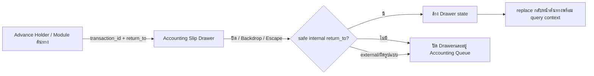
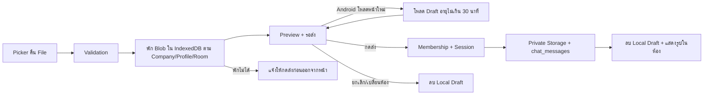
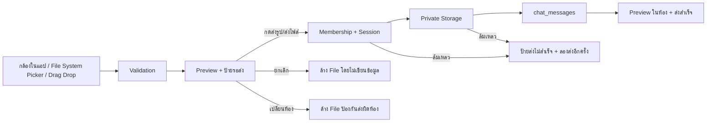
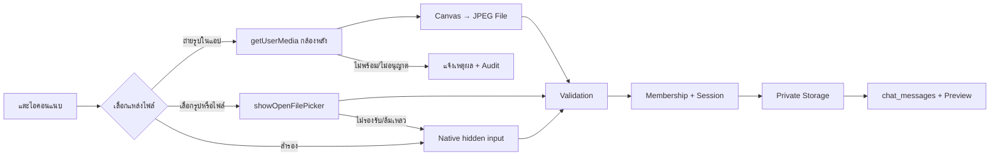
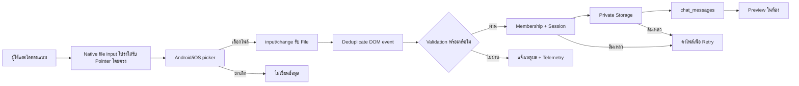
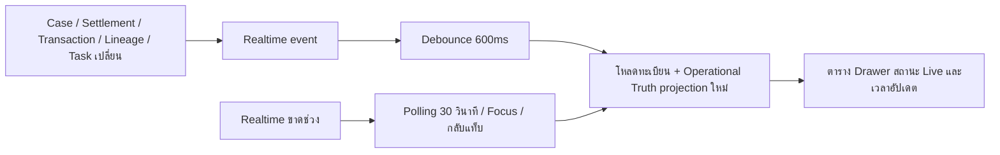
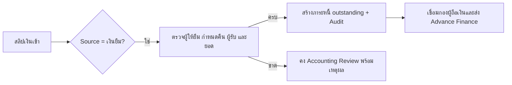
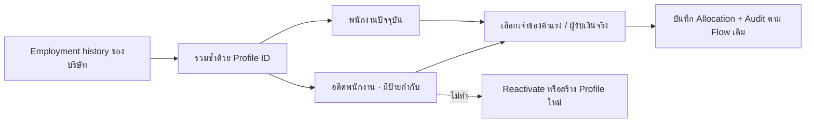

Warning: truncated output (original token count: 71721)
Total output lines: 1857

# Flow Registry Update Protocol

## 2026-09-05 - SYS-CICD-002 local password probe pooler recovery

- Flow: local one-attempt database password verification now connects to the fixed WisdomAI session pooler on port 5432 instead of the direct database hostname.
- Rationale: Direct DNS is unavailable on the current IPv4-only network, while both Supabase pooler ports are reachable. The previous network failure therefore did not prove that the supplied password was wrong.
- Safety: The helper still accepts one masked value through process memory, enforces the shared 30-minute cooldown, verifies TLS, sets the session read-only, runs only `SELECT 1`, never retries, and never stores or prints the password.
- Verification: Fake-client contract test, Windows form `-ValidateOnly`, `git diff --check`, and explicit TCP reachability checks for session/transaction pooler routes.
- Rollback: Revert the SYS-CICD-002 helper commit on its task branch. No schema, Production data, frontend route, or application permission changes are involved.

## 2026-09-05 - SYS-CICD-001 sanitized public release

- Flow: `docs/PUBLIC_RELEASE_HANDOFF.md`; owner Platform.
- Separate public branch from already-public base; retain recovered SQL locally.
- Guard all outgoing commit trees, deleted snapshot history and known blob renames.
- Synthetic fixtures only; no recovered source in public tests or reports.
- This check never replaces migration verification or authorizes Production.
- Rollback: revert safe task commit; no database change.

## 2026-09-05 - SYS-CICD-001 CLI token input correction

- Flow: `docs/SUPABASE_REPLAY_FLOW.md`; owner Platform.
- CI 33927609285: authenticated history read succeeded with version mismatch;
  CLI setup failed unauthenticated latest-release resolution with rate limit.
- Pass `with.github-token` at all three setup-cli steps, not environment-only.
- Regression covers missing/misnamed input; keep replay, SQL guard and dry-run.
- No new credentials, permission expansion, migration or Production apply.
- Rollback: task-branch revert, then rerun verification before any merge.

## 2026-09-05 - SYS-CICD-001 pre-merge safeguards

- Flow: `docs/SUPABASE_REPLAY_FLOW.md`.
- Replace line regex with conservative multiline SQL token checks over added/modified migrations.
- Sequence reusable function deployment after successful migration apply for the same main commit.
- Preserve all existing-table settings during foundation replay; keep full replay and dry-run gates.
- Add local/Git/PostgreSQL tests and run replay regressions in CI; no Production apply in this task.
- Rollback: reviewed task-branch revert; secret values are never stored in repository documentation.

## 2026-09-05 - SYS-CICD-001 ledger view compatibility

- Flow: `docs/SUPABASE_REPLAY_FLOW.md`.
- Evidence: CI run 33917055323 found dropped columns in the replacement view.
- Change: retain assignment metadata and reviewed pay-period precedence from the prior view.
- Verification: PostgreSQL replacement/repeat, column order/types, period routing and grants.
- No table/view drop or Production apply; rollback by task-branch revert.

## 2026-09-05 - SYS-CICD-001 historical salary replay

- Flow: `docs/SUPABASE_REPLAY_FLOW.md`.
- Evidence: CI run 33916675589 passed vendor migration and found absent historical salary target.
- Change: return only for empty identity, document and allocation tables; retain existing-data validations.
- Verification: five isolated PostgreSQL scenarios, with no fabricated salary or audit rows.
- No Production apply; rollback by reverting this task-branch patch.

## 2026-09-05 - SYS-CICD-001 vendor trigger dependency

- Flow: `docs/SUPABASE_REPLAY_FLOW.md`.
- Evidence: CI run 33916274015 found a trigger preceding its table creation.
- Change: attach on existing tables immediately and on fresh tables at creation.
- Verification: actual trigger/table SQL in isolated PostgreSQL; full replay pending.
- Matching rules, permissions and Production data unchanged; rollback by task-branch revert.

## 2026-09-05 - SYS-CICD-001 historical completion replay

- Flow: `docs/SUPABASE_REPLAY_FLOW.md`.
- Evidence: CI run 33915679999 reached 202608150016 after passing identity repairs.
- Change: no-target completion guard only when auth users and profiles are also absent; existing state assertions remain.
- Verification: isolated PostgreSQL reconciliation scenarios; full CI replay remains required.
- Rollback: revert the task-branch patch; no Production migration applied.

## 2026-09-04 - SYS-CICD-001 fresh identity replay

- Flow: `docs/SUPABASE_REPLAY_FLOW.md`.
- Scope: two historical Telegram identity repairs return only when both auth users and profiles are empty; populated databases retain original assertions.
- Evidence: 8 isolated PostgreSQL scenarios; full CI replay and linked dry-run remain separate gates.
- No Production apply, identity creation, permission expansion or migration history repair.
- Rollback: revert the task-branch patch without changing Production data.

## 2026-09-04 — Cross-system Mobile Responsive Contract v1.0

- **เหตุผล:** ทำให้การใช้งานบนมือถือ 320–768px เข้าถึง navigation, table, Drawer/Dialog และ action สำคัญได้ด้วย layout ที่ออกแบบเฉพาะ ไม่ลดความสามารถหรือขยาย scope ข้อมูล
- **ผลกระทบ:** `MainLayout`, `TopBar`, `Sidebar`, `theme`, `StandardDataTable`, Navigation/UI Action/Data Table flow documents และ mobile contract test; query, RLS, company/project scope, audit และ business mutation เดิมไม่เปลี่ยน
- **Migration:** ไม่มี
- **การตรวจสอบ:** `test:mobile-responsive`, targeted lint/typecheck, build, authenticated Android/iPhone portrait/landscape smoke และ Desktop regression; ตรวจเปิดหน้า → ค้นหา → แก้ไข → บันทึก → สถานะ → ส่งต่อ → Audit ในแต่ละโมดูลที่แก้
- **Rollback:** revert shared layout/theme/table UI และเอกสาร/test ได้โดยไม่ลบข้อมูล, audit หรือเปลี่ยน permission; หากหน้ารายใดมีปัญหาให้ปิดเฉพาะ mobile presentation override แล้วคง Desktop flow เดิม

## 2026-08-31 — Accounting Drawer Return-to-Origin v2.8



- **เหตุผล:** Drawer รับ `return_to` จาก Advance Holder อยู่แล้ว แต่ปุ่มปิดเรียกเพียง state cleanup จึงค้างหน้า Accounting และทำให้ผู้ใช้ต้องค้นหา Holder/Transaction ซ้ำ
- **Input/Output/State:** รับ internal `return_to` พร้อม `holder_id/transaction_id`; ทุกวิธีปิดล้าง preview/request/form state แล้ว `replace` กลับต้นทาง หรือ fallback อยู่คิวเดิมเมื่อไม่มีเส้นทางปลอดภัย
- **สิทธิ์/ข้อมูล/Audit:** ไม่เปลี่ยน Auth, RLS, RPC, financial state หรือ Audit; ปฏิเสธ absolute URL, protocol-relative URL, backslash และ encoded protocol-relative path
- **Migration/Legacy:** ไม่มี migration และไม่แก้รายการเดิม; deep link เดิมทำงานต่อได้
- **Verification:** navigation/security contract, Accounting transfer-slip contracts, typecheck, lint, build และ authenticated Advance Holder → Accounting → Close round-trip
- **Rollback:** revert utility และ close handler; ข้อมูล Source/Lineage/Allocation/Audit เดิมไม่เปลี่ยน

## 2026-08-31 — Web Chat Reload-Safe Attachment Draft v3.2



- **เหตุผล/หลักฐาน:** Android revision `870e033` บันทึก `file_received` และ `waiting_confirmation` แต่รุ่นนั้นยังไม่มี persistent draft จากนั้นเกิด `session_start` ใหม่ในประมาณ 0.35 วินาที จึงล้าง React memory ก่อนผู้ใช้เห็น Preview; Storage/RLS ยังไม่ถูกเรียก
- **Input/Output/States:** File ที่ผ่าน validation ถูกเก็บแบบ origin-local Blob → ready/รอส่ง; reload กู้ File/Preview; ส่งสำเร็จหรือยกเลิก/เปลี่ยนห้องลบ draft; expired เกิน 30 นาทีลบอัตโนมัติ
- **Roles/Permissions:** draft key แยก company + profile + room และอยู่ใน IndexedDB ของ origin/device เท่านั้น; server mutation ยังเริ่มเมื่อกดส่งและตรวจ membership/session เดิม
- **Integrations:** camera/File System Picker/native input/drag-drop → IndexedDB draft → Preview → Supabase Auth/private Storage/chat_messages/Realtime
- **Failure/Retry:** IndexedDB ไม่พร้อมยังแสดง Preview ใน memory พร้อมเตือน; draft restore error ไม่ส่งข้อมูล; upload/message failure คง draft/Preview; message success cleanup local draft
- **Audit/Owner:** `chat_attachment_draft_persisted`, `chat_attachment_draft_restored` และ `waiting_confirmation.metadata.draft_persisted`; telemetry ไม่เก็บชื่อหรือ bytes เจ้าของ Web Chat/Application Platform
- **Impact/Migration/Legacy:** ไม่มี database migration; เพิ่ม IndexedDB v1 ฝั่ง browser; ข้อความ/ไฟล์เดิมไม่เปลี่ยน และ draft local ไม่มีสิทธิ์ข้ามผู้ใช้/ห้อง
- **Verification:** draft contract, attachment/Web Chat tests, typecheck, lint, build, revision parity และ Android read-back `file_received → draft_persisted → session_start → draft_restored → send_started → message_recorded`
- **Rollback/Recovery:** revert v3.2 กลับ memory-only v3.1; IndexedDB record ที่ไม่ได้ใช้หมดอายุเองใน 30 นาที และไม่มีผลต่อข้อมูล server

## 2026-08-31 — Web Chat Confirm-Before-Send Attachment v3.1



- **เหตุผล/หลักฐาน:** Android Production revision `b0d5a81` รับกล้องและ File System Picker สำเร็จจริง 3 รายการ (`camera` 1, `file_system` 2) ตั้งแต่ File → Storage → `chat_messages`; แต่ auto-send ทำให้ผู้ใช้ไม่เห็นจังหวะยืนยันและเข้าใจว่าไฟล์หาย จึงเปลี่ยนเป็น Preview ค้างรอผู้ใช้กดส่ง
- **Input/Output/States:** selected → `ready`/รอส่ง → `uploading` → message recorded หรือ `failed`/ลองส่งอีกครั้ง; cancel และ room change ไม่เขียนข้อมูล
- **Roles/Permissions:** คง login/company/room/membership และ owner-only เดิม; ปุ่มส่งเป็นจุดเริ่ม mutation ที่ชัดเจน และไฟล์ที่เลือกผูกกับ room id เพื่อกันส่งผิดห้อง
- **Integrations:** กล้องในแอป, File System Picker, native fallback และ drag/drop ใช้ Preview เดียวกัน ก่อนต่อ Supabase Auth/private Storage/chat_messages/Realtime
- **Failure/Retry:** validation ไม่ผ่านล้างไฟล์พร้อมเหตุผล; membership/session/Storage/message ล้มเหลวคง Preview พร้อมสถานะ failed; เปลี่ยนห้องล้างไฟล์ pending; message insert ล้มเหลวยัง cleanup object เดิม
- **Audit/Owner:** เพิ่ม `chat_attachment_waiting_confirmation`; `send_started` เกิดเฉพาะเมื่อผู้ใช้กดส่ง; telemetry ไม่เก็บชื่อไฟล์ เจ้าของ Web Chat/Application Platform
- **Impact/Migration/Legacy:** เปลี่ยนเฉพาะ UI/state; ไม่มี migration; รูป 3 รายการที่ auto-send สำเร็จก่อน v3.1 คงอยู่และไม่สร้างซ้ำ
- **Verification:** attachment contract, Web Chat test, typecheck, lint, build, Production parity และ Android E2E selected → waiting_confirmation → send_started → message_recorded → image preview
- **Rollback:** revert v3.1 เพื่อคืน auto-send; ไฟล์/ข้อความที่บันทึกสำเร็จแล้วไม่ถูกลบ

## 2026-08-31 — Web Chat In-App Camera + File System Picker v3.0



- **เหตุผล/หลักฐาน:** Android revision `217c798` เปิด picker ได้สองครั้ง แต่ทุกครั้งหน้า `/chat` เริ่ม session ใหม่ทันทีหลังกลับจากกล้อง/แกลเลอรี และไม่มี `file_received`; Chromium มีปัญหา Media Picker/การคืนหน้า mobile ที่อาจทำให้ File handle สูญหาย จึงต้องมีเส้นทางที่ไม่สลับไปแอปกล้องภายนอก
- **Input/Output/States:** ผู้ใช้เลือก camera/file-system/native fallback → `File` → received/validated/uploading/message_recorded → image/file card; cancel เป็น no-op, camera permission/picker/validation error แสดงเหตุผลและไม่สร้างข้อความ
- **Roles/Permissions:** ต้อง login, มี company/room, เป็นสมาชิกห้อง และ Program Development ยังคง owner-only; ไม่เปลี่ยน RLS, private bucket หรือ allow-list
- **Integrations:** `getUserMedia` + Canvas สำหรับกล้องในแอป, `showOpenFilePicker` สำหรับไฟล์, native input เป็น fallback, จากนั้นใช้ Supabase Auth/Storage/chat_messages/Realtime/preview เดิม
- **Failure/Retry:** กล้องไม่พร้อมหรือ permission ถูกปฏิเสธหยุด stream และแจ้งผู้ใช้; File System Picker ไม่รองรับใช้ native fallback; upload/message failure คง Preview และ cleanup object ตาม flow เดิม
- **Audit/Owner:** เพิ่ม `chat_attachment_camera_ready`, source `camera|file_system`, reason `camera_unavailable|picker_failed`; telemetry ไม่เก็บชื่อไฟล์ เจ้าของคือ Web Chat/Application Platform
- **Impact/Migration:** เปลี่ยน UI แนบเป็นตัวเลือกสามทางและเพิ่มกล้องในแอป; ไม่มี schema migrationและไม่แก้ข้อมูลเดิม
- **Verification:** attachment contract, camera/file picker mocks, typecheck, lint, build, release parity และ authenticated Android E2E ทั้ง camera กับ gallery/file
- **Rollback:** revert v3.0 เป็น v2.9 ผ่าน Git integration; ไฟล์/ข้อความ/Audit เดิมคงอยู่ และ native fallback ยังเป็น recovery path

## 2026-08-31 — Web Chat Direct Native Input Overlay v2.9



- **เหตุผล:** Android Production หลัง v2.8 ยังมีเพียง `chat_attachment_picker_opened` โดยไม่พบ Storage/message; การ forward click จาก MUI label ยังเป็นจุดเสี่ยง และ telemetry เดิมเกิดหลัง validation จึงแยกไม่ได้ว่าไม่ได้รับ File หรือถูกปฏิเสธก่อนส่ง
- **Input/Output/States:** รับ `File` จาก native i…61721 tokens truncated…ลบเบอร์โทรหรือ Audit ที่บันทึกแล้ว
# ล่าสุด: Employee Bank Account Secure Store v3.1 — 26/8/2569

- **เหตุผล:** การเก็บเพียงเลขท้าย 4 ตัวตรวจสอบบัญชีได้แต่ไม่สามารถใช้ทำรายการจ่ายจริง ขณะที่การเก็บเลขเต็มใน Master/UI/Log เพิ่มความเสี่ยงข้อมูลรั่ว
- **Flow:** เอกสาร/LINE สร้าง Candidate → Admin/การเงินตรวจเจ้าของและเลขเต็ม → HMAC กันซ้ำ + AES256 ciphertext ใน private schema → Public Master แสดง 4 ตัวท้าย → เปิดดูผ่าน audited RPC 60 วินาที
- **สิทธิ์:** Platform Admin, company_admin, executive และ accounting_hr เท่านั้น; anonymous/พนักงานทั่วไปไม่มีสิทธิ์เพิ่ม แก้ หรือเปิดเลขเต็ม
- **ข้อมูลเดิม:** บัญชีเดิมคงสถานะ `มีเพียงเลขท้าย · ต้องเติมเลขเต็ม`; ห้ามเดาเลขเต็มหรือประกอบจาก Raw อัตโนมัติ
- **Migration:** `20260826203000_employee_bank_account_secure_store.sql` และ `20260826204500_employee_bank_secret_audit_fk_indexes.sql`; ใช้ Supabase Vault key, private table และ FK indexes สำหรับผู้สร้าง/ผู้แก้ไข
- **Verification:** encryption/fingerprint/duplicate/idempotency/privilege/Audit contracts, migration dry-run, tests, typecheck, lint, build และ authenticated Employee Drawer smoke
- **Rollback:** ซ่อน Action และ revoke RPC; ไม่ลบ ciphertext, Master record หรือ Audit ที่เกิดแล้ว

# ล่าสุด: Employee Existing Bank Candidate Link v3.2 — 26/8/2569

- **เหตุผล:** บัญชีจากเอกสาร/ธุรกรรมมีอยู่ใน Master Data แล้ว แต่ Employee Drawer เดิมบังคับกรอกเลขเต็มใหม่ ทำให้เกิดงานซ้ำและเสี่ยงสร้างเจ้าของบัญชีซ้ำ
- **Flow:** Drawer ค้นเฉพาะ Candidate ในบริษัทที่ชื่อ normalized ตรง → แสดงเลขท้าย/แหล่งที่มา/Secure readiness → Admin ตรวจและยืนยัน → RPC ตรวจสิทธิ์/ชื่อ/เจ้าของซ้ำ → เชื่อม Profile → Audit
- **กติกา:** ไม่ Auto-link, ไม่เปิดเลขเต็ม, บัญชีที่ผูกคนอื่นเลือกไม่ได้, บัญชีเลขท้ายอย่างเดียวยังไม่พร้อมจ่าย และการกดซ้ำคืน unchanged โดยไม่สร้าง Audit ซ้ำ
- **Migration:** `20260825233255_employee_bank_candidate_link.sql`; baseline ที่พบร่วมกัน `20260826220000_transfer_slip_money_allocations_v2.sql` นำจาก commit `281f06c` โดยไม่แก้ schema ซ้ำ
- **Verification:** Employee contract, migration permission/idempotency/Audit, typecheck, lint, build และ authenticated Employee Drawer smoke
- **Rollback:** ซ่อนตัวเลือก Candidate และ revoke RPC; ข้อมูล Master/Secure/Audit ที่มีอยู่ไม่ถูกลบ

# ล่าสุด: Vendor Payment Matching v1.0 — 26/8/2569

- **เหตุผล:** รองรับกรณีชำระค่าสินค้าร้านค้าผ่านบัญชีบุคคล โดยแยกผู้จ่าย/ผู้ถือบัญชีออกจากผู้ขายที่รับเงินจริง และไม่เดาผู้ขายจากชื่อเพียงอย่างเดียว
- **Flow:** Raw/สลิป → สกัดผู้จ่ายและผู้รับ → ตรวจ Vendor Master จากเลขภาษี/บัญชีที่อนุมัติ/ชื่อ/เอกสาร/Project → `matched`, `candidate`, `ambiguous` หรือ `needs_review` → Accounting Pending Queue → link Advance Finance/Payroll ตามหลักฐาน
- **สิทธิ์/ความปลอดภัย:** ผู้จ่ายอาจเป็น Employee/Technician แต่ `vendor_id` ต้องอ้าง Vendor Master ที่มีอยู่; alias บัญชีผู้ขายสร้างได้เมื่อ Admin/Accounting อนุมัติเท่านั้น; ไม่เก็บเลขบัญชีเต็มใน UI ทั่วไป
- **Data/Audit/Idempotency:** `transfer_slip_vendor_matches` และ `vendor_bank_account_aliases` เก็บหลักฐาน, confidence, เหตุผล, payer, source IDs และ version; RPC ใช้ event key เดิมและ unique `(lineage_id, allocation_key)`; Raw/OCR ไม่ถูกเขียนทับ
- **Gate:** การยืนยัน allocation ประเภท `vendor_payment` จะผ่านได้ต่อเมื่อมี match สถานะ `matched` และ vendor ที่ถูกต้อง; ข้อมูลไม่ชัด/ขัดแย้ง/ซ้ำค้างตรวจพร้อม next action ห้ามสร้างงานปลายทางซ้ำ
- **Migration:** `20260826044252_transfer_slip_vendor_payment_matching.sql`, `20260826044610_revoke_transfer_slip_vendor_match_trigger_execute.sql`
- **Verification:** `test:vendor-payment-matching`, migration/RLS contract, transfer-slip lineage contract, typecheck, targeted lint, build และ Local Accounting Drawer smoke; Production apply/deploy ใช้ release gate ปกติ
- **Rollback:** ซ่อนฟิลด์/Action จับคู่และ revoke RPC/trigger โดยคง match history, alias, Raw/OCR, Source Reference, Version/Audit และคิวเดิมไว้สำหรับตรวจ/กู้คืน

# ล่าสุด: Daily Wage Transfer → Web Chat Confirmation v2.0 — 26/8/2569

- **เหตุผล:** สลิปโอนที่ชื่อผู้รับตรงกับพนักงานรายวันต้องแยกเป็นรายคน/วันที่โอน ส่ง Web Chat และให้ Admin เห็นว่าส่งแล้วหรือยัง โดยไม่ลงค่าแรงก่อนยืนยัน
- **Flow:** Financial transaction/Intake → exact active daily employee gate → confirmation projection → Web Chat delivery ledger → employee confirmation หรือ Admin review → wage-period gate; duplicate/mismatch/room missing คง source และเข้าส่วนตรวจแก้
- **สิทธิ์/ข้อมูล:** RLS ให้ Admin/Manager อ่าน projection; RPC ตรวจ company manager สำหรับ manual action; trigger ทำงานภายใน; delivery/event key ป้องกันซ้ำ; Raw/OCR/transaction ไม่ถูกลบหรือเขียนทับ
- **Migration:** `20260826042045_daily_wage_transfer_intake_routing.sql`, `20260826042334_daily_wage_transfer_route_trigger.sql` ซึ่งตั้งชื่อตรง Production migration history
- **Verification:** migration history/schema/RPC/trigger/count, routing contract, typecheck, lint, build, GitHub/Cloudflare revision และ authenticated report smoke
- **Rollback:** disable `daily_wage_transfer_route_after_transaction` และซ่อนตาราง delivery ใน UI; เก็บ confirmations/deliveries/audit และ transaction ต้นทางเพื่อ retry/reconcile
### Transfer Slip Canonical Operational Truth v1 (26/8/2569)

- **Source of truth:** `transfer_slip_operational_truth_v1` เป็น projection กลางเพียงชุดเดียวสำหรับข้อมูลสลิปที่ทุก Module ใช้งาน
- **Evidence boundary:** `financial_transactions` และไฟล์ต้นฉบับเป็นหลักฐานอ่าน/ตรวจย้อนหลัง ไม่ใช่ข้อมูลธุรกิจสำหรับลงบัญชี
- **Confirmation gate:** ใช้ `canonical_*` ได้เมื่อ `truth_status=confirmed` และ `is_postable=true` เท่านั้น; สถานะอื่นต้องค้าง Review Queue
- **Consumers:** Accounting Transfer Slip Queue และ Advance Report ห้าม fallback จากชื่อ OCR เป็นผู้ถือเงินจริง
- **Migration:** `20260826102135_transfer_slip_canonical_operational_truth.sql` (ตรงกับ Production migration history)
- **Verification:** Production task 100 = view rows 100 = distinct task 100; confirmed/postable 5, duplicate/non-postable 7, needs-review/non-postable 88, invalid canonical rows 0
- **Rollback:** ถอน View และคืน consumer query ก่อนหน้าได้โดยไม่ลบ Raw/OCR/Lineage/Audit หรือข้อมูลธุรกิจ

### Masked Bank Tail + Holder Starting Fund v2.1 (31/8/2569)

- **เหตุผล:** สลิปธนาคารกรุงเทพแสดงเลขท้ายบัญชีเพียง 3 หลัก แต่ระบบเดิมบังคับ 4 หลัก และ Draft เงินเบิกล่วงหน้ายังไม่เปลี่ยน `expense_type` ก่อน Party Resolver
- **Flow:** สลิป → อ่านเลขท้ายที่เห็นจริง 3–4 หลัก → เลือกแหล่งเงินจริง + `ตั้งต้น/เติมกองให้ผู้ถือเงิน` → Draft Classification/Audit → เชื่อมสองฝั่ง → สร้าง/เชื่อม Advance ID → Advance Finance
- **Data/Audit:** คงชื่อคอลัมน์ `*_account_last4` เพื่อ compatibility แต่ contract คือ visible tail 3–4 หลัก; ห้ามเดาเลขที่ถูกปกปิด. RPC ตรวจ Allocation ก่อน update และ idempotent ด้วย event key
- **Migration:** `20260831054814_support_masked_bank_digits_and_starting_fund.sql`; แก้ constraint/validation/trigger แบบ fail-closed และเพิ่ม `classify_transfer_slip_advance_draft_v1`
- **Verification:** visible-tail contract, money-lineage contract, migration dry-run/local schema, typecheck, lint, build และ authenticated Accounting Drawer → Advance Finance/Audit smoke
- **Rollback:** ซ่อน label/preset และ revoke classification RPC; ก่อนคืน constraint 4 หลักต้อง reconcile หลักฐาน 3 หลัก ห้ามลบ Raw/OCR, Lineage, Advance ID หรือ Audit

### Advance Holder Live Refresh v2.8 (31/8/2569)



- **Flow/State:** `/advance-holders` อัปเดตทั้งบัญชียืนยันและสลิปที่จับคู่เมื่อข้อมูลต้นทางเปลี่ยน; สถานะ UI คือ `connecting → live|polling` และ fallback ไม่หยุดการทำงาน
- **Permission/Data:** ใช้ session/RLS เดิมและโหลดเฉพาะบริษัทปัจจุบัน; migration `20260831084415_enable_advance_holder_realtime.sql` เพิ่มเฉพาะตาราง Flow นี้ใน `supabase_realtime` publication ไม่แก้ข้อมูลธุรกิจ
- **Failure/Retry/Audit:** Realtime event รวมภายใน 600ms; polling ทุก 30 วินาทีและ focus/visibility refresh ชดเชย event ที่พลาด ส่วน Source/Lineage/Audit เดิมไม่เปลี่ยน
- **Owner/Verification/Rollback:** Accounting/Platform; realtime contract, typecheck, lint, build และ authenticated Production smoke; rollback ปิด subscription/polling แล้วคงปุ่ม Refresh

### Advance Holder Balance Projection v2.9 (31/8/2569)

```mermaid
flowchart LR
  C[Advance Cases] --> G{cancelled / rejected?}
  G -->|ใช่| X[ไม่นับยอด · แสดงยอดที่ตัดออก]
  G -->|ไม่| B[ยอดรับ/ใช้/คืนที่บันทึกแล้ว]
  S[Operational Truth] --> D{Transaction หรือ Evidence<br/>ลง Case/Settlement แล้ว?}
  D -->|ใช่| N[แสดงเส้นทาง แต่ไม่คิดซ้ำ]
  D -->|ยัง| R[รับเข้า/จ่ายออก Real-time]
  B --> P[คงเหลือคาดการณ์]
  R --> P
  P --> U[/advance-holders + Drawer + Deep link/Audit]
```

- **Flow/Data:** ยอดบันทึกใช้เฉพาะ Case ที่ไม่ใช่ `cancelled/rejected`; รับเข้า Real-time นับเฉพาะ `advance_transfer/onward_transfer`; จ่ายออก Real-time หักจากยอดคาดการณ์ และใช้ Transaction ID/Evidence Item ID กันรายการที่ลงบัญชีแล้วไม่ให้คิดซ้ำ
- **State/Permission/Audit:** เป็น company-scoped read projection ภายใต้ RLS เดิม ไม่แก้สถานะหรือข้อมูลเงินจริง; รายการยกเลิก/Reject และ Source/Audit ยังคงตรวจย้อนหลังได้
- **Failure/Retry:** รายการขาดประเภทเงินหรือเส้นทางไม่เปลี่ยนยอดรับเข้าและคงอยู่ในรอตรวจ; Realtime/polling v2.8 โหลด projection ใหม่เมื่อแก้ข้อมูลต้นทาง
- **Owner/Verification/Rollback:** Accounting/Platform; balance/realtime contract, legacy reconciliation, typecheck/lint/build และ authenticated Production smoke; rollback revert projection v2.9 โดยไม่ย้อนข้อมูลธุรกิจ

### Borrowed Starting Fund v2.7 (31/8/2569)



- **Flow/Data:** `borrowed_funds` เชื่อม Source → Slip → Money Lineage → `borrowed_fund_obligations` → Holder Fund → Advance Finance โดยไม่ลงรายได้/ค่าใช้จ่ายทันที
- **Permission/Audit/Retry:** company manager/platform เป็นผู้บันทึก; accounting/HR อ่านได้ภายใต้ RLS; event key กันคำสั่งซ้ำและ append `borrowed_fund_obligation_recorded`
- **Migration/Verification:** `20260831072537_borrowed_fund_obligations.sql`; contract, typecheck, lint, build, dry-run/apply และ authenticated Drawer smoke
- **Owner/Rollback:** Accounting owner; ปิด Source และ revoke RPC ได้โดยคง Obligation, Slip, Lineage และ Audit เพื่อ recovery

### Supabase Connection Recovery (2026-09-05)

- Read-only reconciliation follow-up: compare local/remote version IDs, reject
  duplicate IDs and fail diagnostic on drift. A matching version list does not
  authorize SQL apply. Actual catalog evidence: all 7 realtime tables and 6
  holder SELECT policies present, but retry-cap rollout not complete. See
  `SUPABASE_HISTORY_RECONCILIATION_2026-09-05.md`; no history repair performed.

- Local password window follow-up: masked Windows form, fixed WisdomAI direct
  host, TLS verification, SELECT 1 only, no retries, 30-minute local timestamp
  lock. No password storage or database changes. Source:
  `tools/db-password-test`; fixture test and form-construction smoke only until
  the owner explicitly enters a password. No auto-secret update or deploy.

- Flow: `docs/SUPABASE_CONNECTION_RECOVERY.md`; owner Platform, SYS-CICD-001.
- API GET diagnostics run without a database password; pooler/direct are explicit
  transport choices, not automatic write fallbacks. Same verified route for apply.
- No migration, role, business data or frontend connection changes. Existing
  replay, destructive SQL guard and linked dry-run remain required.
- Tests: connection fixtures and workflow contracts; runtime verification pending.
- Rollback: revert task change and restore pooler variable; never reset DB/history.

### Historical Payroll Employee Selection v3.0 (31/8/2569)



- **Input/Output/State:** อ่านประวัติ `employee_employment_records` ทุกสถานะภายในบริษัท แล้วสร้างตัวเลือก Profile เดียวต่อคนสำหรับรายการค่าแรงย้อนหลัง; ไม่แก้ employment state
- **Roles/Permissions/Integration:** ใช้สิทธิ์ Accounting Admin/Manager และ RLS เดิม; Allocation, Payroll destination และ Audit ใช้คำสั่งยืนยันเดิม
- **Failure/Retry:** ถ้ามีหลายประวัติของ Profile เดียว ระบบเลือกสถานะปัจจุบันก่อน; ชื่อยังไม่ชัดคงค้าง Review โดยไม่สร้างบุคคลซ้ำ
- **Owner/Migration/Verification/Rollback:** Accounting/HR; ไม่มี migration; former-employee contract + typecheck/lint/build + authenticated Drawer; rollback เฉพาะ query/label โดยข้อมูลเดิมไม่เปลี่ยน
