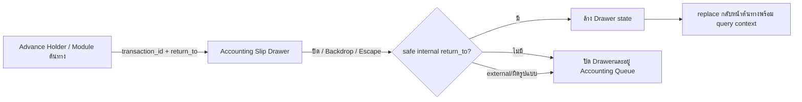
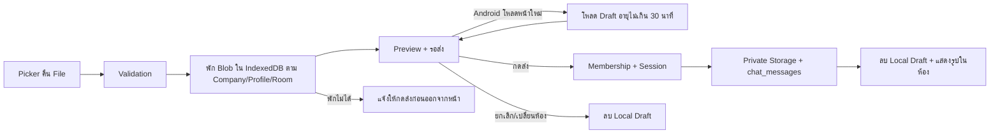
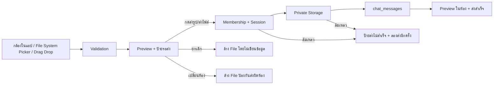
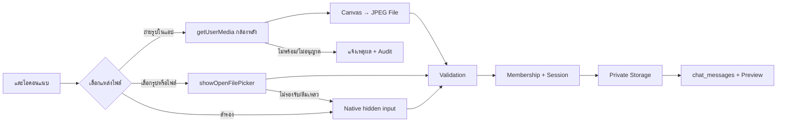
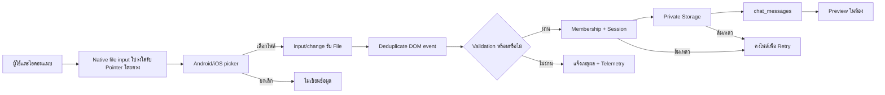
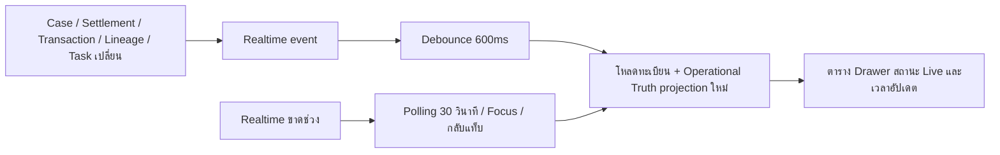
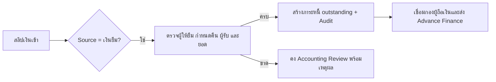
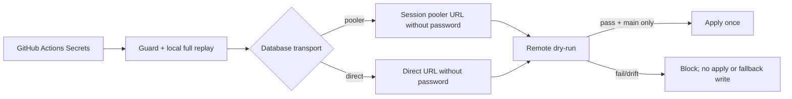
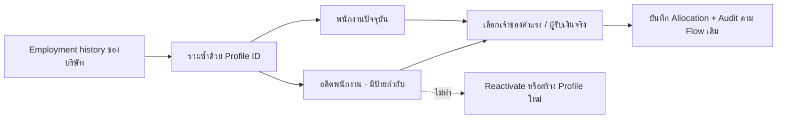

Warning: truncated output (original token count: 30307)
Total output lines: 811

Warning: truncated output (original token count: 71747)
Total output lines: 1857

# Flow Registry Update Protocol

## 2026-09-05 - SYS-CICD-002 local password probe pooler recovery

- Flow: local one-attempt database password verification now connects to the fixed WisdomAI session pooler on port 5432 instead of the direct database hostname.
- Rationale: Direct DNS is unavailable on the current IPv4-only network, while both Supabase pooler ports are reachable. The previous network failure therefore did not prove that the supplied password was wrong.
- Safety: The helper still accepts one masked value through process memory, enforces the shared 30-minute cooldown, pins the official Supabase Root 2021 CA with hostname verification enabled, sets the session read-only, runs only `SELECT 1`, never retries, and never stores or prints the password.
- Verification: Fake-client contract test, Windows form `-ValidateOnly`, `git diff --check`, explicit TCP reachability checks, and a password-free PostgreSQL TLS handshake returning `Verify return code: 0 (ok)`.
- Rollback: Revert the SYS-CICD-002 helper commit on its task branch. No schema, Production data, frontend route, or application permission changes are involved.

## 2026-09-05 - SYS-CICD-001 sanitized public release

- Flow: `docs/PUBLIC_RELEASE_HANDOFF.md`; owner Platform.
- Separate public branch from already-public base; retain recovered SQL locally.
- Guard all outgoing commit trees, deleted snapshot history and known blob renames.
- Synthetic fixtures only; no recovered source in public tests or reports.
- This check never replaces migration verification or authorizes Production.
- Rollback: revert safe task commit; no database change.

## 2026-09-05 - SYS-CICD-001 CLI token input correction

- Flow: `docs/SUPABASE_REPLAY_FLOW.md`; owner Platform.
- CI 33927609285: authenticated history read succeeded with version mismatch;
  CLI setup failed unauthenticated latest-release resolution with rate limit.
- Pass `with.github-token` at all three setup-cli steps, not environment-only.
- Regression covers missing/misnamed input; keep replay, SQL guard and dry-run.
- No new credentials, permission expansion, migration or Production apply.
- Rollback: task-branch revert, then rerun verification before any merge.

## 2026-09-05 - SYS-CICD-001 pre-merge safeguards

- Flow: `docs/SUPABASE_REPLAY_FLOW.md`.
- Replace line regex with conservative multiline SQL token checks over added/modified migrations.
- Sequence reusable function deployment after successful migration apply for the same main commit.
- Preserve all existing-table settings during foundation replay; keep full replay and dry-run gates.
- Add local/Git/PostgreSQL tests and run replay regressions in CI; no Production apply in this task.
- Rollback: reviewed task-branch revert; secret values are never stored in repository documentation.

## 2026-09-05 - SYS-CICD-001 ledger view compatibility

- Flow: `docs/SUPABASE_REPLAY_FLOW.md`.
- Evidence: CI run 33917055323 found dropped columns in the replacement view.
- Change: retain assignment metadata and reviewed pay-period precedence from the prior view.
- Verification: PostgreSQL replacement/repeat, column order/types, period routing and grants.
- No table/view drop or Production apply; rollback by task-branch revert.

## 2026-09-05 - SYS-CICD-001 historical salary replay

- Flow: `docs/SUPABASE_REPLAY_FLOW.md`.
- Evidence: CI run 33916675589 passed vendor migration and found absent historical salary target.
- Change: return only for empty identity, document and allocation tables; retain existing-data validations.
- Verification: five isolated PostgreSQL scenarios, with no fabricated salary or audit rows.
- No Production apply; rollback by reverting this task-branch patch.

## 2026-09-05 - SYS-CICD-001 vendor trigger dependency

- Flow: `docs/SUPABASE_REPLAY_FLOW.md`.
- Evidence: CI run 33916274015 found a trigger preceding its table creation.
- Change: attach on existing tables immediately and on fresh tables at creation.
- Verification: actual trigger/table SQL in isolated PostgreSQL; full replay pending.
- Matching rules, permissions and Production data unchanged; rollback by task-branch revert.

## 2026-09-05 - SYS-CICD-001 historical completion replay

- Flow: `docs/SUPABASE_REPLAY_FLOW.md`.
- Evidence: CI run 33915679999 reached 202608150016 after passing identity repairs.
- Change: no-target completion guard only when auth users and profiles are also absent; existing state assertions remain.
- Verification: isolated PostgreSQL reconciliation scenarios; full CI replay remains required.
- Rollback: revert the task-branch patch; no Production migration applied.

## 2026-09-04 - SYS-CICD-001 fresh identity replay

- Flow: `docs/SUPABASE_REPLAY_FLOW.md`.
- Scope: two historical Telegram identity repairs return only when both auth users and profiles are empty; populated databases retain original assertions.
- Evidence: 8 isolated PostgreSQL scenarios; full CI replay and linked dry-run remain separate gates.
- No Production apply, identity creation, permission expansion or migration history repair.
- Rollback: revert the task-branch patch without changing Production data.

## 2026-09-04 — Cross-system Mobile Responsive Contract v1.0

- **เหตุผล:** ทำให้การใช้งานบนมือถือ 320–768px เข้าถึง navigation, table, Drawer/Dialog และ action สำคัญได้ด้วย layout ที่ออกแบบเฉพาะ ไม่ลดความสามารถหรือขยาย scope ข้อมูล
- **ผลกระทบ:** `MainLayout`, `TopBar`, `Sidebar`, `theme`, `StandardDataTable`, Navigation/UI Action/Data Table flow documents และ mobile contract test; query, RLS, company/project scope, audit และ business mutation เดิมไม่เปลี่ยน
- **Migration:** ไม่มี
- **การตรวจสอบ:** `test:mobile-responsive`, targeted lint/typecheck, build, authenticated Android/iPhone portrait/landscape smoke และ Desktop regression; ตรวจเปิดหน้า → ค้นหา → แก้ไข → บันทึก → สถานะ → ส่งต่อ → Audit ในแต่ละโมดูลที่แก้
- **Rollback:** revert shared layout/theme/table UI และเอกสาร/test ได้โดยไม่ลบข้อมูล, audit หรือเปลี่ยน permission; หากหน้ารายใดมีปัญหาให้ปิดเฉพาะ mobile presentation override แล้วคง Desktop flow เดิม

## 2026-08-31 — Accounting Drawer Return-to-Origin v2.8



- **เหตุผล:** Drawer รับ `return_to` จาก Advance Holder อยู่แล้ว แต่ปุ่มปิดเรียกเพียง state cleanup จึงค้างหน้า Accounting และทำให้ผู้ใช้ต้องค้นหา Holder/Transaction ซ้ำ
- **Input/Output/State:** รับ internal `return_to` พร้อม `holder_id/transaction_id`; ทุกวิธีปิดล้าง preview/request/form state แล้ว `replace` กลับต้นทาง หรือ fallback อยู่คิวเดิมเมื่อไม่มีเส้นทางปลอดภัย
- **สิทธิ์/ข้อมูล/Audit:** ไม่เปลี่ยน Auth, RLS, RPC, financial state หรือ Audit; ปฏิเสธ absolute URL, protocol-relative URL, backslash และ encoded protocol-relative path
- **Migration/Legacy:** ไม่มี migration และไม่แก้รายการเดิม; deep link เดิมทำงานต่อได้
- **Verification:** navigation/security contract, Accounting transfer-slip contracts, typecheck, lint, build และ authenticated Advance Holder → Accounting → Close round-trip
- **Rollback:** revert utility และ close handler; ข้อมูล Source/Lineage/Allocation/Audit เดิมไม่เปลี่ยน

## 2026-08-31 — Web Chat Reload-Safe Attachment Draft v3.2



- **เหตุผล/หลักฐาน:** Android revision `870e033` บันทึก `file_received` และ `waiting_confirmation` แต่รุ่นนั้นยังไม่มี persistent draft จากนั้นเกิด `session_start` ใหม่ในประมาณ 0.35 วินาที จึงล้าง React memory ก่อนผู้ใช้เห็น Preview; Storage/RLS ยังไม่ถูกเรียก
- **Input/Output/States:** File ที่ผ่าน validation ถูกเก็บแบบ origin-local Blob → ready/รอส่ง; reload กู้ File/Preview; ส่งสำเร็จหรือยกเลิก/เปลี่ยนห้องลบ draft; expired เกิน 30 นาทีลบอัตโนมัติ
- **Roles/Permissions:** draft key แยก company + profile + room และอยู่ใน IndexedDB ของ origin/device เท่านั้น; server mutation ยังเริ่มเมื่อกดส่งและตรวจ membership/session เดิม
- **Integrations:** camera/File System Picker/native input/drag-drop → IndexedDB draft → Preview → Supabase Auth/private Storage/chat_messages/Realtime
- **Failure/Retry:** IndexedDB ไม่พร้อมยังแสดง Preview ใน memory พร้อมเตือน; draft restore error ไม่ส่งข้อมูล; upload/message failure คง draft/Preview; message success cleanup local draft
- **Audit/Owner:** `chat_attachment_draft_persisted`, `chat_attachment_draft_restored` และ `waiting_confirmation.metadata.draft_persisted`; telemetry ไม่เก็บชื่อหรือ bytes เจ้าของ Web Chat/Application Platform
- **Impact/Migration/Legacy:** ไม่มี database migration; เพิ่ม IndexedDB v1 ฝั่ง browser; ข้อความ/ไฟล์เดิมไม่เปลี่ยน และ draft local ไม่มีสิทธิ์ข้ามผู้ใช้/ห้อง
- **Verification:** draft contract, attachment/Web Chat tests, typecheck, lint, build, revision parity และ Android read-back `file_received → draft_persisted → session_start → draft_restored → send_started → message_recorded`
- **Rollback/Recovery:** revert v3.2 กลับ memory-only v3.1; IndexedDB record ที่ไม่ได้ใช้หมดอายุเองใน 30 นาที และไม่มีผลต่อข้อมูล server

## 2026-08-31 — Web Chat Confirm-Before-Send Attachment v3.1



- **เหตุผล/หลักฐาน:** Android Production revision `b0d5a81` รับกล้องและ File System Picker สำเร็จจริง 3 รายการ (`camera` 1, `file_system` 2) ตั้งแต่ File → Storage → `chat_messages`; แต่ auto-send ทำให้ผู้ใช้ไม่เห็นจังหวะยืนยันและเข้าใจว่าไฟล์หาย จึงเปลี่ยนเป็น Preview ค้างรอผู้ใช้กดส่ง
- **Input/Output/States:** selected → `ready`/รอส่ง → `uploading` → message recorded หรือ `failed`/ลองส่งอีกครั้ง; cancel และ room change ไม่เขียนข้อมูล
- **Roles/Permissions:** คง login/company/room/membership และ owner-only เดิม; ปุ่มส่งเป็นจุดเริ่ม mutation ที่ชัดเจน และไฟล์ที่เลือกผูกกับ room id เพื่อกันส่งผิดห้อง
- **Integrations:** กล้องในแอป, File System Picker, native fallback และ drag/drop ใช้ Preview เดียวกัน ก่อนต่อ Supabase Auth/private Storage/chat_messages/Realtime
- **Failure/Retry:** validation ไม่ผ่านล้างไฟล์พร้อมเหตุผล; membership/session/Storage/message ล้มเหลวคง Preview พร้อมสถานะ failed; เปลี่ยนห้องล้างไฟล์ pending; message insert ล้มเหลวยัง cleanup object เดิม
- **Audit/Owner:** เพิ่ม `chat_attachment_waiting_confirmation`; `send_started` เกิดเฉพาะเมื่อผู้ใช้กดส่ง; telemetry ไม่เก็บชื่อไฟล์ เจ้าของ Web Chat/Application Platform
- **Impact/Migration/Legacy:** เปลี่ยนเฉพาะ UI/state; ไม่มี migration; รูป 3 รายการที่ auto-send สำเร็จก่อน v3.1 คงอยู่และไม่สร้างซ้ำ
- **Verification:** attachment contract, Web Chat test, typecheck, lint, build, Production parity และ Android E2E selected → waiting_confirmation → send_started → message_recorded → image preview
- **Rollback:** revert v3.1 เพื่อคืน auto-send; ไฟล์/ข้อความที่บันทึกสำเร็จแล้วไม่ถูกลบ

## 2026-08-31 — Web Chat In-App Camera + File System Picker v3.0



- **เหตุผล/หลักฐาน:** Android revision `217c798` เปิด picker ได้สองครั้ง แต่ทุกครั้งหน้า `/chat` เริ่ม session ใหม่ทันทีหลังกลับจากกล้อง/แกลเลอรี และไม่มี `file_received`; Chromium มีปัญหา Media Picker/การคืนหน้า mobile ที่อาจทำให้ File handle สูญหาย จึงต้องมีเส้นทางที่ไม่สลับไปแอปกล้องภายนอก
- **Input/Output/States:** ผู้ใช้เลือก camera/file-system/native fallback → `File` → received/validated/uploading/message_recorded → image/file card; cancel เป็น no-op, camera permission/picker/validation error แสดงเหตุผลและไม่สร้างข้อความ
- **Roles/Permissions:** ต้อง login, มี company/room, เป็นสมาชิกห้อง และ Program Development ยังคง owner-only; ไม่เปลี่ยน RLS, private bucket หรือ allow-list
- **Integrations:** `getUserMedia` + Canvas สำหรับกล้องในแอป, `showOpenFilePicker` สำหรับไฟล์, native input เป็น fallback, จากนั้นใช้ Supabase Auth/Storage/chat_messages/Realtime/preview เดิม
- **Failure/Retry:** กล้องไม่พร้อมหรือ permission ถูกปฏิเสธหยุด stream และแจ้งผู้ใช้; File System Picker ไม่รองรับใช้ native fallback; upload/message failure คง Preview และ cleanup object ตาม flow เดิม
- **Audit/Owner:** เพิ่ม `chat_attachment_camera_ready`, source `camera|file_system`, reason `camera_unavailable|picker_failed`; telemetry ไม่เก็บชื่อไฟล์ เจ้าของคือ Web Chat/Application Platform
- **Impact/Migration:** เปลี่ยน UI แนบเป็นตัวเลือกสามทางและเพิ่มกล้องในแอป; ไม่มี schema migrationและไม่แก้ข้อมูลเดิม
- **Verification:** attachment contract, camera/file picker mocks, typecheck, lint, build, release parity และ authenticated Android E2E ทั้ง camera กับ gallery/file
- **Rollback:** revert v3.0 เป็น v2.9 ผ่าน Git integration; ไฟล์/ข้อความ/Audit เดิมคงอยู่ และ native fallback ยังเป็น recovery path

## 2026-08-31 — Web Chat Direct Native Input Overlay v2.9



- **เหตุผล:** Android Production หลัง v2.8 ยังมีเพียง `chat_attachment_picker_opened` โดยไม่พบ Storage/message; การ forward click จาก MUI label ยังเป็นจุดเสี่ยง และ telemetry เดิมเกิดหลัง validation จึงแยกไม่ได้ว่าไม่ได้รับ File หรือถูกปฏิเสธก่อนส่ง
- **Input/Output/States:** รับ `File` จาก native input หรือ drag/drop → `received` → `validated` → `uploading` → `message_recorded`; ยกเลิกเป็น no-op และ validation/auth/Storage ล้มเหลวคง flow แจ้งเตือน/Retry เดิม
- **Roles/Permissions:** ผู้ส่งต้อง login, อยู่ใน company/room และเป็นสมาชิกห้อง; ห้อง Program Development ยัง owner-only; ไม่ขยาย RLS, Storage policy หรือ allow-list
- **Integration:** native browser picker → Supabase Auth/session → private bucket `chat-attachments` → `chat_messages` → signed preview/Realtime ตาม flow เดิม
- **Failure/Retry:** input/change ที่ browser ยิงซ้ำถูก deduplicate ใน memory; ไฟล์เกิน 50 MB, MIME ไม่รองรับ และสถานะห้องไม่พร้อมบันทึก reason แยก; upload/message failure คงไฟล์ให้ลองใหม่และ cleanup object เมื่อ message insert ล้มเหลว
- **Audit/Owner:** telemetry `picker_opened`, `file_received`, `selection_blocked`, `file_selected`, `send_started`, `message_recorded` ไม่เก็บชื่อไฟล์; owner คือ Web Chat/Application Platform
- **Impact/Migration:** แก้เฉพาะตัวรับไฟล์และ telemetry หน้า Chat; ไม่มี schema migration และไม่เปลี่ยนข้อมูลเดิม
- **Verification:** attachment contract, targeted/full lint, typecheck, build, Git/release parity และ authenticated Android read-back ครบ File → Storage → message → preview
- **Rollback:** revert v2.9 เป็น v2.8 ผ่าน Git integration; ไฟล์/ข้อความ/Audit ที่สำเร็จแล้วคงอยู่ และใช้ telemetry แยกสาเหตุเพื่อ recovery

## 2026-08-31 — Web Chat Android Picker Change Recovery v2.8

- **เหตุผล:** Production Android มี `chat_attachment_picker_opened` แต่ไม่มี `file_selected`, Storage object หรือ message หลังผู้ใช้เลือกรูป จึงยืนยันว่าจุดขาดอยู่ระหว่าง native picker กลับมาและ input `change`
- **Flow:** แตะไอคอน → pointer-down ล้าง selection เดิม → native picker → เลือกรูป → input change คง File → Preview/membership/session → Storage → `chat_messages` → รูปในห้อง
- **สิทธิ์/ข้อมูล:** ไม่เปลี่ยน RLS, membership, private bucket, allow-list หรือข้อมูลเดิม; telemetry ไม่เก็บชื่อไฟล์
- **Failure/Retry:** ยกเลิก picker ไม่สร้างข้อมูล; validation/session/Storage ล้มเหลวยังคงไฟล์และ retry ตาม flow เดิม; ถอด reset จาก input click เพื่อไม่ล้าง File หลัง Android picker กลับมา
- **Migration:** ไม่มี
- **การตรวจสอบ:** attachment contract, targeted ESLint, typecheck, lint, build, release parity และ authenticated Android read-back ของ telemetry/Storage/message/preview
- **Rollback:** revert v2.8 แล้ว deploy ผ่าน Git integration; ไฟล์และข้อความเดิมไม่ถูกลบ

## 2026-08-31 — Cache-busted Logout Navigation v1.11

- **เหตุผล:** Production Android Logout/Login รอบ 11:37 กลับ `/chat` และ session telemetry ไม่มี `release_revision` ยืนยันว่าเครื่องยังอยู่ใน SPA รุ่นเก่าซึ่งไม่ได้โหลด routing fix
- **Flow:** กด Logout → บันทึก offline/session end → Supabase sign out → full document replace ไป `/login` พร้อม release/timestamp → โหลด bundle ปัจจุบัน → Login → มือถือ `/` Launcher
- **สิทธิ์/ข้อมูล:** URL อยู่ same-origin, ไม่มี token/email/company data; ไม่เปลี่ยน Auth/RLS/role และยัง revoke local session ผ่าน Supabase signOut ก่อน navigation
- **Migration:** ไม่มี
- **การตรวจสอบ:** auth-routing/cache-bust contract, typecheck, lint, build, Production revision/bundle และ Android session telemetry ต้องมี release metadata พร้อม page `/`
- **Rollback:** revert hard navigation เป็น client navigation; session/logout records และข้อมูลเดิมไม่ถูกแก้

## 2026-08-31 — Mobile Fresh Login Launcher v1.10

- **เหตุผล:** Logout จาก `/chat` อาจทำให้ ProtectedRoute จำ `from=/chat`; Login เดิมคืน path นี้ทันที จึงข้าม Launcher สองไอคอนบน Android
- **Flow:** Logout/Session expiry → Login → ตรวจ device → มือถือบังคับ `/` Launcher → ผู้ใช้เลือก Web Chat หรือ ลงเวลา; Desktop ยังคืน safe internal requested path หรือให้ Launcher ส่งตาม role
- **สิทธิ์/ข้อมูล:** ไม่เปลี่ยน Auth, role, route guard, company scope, unread หรือข้อมูลธุรกิจ; ปฏิเสธ external/protocol-relative redirect ตามเดิม
- **Migration:** ไม่มี
- **การตรวจสอบ:** auth-routing contract สำหรับ remembered `/chat`/`time-tracking`, invalid redirect, typecheck, lint, build, revision parity และ authenticated Android logout/login
- **Rollback:** revert `getLoginNavigationTarget` แล้วคืน safe requested route ทุก device; route/สิทธิ์/ข้อมูลเดิมคงอยู่

## 2026-08-31 — Runtime Release Freshness Guard v1.4

- **เหตุผล:** Android Login และเข้า `/chat` สำเร็จ แต่ไม่มี Attachment picker telemetry ของ Production revision ล่าสุด แสดงว่า browser/PWA ยังคง JavaScript SPA รุ่นเก่าในหน่วยความจำแม้ deploy สำเร็จ
- **Flow:** เริ่ม/กลับเข้าแอป → อ่าน `release.json` แบบ no-store → เทียบ runtime revision → ตรงแล้วทำงานต่อ; ไม่ตรงให้เพิ่ม `__release` และ replace URL หนึ่งครั้ง → โหลด HTML/JavaScript ล่าสุด → ทำงาน/Attachment ต่อ
- **สิทธิ์/ข้อมูล:** manifest เป็นข้อมูล public และไม่มี token/ข้อมูลบริษัท; telemetry เพิ่มเฉพาะ `release_revision`/`release_host`; ไม่แก้ Auth, RLS, Storage หรือข้อมูลธุรกิจ
- **Failure/Retry:** offline/manifest error ไม่บล็อก Login หรือ workflow; retry เมื่อ online/visible/รอบถัดไป และใช้ session guard 2 นาทีป้องกัน reload วน
- **Migration:** ไม่มี
- **การตรวจสอบ:** release freshness, chunk recovery และ attachment contract, typecheck, lint, build, Production revision parity และ authenticated Android telemetry/upload
- **Rollback:** revert guard/telemetry; เปิด URL แบบ `?__release=<revision>` เพื่อบังคับ navigation ได้ และข้อมูลเดิมไม่ถูกกระทบ

## 2026-08-31 — Web Chat Native Mobile Picker v2.7

- **เหตุผล:** Production Android เปิด `/chat` และอ่านห้องได้ แต่ attempt หลังเลือกไฟล์ไม่มีคำขอ `chat-attachments`; จุดขาดอยู่ก่อน membership/Storage ไม่ใช่ bucket/RLS
- **Flow:** แตะปุ่มแนบแบบ native label → เปิด Android/iOS picker → reset input ก่อนเปิด → เลือกไฟล์โดยคง File handle → Preview → membership/session → Storage → `chat_messages`; telemetry ระบุแต่ละขั้นโดยไม่เก็บชื่อไฟล์
- **สิทธิ์/ข้อมูล:** ไม่เปลี่ยน RLS/private bucket/allow-list/member permission หรือข้อมูลเดิม; telemetry เก็บ step, room id, MIME และขนาดเท่านั้น
- **Migration:** ไม่มี
- **การตรวจสอบ:** contract tests, typecheck, lint, build, revision parity, authenticated Android upload และ read-back Storage/message/telemetry
- **Rollback:** revert native-label/reset/telemetry patch; ไฟล์และข้อความที่ส่งสำเร็จแล้วคงอยู่

## 2026-08-31 — Web Chat Attachment One-Step Send v2.6

- **เหตุผล:** Production ยืนยันว่า bucket, allow-list, RLS และ membership ของเจ้าของระบบพร้อม แต่ไม่มี Storage upload request หลังเลือกไฟล์ เพราะ UI เดิมรอการกด `ส่งไฟล์` รอบที่สอง
- **Flow:** เลือก/ลากไฟล์ → Preview → ตรวจสมาชิกห้อง → ตรวจ session/MIME/ขนาด → Upload อัตโนมัติ → สร้าง `chat_messages` → แสดงรูป; หากล้มเหลวคง Preview และ Retry โดยไม่สร้างข้อความหลอก
- **สิทธิ์/ข้อมูล:** ไม่ขยาย RLS และไม่แก้ข้อมูลเดิม; ต้องเป็นสมาชิกห้องจริง, bucket ยัง private, object path ยังผูก company/room และ cleanup object เมื่อ message insert ล้มเหลว
- **Migration:** ไม่มี; ใช้ `20260822003747_chat_attachment_mobile_images.sql` และ `20260822194037_chat_attachment_manager_storage_policy.sql` ที่ Production มีอยู่
- **การตรวจสอบ:** Production schema/policy/membership/log evidence, attachment contract, typecheck, lint, build และ authenticated `/chat` smoke
- **Rollback:** revert auto-send/preview/membership preflight; ข้อความและไฟล์ที่ส่งสำเร็จแล้วคงอยู่

## 2026-08-31 — Mobile Unread Badge + Focused Time Tracking v1.9/v1.6

- **เหตุผล:** ให้พนักงานเห็นจำนวน Web Chat ค้างจากหน้ารวมมือถือ และลดหน้าลงเวลาให้เหลือข้อมูล/การกระทำที่จำเป็นโดยไม่วางไอคอน Chat ซ้ำภายใน
- **ผลกระทบ:** Launcher นับ unread เฉพาะห้องที่ผู้ใช้เป็นสมาชิก หลังเวลาเข้าห้อง/read state ไม่รวมข้อความตนเองหรือข้อความที่ลบ; แสดง badge+ข้อความ และซิงก์ไอคอน PWA เมื่ออุปกรณ์รองรับ ส่วน `/time-tracking` มือถือแสดงสถานะ เวลา ความพร้อม GPS/ไซต์/Selfie ปุ่มหลัก และสรุปเวลาเข้า–ออกวันนี้
- **Migration:** ไม่มี; ไม่เปลี่ยน Chat/Attendance schema, RLS, read state, `attendance-clock`, Selfie, HR bridge หรือ Audit ธุรกิจ
- **การตรวจสอบ:** chat launcher contract, attendance/tenant/session tests, typecheck, lint, build และ authenticated mobile smoke บน `/` กับ `/time-tracking`
- **Rollback:** revert `appBadge`, Launcher และ mobile Time Tracking UI; ข้อมูลข้อความ/read state/attendance/Selfie/Audit เดิมคงอยู่

## 2026-08-31 — Mobile Top Bar Brand Navigation v1.8

- **เหตุผล:** ลดไอคอนซ้ำบนมือถือและให้จุดเปิดเมนูสื่อแบรนด์ชัดเจน โดยใช้โลโก้ Wisdom แทนสัญลักษณ์สามขีด
- **ผลกระทบ:** โลโก้บนแถบบนมือถือกดเปิดเมนูนำทางเดิมได้ และนำปุ่มนาฬิกา/ลงเวลาแบบซ้ำออก; ปุ่มลงเวลาหลักบน Application Launcher, route และสิทธิ์เดิมไม่เปลี่ยน
- **Migration:** ไม่มี; ไม่มีการแก้ข้อมูลหรือ Audit ธุรกิจ
- **การตรวจสอบ:** auth-routing contract, typecheck, lint, build และ mobile browser smoke
- **Rollback:** คืนสัญลักษณ์สามขีดและปุ่มนาฬิกาใน `TopBar`; route `/time-tracking`, `/chat` และข้อมูลเดิมไม่เปลี่ยน

## 2026-08-31 — Wisdom Power Branding + PWA Icon Refresh v1.2

- **เหตุผล:** Company Selector เปลี่ยนเป็น Wisdom Power แล้ว แต่ Production frontend และไอคอนติดตั้งบนมือถือยังใช้ไฟล์ WisdomAI รุ่นเดิมจาก cache
- **Flow:** commit ใหม่ → Vite เติม release revision ใน manifest/favicon/Apple touch icon/App Icon/Web mark → Cloudflare revalidate `/manifest.webmanifest` และ `/branding/*` → browser/PWA ดึงแบรนด์รุ่นใหม่
- **ผลกระทบ:** ชื่อหน้า, Login, Sidebar, Smart Entry, Launcher, mobile menu mark และ PWA App Icon เป็น Wisdom Power; unread badge, mobile launcher, route, permission และข้อมูลธุรกิจเดิมไม่เปลี่ยน
- **Migration:** `20260831074502_rename_default_company_to_wisdom_power.sql` ถูก Apply ที่ Supabase project `xkieyqixlufjqructjkr`; Company ID/slug เดิมและ Audit event เดียว
- **การตรวจสอบ:** company-branding/auth-routing tests, typecheck, lint, build artifact manifest/index, Cloudflare cache headers, release revision และ authenticated runtime smoke
- **Rollback:** revert frontend commit และเปลี่ยนชื่อ canonical tenant กลับพร้อม Audit ใหม่; ห้ามเปลี่ยน Company ID/slug หรือข้อมูลธุรกิจ

## 2026-08-31 — Admin Account Recovery Audit Hotfix v1.2.1

- **เหตุผล:** การยกเลิกการระงับสำเร็จ แต่ Audit insert ใช้ severity `critical` ซึ่งผิด constraint (`info/warning/error`) ทำให้ Edge Function ตอบ 500 และหน้าเว็บแสดงเพียง non-2xx
- **ผลกระทบ:** ใช้ severity `info` สำหรับ Admin recovery mutation และอ่าน error body จาก Edge Function เพื่อแสดงสาเหตุจริง
- **Migration:** ไม่มี; Edge Function `admin-account-recovery` v3
- **การตรวจสอบ:** ยืนยัน `auth.users.banned_until` เป็น null, contract/typecheck/lint/build และ authenticated retry
- **Rollback:** deploy Function v2 และ revert frontend ได้; สถานะบัญชีที่ยกเลิกการระงับแล้วไม่ย้อนกลับอัตโนมัติ

## 2026-08-31 — Admin Account Recovery v1.2

- **เหตุผล:** Route กู้คืนบัญชีถูก Merge แล้วแต่ไม่มีเมนู และ Action เดิมใช้ `generateLink` ซึ่งไม่ส่งอีเมลจริง
- **ผลกระทบ:** Admin เห็นเมนู “กู้คืนบัญชีผู้ใช้”; ต้องตรวจสถานะก่อน ยกเลิกการระงับและส่งอีเมลเป็นคนละ Action พร้อมเหตุผล/Audit
- **Migration:** ไม่มี; อัปเดต Edge Function `admin-account-recovery`
- **การตรวจสอบ:** account recovery contract, typecheck, lint, build, authenticated Admin smoke และตรวจอีเมล/redirect โดยไม่บันทึก token
- **Rollback:** revert frontend และ Edge Function เป็นรุ่นก่อน; Audit เดิมคงอยู่และไม่มีการลบ/แก้รหัสผ่านโดยตรง

## 2026-08-29 — Notification Center Type Filter and Scoped Mark-All v1.3

- **เหตุผล:** หน้า Notification Center มีรายการหลายประเภทและการอ่านทีละรายการใช้เวลานาน จึงต้องกรอง Type ได้ตรงจุดและทำเครื่องหมายอ่านแล้วแบบไม่กระทบงานต้นทางทั้งหมด
- **ผลกระทบ:** `/notifications` เพิ่ม Type filter ที่เก็บใน URL และปุ่ม `อ่านแล้วทั้งหมด` ซึ่งทำเฉพาะรายการยังไม่อ่านในแท็บ + Module + Type ปัจจุบัน; actionable count และสถานะงานต้นทางไม่เปลี่ยน
- **Migration:** ไม่มี; ใช้ `notification_read_states` เดิม พร้อม request key แบบ idempotent ต่อผู้ใช้และ notification
- **การตรวจสอบ:** notification-center contract (Type filter, scoped mark-all, partial failure/retry), typecheck, lint, build และ authenticated smoke หน้า `/notifications`
- **Rollback:** revert UI/filter/bulk handler; read state ที่บันทึกแล้วคงอยู่และไม่กระทบ event, งานต้นทาง หรือ Audit

## 2026-08-28 — Transfer Slip Project Scope Compatibility v2.1

- **เหตุผล:** Drawer บันทึกโครงการใน Allocation v2 แล้ว แต่ legacy lineage contract ยังตรวจ `project_id` ระดับ parent ทำให้รายการวัสดุยืนยันซ้ำไม่ผ่าน
- **ผลกระทบ:** ส่ง project/site จาก Allocation ที่มีขอบเขตโครงการไปยัง legacy payload พร้อมกัน โดย Allocation v2 ยังคงเป็นข้อมูลหลักและรองรับหลายโครงการ
- **Migration:** ไม่มี
- **การตรวจสอบ:** transfer lineage regression, typecheck, lint, build และ Accounting Drawer smoke
- **Rollback:** revert mapping; ไม่แก้ Raw/OCR/Canonical/Allocation/Audit ที่บันทึกแล้ว

## ล่าสุด: Payroll Summary Wage Day Override Alignment v1.2 — 27/8/2569

- **เหตุผล:** รายละเอียดรายวันของพัฒนรัตน์แสดง 22 ส.ค. เป็น 1 วันหลัง Admin แก้เวลา แต่ Summary ยังนับ `worked_minutes` เก่า 460 นาทีเป็น 0.5 วัน จึงแสดง 8.5 วัน/3,825 บาทผิดจากรายละเอียด
- **Flow:** Attendance รายวัน → รวมต่อวันที่ → คำนวณ `clock_out - clock_in - excluded` จากหลักฐานปัจจุบัน → อ่าน `employee_wage_day_overrides` → วันสุทธิ/ประมาณการค่าแรง → Summary และ Dialog จากผลคิดวันเดียวกัน
- **ข้อมูล/Audit:** เป็น read-model correction ไม่มี migration และไม่แก้ Attendance/Override/Audit เดิม; Clock correction และ Admin Override ที่มี Audit เป็น source of truth ตามลำดับ
- **Verification/Rollback:** fixture มี `worked_minutes` เก่า 460 แต่ Clock evidence ใหม่ 520 ต้องนับ 1 วัน พร้อมกรณี Override, payroll tests, typecheck/lint/build และ authenticated `/reports`; rollback revert utility/import โดยไม่แก้ข้อมูลธุรกิจ

## ล่าสุด: Employee Money Projection Scope Reconciliation v2.3 — 27/8/2569

- **เหตุผล:** สลิป 400 บาทมีทั้ง Transaction projection เก่าและ Allocation projection ที่ยืนยันแล้ว ทำให้รายงานมี Active Ledger สองแถวสำหรับเงินก้อนเดียวกัน
- **Flow:** สร้าง Allocation projection → ตรวจ company/transaction/employee/type/amount เดียวกัน → Reverse Transaction projection เดิม → เก็บ replacement metadata → Ledger Audit; ไม่ลบ Source, สลิป, Transaction, Allocation หรือ Ledger
- **ข้อมูลเดิม:** ซ่อมเฉพาะ Ledger `e0b6b451-8781-40a3-86f2-757d47677354` หลังตรวจคู่กับ Allocation Ledger `0e17121b-ae1e-4aa2-9f87-7406b577b5aa`; บันทึก Ledger Audit และ Document Flow Event อย่างละหนึ่งรายการ
- **Migration:** `20260827004227_reconcile_employee_money_projection_scope.sql`, `20260827004553_fix_projection_reversal_contract.sql`; function เป็น `security definer` และ revoke จาก client roles
- **Verification/Rollback:** Active Ledger ของ Transaction เหลือ 1, duplicate-active ทั้งระบบเหลือ 0, Audit/Trigger/constraint contract, test/typecheck/lint/build และ authenticated Advance page; rollback ปิด Trigger และคืนแถวเดิมจาก Audit เฉพาะหลัง Reverse Allocation ใหม่ โดยไม่ลบประวัติ

## ล่าสุด: Two-sided Advance Party Auto Link v2.2 — 27/8/2569

- **เหตุผล:** สลิปจ่ายเงินเบิกล่วงหน้าที่ผู้โอนมีทะเบียนผู้ถือเงินและผู้รับมีทะเบียนพนักงานครบ ยังแสดง blocker `กรอกผู้ถือเงิน` และบัญชีพนักงานไม่ถูกเชื่อมกลับ Master Data
- **Flow:** Preview แบบไม่เขียนข้อมูล → จับคู่ผู้โอนกับ Holder/alias หนึ่งคน + ผู้รับกับพนักงาน/alias หนึ่งคน → Admin ยืนยัน → เชื่อม/สร้าง Master Bank Account ทั้งสองฝั่ง → Party Link/Audit → Money Lineage/Employee Holding Ledger/Advance Finance เดิม; ไม่แก้ Raw/OCR
- **Failure/Retry:** ไม่พบ/พบหลายคน/เลขท้ายบัญชีชนเจ้าของอื่นจะค้างพร้อมเหตุผลเฉพาะจุด; `company_id + financial_transaction_id` และ `event_key` กันบันทึกซ้ำ
- **Migration:** `20260827003009_transfer_slip_advance_party_auto_link.sql`; ตารางใหม่เปิด RLS และอ่านได้เฉพาะ Admin/Manager/Accounting/HR ส่วน mutation ผ่าน RPC ที่ตรวจ tenant/role
- **Verification/Rollback:** fixture/contract, Production preview/apply, bank/party/ledger/task/audit counts, typecheck/lint/build และ authenticated Accounting/Advance page; rollback revoke RPC และซ่อน panel โดยเก็บ Link/Bank/Alias/Audit

## ล่าสุด: Daily Employee Advance Completion Reconciliation v2.1 — 27/8/2569

- **เหตุผล:** รายการเบิกล่วงหน้าของพนักงานรายวันซึ่งทำงานอยู่ในวันโอนยังค้าง Accounting หลังพนักงานลาออกภายหลัง และคำนำหน้า `น.ส.` ทำให้ชื่อจับคู่ไม่สำเร็จ
- **Flow:** Admin ยืนยัน Allocation → Canonical Transfer → จับคู่ชื่อโดยสิทธิ์ ณ วันโอน → Employee Money Holding Ledger → ปิด Accounting Task → `employee_money_review_queue`; ไม่บังคับทะเบียนผู้ถือเงินรายเดือนในกรณีช่างรายวัน
- **ข้อมูลเดิม:** Migration ไม่ทำ Bulk reprocess; รายการเดิมซ่อมแบบระบุ Source/Allocation ทีละรายการพร้อม Audit เท่านั้น และ Raw/OCR/สลิป/Allocation ไม่ถูกลบ
- **Migration:** `20260826235253_reconcile_daily_employee_advance_routing.sql`, `20260826235415_fix_daily_employee_advance_destination.sql`; Lineage ใช้ `advance_finance` ตาม enum ส่วน Flow Item ใช้คิว `employee_money_review_queue`
- **Verification/Rollback:** title/temporal eligibility, ledger/queue/task/audit counts, targeted test, typecheck, lint, build และ authenticated Accounting/Advance page; rollback ปิด trigger/คืน RPC definitions โดยเก็บ Ledger/Audit เพื่อ recovery

## ล่าสุด: Transfer Slip Allocation Project Reference Fix v1.9 — 27/8/2569

- **เหตุผล:** RPC จัดสรรสลิปใช้ตัวแปร `project_id`/`site_id` ชื่อเดียวกับคอลัมน์ ทำให้ Draft/Confirm หยุดด้วย PostgreSQL 42702 ก่อนบันทึก
- **ผลกระทบ:** เปลี่ยนชื่อตัวแปรภายใน RPC ให้แยกจากคอลัมน์ชัดเจน; Validation, Routing, Audit, RLS และข้อมูลเดิมไม่เปลี่ยน
- **Migration:** `20260826233010_fix_transfer_slip_allocation_project_ambiguity.sql`; ไม่แก้/ลบ Transaction, Allocation, Lineage, Task หรือ Audit เดิม
- **Verification/Rollback:** RPC definition contract, Draft/Confirm runtime, targeted test, typecheck, lint, build; rollback คืน function definition ก่อนหน้าโดยไม่ย้อนข้อมูลธุรกิจ

## ล่าสุด: Reserve-fund Vendor via Personal Account UI v1.8 — 27/8/2569

- **เหตุผล:** ประเภทเดิมชื่อ `จ่ายผู้ขาย` ทำให้ Admin ไม่ทราบว่าใช้กับกรณีเงินสำรองจ่ายซึ่งสลิปเข้าบัญชีบุคคลได้
- **ผลกระทบ:** Accounting Transfer Slip Drawer แสดง `จ่ายผู้ขายผ่านบัญชีบุคคล (เงินสำรองจ่าย)` และย้ำให้เลือกแหล่งเงิน `เงินสำรองจ่าย`; เจ้าของบัญชียังคงแยกจาก Vendor Master
- **Data/Migration:** ไม่มี schema change; คง `vendor_payment`, Vendor Match, Money Lineage, RLS/Audit/idempotency เดิม
- **Verification/Rollback:** UI contract, typecheck, lint, build และ Production Drawer; revert label/help text โดยไม่เปลี่ยนข้อมูล

## ล่าสุด: Confirmed Master Duplicate Group Reconciliation v3.5 — 27/8/2569

- **เหตุผล:** ยืนยัน Candidate หนึ่งต้นทางแล้ว แต่หลักฐานชื่อ+เลขท้ายเดียวกันที่เหลือยังคงสถานะเปิด ทำให้กลุ่มเดิมย้อนมาแสดงใน Review Queue
- **Flow:** Confirm/Approve/Lock canonical → หาเฉพาะบริษัท+ประเภท+normalized name+account last4 เดียวกัน → archived sibling + `duplicate_of` → Version/Audit → คิวและตัวเลขรีเฟรช; Raw/OCR/Source ไม่ถูกลบ
- **ข้อมูลเดิม:** migration reconcile กลุ่มที่มี canonical ยืนยันแล้วกับ sibling ที่ยังเปิด โดยเลือก canonical ล่าสุดและไม่แตะ confirmed/terminal อื่น
- **Migration:** `20260826233000_reconcile_confirmed_master_duplicate_groups.sql`; trigger function ไม่เปิดให้ client เรียกโดยตรง
- **Verification/Rollback:** group/status/audit/idempotency contract, dry-run/apply, Production counts และ authenticated `/master-data`; rollback drop trigger/function และ restore จาก Audit `before_data` แบบ audited correction

## ล่าสุด: Transfer Slip Analysis Gate + Adaptive Drawer v1.0 — 27/8/2569

- **เหตุผล:** Drawer เดิมแสดงฟิลด์ทุกประเภทพร้อมกันและไม่อธิบายว่ารายการค้างเพราะอะไร ทำให้ Admin ต้องตีความสลิปซ้ำ
- **Flow:** สลิปทุกใบ → วิเคราะห์ประเภทเงิน/คู่บัญชี/ยอด/เวลา/duplicate → เสนอปลายทางและฟิลด์เฉพาะประเภท → ครบทุก Gate จึงยืนยัน Canonical และ Auto route ด้วย event key เดิม; ถ้าไม่ครบค้างพร้อม blocker ที่แก้ได้ตรงจุด
- **ประเภท:** ค่าแรง, เงินเบิกล่วงหน้า/เงินสำรอง, ผู้ขาย, วัสดุ, โครงการ, เงินคืน, โอนภายใน, ภาษี/ค่าธรรมเนียม/ถอนเงิน และไม่ทราบ
- **Data/Security:** ไม่สร้างตารางใหม่ ไม่แก้ Raw/OCR; ใช้ `financial_transactions`, Canonical truth, Money Lineage/Allocation, destination tasks และ Audit/RLS/RPC เดิม
- **Verification/Rollback:** type fixture, blocker/auto-route contract, typecheck, lint, build และ authenticated Accounting Drawer; revert projection/UI โดยคง Transaction, Lineage, Allocation, Task และ Audit

## ล่าสุด: Master Data Transfer Slip Party Binding v3.4 — 27/8/2569

- **เหตุผล:** หน้า Project Gate ทำให้ Admin มองไม่เห็นขั้นตอนยืนยันบัญชีสองฝั่งของสลิปเงินเบิกล่วงหน้า แม้ระบบหลังบ้านรองรับแล้ว
- **ผลกระทบ:** Candidate จาก `financial_transactions` แสดงปุ่ม `เลือกและตรวจ 2 ฝั่ง`; สัญญาณ `transaction_purpose=advance_transfer` หรือ `expense_type=advance` เปิดโหมดเงินเบิกล่วงหน้าอัตโนมัติ ผู้โอนผูก `Company/Internal` และผู้รับผูก `Employee/Technician` คนละ Master Account
- **Migration:** ไม่มี ใช้ `master_data_transfer_party_reviews` และ `confirm_master_data_employee_advance_funding_v2` เดิม
- **Verification/Rollback:** targeted contract, typecheck, lint, build, Cloudflare revision และ authenticated `/master-data` Drawer; rollback UI/inference โดยไม่ลบ Raw/OCR, Candidate, Master Account, Party Review หรือ Audit

## ล่าสุด: Employee Bank All-source Search v3.3 — 27/8/2569

- **เหตุผล:** ค้นเลขท้ายจาก Master Account อย่างเดียวทำให้เอกสาร/สลิปที่มีข้อมูลแล้วถูกแจ้งว่าไม่พบ
- **ผลกระทบ:** ค้นเลขท้าย 4 ตัวรวม Master Account, Master Candidate/OCR, สลิปฝั่งผู้รับ/ผู้โอน และบัญชีผู้ขาย พร้อมชื่อ ธนาคาร แหล่งที่มาและสถานะ
- **Gate/Security:** company-scoped/masked; ผลจาก Source ใช้เป็นหลักฐานและห้ามผูกทันที ต้องยืนยันเป็น Master Account ก่อน; ชื่อไม่ตรงหรือผูกคนอื่นยังถูกบล็อก
- **Migration:** `20260826232500_employee_bank_all_source_last4_search.sql`; ไม่แก้หรือลบ Raw/OCR/สลิป/บัญชีเดิม
- **Verification/Rollback:** all-source contract, permission/source-only/name guard, typecheck/lint/build และ authenticated Employee Drawer smoke; rollback RPC เป็น v3.2 โดยคงข้อมูลทั้งหมด

## ล่าสุด: Employee Bank Last-4 Candidate Search v3.2 — 27/8/2569

- **เหตุผล:** Admin มีเลขท้ายบัญชี 4 ตัว แต่ Candidate เดิมค้นจากชื่อเท่านั้น จึงหาและนำบัญชีเดิมมาใช้ไม่ได้
- **ผลกระทบ:** Employee Drawer → บัญชี/ติดต่อ → เพิ่มบัญชี รองรับค้นหาเลขท้าย 4 ตัวและแสดงธนาคาร/ชื่อเจ้าของแบบปกปิด
- **Gate/Security:** ค้นเฉพาะบริษัทปัจจุบันและบทบาทที่จัดการข้อมูลธนาคารได้; ชื่อไม่ตรงหรือผูกบุคคลอื่นแสดงเพื่อทบทวนแต่เลือกผูกไม่ได้
- **Migration:** `20260826232000_employee_bank_candidate_last4_search.sql`; ไม่แก้ Raw/OCR เลขเต็ม หรือบัญชีเดิม
- **Verification/Rollback:** RPC contract, permission/name/linked guard, typecheck/lint/build และ authenticated Employee Drawer smoke; rollback โดย revoke RPC/ซ่อนช่องค้นหาและคงข้อมูลเดิม

## ล่าสุด: Master Data Manual Bank Account Entry v2.6 — 26/8/2569

- **เหตุผล:** เมื่อระบบยังไม่พบบัญชีของพนักงาน Admin ต้องเพิ่มข้อมูลที่ขาดได้จากทะเบียนกลาง โดยไม่เดาหรือยืนยันบัญชีให้อัตโนมัติ
- **ผลกระทบ:** `/master-data` รองรับการเลือกชื่อพนักงานเป็นคำแนะนำ แล้วระบุประเภทเจ้าของ ธนาคาร และเลขท้าย 4 หลัก; รายการที่บันทึกใหม่อยู่สถานะ `unverified`
- **Validation/Retry:** ตรวจ owner/type/bank/last-four ซ้ำก่อนบันทึก; ข้อมูลไม่ครบหรือซ้ำต้องคง Dialog ไว้พร้อมเหตุผลให้แก้แล้วลองใหม่
- **Security/Data:** ไม่แสดงหรือเก็บเลขบัญชีเต็มในหน้าทั่วไป, ไม่ auto-link/auto-verify และไม่แก้ Raw/OCR/Source Reference เดิม
- **Migration:** ไม่มี ใช้ทะเบียน `master_bank_accounts` และสิทธิ์ company-scoped เดิม
- **Verification:** Flow contract, typecheck, lint, build และ authenticated `/master-data` account-list smoke
- **Rollback:** revert UI/เอกสาร manual-entry; คง Master Account, Source และ Audit เดิมทั้งหมด

## ล่าสุด: HR Action Standard + Intake Evidence Split — 26/8/2569

- **HR:** `/employees` รวม Action เพิ่ม/รีเฟรช/กรอง/ค้นหา/ส่งออกไว้ที่ PageHeader และใช้ `StandardDataTable` เป็นเครื่องมือกลาง โดยคง Employee Drawer/Onboarding ล่าสุด
- **Intake → Accounting:** Drawer สลิปแสดง `หลักฐานเดิม → OCR/Derived → ข้อมูลธุรกิจที่ยืนยัน → Allocation/ปลายทาง` เพื่อไม่ให้ชื่อผู้โอนบนสลิปปนกับผู้จ่ายจริงหรือผู้ถือเงิน
- **Data rule:** รูป/Raw/Source Reference read-only; การแก้ Derived และข้อมูลธุรกิจต้องมี before/after, actor, เวลา และ Audit เดิม
- **Verification:** HR UI contract, Accounting transfer-slip contract, lint, typecheck, build และ authenticated Cloudflare smoke
- **Rollback:** revert UI release ได้โดยไม่ลบ Raw, Money Lineage, Allocation หรือ Audit

## ล่าสุด: Employee advance UUID matching fix — 26/8/2569

- **Scope:** Master Data → reviewed transfer parties → Accounting → Advance Finance.
- **Incident:** Confirmation failed before persistence because PostgreSQL does not provide `min(uuid)`.
- **Fix:** The canonical holder-match RPC now…307 tokens truncated…back:** ปิด trigger `omni_register_line_message_after_insert` และ `omni_register_chat_message_after_insert`; ข้อมูล LINE, Web Chat และ Document Flow เดิมไม่ถูกลบ

## ล่าสุด: Omni Filter UI v1.1 — 22/8/2569

- **เหตุผล:** Admin/Filter ต้องเห็นข้อมูลที่ศูนย์กลาง Omni วิเคราะห์และส่งต่อแล้วบนหน้าโปรแกรมจริง
- **ผลกระทบ:** `src/pages/DocumentFlows/index.tsx` เพิ่มแท็บ `Omni Filter`; `src/services/documentFlowGateway.ts` เพิ่ม gateway อ่าน `omni_filter_tasks` พร้อม source registry
- **Migration:** ไม่มี schema ใหม่เพิ่มเติมจาก `202608220002_omni_channel_intake_outtake.sql`
- **การตรวจสอบ:** migration contract test, lint, build และตรวจหน้า `/document-flows`
- **Rollback:** ซ่อนแท็บ `Omni Filter` และหยุดเรียก `loadOmniFilterTasks`; registry/trigger backend ยังทำงานต่อโดยไม่กระทบ workflow เดิม

## ล่าสุด: Advance Detail Drawer v1.6 — 22/8/2569

- **เหตุผล:** ผู้ใช้ต้องเปิดดูว่าเงินทดรองแต่ละยอดถูกจ่ายอะไรบ้างจากแถวหรือตัวเลขยอดเงิน โดยไม่เสียบริบทของตาราง
- **ผลกระทบ:** `AdvanceSettlements` เปลี่ยนรายละเอียดเคสจาก Dialog กลางเป็น Drawer ด้านขวา; ยอดรับมา, ใช้จ่ายอนุมัติ และคงค้างกดเปิดรายละเอียดเดียวกันได้
- **Migration:** ไม่มี; อ่าน `employee_advance_cases`, `employee_advance_settlement_items`, `financial_transactions`, route และ audit กลางเดิมเท่านั้น
- **การตรวจสอบ:** TypeScript, lint, build, document-pipeline test, deploy และตรวจ protected production route
- **Rollback:** คืน Dialog เดิมได้ทันที; ไม่เปลี่ยนยอด, รายการจ่าย, route, สิทธิ์ หรือ audit

## ล่าสุด: Master Data Governance v1.0 — 22/8/2569

- **เหตุผล:** ข้อมูลบุคคล ผู้ขาย ลูกค้า โครงการ งานย่อย และบัญชีธนาคารต้องใช้ซ้ำข้าม Module โดยไม่ให้ AI เขียนทับข้อมูลที่ยืนยันแล้ว หรือปล่อยข้อมูลรอตรวจค้างถาวร
- **ผลกระทบ:** เพิ่มศูนย์ข้อมูลกลาง `/master-data`, candidate inbox, account evidence registry, customer master, audit และกติกา archive; employee/vendor/project/work package เดิมยังเป็น source-of-truth

### Master Data Source Reference v1.2 — 24/8/2569

- ตารางและ Drawer ใช้ Source Reference object เดียวกัน โดย resolve `master_data_candidates.source_id` ตามชนิด source ก่อนเสมอ
- Candidate จาก `financial_transactions` ต้องผ่าน Transaction ID → Message ID → Document Flow/Intake → Attachment/Event/Audit; ห้ามนำ Transaction ID ไปแสดงเป็น Message ID
- Source ที่หาไม่ครบแสดงเหตุผลและค้างตรวจ โดยไม่แก้ raw data ไม่เดา identifier และไม่สร้าง candidate เพิ่ม

### Master Data Classification & Review v1.3 — 24/8/2569

- Classification กลางแยก Vendor, Employee/Technician, Customer, Company/Internal และ Unknown/Needs Review จากหลักฐานอย่างน้อยสองกลุ่ม; ห้ามใช้ชื่ออย่างเดียว
- `auto_verified` เป็นสถานะ Data Review ที่ยังไม่ Final/Locked และห้ามนำไปปิดบัญชี ตัดยอด ตัดเงินสำรอง ปิดค่าแรง หรือปิด Job
- Review Queue แยก pending/duplicate/mismatch/conflict/unknown; Confirmed Reports แยกตามประเภทพร้อม reviewer/date/source
- Admin correction แก้เฉพาะ derived candidate data แล้ว append before/after, actor, time, reason, Source Reference และ Version; Raw/OCR ไม่เปลี่ยนและรายการกลับ `admin_reviewed` เพื่อรอตรวจซ้ำ
- **Migration:** `20260824010000_master_data_classification_review.sql`
- **Verification:** five-type fixture, auto-verify gate, conflict/unknown/duplicate, confirmed report, correction audit/version, Source parity, typecheck/lint/build และ Cloudflare Admin smoke
- **Rollback:** ปิด trigger/RPC/UI classification และเปลี่ยน `auto_verified/admin_reviewed` กลับ `needs_review`; ห้ามลบ audit/version/source evidence ที่สร้างแล้ว
- **Migration:** `20260821211435_master_data_governance.sql`; สลิปโอนที่พบชื่อผู้รับและเลขท้ายบัญชีสร้าง candidate อัตโนมัติ, Admin/Manager ยืนยันหรือปฏิเสธผ่าน RPC กลาง
- **การตรวจสอบ:** apply migration, RLS/RPC/schema query, TypeScript, lint, build, document-pipeline test, deploy และตรวจ protected production route
- **Rollback:** ปิด UI/trigger/RPC ใหม่ได้โดยไม่ลบสลิป, master เดิม, candidate, account evidence หรือ audit ที่เกิดแล้ว

## ล่าสุด: Master Bank Account Person Link v1.1 — 22/8/2569

- **เหตุผล:** บัญชีที่ยืนยันจากสลิปต้องเป็นข้อมูลใช้งาน/ตรวจสอบในทะเบียนพนักงานหรือช่าง ไม่ใช่เพียงชื่อที่แยกขาดจากบุคคล
- **ผลกระทบ:** การ approve candidate บัญชีจะผูก `profile_id` หรือ `employee_person_id` เฉพาะเมื่อพบชื่อ normalized ที่ active ตรงกันเพียงคนเดียว; ชื่อคลุมเครือคง unlinked เพื่อให้ Admin ตัดสินใจ
- **Migration:** `20260821212940_master_bank_account_person_link.sql`
- **การตรวจสอบ:** function/backfill, RLS/schema, TypeScript, lint, build, pipeline test และ production route
- **Rollback:** คืน function review ก่อนหน้าได้ โดยไม่ลบ account evidence, candidate, person หรือ audit

## ล่าสุด: Employee Intake Approval and Attachment Registry v1.9 — 22/8/2569

- **เหตุผล:** คำสั่งอนุมัติ New Employee เดิมอาจสร้าง `employee_people` สำเร็จ แต่ค้าง `employee_intakes.status=pending_review`; การกดซ้ำตอบสำเร็จโดยไม่ซ่อมสถานะ และ HR ไม่เห็นว่าเอกสารใดแนบมากับพนักงาน
- **ผลกระทบ:** HR Intake approval, Employee Master, Employee page registry, private attachment references และ Workforce Audit
- **Migration:** `20260822001621_employee_intake_approval_document_link.sql` เพิ่ม `employee_person_documents`, ปรับ RPC ให้ idempotent แบบซ่อมสถานะ และ reconcile ข้อมูลเดิม
- **การตรวจสอบ:** Apply migration, ตรวจ Intake/Employee/attachment link/audit จริง, RLS/function privilege, deploy Function, TypeScript/lint/build และตรวจหน้า `/employees`
- **Rollback:** ซ่อน registry และคืน RPC ก่อนหน้าได้โดยไม่ลบ Employee Master, Intake, Audit หรือไฟล์ต้นฉบับ

## ล่าสุด: End-to-End Completion Gate v1.0 — 22/8/2569

- **เหตุผล:** ป้องกันการส่งมอบที่เสร็จเพียงปุ่ม, API หรือสถานะจุดเดียว แต่ข้อมูลไม่ไปถึงคิวปลายทาง ผู้รับผิดชอบไม่เห็นงาน หรือข้อมูลเดิมค้างไม่สอดคล้องกัน
- **ผลกระทบ:** เป็นมาตรฐานบังคับใช้ทุก Module: ต้องตรวจต้นทาง → validation → data write → state → destination/owner → UI → audit/retry/recovery และรายงาน blocker เชิงรุกพร้อมหลักฐาน
- **Migration:** ไม่มี; ไม่เปลี่ยน schema หรือข้อมูล runtime
- **การตรวจสอบ:** อ่านและบันทึกใน `AGENTS.md`, `docs/END_TO_END_CHANGE_EXECUTION_STANDARD.md`; รัน TypeScript, lint, build และ test ที่เกี่ยวข้อง
- **Rollback:** ย้อนข้อความมาตรฐานได้โดยไม่กระทบข้อมูล ระบบ หรือ Flow runtime

## ล่าสุด: HR Intake Approved Exit to Onboarding v3.5 — 22/8/2569

- **เหตุผล:** HR Intake ที่อนุมัติแล้วเคยยังถูก query และนับเป็น Intake ทำให้ผู้ใช้เห็นว่ารายการไม่ย้ายห้อง แม้ Employee Master ถูกสร้างแล้ว
- **ผลกระทบ:** Intake Room และ Main Tap นับเฉพาะสถานะที่ยังต้องดำเนินการ; รายการอนุมัติไปคิว HR Onboarding ผ่าน `employee_people.employee_status=preboarding` ที่หน้าพนักงาน
- **Migration:** `20260822005245_employee_intake_approved_exit_to_onboarding.sql` ปรับ central queue count และ reconcile legacy partial approvals แบบ idempotent
- **การตรวจสอบ:** apply migration, ตรวจ count/query ก่อน-หลัง, ตรวจว่า approved ไม่อยู่ Intake แต่ปรากฏใน Employee HR Onboarding, TypeScript/lint/build/employee-intake test และหน้าจอจริง
- **Rollback:** คืน central count/query ให้รวม approved ได้; ไม่ลบ Employee Master, เอกสารต้นทาง หรือ audit

## ล่าสุด: Supabase Migration Governance v1.0 — 22/8/2569

- **เหตุผล:** พบ history บน Production กับไฟล์ migration ในโครงการไม่ตรงกัน ทำให้ `supabase db push` ปฏิเสธงานใหม่ แม้ schema หลายส่วนมีอยู่จริงแล้ว
- **ผลกระทบ:** เพิ่ม Flow มาตรฐานและ Flow Registry card สำหรับการเทียบ local/remote history, schema evidence, historical no-op marker และ repair แบบปลอดภัย
- **Migration:** ไม่มี business schema ใหม่; ใช้ marker สำหรับ remote-only history และ mark applied เฉพาะ migration local ที่ยืนยัน schema บน Production แล้ว
- **การตรวจสอบ:** `supabase migration list --linked`, schema/function/policy query, `supabase db push --dry-run`, TypeScript/lint/build และตรวจหน้า Flow Registry
- **Rollback:** ลบ marker ใน local repository ได้; ห้าม revert remote history หรือ schema โดยไม่มี backup/หลักฐาน schema

## ล่าสุด: Attendance Approval MSG v3.3 — 23/8/2569

- **เหตุผล:** รายการลงเวลาที่ระบบตรวจพบต้องแจ้ง HR ผ่าน MSG จุดกลาง พร้อมให้รับงานและตัดสินใจได้ โดยไม่สร้างรายการลงเวลาซ้ำจากข้อความยืนยันระบบ
- **ผลกระทบ:** `chat_attendance_approval_jobs` เพิ่มสถานะการส่ง/ผู้รับ/เวลารับงาน, `chat_messages.message_class`, delivery projection และ Omni trigger; `attendance_sessions` ยังเป็น source of truth
- **Migration:** `20260823031549_web_chat_attendance_approval_jobs.sql` (Production baseline); เพิ่ม RLS/metadata, System Confirmation MSG และ fallback `pending_send` เมื่อไม่มี HR recipient
- **การตรวจสอบ:** migration contract/static checks, TypeScript, targeted lint, build และ UAT หน้า `/chat` ภายใต้ session ผู้จัดการ; ตรวจสถานะ pending_send/send_failed/sent, claim จาก decision และ audit
- **Rollback:** ปิด trigger/metadata projection และคืน UI approval เดิมได้โดยไม่ลบ `attendance_sessions`, `chat_messages`, jobs หรือ audit; System Confirmation ยังคงค้นย้อนหลังได้

- **Program Loop boundary:** ปลายทางภายในระบบใช้ห้องต้นทาง/ห้องงาน, HR หลัก และห้องเงินสำรองจ่ายตาม config กลาง โดยใช้ `request_code/event_key` เดิมทุกจุด; ห้อง 00 ของ Codex ไม่ใช่ Web Chat destination และต้องไม่มี duplicate notification ไปที่นั่น
# Latest changes (23/08/2569)

- Starting Fund Recipient Holder Gate v2.5 (31/8/2569): `ตั้งต้นกองเงิน/เติมกองให้ผู้ถือเงิน` จากบัญชีบริษัทหรือเงินส่วนตัวสำรองก่อน ตรวจผู้รับกับทะเบียนผู้ถือเงินและบัญชีรับ ขณะที่ผู้โอนคงเป็น Source Fact ไม่ต้องเป็นผู้ถือเงิน; Flow กองเดิม → พนักงานรายวันไม่เปลี่ยน ใช้ RPC แยก, event key, RLS/role guard และ append-only Audit
- Starting Fund Source Choice v2.6 (31/8/2569): ชื่อแหล่งเงินใน Accounting Drawer ระบุทิศทางเงินใหม่เข้ากองกับการโอนต่อจากกองเดิมให้ชัด เพิ่มคำเตือนเมื่อเลือก Gate ขัดกับวัตถุประสงค์ และล้าง Error เก่าทันทีเมื่อเปลี่ยนแหล่งเงิน

- Advance Holder Guided Resolution v2.4 (31/8/2569): unresolved money movements now state the exact missing reasons and deep-link the original Transaction directly into Accounting review. A safe `/advance-holders` return context reopens the holder and highlights the transaction; suspicious dates cannot auto-route. No migration or financial write; rollback removes only the UI/helper changes.

- Advance Holder Source Registry v2.2 (31/8/2569): `/advance-holders` derives received, approved paid/offset, returned, balance, pending and last-update values from existing company-scoped Advance Case/Settlement records while retaining its slip discovery tab. Negative balances are red and filterable, with a read-only transaction Drawer. No summary cards, migration or financial write are introduced; rollback removes the projection UI only.
- Advance Holder Real-time Money Route v2.3 (31/8/2569): `/advance-holders` remains one main table and overlays non-duplicate Operational Truth slips to show outgoing Real-time, money in transit, projected versus confirmed balance, variance/review count, last movement and clickable source→holder→beneficiary→destination routes. Unconfirmed evidence is dashed/orange and never posts to the confirmed ledger; no migration or financial mutation is introduced. Rollback removes only the v2.3 helper/UI and retains every source, ledger and Audit record.

- Employee Preboarding Visible List v2.4 (25/8/2569): `/employees` ย้ายทะเบียนที่สร้างแล้วไปแสดงด้านล่างในกลุ่ม “พนักงานเตรียมเริ่มงาน”, แสดงข้อมูลบังคับที่ขาดเป็นสีแดง และสร้างบัญชีจาก Employee Person เดิมผ่าน company/name/duplicate gate; Edge Function ผูก Auth/Profile/Membership/Employment กลับ `employee_people.profile_id`, บันทึก Audit และ rollback สิ่งที่สร้างในรอบเมื่อผิดพลาด โดยยังคง Intake/Document ต้นฉบับ
- Employee Preboarding Visible List v2.4.1 (25/8/2569): กลุ่มเตรียมเริ่มงานอ่านเฉพาะ `employee_people.profile_id is null`; เมื่อสร้างและผูกบัญชีสำเร็จ รายการจะหายจากกลุ่มทันทีและปรากฏในตารางพนักงานหลักเพียงรายการเดียว จึงไม่มีปุ่มสร้างบัญชีซ้ำ

- Master Data Drawer Step UX v1.5 (25/8/2569): `/master-data` now presents the single review path `Project รอเลือก → Project พร้อม → แก้ข้อมูลแล้ว → รอตรวจซ้ำ → ยืนยันแล้ว`, one state-aware Primary Action, grouped secondary actions, inline missing-field reasons, persisted Project Candidate/Correction Version/Audit evidence and next-item/count refresh. Existing Project auto-selection requires at least two matching evidence points so a weak province/site-only hint cannot silently override the Project Candidate path. No schema or Raw/OCR mutation; rollback removes the Step/receipt UI while preserving all existing evidence and audit.

- HR Confirmation Bundle trigger hardening v1.1: added a safe wrapper trigger for `chat_attendance_approval_jobs` and enriched the local HR fixture/omni projection with classification reason/rule/model metadata. Migration remains local-only; rollback restores the direct trigger call and removes the added fixture metadata while preserving raw/audit history.

- Intake AI Reprocess and Classification Audit v3.8: added append-only classification history and reprocess batch accounting, with confidence-gated routing to Filter/Accounting and held/failed retry states. Production migration `20260823052638_intake_ai_reprocess_audit.sql`; source function `supabase/functions/reprocess-transfer-slips/index.ts`. Raw sources and prior classifications remain unchanged; rollback is to disable the Edge Function and stop invoking batches.

- Flow Registry Active Dashboard v1.0: added `docs/FLOW_REGISTRY_DASHBOARD_FLOW.md`, read-only runtime source aggregation, filters, refresh, nodes, exception lane, and drill-down. No migration; rollback is UI/service removal.
- General Work Room v1.0: added `docs/GENERAL_WORK_ROOM_FLOW.md` and Production baseline migration `20260823035220_general_work_room.sql`; canonical `general_work_primary`, company-scoped membership, safe classification/forwarding, audit, and pending destination retry path.
- Advance Confirmation RPC hardening v1.1: Production applied `20260823041021_lock_advance_confirmation_room_rpc`; `ensure_advance_confirmation_room` now requires a manager when called with an authenticated session, and `EXECUTE` is revoked from `PUBLIC`/`anon` (retained for `authenticated`/`service_role`). Verify with the privilege query and retain the existing no-fallback room/audit/retry flow.
- Program Development Command Inbox v1.1: add owner-only Action Cards in `/chat` for `program_development_primary`, task status transitions, Codex/developer dispatch, result drill-down, and System Result guard. Production migration `20260823043451_program_development_actions.sql` adds the idempotent owner-checked dispatch RPC; rollback hides the cards and revokes the action RPC while retaining tasks/audit/messages.

- Accounting Pending Queue v1.1 (23/8/2569): `/accounting-documents` now reads pending transfer-slip work from the existing accounting destination task projection and joins the source flow item/financial transaction for display. This is read-only UI behavior; no migration, raw overwrite, reprocess, or new task creation. Verify with Production count reconciliation, typecheck/lint/build, and authenticated page smoke. Rollback is removing the pending queue projection while leaving source items, tasks, financial transactions, and audit history intact.

- Accounting Transfer Slip Queue v1.2 (23/8/2569): `/accounting-documents` separates transfer slips from general accounting documents, reconciles status filter counts from one projection, and opens source files plus audit timeline in an isolated Drawer. Duplicate/system/non-slip records are excluded from the main slip count; no schema, task, raw source, or audit mutation is introduced. Rollback removes the view/helper only.

- Accounting Transfer Slip Queue v1.2.1 (23/8/2569): authenticated Production smoke corrected the duplicate projection to the existing `financial_transactions.duplicate_of` column. This restores transaction details/counts without schema or data mutation; rollback the whole v1.2 queue view rather than restoring the invalid column name.

- Accounting Transfer Slip Drawer Review v1.3 (23/8/2569): added a two-tab source/AI and manual-review Drawer. AI re-read is scoped by `document_flow_items.id`, preserves the Accounting route, and records model/rule/guidance audit; Admin corrections use the company-guarded idempotent `review_transfer_slip_details` RPC with required-field validation and before/after audit. Migration `20260823111848_transfer_slip_drawer_review.sql`; rollback disables the actions/RPC and restores the prior Edge Function while preserving raw source and audit history.

- Accounting Transfer Slip Money Lineage v1.4 (23/8/2569): Drawer review now captures source fund, fund holder, payer, final beneficiary, project/site, fund balance and every transfer hop. `review_transfer_slip_money_lineage` validates and writes the reviewed projection atomically, then completes Accounting and creates idempotent HR, Inventory, Project, Accounting Posting or Advance continuation. Unmatched advance holders remain `recheck_required`; raw source/OCR is never overwritten. Production migration `20260823122135_transfer_slip_money_lineage_routing.sql`; rollback revokes the new RPC/hides the routing card while retaining lineage and audit for recovery.

- Notification Center v1.0 (24/8/2569): added `docs/NOTIFICATION_CENTER_FLOW.md`, an Admin/manager-only bell and `/notifications` view over the tenant-guarded `get_communication_event_feed` RPC. Filters persist in URL; read state is user-scoped/idempotent and does not approve or close source work. No migration; rollback restores the previous page/bell while retaining source events and read-state audit.
- Notification Center v1.1 (24/8/2569): Production UAT now classifies `incident`, `repeat`, approval and review event types as actionable independently from delivery status, so a successfully delivered incident notification remains in the work queue. No migration or source mutation; rollback restores the v1.0 classifier.
- Notification Center v1.2 (24/8/2569): unread and actionable counts are independent. Marking a notification read changes only user read state; the work remains actionable until its source Module closes it. No migration or source mutation; rollback restores the prior count projection.
- Notification Center v1.3 (29/8/2569): added Type filtering and scoped “mark all as read” for the current tab + Module + Type. Bulk writes reuse idempotent read keys, preserve actionable/source state, and retain failed items for retry. No migration or source mutation; rollback restores the prior filters/controls.

- Master Data account-last4 confirmation v1.7 (25/8/2569): `/master-data` normalizes full/formatted account evidence to a four-digit derived Master Account value inside `correct_master_data_candidate` and `review_master_data_candidate`. Invalid short values fail atomically with an inline Drawer reason; Raw/OCR/Source Reference remain unchanged. Migration `20260825211200_fix_master_data_account_last4_confirmation.sql`; rollback restores the previous RPC definitions without changing candidate versions, audit or source evidence.

## ล่าสุด: LINE Employee Document → Restricted HR Intake v3.9 — 25/8/2569

- **เหตุผล:** รูปบัตร/เอกสารพนักงานจาก LINE เคยถูกจำแนกเป็นสรุปงานหรือ `other` ทำให้ HR ไม่เห็นรายการ แม้ Raw และไฟล์ต้นฉบับถูกเก็บแล้ว
- **ผลกระทบ:** `line-webhook`, Image Review, Document Flow, Employee Intake, private Storage, HR/Admin UI, Audit และ recovery ของข้อมูล LINE เดิม
- **Flow:** เก็บ Raw → จำแนกเอกสารบุคคล → confidence gate → bundle ตามบริษัท/ห้อง/ผู้ส่ง/10 นาที → `awaiting_purpose` ใน HR Intake → Admin เลือก New/Update/Archive → ตรวจ/อนุมัติก่อนสร้าง Employee Master; confidence ต่ำค้าง Manual Review
- **Privacy/สิทธิ์:** เก็บเลขบัตร/บัญชีเฉพาะ 4 ตัวท้าย, ใช้ `hr_restricted` และ bucket private; service role ทำ ingestion เท่านั้น ส่วน HR/Admin ตัดสินใจตาม tenant RLS
- **Idempotency/Audit:** `source_bundle_key` และ external attachment ID กันรายการซ้ำ; reprocess รับ internal UUID หรือ LINE message ID เดิม; Raw ไม่ถูกแก้และมี ingestion/document/workforce audit
- **Migration:** `20260825194500_line_hr_document_intake_routing.sql`
- **Verification:** `test:line-hr-document-routing`, `test:employee-intake`, `test:line-webhook-intake`, typecheck, lint, build, migration dry-run และ authenticated HR Intake smoke
- **Rollback:** ปิด route ใน Edge Function และ trigger `zz_route_hr_image_review_to_intake`; ห้ามลบ Raw, Intake, private document หรือ Audit ที่เกิดแล้ว

## ล่าสุด: Employee Preboarding Draft Update v1.5 — 25/8/2569

- **เหตุผล:** คิว HR Onboarding แสดงประวัติเบื้องต้นและเอกสารแล้ว แต่ไม่มี Action สำหรับเติมข้อมูลที่ขาด ทำให้ HR ไปต่อไม่ได้
- **ผลกระทบ:** `/employees` เพิ่มปุ่ม/ฟอร์มแก้ร่าง; Edge Function และ RPC กลางตรวจสิทธิ์บริษัท รูปแบบข้อมูล สถานะ และคำนวณ `missing_fields` ก่อนเปลี่ยน `information_required` เป็น `pending_review`
- **Migration:** `20260825212911_employee_intake_preboarding_update.sql`; service-role only และ transaction เดียวกับ Workforce Audit
- **การตรวจสอบ:** contract, typecheck, lint, build, migration dry-run/apply, Edge smoke, จำนวน Employee/Document ไม่เพิ่มซ้ำ และ authenticated `/employees` UI
- **Rollback:** ซ่อน Action และคืน Edge/RPC ก่อนหน้า; เก็บ Employee draft, Intake, Document link และ Audit เดิมทั้งหมด

## LINE HR recovery service authentication v4.0 — 25/8/2569

- **เหตุผล:** Supabase Function ใช้ server secret รุ่นใหม่ แต่ CLI ใช้ legacy service-role JWT ทำให้ exact string comparison ปฏิเสธคำสั่ง recovery ที่มีสิทธิ์จริงด้วย `401`
- **ผลกระทบ:** เฉพาะ internal actions ใน `telegram-admin`; Telegram webhook secret, user permission, tenant RLS และ HR approval boundary ไม่เปลี่ยน
- **กติกา:** exact server secret ผ่านได้ตามเดิม; legacy token ต้องมี claim `service_role` และผ่าน protected PostgREST verification ก่อนเรียก action ภายใน ผู้ใช้/anonymous/ปลอมถูกปฏิเสธ
- **Migration:** ไม่มี schema migration
- **Verification:** `test:line-hr-document-routing`, typecheck, lint, build, invalid credential smoke, valid legacy recovery และตรวจ Intake/เอกสาร/Audit/Telegram
- **Rollback:** revert helper และ internal guards เป็น exact-key comparison; ไม่ลบ Raw, Intake, private document หรือ Audit

## ล่าสุด: Master Data 3-Step Auto Input v1.8 — 25/8/2569

- **เหตุผล:** Drawer เดิมแสดงสถานะย่อย 5 จุดและบังคับกรอก Project หลายช่อง ทำให้ Admin ทำงานช้า รวมทั้ง Error จาก RPC อาจดูเหมือนระบบเงียบหรือบันทึกสำเร็จทั้งที่ DB ไม่เปลี่ยน
- **ผลกระทบ:** `/master-data` เหลือ 3 ขั้นตอน `ความสัมพันธ์ → ตรวจและแก้ข้อมูล → ยืนยันและส่งต่อ`; เพิ่มหน้าต่าง Project Candidate แบบกระชับ และเติมชื่อ/ประเภท/บัญชี/ธนาคาร/ภาษี/Project/ผู้รับผิดชอบ/วันเริ่ม/ปลายทาง/ผู้รับผิดชอบงาน/งานถัดไปจากหลักฐานที่มี
- **กติกา Auto:** วันเริ่มใช้กิจกรรม/ข้อความ/เอกสารที่เกี่ยวข้องรายการแรกเป็นค่าเริ่มต้น; ทุกค่ามี source/confidence/status สีเขียว-เหลือง-แดง-เทา; ข้อมูลขัดแย้งหรือไม่ครบต้องให้คนตรวจ และห้ามสร้าง Project จริง ยืนยัน/Lock ปิดบัญชีหรือตัดยอดด้วย Auto อย่างเดียว
- **Persistence/Audit:** UI เรียก v2 RPC ด้วย event key, รอผล RPC แล้ว read-back Candidate จาก source เดียวกันก่อนแจ้งสำเร็จ; บันทึก Auto provenance, before/after, actor, time, reason, route และ Audit/Version แบบ append-only โดย Raw/OCR/Source Reference ไม่เปลี่ยน
- **Migration:** `20260825220000_master_data_auto_input_three_step.sql` เพิ่ม optional Project Candidate metadata และ v2 wrappers แบบ company-scoped/idempotent
- **การตรวจสอบ:** `test:master-data-project-gate`, `test:master-data-review-step`, `test:master-data-candidate-review`, `test:master-data-account-last4`, `test:master-data-auto-input`, migration local checks, typecheck, lint, build และ Local/Production browser smoke ตาม role
- **Rollback:** คืนหน้าและ RPC call ไป v1.7/ฟังก์ชัน v1, revoke v2 wrapper ได้โดยไม่ลบ metadata, Project Candidate, Version, Audit หรือหลักฐานต้นฉบับ

## ล่าสุด: Master Data persisted classification precedence v1.9 — 25/8/2569

- **เหตุผล:** Production Candidate ที่ Admin บันทึกเป็น `employee_technician` แล้วถูก Auto Input คำนวณจากหลักฐานล่าสุดเป็น `unknown_review` และแสดงเหมือนค่าประเภทยังไม่เคยบันทึก
- **ผลกระทบ:** `/master-data` ใช้ classification ที่บันทึกใน Candidate สถานะ `admin_reviewed`/`confirmed`/`locked` เป็นค่าหลักใน Drawer พร้อมป้าย `Admin บันทึกแล้ว`; ผล AI ที่ต่างกันแสดงแยกเป็นข้อเสนอพร้อมเหตุผลและ confidence โดยไม่เขียนทับค่าปัจจุบัน
- **Data/Audit:** ไม่มี migration และไม่มีการแก้ Candidate/Raw/OCR/Source Reference/Version/Audit; เป็นการแก้ projection ฝั่งอ่านเท่านั้น
- **การตรวจสอบ:** `test:master-data-auto-input`, targeted lint, typecheck, build และ authenticated exact-row Drawer smoke สำหรับ Candidate ที่บันทึก `employee_technician` แต่ AI เสนอ `unknown_review`
- **Rollback:** revert UI/service precedence patch; ค่าที่ Admin บันทึกและหลักฐานทั้งหมดคงอยู่เหมือนเดิม

## ล่าสุด: Master Data one-shot confirmation v2.0 — 25/8/2569

- **เหตุผล:** ป้องกันการกดปุ่มยืนยันเร็วสองครั้งหรือกดซ้ำหลังฐานข้อมูลบันทึกแล้ว ซึ่งอาจทำให้ผู้ใช้ไม่แน่ใจว่ามีการสร้าง Version/Audit ซ้ำหรือไม่
- **ผลกระทบ:** `/master-data` ล็อก Candidate ทันทีตั้งแต่คลิกครั้งแรก ระหว่างรอ RPC ปุ่มใช้ซ้ำไม่ได้ และหลัง read-back ได้สถานะ `confirmed`/`approved`/`locked` จะเอาปุ่มยืนยันออก แสดง `บันทึกแล้ว · ปิดการยืนยันซ้ำ` และเหลือเฉพาะ `รายการถัดไป`/`กลับคิว`
- **Data/Audit:** ไม่มี migration และไม่แก้ Raw/OCR/Source Reference; database review-state guard ยังคงเป็นด่านสุดท้ายสำหรับ request เก่าหรือ request ซ้ำ
- **การตรวจสอบ:** one-shot regression, Master Data review contracts, targeted/full lint, typecheck, build และ authenticated terminal-Drawer smoke
- **Rollback:** revert client lock/status marker ได้โดยไม่เปลี่ยน Candidate, Master Data, Version หรือ Audit ที่บันทึกแล้ว
# ล่าสุด: UI Action Standard + Employee Contact v3.0 — 26/8/2569

- **เหตุผล:** ช่องข้อมูลติดต่อเดิมแสดงเบอร์โทรอย่างเดียว และปุ่มเพิ่ม LINE มีน้ำหนักมากเกิน Action ใน Section ทำให้ภาษาการเพิ่ม/แก้ไขไม่สม่ำเสมอ
- **มาตรฐาน:** ข้อมูลว่างใช้ปุ่มข้อความสั้นพร้อมไอคอนเพิ่ม; ข้อมูลที่มีแล้วแสดงค่าและไอคอนแก้ไขพร้อม Tooltip/aria-label; รายการหลายค่าใช้ `+ เพิ่ม...อีกบัญชี`
- **ผลกระทบ:** เริ่มใช้ที่ `/employees` เบอร์โทรและ LINE; โมดูลอื่นบันทึกเป็น technical debt แบบมีเจ้าของและต้องปรับตาม `docs/UI_ACTION_STANDARD.md` เมื่อแก้ Flow นั้นครั้งถัดไป
- **Data/Permission/Audit:** `admin_update_employee_phone` ตรวจบริษัท/manager/รูปแบบ, idempotent และบันทึก Workforce Audit; legacy Profile ที่ยังไม่มี `employee_people` จะสร้าง/เชื่อม projection เมื่อ Admin บันทึกครั้งแรก; anonymous ไม่มีสิทธิ์
- **Migration:** `20260826200000_employee_phone_admin_update.sql`, `20260826210000_employee_phone_legacy_profile_bridge.sql`
- **Verification:** contract, RPC privilege/idempotency/Audit, typecheck, lint, build และ authenticated Employee Drawer smoke
- **Rollback:** revert UI/revoke RPC; ไม่ลบเบอร์โทรหรือ Audit ที่บันทึกแล้ว
# ล่าสุด: Employee Bank Account Secure Store v3.1 — 26/8/2569

- **เหตุผล:** การเก็บเพียงเลขท้าย 4 ตัวตรวจสอบบัญชีได้แต่ไม่สามารถใช้ทำรายการจ่ายจริง ขณะที่การเก็บเลขเต็มใน Master/UI/Log เพิ่มความเสี่ยงข้อมูลรั่ว
- **Flow:** เอกสาร/LINE สร้าง Candidate → Admin/การเงินตรวจเจ้าของและเลขเต็ม → HMAC กันซ้ำ + AES256 ciphertext ใน private schema → Public Master แสดง 4 ตัวท้าย → เปิดดูผ่าน audited RPC 60 วินาที
- **สิทธิ์:** Platform Admin, company_admin, executive และ accounting_hr เท่านั้น; anonymous/พนักงานทั่วไปไม่มีสิทธิ์เพิ่ม แก้ หรือเปิดเลขเต็ม
- **ข้อมูลเดิม:** บัญชีเดิมคงสถานะ `มีเพียงเลขท้าย · ต้องเติมเลขเต็ม`; ห้ามเดาเลขเต็มหรือประกอบจาก Raw อัตโนมัติ
- **Migration:** `20260826203000_employee_bank_account_secure_store.sql` และ `20260826204500_employee_bank_secret_audit_fk_indexes.sql`; ใช้ Supabase Vault key, private table และ FK indexes สำหรับผู้สร้าง/ผู้แก้ไข
- **Verification:** encryption/fingerprint/duplicate/idempotency/privilege/Audit contracts, migration dry-run, tests, typecheck, lint, build และ authenticated Employee Drawer smoke
- **Rollback:** ซ่อน Action และ revoke RPC; ไม่ลบ ciphertext, Master record หรือ Audit ที่เกิดแล้ว

# ล่าสุด: Employee Existing Bank Candidate Link v3.2 — 26/8/2569

- **เหตุผล:** บัญชีจากเอกสาร/ธุรกรรมมีอยู่ใน Master Data แล้ว แต่ Employee Drawer เดิมบังคับกรอกเลขเต็มใหม่ ทำให้เกิดงานซ้ำและเสี่ยงสร้างเจ้าของบัญชีซ้ำ
- **Flow:** Drawer ค้นเฉพาะ Candidate ในบริษัทที่ชื่อ normalized ตรง → แสดงเลขท้าย/แหล่งที่มา/Secure readiness → Admin ตรวจและยืนยัน → RPC ตรวจสิทธิ์/ชื่อ/เจ้าของซ้ำ → เชื่อม Profile → Audit
- **กติกา:** ไม่ Auto-link, ไม่เปิดเลขเต็ม, บัญชีที่ผูกคนอื่นเลือกไม่ได้, บัญชีเลขท้ายอย่างเดียวยังไม่พร้อมจ่าย และการกดซ้ำคืน unchanged โดยไม่สร้าง Audit ซ้ำ
- **Migration:** `20260825233255_employee_bank_candidate_link.sql`; baseline ที่พบร่วมกัน `20260826220000_transfer_slip_money_allocations_v2.sql` นำจาก commit `281f06c` โดยไม่แก้ schema ซ้ำ
- **Verification:** Employee contract, migration permission/idempotency/Audit, typecheck, lint, build และ authenticated Employee Drawer smoke
- **Rollback:** ซ่อนตัวเลือก Candidate และ revoke RPC; ข้อมูล Master/Secure/Audit ที่มีอยู่ไม่ถูกลบ

# ล่าสุด: Vendor Payment Matching v1.0 — 26/8/2569

- **เหตุผล:** รองรับกรณีชำระค่าสินค้าร้านค้าผ่านบัญชีบุคคล โดยแยกผู้จ่าย/ผู้ถือบัญชีออกจากผู้ขายที่รับเงินจริง และไม่เดาผู้ขายจากชื่อเพียงอย่างเดียว
- **Flow:** Raw/สลิป → สกัดผู้จ่ายและผู้รับ → ตรวจ Vendor Master จากเลขภาษี/บัญชีที่อนุมัติ/ชื่อ/เอกสาร/Project → `matched`, `candidate`, `ambiguous` หรือ `needs_review` → Accounting Pending Queue → link Advance Finance/Payroll ตามหลักฐาน
- **สิทธิ์/ความปลอดภัย:** ผู้จ่ายอาจเป็น Employee/Technician แต่ `vendor_id` ต้องอ้าง Vendor Master ที่มีอยู่; alias บัญชีผู้ขายสร้างได้เมื่อ Admin/Accounting อนุมัติเท่านั้น; ไม่เก็บเลขบัญชีเต็มใน UI ทั่วไป
- **Data/Audit/Idempotency:** `transfer_slip_vendor_matches` และ `vendor_bank_account_aliases` เก็บหลักฐาน, confidence, เหตุผล, payer, source IDs และ version; RPC ใช้ event key เดิมและ unique `(lineage_id, allocation_key)`; Raw/OCR ไม่ถูกเขียนทับ
- **Gate:** การยืนยัน allocation ประเภท `vendor_payment` จะผ่านได้ต่อเมื่อมี match สถานะ `matched` และ vendor ที่ถูกต้อง; ข้อมูลไม่ชัด/ขัดแย้ง/ซ้ำค้างตรวจพร้อม next action ห้ามสร้างงานปลายทางซ้ำ
- **Migration:** `20260826044252_transfer_slip_vendor_payment_matching.sql`, `20260826044610_revoke_transfer_slip_vendor_match_trigger_execute.sql`
- **Verification:** `test:vendor-payment-matching`, migration/RLS contract, transfer-slip lineage contract, typecheck, targeted lint, build และ Local Accounting Drawer smoke; Production apply/deploy ใช้ release gate ปกติ
- **Rollback:** ซ่อนฟิลด์/Action จับคู่และ revoke RPC/trigger โดยคง match history, alias, Raw/OCR, Source Reference, Version/Audit และคิวเดิมไว้สำหรับตรวจ/กู้คืน

# ล่าสุด: Daily Wage Transfer → Web Chat Confirmation v2.0 — 26/8/2569

- **เหตุผล:** สลิปโอนที่ชื่อผู้รับตรงกับพนักงานรายวันต้องแยกเป็นรายคน/วันที่โอน ส่ง Web Chat และให้ Admin เห็นว่าส่งแล้วหรือยัง โดยไม่ลงค่าแรงก่อนยืนยัน
- **Flow:** Financial transaction/Intake → exact active daily employee gate → confirmation projection → Web Chat delivery ledger → employee confirmation หรือ Admin review → wage-period gate; duplicate/mismatch/room missing คง source และเข้าส่วนตรวจแก้
- **สิทธิ์/ข้อมูล:** RLS ให้ Admin/Manager อ่าน projection; RPC ตรวจ company manager สำหรับ manual action; trigger ทำงานภายใน; delivery/event key ป้องกันซ้ำ; Raw/OCR/transaction ไม่ถูกลบหรือเขียนทับ
- **Migration:** `20260826042045_daily_wage_transfer_intake_routing.sql`, `20260826042334_daily_wage_transfer_route_trigger.sql` ซึ่งตั้งชื่อตรง Production migration history
- **Verification:** migration history/schema/RPC/trigger/count, routing contract, typecheck, lint, build, GitHub/Cloudflare revision และ authenticated report smoke
- **Rollback:** disable `daily_wage_transfer_route_after_transaction` และซ่อนตาราง delivery ใน UI; เก็บ confirmations/deliveries/audit และ transaction ต้นทางเพื่อ retry/reconcile
### Transfer Slip Canonical Operational Truth v1 (26/8/2569)

- **Source of truth:** `transfer_slip_operational_truth_v1` เป็น projection กลางเพียงชุดเดียวสำหรับข้อมูลสลิปที่ทุก Module ใช้งาน
- **Evidence boundary:** `financial_transactions` และไฟล์ต้นฉบับเป็นหลักฐานอ่าน/ตรวจย้อนหลัง ไม่ใช่ข้อมูลธุรกิจสำหรับลงบัญชี
- **Confirmation gate:** ใช้ `canonical_*` ได้เมื่อ `truth_status=confirmed` และ `is_postable=true` เท่านั้น; สถานะอื่นต้องค้าง Review Queue
- **Consumers:** Accounting Transfer Slip Queue และ Advance Report ห้าม fallback จากชื่อ OCR เป็นผู้ถือเงินจริง
- **Migration:** `20260826102135_transfer_slip_canonical_operational_truth.sql` (ตรงกับ Production migration history)
- **Verification:** Production task 100 = view rows 100 = distinct task 100; confirmed/postable 5, duplicate/non-postable 7, needs-review/non-postable 88, invalid canonical rows 0
- **Rollback:** ถอน View และคืน consumer query ก่อนหน้าได้โดยไม่ลบ Raw/OCR/Lineage/Audit หรือข้อมูลธุรกิจ

### Masked Bank Tail + Holder Starting Fund v2.1 (31/8/2569)

- **เหตุผล:** สลิปธนาคารกรุงเทพแสดงเลขท้ายบัญชีเพียง 3 หลัก แต่ระบบเดิมบังคับ 4 หลัก และ Draft เงินเบิกล่วงหน้ายังไม่เปลี่ยน `expense_type` ก่อน Party Resolver
- **Flow:** สลิป → อ่านเลขท้ายที่เห็นจริง 3–4 หลัก → เลือกแหล่งเงินจริง + `ตั้งต้น/เติมกองให้ผู้ถือเงิน` → Draft Classification/Audit → เชื่อมสองฝั่ง → สร้าง/เชื่อม Advance ID → Advance Finance
- **Data/Audit:** คงชื่อคอลัมน์ `*_account_last4` เพื่อ compatibility แต่ contract คือ visible tail 3–4 หลัก; ห้ามเดาเลขที่ถูกปกปิด. RPC ตรวจ Allocation ก่อน update และ idempotent ด้วย event key
- **Migration:** `20260831054814_support_masked_bank_digits_and_starting_fund.sql`; แก้ constraint/validation/trigger แบบ fail-closed และเพิ่ม `classify_transfer_slip_advance_draft_v1`
- **Verification:** visible-tail contract, money-lineage contract, migration dry-run/local schema, typecheck, lint, build และ authenticated Accounting Drawer → Advance Finance/Audit smoke
- **Rollback:** ซ่อน label/preset และ revoke classification RPC; ก่อนคืน constraint 4 หลักต้อง reconcile หลักฐาน 3 หลัก ห้ามลบ Raw/OCR, Lineage, Advance ID หรือ Audit

### Advance Holder Live Refresh v2.8 (31/8/2569)



- **Flow/State:** `/advance-holders` อัปเดตทั้งบัญชียืนยันและสลิปที่จับคู่เมื่อข้อมูลต้นทางเปลี่ยน; สถานะ UI คือ `connecting → live|polling` และ fallback ไม่หยุดการทำงาน
- **Permission/Data:** ใช้ session/RLS เดิมและโหลดเฉพาะบริษัทปัจจุบัน; migration `20260831084415_enable_advance_holder_realtime.sql` เพิ่มเฉพาะตาราง Flow นี้ใน `supabase_realtime` publication ไม่แก้ข้อมูลธุรกิจ
- **Failure/Retry/Audit:** Realtime event รวมภายใน 600ms; polling ทุก 30 วินาทีและ focus/visibility refresh ชดเชย event ที่พลาด ส่วน Source/Lineage/Audit เดิมไม่เปลี่ยน
- **Owner/Verification/Rollback:** Accounting/Platform; realtime contract, typecheck, lint, build และ authenticated Production smoke; rollback ปิด subscription/polling แล้วคงปุ่ม Refresh

### Advance Holder Balance Projection v2.9 (31/8/2569)

```mermaid
flowchart LR
  C[Advance Cases] --> G{cancelled / rejected?}
  G -->|ใช่| X[ไม่นับยอด · แสดงยอดที่ตัดออก]
  G -->|ไม่| B[ยอดรับ/ใช้/คืนที่บันทึกแล้ว]
  S[Operational Truth] --> D{Transaction หรือ Evidence<br/>ลง Case/Settlement แล้ว?}
  D -->|ใช่| N[แสดงเส้นทาง แต่ไม่คิดซ้ำ]
  D -->|ยัง| R[รับเข้า/จ่ายออก Real-time]
  B --> P[คงเหลือคาดการณ์]
  R --> P
  P --> U[/advance-holders + Drawer + Deep link/Audit]
```

- **Flow/Data:** ยอดบันทึกใช้เฉพาะ Case ที่ไม่ใช่ `cancelled/rejected`; รับเข้า Real-time นับเฉพาะ `advance_transfer/onward_transfer`; จ่ายออก Real-time หักจากยอดคาดการณ์ และใช้ Transaction ID/Evidence Item ID กันรายการที่ลงบัญชีแล้วไม่ให้คิดซ้ำ
- **State/Permission/Audit:** เป็น company-scoped read projection ภายใต้ RLS เดิม ไม่แก้สถานะหรือข้อมูลเงินจริง; รายการยกเลิก/Reject และ Source/Audit ยังคงตรวจย้อนหลังได้
- **Failure/Retry:** รายการขาดประเภทเงินหรือเส้นทางไม่เปลี่ยนยอดรับเข้าและคงอยู่ในรอตรวจ; Realtime/polling v2.8 โหลด projection ใหม่เมื่อแก้ข้อมูลต้นทาง
- **Owner/Verification/Rollback:** Accounting/Platform; balance/realtime contract, legacy reconciliation, typecheck/lint/build และ authenticated Production smoke; rollback revert projection v2.9 โดยไม่ย้อนข้อมูลธุรกิจ

### Borrowed Starting Fund v2.7 (31/8/2569)



- **Flow/Data:** `borrowed_funds` เชื่อม Source → Slip → Money Lineage → `borrowed_fund_obligations` → Holder Fund → Advance Finance โดยไม่ลงรายได้/ค่าใช้จ่ายทันที
- **Permission/Audit/Retry:** company manager/platform เป็นผู้บันทึก; accounting/HR อ่านได้ภายใต้ RLS; event key กันคำสั่งซ้ำและ append `borrowed_fund_obligation_recorded`
- **Migration/Verification:** `20260831072537_borrowed_fund_obligations.sql`; contract, typecheck, lint, build, dry-run/apply และ authenticated Drawer smoke
- **Owner/Rollback:** Accounting owner; ปิด Source และ revoke RPC ได้โดยคง Obligation, Slip, Lineage และ Audit เพื่อ recovery

### Supabase Connection Recovery (2026-09-05)



- Database transport follow-up: migration verify/apply no longer calls
  Management API `supabase link`. It uses the selected PostgreSQL endpoint with
  `PGPASSWORD`, a password-free `--db-url`, strict Project Ref validation and
  the pinned Supabase root CA. The default remains the IPv4 session pooler.
- Impact: CI transport only. No frontend, RLS, schema, business data, migration
  history repair or Production write is performed by this change. Apply remains
  limited to a successful verification followed by the same `main` commit.
- Failure/rollback: authentication, TLS, history drift or unknown transport fail
  closed. Revert this workflow/docs/test commit to restore linked transport;
  never retry with a second write path after an uncertain apply.

- Read-only reconciliation follow-up: compare local/remote version IDs, reject
  duplicate IDs and fail diagnostic on drift. A matching version list does not
  authorize SQL apply. Actual catalog evidence: all 7 realtime tables and 6
  holder SELECT policies present, but retry-cap rollout not complete. See
  `SUPABASE_HISTORY_RECONCILIATION_2026-09-05.md`; no history repair performed.

- Local password window follow-up: masked Windows form, fixed WisdomAI direct
  host, TLS verification, SELECT 1 only, no retries, 30-minute local timestamp
  lock. No password storage or database changes. Source:
  `tools/db-password-test`; fixture test and form-construction smoke only until
  the owner explicitly enters a password. No auto-secret update or deploy.

- Flow: `docs/SUPABASE_CONNECTION_RECOVERY.md`; owner Platform, SYS-CICD-001.
- API GET diagnostics run without a database password; pooler/direct are explicit
  transport choices, not automatic write fallbacks. Same verified route for apply.
- No migration, role, business data or frontend connection changes. Existing
  replay, destructive SQL guard and linked dry-run remain required.
- Tests: connection fixtures and workflow contracts; runtime verification pending.
- Rollback: revert task change and restore pooler variable; never reset DB/history.

### Historical Payroll Employee Selection v3.0 (31/8/2569)



- **Input/Output/State:** อ่านประวัติ `employee_employment_records` ทุกสถานะภายในบริษัท แล้วสร้างตัวเลือก Profile เดียวต่อคนสำหรับรายการค่าแรงย้อนหลัง; ไม่แก้ employment state
- **Roles/Permissions/Integration:** ใช้สิทธิ์ Accounting Admin/Manager และ RLS เดิม; Allocation, Payroll destination และ Audit ใช้คำสั่งยืนยันเดิม
- **Failure/Retry:** ถ้ามีหลายประวัติของ Profile เดียว ระบบเลือกสถานะปัจจุบันก่อน; ชื่อยังไม่ชัดคงค้าง Review โดยไม่สร้างบุคคลซ้ำ
- **Owner/Migration/Verification/Rollback:** Accounting/HR; ไม่มี migration; former-employee contract + typecheck/lint/build + authenticated Drawer; rollback เฉพาะ query/label โดยข้อมูลเดิมไม่เปลี่ยน
