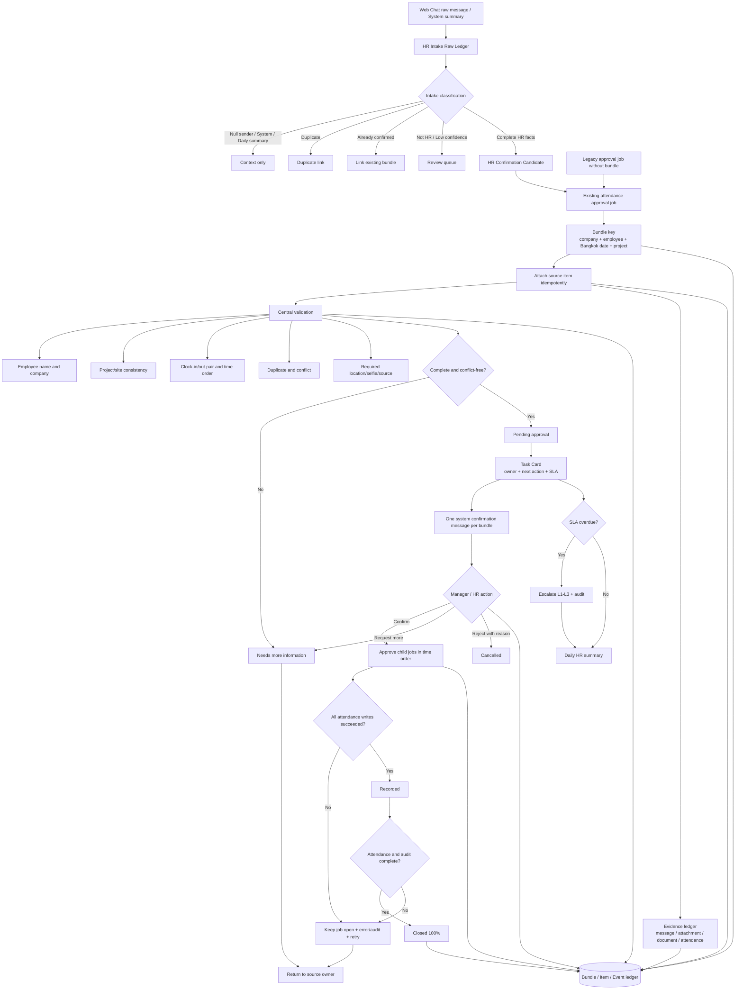

# HR Confirmation Bundle Flow

## Purpose

รวมข้อความลงเวลาเข้า/ออกและสรุป HR ที่เกี่ยวข้องให้เป็นงานเดียวตาม `บริษัท + ช่าง + วันที่ทำงานเขตเวลา Asia/Bangkok + โครงการ` เพื่อไม่ให้ผู้อนุมัติเห็นรายการเดี่ยวปะปน และยัง trace กลับไปยัง Web Chat, request code, room, approval job, attendance session และผู้ดำเนินการทุกขั้นได้

ก่อนสร้าง Candidate ทุกข้อความต้องผ่าน **HR Intake Gate** และถูกเก็บ Raw แบบแก้ย้อนหลังไม่ได้ก่อนเสมอ หน้าจอแสดง count ก่อนคัดเทียบกับ candidate หลังคัด พร้อมเหตุผลของรายการที่ถูกแยกออก โดย Raw ไม่ถูกลบ

## HR Intake Gate

- `pending`: รับ Raw แล้ว ยังไม่ตีความเป็นงาน
- `context`: System Confirmation และ Daily Summary เป็นบริบท ไม่สร้างงานใหม่
- ข้อความที่ระบบสร้าง (`sender_profile_id` ว่าง แม้ legacy row จะยังเป็น `user_message`) เป็น context และไม่สร้าง Operational Task/Omni source ใหม่
- ข้อความพัฒนา/UAT ที่มี keyword ชัดเจนและไม่มีคำ HR/ลงเวลา ถูกจัด `not_hr` อัตโนมัติพร้อมเหตุผล; ข้อความกำกวมยังคง `pending|low_confidence` เพื่อให้คนตรวจ
- `duplicate`: source/content ซ้ำและมี `duplicate_of_id`
- `already_confirmed`: ผูกกับ bundle/job ที่ยืนยันแล้ว ไม่สร้างซ้ำ
- `not_hr`: ไม่เกี่ยว HR รอผู้รับผิดชอบตรวจ
- `low_confidence`: ความมั่นใจต่ำกว่ากติกา รอตรวจ
- `candidate`: มี employee, work date, project, clock action, request code และ source reference ครบ
- `needs_more_info`, `rejected`, `confirmed`: ผล Action ขอข้อมูล/ปฏิเสธ/ยืนยัน Candidate

Gate บันทึก `raw_message_id`, channel, room, source reference, content snapshot, extracted payload, confidence, reason, duplicate link, approval job/bundle link และ event audit ทุก transition โดย unique `(company_id, source_channel, source_ref)` ป้องกันรับ Raw หรือสร้าง Candidate ซ้ำ

## Inputs and outputs

- **Input:** `chat_attendance_approval_jobs`, ผู้ส่ง/โปรไฟล์, `clock_in|clock_out`, เวลา, site/project, request code, room/message, GPS, Selfie และ validation เดิม
- **Output:** `hr_confirmation_bundles`, `hr_confirmation_bundle_items`, `hr_confirmation_evidence`, `hr_confirmation_bundle_events`, Task Card, Daily Summary, attendance session ที่ผ่าน approval และ System Confirmation หนึ่งข้อความต่อ bundle
- System MSG เป็น projection สำหรับยืนยัน/แจ้งผู้รับผิดชอบเท่านั้น ไม่ใช่ source ใหม่ และ `message_class=system_confirmation` ต้องถูกตัดออกจาก Omni Intake

## States

| State | ความหมาย | ทางออกที่อนุญาต |
| --- | --- | --- |
| `received` | รับ source item แล้ว | `under_review`, `needs_more_info`, `cancelled` |
| `under_review` | ตรวจ validation กลาง | `needs_more_info`, `pending_approval`, `cancelled` |
| `needs_more_info` | ข้อมูลไม่ครบ/ขัดแย้ง | กลับ `under_review` หลังมีข้อมูลเพิ่ม หรือ `cancelled` |
| `pending_approval` | ผ่าน validation รอผู้รับผิดชอบ | `approved`, `needs_more_info`, `cancelled` |
| `approved` | ผู้มีสิทธิ์ยืนยันแล้ว | `recorded`; ถ้าเขียนล้มเหลวคงเปิดงานและบันทึก error |
| `recorded` | child jobs ทุกตัวบันทึก attendance สำเร็จ | `closed` |
| `closed` | attendance และ audit gate ครบ 100% | terminal |
| `cancelled` | ปฏิเสธพร้อมเหตุผล | terminal; ไม่สร้าง attendance เพิ่ม |

## Validation contract

1. โปรไฟล์ช่างมีชื่อและเป็นสมาชิกบริษัทเดียวกับ bundle
2. source items ทุกตัวเป็นช่าง วัน และโครงการเดียวกัน
3. ต้องมี clock-in และ clock-out อย่างละหนึ่งรายการสำหรับการปิดชุดปกติ
4. `clock_in < clock_out`; เวลาเท่ากันหรือกลับลำดับเป็น conflict
5. request code/job/session ต้องไม่ซ้ำ และ child job ที่มี `duplicate_of_job_id` ถือเป็น conflict
6. site ต้องอยู่ใน project/company เดียวกัน; ข้อมูล GPS/Selfie และ missing fields ใช้กติกา approval เดิม
7. การกดซ้ำใช้ `bundle_key`, unique child `job_id` และ action idempotency key เดิม จึงคืนผลเดิมโดยไม่เขียน attendance หรือ System MSG ซ้ำ
8. ทุก child ต้องมี Evidence ชนิด `attendance_job`; ตอนปิด 100% ต้องมี `attendance_session_id` ครบตามจำนวน child และ source message/attachment/document ถูกเก็บเมื่อมีจริง

## Task Card, SLA and escalation

- Task Card หนึ่งใบต่อ Bundle แสดงช่าง วันที่ โครงการ สถานะ Owner, Next Action, Evidence, เวลาเข้า/ออก, conflict และ SLA
- Owner ต้องเป็นสมาชิก active ของบริษัทเดียวกัน; HR/Admin/Manager รับงานหรือมอบหมายผ่าน `assign_hr_confirmation_bundle` พร้อม idempotency key
- SLA เริ่ม 30 นาทีสำหรับงานรอตรวจ/อนุมัติ และ 4 ชั่วโมงเมื่อรอข้อมูลเพิ่ม; terminal state ไม่มี SLA
- งานเกิน SLA ถูกเพิ่ม `escalation_level` สูงสุด 3 พร้อม `sla_escalated` audit และกำหนด SLA รอบใหม่ ไม่เปลี่ยนผล attendance เอง
- `get_hr_confirmation_daily_summary` สรุปจำนวนรอตรวจ รอข้อมูล รออนุมัติ บันทึกแล้ว ปิดแล้ว เกิน SLA และ escalated ตามบริษัท/วันที่

## Evidence contract

- Evidence เก็บแบบ append/idempotent ใน `hr_confirmation_evidence` และอ้างกลับ `bundle_item_id`
- รองรับ source message ID, attachment bucket/path/name, Document Flow Item ID, Approval Job ID และ Attendance Session ID
- Evidence snapshot เก็บเฉพาะ metadata ที่จำเป็น เช่น request code, action, requested time, validation, channel และ classification reason; ไม่คัดลอกรหัสผ่าน/token
- Employee อ่าน Evidence ของตนเอง; HR/Manager อ่านเฉพาะบริษัทปัจจุบันผ่าน RLS และ client แก้ ledger โดยตรงไม่ได้

## Roles and permissions

- Employee เห็น bundle ของตนเองและ source/audit ที่ตนเกี่ยวข้อง แต่แก้ ledger โดยตรงไม่ได้
- Company manager/admin/HR เห็น bundle ในบริษัทและใช้ RPC Action เท่านั้น
- `anon` ไม่มี SELECT/EXECUTE; authenticated ถูกตรวจ `current_company_id()` และ `is_company_manager()` ภายใน RLS/RPC
- Tables เปิด RLS และ revoke direct insert/update/delete จาก client; backend functions ใช้ `SECURITY DEFINER` พร้อม auth/company guard และ fixed `search_path`

## Actions

- **ยืนยัน:** ตรวจ validation ซ้ำและ approve child jobs ตามเวลา; เปลี่ยนเป็น `recorded` เฉพาะเมื่อ attendance write ครบ
- **ขอข้อมูลเพิ่ม:** ต้องมีเหตุผล ส่งกลับ source owner และคง bundle เปิด
- **ปฏิเสธ:** ต้องมีเหตุผล เปลี่ยนเป็น `cancelled`; child jobs ที่ยังไม่บันทึกถูก reject
- **ปิด Job 100%:** ทำได้เฉพาะ `recorded`, child attendance ครบ, ไม่มี duplicate/conflict/missing fields และ audit events ครบ

## Integrations, failures and retries

- ใช้ approval RPC เดิมเป็นจุดเขียน attendance เพื่อไม่สร้างกติกาค่าแรงชุดที่สอง
- ถ้า child job ตัวใดล้มเหลว transaction ต้อง rollback ทั้ง action; bundle ไม่อ้างว่า recorded และ event เก็บ error/retry context
- System Confirmation ใช้ unique bundle/message projection; trigger เดิมแบบหนึ่งข้อความต่อ job ถูกแทนด้วย bundle projection
- Legacy open jobs ถูก reconcile ผ่าน function เดียวกันโดยไม่แก้ attendance ที่บันทึกแล้ว
- Migration reconciliation เปลี่ยนเฉพาะ Raw `pending` ที่พิสูจน์ได้ว่าเป็นข้อความจากระบบเป็น `context` พร้อม audit และเติม Bundle link ให้ approval job เดิมที่ยังไม่มี link แบบ idempotent

## Audit events

ขั้นต่ำฝั่ง Gate: `raw_received`, `intake_classified`, `candidate_confirmed`, `more_information_required`, `intake_rejected` และฝั่ง Bundle: `bundle_received`, `validation_completed`, `operational_gate_refreshed`, `owner_assigned`, `approval_requested`, `approval_granted`, `child_attendance_recorded`, `bundle_recorded`, `sla_escalated`, `bundle_rejected`, `bundle_closed_100_percent`, `action_failed`, `confirmation_sent|confirmation_failed` พร้อม actor, source, from/to state, idempotency key และ details

## Owner

- Workflow owner: HR / Company Admin
- Technical owner: WisdomAI platform

## Change record

| Version | Date | Rationale | Impact | Migration | Verification | Rollback |
| --- | --- | --- | --- | --- | --- | --- |
| v1.4 | 25/8/2569 | ปิด Raw pending ที่เป็นข้อความพัฒนา/UAT ชัดเจนโดยไม่กลบข้อความ HR ที่กำกวม | deterministic non-HR classification พร้อม confidence/reason/audit; ไม่ลบ Raw | `20260825073707_classify_obvious_non_hr_intake.sql` | HR contract, linked dry-run/apply, Gate count และ authenticated Cloudflare smoke | คืน classifier ก่อนหน้า; เก็บ not_hr audit ไว้และสามารถให้ผู้รับผิดชอบ reclassify ผ่าน RPC ได้ |
| v1.3 | 25/8/2569 | แก้ Production ที่ System attendance notifications ถูกนับเป็น Raw pending และ approval job เก่าขาด Bundle | กรอง null-sender/system output เป็น context, หยุด Omni loop, reconcile Raw พร้อม audit และ backfill Bundle link โดยไม่แตะ attendance | `20260825065812_reconcile_hr_intake_system_outputs.sql` | HR/Operational contract tests, linked dry-run/apply, counts ก่อน-หลัง, typecheck/lint/build และ authenticated Cloudflare smoke | คืน trigger classifier เดิม; Raw ที่ reconcile คง audit/context ไว้เพื่อไม่สร้างงานซ้ำ และไม่ rollback attendance/bundle evidence |
| v1.2 | 23/8/2569 | ทำ Bundle พร้อมใช้งานจริงด้วย Evidence, Task Card, Owner, Next Action, SLA, Escalation และ Daily Summary | เพิ่ม Evidence ledger/RLS, operational approval-close gate, assignment/escalation/summary RPC และ Task Card ในห้อง HR | Production migration `20260823122137_hr_confirmation_operational_readiness.sql` | fixture/contract/integration, RLS/idempotency, typecheck/lint/build และ linked migration dry-run | ปิด operational triggers/RPC/UI, เก็บ Evidence/Audit เดิมเพื่อย้อนตรวจ และคืนการอ่าน Bundle v1.1 โดยไม่ลบ Raw/Attendance |
| v1.1 | 23/8/2569 | ปรับ trigger ให้เรียก wrapper แบบปลอด recursion และเติม classification metadata ให้ local HR fixture/omni projection | Trigger sync, fixture classification reason/rule/model metadata และ confirmation retry guard คงที่ | Production migration `20260823122113_hr_confirmation_bundle.sql` | `test:hr-confirmation-bundle`, `scripts/document-flow-filter-consistency.test.ts`, lint, typecheck, build และ linked migration dry-run | คืน trigger call เดิมและตัด metadata enrichment ออก; ledger/audit และ raw เดิมไม่ต้องลบ |
| v1.0 | 23/8/2569 | เพิ่ม Intake Gate เก็บ Raw pending ก่อนคัด และรวม attendance/HR summary เป็นชุดต่อช่าง/วัน/โครงการ | Raw/gate audit + Bundle ledger, child mapping, approval RPC, System Confirmation projection และ HR queue | Production migration `20260823122113_hr_confirmation_bundle.sql` | Local fixture เห็น Raw จำนวนมากเหลือเฉพาะ candidate, normal/missing/duplicate/conflict/reject/idempotency/RLS, typecheck/lint/build และ linked migration dry-run | ปิด gate/bundle trigger/RPC/UI และคืน individual confirmation projection; เก็บ Raw/ledger/audit และ attendance เดิม ห้ามลบ |
