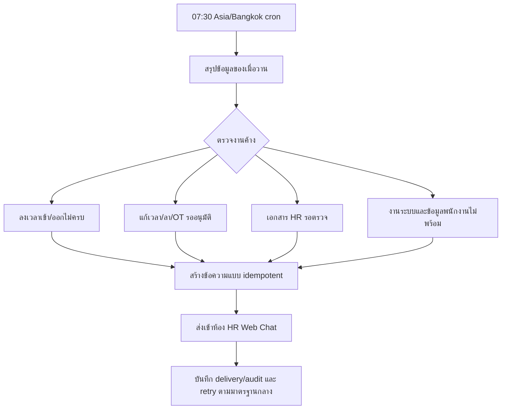

# HR Morning Status Summary Flow

ทุกวันเวลา 07:30 ระบบสรุปสถานะของวันก่อนหน้าในขอบเขตบริษัท แล้วส่งข้อความเข้า HR Web Chat ห้องเดิมที่ตั้งเป็น integration `attendance` โดยไม่ส่งข้อมูลส่วนบุคคลเกินความจำเป็น

## Inputs / Outputs

- Input: attendance sessions, attendance correction requests, leave requests, overtime approvals, employee document requests, company system work items, employee readiness.
- Output: ข้อความสรุป 1 รายการต่อบริษัทต่อวันใน `chat_messages` และ `chat_hr_delivery_events`.
- State: pending → sent หรือ failed → retry ตาม delivery flow.

## Roles / Permissions / Integrations

- Cron ใช้ service role; ผู้ใช้อ่านได้ตามสิทธิ์ห้อง HR เดิม.
- ใช้ `deliver_hr_work_chat_event` และห้องที่มี `chat_room_integrations.integration_key = attendance`.
- ไม่เปิด LINE ภายนอกโดยอัตโนมัติ.

## Failure / Retry / Audit

- ไม่มีห้อง HR: ไม่สร้างข้อความและไม่ทำให้ข้อมูลต้นทางล้ม.
- ส่งไม่สำเร็จ: เก็บ `failed`, `error_message`, `next_retry_at`; worker เดิม retry.
- event key deterministic ป้องกันข้อความซ้ำ.

## Owner

HR เป็นเจ้าของการตรวจรายการค้าง; Admin/Manager เป็นผู้อนุมัติรายการที่มีผลต่อค่าแรง; System Operations ดูแล cron และ delivery health.

## Change record

| Version | Date | Change | Migration | Verification | Rollback |
|---|---|---|---|---|---|
| v1.0 | 22/08/2569 | เพิ่มสรุป HR เวลา 07:30 สำหรับงานค้างของเมื่อวานและความพร้อมวันนี้ | `202608220003_hr_morning_status_summary.sql` | migration, SQL smoke, lint, build | unschedule cron/drop function; ไม่ลบ audit/message เดิม |
