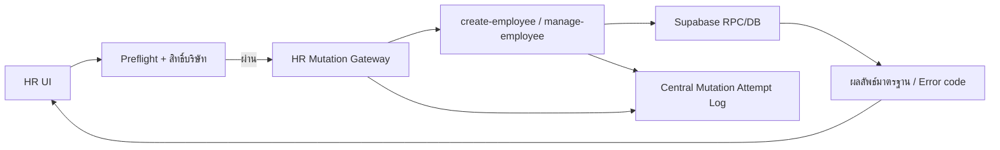

# HR Mutation Center Flow v1.0 — 20/8/2569

## ขอบเขต

คำสั่งเปลี่ยนข้อมูลของ Modul HR ต้องผ่าน `invokeHrMutation` เป็นจุดเรียกกลางของ Frontend ก่อนส่งต่อไปยัง Edge Function และต้องบันทึกผลผ่าน `globalMutationAttemptStore` → `register_mutation_attempt` (สำรอง `app_activity_logs`) รวมถึงการแก้ Email/ตั้ง Password ผ่าน `manage-employee-account`

- Inputs: payload ของ create employee หรือ action ของ manage employee
- States: pending → success/error
- Roles: company admin, executive, site supervisor ตาม action; platform admin ใช้สิทธิ์ส่วนกลางตามนโยบาย
- Failure/retry: หยุดเมื่อ preflight ไม่ผ่าน, เก็บ error code/detail/action และไม่ retry อัตโนมัติแบบวนลูป
- Owner: HR Module + Central Mutation Attempt Center
- Rollback: ถอด gateway แล้วคืนการเรียก Edge Function เดิมได้ โดยไม่กระทบข้อมูลที่บันทึกแล้ว

## Employee Resignation Lifecycle v1.1 — 20/8/2569

การแจ้งลาออกแยกวันที่ออกเป็น 3 ค่าเพื่อไม่ให้สิทธิ์, การลงเวลา และค่าแรงปนกัน:

- `last_working_on`: วันสุดท้ายที่พนักงานยังทำงาน/ลงเวลาได้
- `status_effective_on`: วันที่ตัดสิทธิ์เข้าใช้งาน ปกติคือ `last_working_on + 1`
- `payroll_eligible_until`: วันสุดท้ายที่นำเวลา/รายการมาคิดค่าแรง รองรับกรณีย้อนหลัง เช่น บันทึกวันที่ 25 แต่คิดเงินถึงวันที่ 16
- การปิด membership/site assignment ใช้วันที่เทคนิคที่ไม่ขัดกับ `starts_on` ของ record (`ends_on >= starts_on`) เพื่อรองรับการลาออกย้อนหลังที่ถูกบันทึกหลังสร้างสมาชิกแล้ว แต่ค่า HR จริงยังเก็บใน `last_working_on/status_effective_on/payroll_eligible_until`

สถานะการลาออก:

- บันทึกล่วงหน้า: `employment_status=notice`, `resignation_status=pending`, membership ยัง active แต่มี `ends_on=last_working_on`
- มีผลแล้วหรือย้อนหลัง: `employment_status=terminated`, `resignation_status=effective`, membership/site assignment ถูกปิดตามวันที่สิ้นสภาพ
- วันที่ตัดสิทธิ์ต้องเป็นวันถัดจากวันสุดท้ายทำงานหรือหลังจากนั้น เพื่อให้พนักงานยังใช้งาน/ลงเวลาได้จนจบวันสุดท้ายตามจริง
- Payroll ไม่ลบ attendance เดิม และบันทึก `payroll_eligible_until` ไว้เป็น cutoff กลาง; การเปลี่ยนสูตร `generate_pay_period` ต้อง deploy เป็น migration แยกเพราะมีผลทางการเงิน
- หน้า Employees แยก filter รายชื่อเป็น `พนักงานปกติ`, `พนักงานลาออก`, และ `รวมพนักงานทั้งหมด`

สิทธิ์:

- Company Admin, Executive, Site Supervisor และ Platform Admin จัดการลาออกได้
- ห้ามจัดการบัญชีตัวเอง
- การลาออกเป็น company-local ไม่ปิด membership ของบริษัทอื่น
- ผู้ดูแลบริษัทต้องยังเห็น profile ของพนักงานที่ลาออก/ปิด membership แล้วในบริษัทเดิม เพื่อให้แท็บลาออกและ audit ตรวจสอบย้อนหลังได้

Audit:

- บันทึก `employee_workforce_audit_logs` พร้อม `old_values/new_values`
- การลาออกต้องเขียน Audit หลังอัปเดต employment record แต่ก่อนปิด membership/site assignment เพื่อให้ trigger tenant ยังตรวจ profile ที่ active ได้ถูกต้อง
- Mutation Attempt Center เก็บ payload วันที่และผลลัพธ์ของคำสั่งทุกครั้ง
