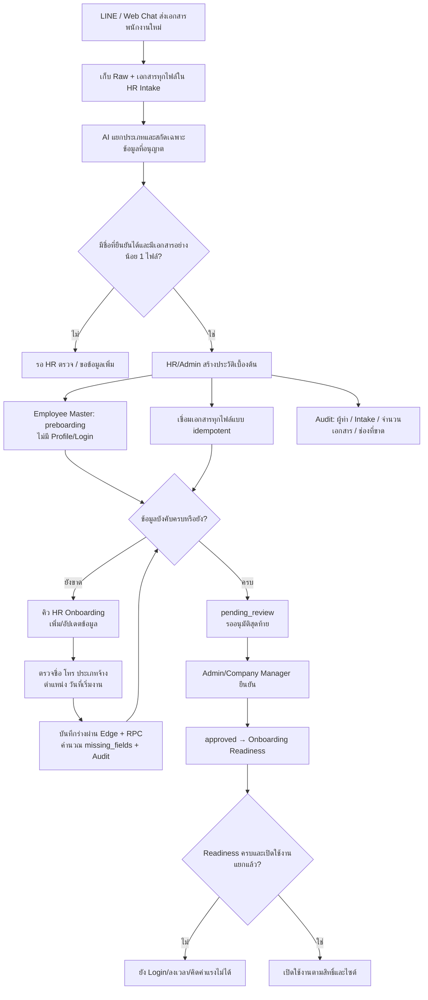
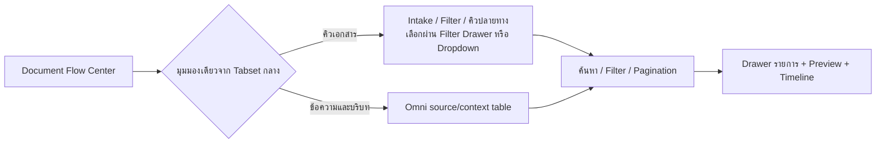
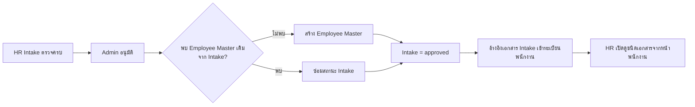
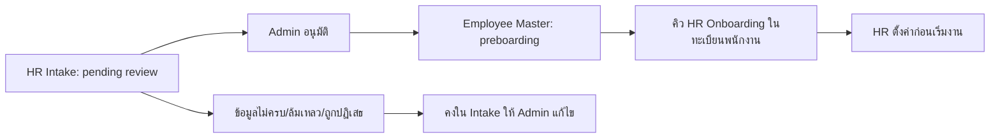
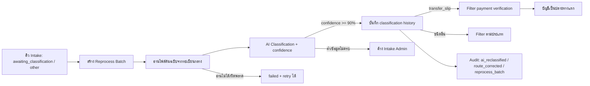
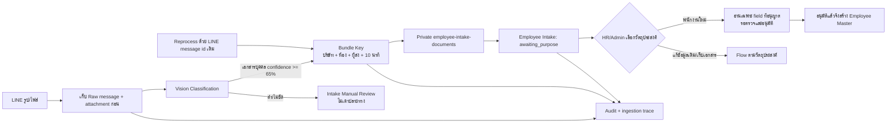

# Intake Case: ความสัมพันธ์ข้อความ ไฟล์ และเอกสาร

เอกสารหลักสำหรับปรับ Intake ให้ตีความ “ชุดการสนทนา” ไม่ใช่รับไฟล์โดด ๆ

```mermaid
flowchart LR
  A[LINE / Web Chat / Upload] --> O[Omni Intake Source Registry]
  O --> P[Conversation Analyzer\nType / Intent / Summary]
  P --> Q{ซ้ำข้ามช่องทางหรือไม่}
  Q -->|ซ้ำ| R[เลือก Primary Source\nอีกขาเป็น context/duplicate]
  Q -->|ไม่ซ้ำ| B[Source Message]
  R --> B
  B --> C[Source Attachment: รูป / PDF / ไฟล์]
  B --> D[Context ก่อน-หลัง: ห้อง ผู้ส่ง เวลา ข้อความ]
  C --> E[Intake Case]
  D --> E
  E --> F{จับคู่มั่นใจ ≥ 90%?}
  F -->|ใช่| G[AI ตีความข้อความ + ไฟล์]
  F -->|ไม่ใช่| H[Admin Drawer: รวม / แยก / ย้าย / ยืนยัน]
  H --> G
  G --> I[Document Flow Item เดียวหรือหลายรายการ]
  I --> J[Intake Quality Gate]
  J -->|ผ่าน| K[Filter: จัดประเภทและปลายทาง]
  J -->|มีปัญหา/ซ้ำ| L[ค้าง Intake Admin]
  G --> N{เป็นเอกสารบุคคลหรือไม่}
  N -->|ใช่ มั่นใจ >= 65%| O2[คัดลอกไฟล์เข้า Private HR Intake\nรวมชุดตามห้อง + ผู้ส่ง + 10 นาที]
  N -->|ใช่ แต่ไม่มั่นใจ| L
  O2 --> P2[awaiting_purpose\nHR/Admin ตรวจเอกสาร]
  K --> M[คิวแผนกปลายทาง]
```

## Employee Intake สองขั้น — v1.5 (25/8/2569)

- Input คือชุดเอกสารต้นฉบับจาก Intake; ระบบเก็บ Raw และทุกไฟล์ไว้เสมอ ไม่เลือกแสดงหรือผูกเพียงไฟล์แรก
- การสร้างประวัติเบื้องต้นต้องมีชื่อที่ยืนยันได้และเอกสารอย่างน้อยหนึ่งไฟล์ แต่ยอมให้ประเภทการจ้างเป็น `unknown` ชั่วคราว
- Output ขั้นแรกคือ `employee_people.employee_status=preboarding`, `profile_id=null` และทะเบียนเอกสารที่เชื่อมครบทุกไฟล์ จึงยังไม่มี Login, สิทธิ์ลงเวลา, ไซต์ หรือรายการค่าแรง
- สถานะ Intake คง `information_required` ตราบใดที่ยังมี `missing_fields`; เปลี่ยนเป็น `pending_review` เมื่อข้อมูลครบ และเป็น `approved` หลังผู้มีสิทธิ์ยืนยันสุดท้ายเท่านั้น
- สิทธิ์สร้าง/อนุมัติใช้ Admin ระดับระบบหรือ Company Admin/Executive/Manager ในบริษัทเดียวกัน ผ่าน Edge Function และ RPC service-role เท่านั้น
- การกดซ้ำใช้ `source_intake_id` และ unique document link เป็น idempotency key; ไม่สร้างพนักงานหรือเอกสารซ้ำ และทุกการสร้าง/เชื่อมเขียน Workforce Audit
- Failure แสดงสาเหตุเฉพาะ: ไม่มีชื่อ, ไม่มีเอกสาร, สถานะปิดแล้ว, ข้อมูลยังไม่ครบ หรือสิทธิ์ไม่พอ; ผู้ใช้แก้ข้อมูลแล้ว retry รายการเดิมได้
- Owner: HR/Admin เป็นเจ้าของการเติมข้อมูลและอนุมัติ; Platform Admin เป็นเจ้าของ schema/RPC และ recovery
- หน้า `/employees` เป็นจุดทำงานของ HR: ปุ่ม `เพิ่ม / อัปเดตข้อมูล` เปิดร่างเดิมจาก Employee Master, ตรวจค่าก่อนส่ง, บันทึกผ่าน Edge Function/RPC กลาง และอ่านผล `remaining_fields` กลับมาแสดง ห้ามเขียนตารางตรงจากหน้าเว็บ
- Retry ใช้ `source_intake_id` เดิม จึงอัปเดตพนักงานเดิมและเขียน Audit ใหม่โดยไม่สร้าง Employee/เอกสารซ้ำ; ถ้าล้มเหลว transaction จะ rollback ทั้ง Employee, Intake state และ Audit

### Change record

| Version | Date | Rationale | Impact | Migration | Verification | Rollback |
| --- | --- | --- | --- | --- | --- | --- |
| v1.5 | 25/8/2569 | ให้ HR เติมข้อมูลที่ขาดจากคิว Onboarding ได้จริงโดยไม่ย้อนกลับไปแก้ฐานข้อมูล | เพิ่มฟอร์มร่าง, validation, readiness projection และ audit; ยังคงไม่มี Profile/Login/ลงเวลา/ค่าแรง | `20260825212911_employee_intake_preboarding_update.sql` | contract, typecheck, lint, build, migration dry-run/apply, Edge และ authenticated `/employees` smoke | ซ่อนปุ่ม/ฟอร์มและคืน Edge/RPC; ข้อมูลร่างล่าสุดและ Audit คงไว้เพื่อ recovery |
| v1.4 | 25/8/2569 | ให้เริ่มทะเบียนพนักงานจากเอกสารที่ยืนยันได้โดยไม่เดาข้อมูลที่ขาด | เพิ่มปุ่มสร้างประวัติเบื้องต้น, preview ทุกไฟล์, final approval gate และ audit; ไม่เปิดสิทธิ์ใช้งาน | `20260825203000_employee_intake_preboarding_draft.sql` | contract, intake routing, typecheck, lint, build, linked dry-run/apply และ authenticated UI/Data smoke | revert UI/Edge/RPC; เปลี่ยนประวัติเบื้องต้นเป็น archived ได้โดยเก็บ Intake/เอกสาร/Audit เพื่อ recovery ห้ามลบ Raw |

## หลักข้อมูล

- `Intake Case` เป็นหัวชุดการสนทนา; ไม่สร้างเอกสารใหม่เมื่อย้ายห้อง
- `intake_case_messages` เก็บข้อความหลักและข้อความบริบท พร้อมวิธี/คะแนนการจับคู่
- `intake_case_attachments` เก็บทุกไฟล์ในชุด พร้อมสถานะไฟล์หลัก/ประกอบ/ซ้ำ
- `document_flow_items.intake_case_id` เชื่อมเอกสารที่สร้างจากชุดนั้น; 1 Case มีหลาย Document Flow Item ได้
- `direct_attachment` = 100%, `same_sender_time_window` และ `ai_context_match` ต้องระบุคะแนนและเหตุผล
- คะแนนต่ำกว่า 90% ให้ `needs_review`; ห้ามส่ง Filter ก่อน Admin ยืนยัน

## กติกาการจับคู่

1. ไฟล์ที่แนบกับข้อความเดียวกัน: ผูกอัตโนมัติเป็น primary
2. ข้อความห้องเดียวกัน/ผู้ส่งสัมพันธ์กันในช่วงเวลา: เพิ่มเป็น context โดย AI เสนอเท่านั้น
3. Admin สามารถรวม Case, แยก Case, ย้ายไฟล์, เลือกไฟล์ต้นฉบับ และล็อกผล (`manual_confirmed` / `locked`)
4. ทุกการแก้ความสัมพันธ์ต้องเขียน event พร้อมผู้ทำ เหตุผล และ version

## Backfill

- สร้าง Case จาก `document_flow_items.source_message_id` ที่อ้างอิง LINE ได้
- เติมชื่อห้อง ผู้ส่ง เวลา และไฟล์จากข้อมูลต้นฉบับ
- ถ้าพิสูจน์ต้นทางไม่ได้ เก็บ `source_channel=unknown`; ไม่เดาและไม่แก้ทับข้อมูลเดิม
- Telegram/Web Chat จะใช้ Case โครงสร้างเดียวกันเมื่อ ingestion บันทึก source message/attachment เข้าทะเบียนกลาง

## Intake Search Standard — v1.1 (19/8/2569)

- ตัวกรอง Intake ต้อง query ฝั่งฐานข้อมูล ไม่กรองเฉพาะแถวที่หน้าเว็บโหลด
- ขั้นต่ำต้องค้นได้ตามช่องทาง (`LINE`, `Telegram`, `Web Chat`, `unknown`) และวันที่รับเข้า
- การเลือก “วันนี้ + LINE” ใช้ `source_channel=line` และช่วง `source_received_at` ของวันนั้น
- ข้อมูลผลลัพธ์ยังแยกตามห้อง ผู้ส่ง สถานะ และคุณภาพได้จากทะเบียนกลาง
- การเปลี่ยนแปลงนี้ไม่แก้ข้อมูลต้นฉบับ; รายการที่ไม่มี source metadata ยังคงแสดงเป็น `unknown`

## Source Preview Standard — v1.2 (19/8/2569)

- ปุ่ม “ดูเอกสาร” และ “เปิดรูป/เอกสารต้นฉบับ” ใน Intake ต้องใช้ Preview กลางเดียวกัน
- Document Flow ใช้ `document_flow_item_preview` หาไฟล์จาก source message; Intake HR ใช้ `employee_intake_documents`
- ระบบสร้าง signed URL ชั่วคราวและแสดงไฟล์ใน Drawer เดิม ไม่พาไปหน้ารวมที่ไม่รู้ว่าเปิดรายการใด
- ถ้าไม่มีไฟล์หรือไม่มีสิทธิ์ ต้องแสดงสาเหตุที่ตรวจสอบได้แก่ผู้ใช้ทันที

## Global Flow Scope and Preview — v1.3 (19/8/2569)

### Document Flow Center single-tabset contract — v2.9 (23/8/2569)

- `DocumentFlowsPage` เป็นเจ้าของ Tabset เพียงชุดเดียว มี 2 มุมมอง: `คิวเอกสาร` และ `ข้อความและบริบท`
- `IntakeRoomPanel` เป็นตารางคิวเอกสารเท่านั้น ห้าม render Tabset ซ้ำเมื่อถูก mount ใต้ศูนย์กลาง
- การเลือกแผนกปลายทางเป็น Dropdown ในมุมมองคิวงานปลายทาง ไม่ใช่ Tabset ชั้นที่สอง
- ค่า `document_view`, ตัวกรองกลาง, จำนวน, pagination และสิทธิ์ยังคงมาจาก state/gateway เดิม
- สลับมุมมองเปลี่ยนเฉพาะ content ที่แสดง; ไม่สร้างรายการหรือเปลี่ยน state transition

### ตัวกรองกลาง

- หน้า `Document Flow Center` เป็นเจ้าของตัวกรองกลางเพียงชุดเดียว และส่งชุดเดิมไปยัง Intake, Filter และคิวปลายทาง
- ขอบเขตประกอบด้วย: วันที่รับเข้าต้นทาง, ช่องทาง, ห้องต้นทาง, ผู้ส่ง, ประเภทไฟล์ และโครงการ
- วันที่หมายถึง `source_received_at` (หรือเวลา source เดิมที่เทียบเท่า) ไม่ใช่ `updated_at`; จึงติดตามได้ว่าของที่รับเข้าวันนี้กองอยู่ขั้นใด
- Query, จำนวนบน Main Tab, sub-queue count และรายการตารางคำนวณที่ฐานข้อมูลจาก scope เดียวกันก่อนแบ่งหน้า
- URL เก็บค่า `channel`, `received_date`, `source_room`, `source_sender`, `file_kind`, `project` เพื่อเปิดลิงก์เดิมแล้วเห็นชุดข้อมูลเดิม
- เมื่อเปิดศูนย์เส้นทางเอกสารโดยไม่มี `received_date` ระบบเริ่มที่วันทำการปัจจุบันของเวลา Bangkok เพื่อลดข้อมูลที่ต้องโหลด; ปุ่มด้านบนเลือก `วันนี้` หรือ `ทั้งหมด` ได้ทันที และตัวกรองอื่นยังใช้ข้ามทุก Tap ชุดเดิม

### Preview ที่ตรวจสอบได้

- Preview ดึง signed URL แยกทีละไฟล์จากทะเบียนกลาง และแสดงทุกไฟล์ที่เปิดได้
- รูปแสดงด้วย image renderer, PDF/ชนิดอื่นแสดงด้วย viewer; ผู้ใช้เปิดแท็บใหม่ได้จาก signed link เดียวกัน
- RPC/Storage exception ทุกแบบต้องแสดงข้อความผิดพลาดใน Drawer; ไม่ปล่อยให้ Drawer ว่างโดยไม่ทราบสาเหตุ
- Signed URL อายุ 10 นาที และไม่บันทึกลงฐานข้อมูลหรือ URL ของหน้า

## Change record

| Version | วันที่ | เหตุผล/ผลกระทบ | Migration | การย้อนกลับ |
|---|---|---|---|---|
| v1.3 | 19/8/2569 | ทำให้ตรวจข้อมูลชุดเดียวกันข้ามทุก Tap และเปิดไฟล์ต้นฉบับได้ตรวจสอบได้ | `202608190014_document_flow_global_scope.sql` | ย้อนหน้า UI และคืน RPC signature เดิมจาก migration `009/011`; ข้อมูลต้นฉบับไม่ถูกแก้ |
| v1.4 | 19/8/2569 | แก้ signed link ของไฟล์ LINE ที่ถูก Storage policy แบบ restrictive บล็อก | `202608190015_line_attachment_preview_storage_policy.sql` | ลบ policy `Company members view LINE attachment storage`; ไม่มีผลต่อไฟล์ |
| v1.5 | 19/8/2569 | เพิ่มประเภทบิลเงินสดและการผูกเอกสาร Filter กับโครงการ/งานย่อยหลายชั้น โดยแยก audit event จากการส่งต่อ | `202608190016_cash_receipt_and_work_packages.sql` | ซ่อน UI งานย่อยและหยุดใช้ชนิดใหม่ได้ โดยไม่ลบรายการเดิม |
| v1.7 | 19/8/2569 | ยุบตัวกรองกลางเป็น Drawer จากไอคอน และทำให้จำนวนบน Intake สะท้อนรายการที่แสดงจริงหลังตัวกรอง | ไม่มี migration | คืนแผงตัวกรองเดิม; ไม่เปลี่ยนข้อมูลหรือ URL |
| v1.8 | 20/8/2569 | เพิ่มสถานะคุณภาพข้อมูลกลางและเปิดตรวจซ้ำเฉพาะงานปลายทางที่ได้รับผลกระทบ | `202608200001_document_flow_data_review_status.sql` | ปิด UI และหยุดเปลี่ยนสถานะใหม่; สถานะ/audit ที่มีอยู่ยังอ่านได้ |
| v1.9 | 20/8/2569 | แก้กฎสถานะทะเบียนกลางให้รองรับงานหลายปลายทางที่กำลังดำเนินการ (`destination_in_progress`) โดยยังคง Intake ID/ไฟล์/Audit ชุดเดียว | `20260820082024_document_flow_multi_destination_state_fix.sql` | ปิดการ route หลายปลายทางชั่วคราว; ไม่ลบ task หรือ event เดิม |
| v2.0 | 20/8/2569 | แยก Intake ตามช่องทางรับเข้า และแสดงบริบท LINE จากทะเบียนกลาง (เวลา/ห้อง/ชนิด/ข้อความหรือไฟล์/ผล AI) พร้อมทำให้จำนวน Flow ใช้รายการครบ scope เดียวกับตาราง | ไม่มี migration | คืน UI tab/column เดิม; ไม่เปลี่ยนข้อมูลต้นฉบับ |
| v2.3 | 20/8/2569 | ลด UI ที่ซ้ำใน Document Flow Center: ตัดชื่อ/คำอธิบายหน้า, ตัวเลือกคิวย่อยข้าง Main Tap และตัวกรองห้อง/สถานะ/ต้นทางที่ซ้ำจาก Intake; คง Main Tap, Tap ช่องทางรับเข้า และ Drawer ตัวกรองกลาง | ไม่มี migration | คืนองค์ประกอบ UI เดิมได้; ไม่เปลี่ยนข้อมูล, routing หรือ audit |
| v2.4 | 20/8/2569 | เปลี่ยน Tap 3 เป็นคิวแผนก: แสดง Subtab บัญชี, จัดซื้อ, สต็อก/รับสินค้า, HR, โครงการ และเอกสารอ้างอิง พร้อมจำนวน โดยเอกสารหลายปลายทางแสดงได้ทุกแผนกที่เกี่ยวข้อง | ไม่มี migration | คืนตารางรวมแบบเดิมได้; ไม่เปลี่ยน task, routing หรือ audit |
| v2.5 | 20/8/2569 | ปุ่ม PDF ของตารางศูนย์เอกสารดาวน์โหลดไฟล์ PDF โดยตรง แทนการเปิดหน้าสั่งพิมพ์ | ไม่มี migration | คืน implementation การพิมพ์เดิมได้; ไม่เปลี่ยนข้อมูลหรือ audit |
| v2.6 | 20/8/2569 | แก้ PDF หน้าว่าง โดยให้ renderer จับรายงานใน viewport และใช้หน้ากากระหว่างสร้างไฟล์ | ไม่มี migration | คืนตำแหน่ง renderer เดิมได้; ไม่เปลี่ยนข้อมูลหรือ audit |
| v2.7 | 20/8/2569 | แยกข้อมูลธุรกรรมสลิปใน Intake: ต้นทางไฟล์แยกจากผู้โอน/ผู้รับ/ธนาคาร และเก็บเลขบัญชีเฉพาะ 4 ตัวท้าย | `20260820164102_transfer_slip_payment_parties.sql` | ซ่อนคอลัมน์/Drawer และหยุดบันทึก field ใหม่ได้; ข้อมูลเดิมไม่ถูกลบ |
| v2.8 | 21/8/2569 | เพิ่มงานอ่านสลิปย้อนหลังแบบเป็น batch สำหรับ Admin เพื่อเติมข้อมูลคู่โอนจากไฟล์ต้นฉบับเดิม โดยไม่สร้าง Intake ซ้ำหรือเปลี่ยนเส้นทางงาน | ไม่มี migration | หยุดเรียก Edge Function และซ่อนปุ่ม; ผลที่บันทึกแล้วคงเป็น Audit อ่านย้อนหลังได้ |
| v2.9 | 23/8/2569 | แก้ Tab ซ้อนใน Document Flow Center ให้เหลือ Tabset เดียว 2 มุมมอง และย้ายตัวเลือกแผนกปลายทางเป็น Dropdown โดยไม่เปลี่ยน Flow/สิทธิ์/ข้อมูล | ไม่มี migration | คืน Tabset เดิมได้โดยไม่แก้ข้อมูลหรือ Audit |
| v2.9 | 21/8/2569 | กำหนด auto-route สลิปที่ผ่าน Intake Quality Gate เข้า Filter ตรวจสอบการโอนของบัญชี และซ่อมเส้นทางสลิปเดิมผ่านกฎเดียวกัน | `20260820222343_transfer_slip_auto_routing.sql` | ปิด trigger/คืน route เดิมได้; ไม่ลบ Intake ID ไฟล์ หรือ Audit |
| v3.0 | 21/8/2569 | ส่งสลิปที่ผ่าน Intake จาก Filter เข้าห้องบัญชี (Tap 3) อัตโนมัติ พร้อมสร้าง destination task กลาง | `20260820223637_transfer_slip_auto_dispatch_accounting.sql` | ปิด trigger/คืนรายการเข้า Filter ผ่าน workflow กลาง; ไม่ลบ Intake ID ไฟล์ task หรือ Audit |
| v3.1 | 21/8/2569 | แสดงรายละเอียดคู่โอนของสลิปใน Drawer คิวบัญชีจากทะเบียนกลางโดยไม่คัดลอกข้อมูล | ไม่มี migration | ซ่อนส่วนรายละเอียดใน Drawer; ไม่มีข้อมูลถูกแก้ |
| v3.2 | 21/8/2569 | เมื่อชื่อผู้รับสลิปตรงกับพนักงานรายวันในบริษัทเดียวกัน ให้คงบัญชีและสร้างคิว HR เพิ่มแบบ audit-safe | `20260820231427_transfer_slip_daily_employee_hr_routing.sql` | ปิด trigger/function; task HR ที่สร้างแล้วให้ Admin ยกเลิกตาม workflow ไม่ลบ Audit |
| v3.3 | 22/8/2569 | เพิ่ม Omni Channel Intake/OutTake ให้ LINE และ Web Chat เข้า registry กลาง วิเคราะห์บทสนทนา สรุป ส่ง Filter และกันซ้ำข้ามช่องทางก่อนส่งปลายทาง | `202608220002_omni_channel_intake_outtake.sql` | ปิด trigger `omni_register_*`; ข้อมูล LINE/Web Chat/Document Flow เดิมไม่ถูกลบ |
| v3.4 | 23/8/2569 | ตั้งค่าเริ่มต้นของศูนย์เส้นทางเอกสารเป็นรายการรับเข้าวันนี้ตามเวลา Bangkok เพื่อลดเวลาโหลด และเพิ่มปุ่ม วันนี้/ทั้งหมดบนพื้นที่ Header; ตัด Drawer ตัวกรองกลางที่ซ้ำออก | ไม่มี migration | กด “ทั้งหมด” เพื่อคืนขอบเขตทุกช่วงเวลา; ไม่มีข้อมูลหรือเส้นทางงานถูกแก้ |

## Compact Queue Navigation — v2.3 (20/8/2569)

## HR Intake Approval → Employee Master Attachments — v3.4 (22/8/2569)

- งาน HR Intake ที่อนุมัติแล้วไม่ส่งไฟล์ซ้ำหรือสร้าง Intake ID ใหม่: บันทึกลิงก์เอกสารต้นทางลง `employee_person_documents` ของ Employee Master
- หากเคยสร้าง Employee Master สำเร็จ แต่ update Intake ล้มเหลว ระบบจะ repair ให้ Intake เป็น `approved` และเติมเอกสารที่ขาดเมื่อกดอนุมัติซ้ำหรือระหว่าง migration reconciliation
- สิทธิ์อ่านลิงก์/ไฟล์เป็นของ Admin/Manager บริษัทเดียวกันเท่านั้น; Storage ของเอกสารยัง private เหมือนเดิม

### Approved Employee Intake exits Intake → HR Onboarding (v3.5, 22/8/2569)

- `approved` และ `cancelled` ไม่ใช่คิว Intake ที่ต้องทำงานต่อ จึงไม่แสดงและไม่นับใน Intake Room หรือจำนวน Main Tap
- `approved` ไปอยู่ Employee Master สถานะ `preboarding` ซึ่งเป็นคิว HR Onboarding ที่หน้าพนักงาน; Intake ID และไฟล์เดิมยังอ้างย้อนกลับได้
- สถานะเก่าที่มี Employee Master แล้วแต่ Intake ไม่ใช่ `approved` จะถูก reconcile แบบ idempotent โดยไม่สร้างพนักงานหรือไฟล์ซ้ำ
- Owner: Admin อนุมัติ; HR ดำเนินการตั้งค่าก่อนเริ่มงาน; Audit อนุมัติเดิมและเวลา update คงอยู่

| Version | วันที่ | เหตุผล/ผลกระทบ | Migration | การย้อนกลับ |
|---|---|---|---|---|
| v3.4 | 22/8/2569 | เชื่อมอนุมัติ HR Intake กับทะเบียนพนักงานและเอกสารแนบ พร้อมซ่อมข้อมูล partial approval เดิม | `20260822001621_employee_intake_approval_document_link.sql` | ปิด UI registry/คืน RPC เดิมได้ โดยไม่ลบไฟล์หรือ Employee Master |
| v3.5 | 22/8/2569 | ย้ายความหมายของ HR Intake ที่อนุมัติแล้วออกจากคิวรับเข้า ไปคิว HR Onboarding ใน Employee Master และให้จำนวน Intake นับเฉพาะงานที่ยังต้องดำเนินการ | `20260822005245_employee_intake_approved_exit_to_onboarding.sql` | คืน query/count ให้แสดง approved ใน Intake ได้; Employee Master/ไฟล์/Audit ไม่ถูกลบ |

- หน้าศูนย์เอกสารแสดงเฉพาะ Main Tap เพื่อเลือกขั้นตอนงาน และ Tap ช่องทางรับเข้าใน Intake เพื่อเลือกเส้นทางที่เข้ามา
- ตัวกรองละเอียดใช้ Drawer กลางจากไอคอนด้านขวาบนเพียงจุดเดียว จึงใช้ขอบเขตเดียวกันกับ Intake, Filter และคิวปลายทาง
- ไม่มีตัวกรองซ้ำในแถบตาราง Intake; การตัด UI นี้ไม่เปลี่ยนรายการที่โหลดหรือการนับจำนวน

## Department Destination Queues — v2.4 (20/8/2569)

- Tap 3 แยกงานตามแผนกผู้รับผิดชอบ ไม่แยกตามชนิดเอกสาร เพื่อให้แต่ละทีมเห็นเฉพาะงานของตน
- Subtab คือ ทุกแผนก, บัญชี, จัดซื้อ, สต็อก/รับสินค้า, HR, โครงการ และเอกสารอ้างอิง; จำนวนในแต่ละ Subtab นับรายการที่ถูกมอบหมายไปยังแผนกนั้น
- เอกสารหลายปลายทางยังใช้ Intake ID และไฟล์ต้นฉบับชุดเดียว แต่จะแสดงในทุก Subtab ของแผนกที่ได้รับมอบหมาย
- ประเภทเอกสารและสถานะยังกรองต่อภายในแผนกได้จากแถบตาราง

## Direct PDF Export — v2.6 (20/8/2569)

- ไอคอน PDF บนตารางของ Document Flow Center สร้างและดาวน์โหลด `.pdf` จากรายการที่อยู่ใน scope/สิทธิ์/คอลัมน์ที่ผู้ใช้เลือก ณ ขณะนั้นโดยตรง
- ไม่เปิดหน้าต่างใหม่และไม่เรียกหน้าสั่งพิมพ์; หากสร้างไม่ได้ จะแจ้งข้อผิดพลาดและผู้ใช้กดลองใหม่ได้
- มาตรฐานรายละเอียดของตารางกลางอยู่ที่ `docs/STANDARD_DATA_TABLE_FLOW.md`; export event ยังคงบันทึก `export_data` ที่ส่วนกลาง
- ระหว่างสร้างไฟล์ จะแสดงหน้ากาก “กำลังสร้างไฟล์ PDF…” เพื่อเก็บ renderer ไว้ใน viewport โดยไม่แสดงรายงานชั่วคราวบนหน้าจอ; วิธีนี้ป้องกัน PDF หน้าว่าง

## Transfer Slip Parties — v2.7 (20/8/2569)

- Intake แยก “ต้นทางไฟล์” (ช่องทาง, ห้อง, ผู้ส่ง LINE และเวลา) ออกจาก “ข้อมูลธุรกรรม” อย่างชัดเจน; ผู้ส่งไฟล์ไม่ใช่ผู้โอนเงินโดยอัตโนมัติ
- สำหรับสลิป AI ดึงผู้โอน, ธนาคารต้นทาง, 4 ตัวท้ายบัญชีต้นทาง, ผู้รับ, ธนาคารปลายทาง, 4 ตัวท้ายบัญชีปลายทาง, วันเวลาโอน และเลขอ้างอิง พร้อมคะแนนความมั่นใจของคู่โอน
- ตาราง Intake เพิ่มคอลัมน์เลือกได้ “คู่โอนเงิน”; Drawer แสดงสองฝั่งของธุรกรรมแบบปกปิดเลขบัญชี จึงพร้อมใช้สร้างเงื่อนไขในขั้น Filter ถัดไป
- รายการเดิมไม่ถูกเดาหรือเขียนทับ: ช่องที่ยังไม่เคย OCR จะแสดง “ยังอ่านไม่ได้” จนกว่าจะมีการตรวจ/อ่านใหม่

## Transfer Slip Historical Reprocessing — v2.8 (21/8/2569)

- เดิมมี UI สำหรับ “แยกสลิปย้อนหลัง” จาก Intake แต่ใน Flow ใหม่ได้ถอดปุ่มออกจากหน้าใช้งานแล้ว; หากต้องอ้างอิงย้อนหลังให้ทำผ่านเส้นทาง backend/งานดูแลระบบที่ถูกกำหนด ไม่ใช่จาก Document Flow screen
- เลือกเฉพาะ `financial_transactions` ที่ยังไม่มีข้อมูลคู่โอนและยังไม่เคยถูก backfill; จึงไม่เขียนทับข้อมูลที่ AI/ผู้ใช้บันทึกไว้แล้ว
- ดึงไฟล์จาก `line_attachments` ผ่าน Storage ส่วนกลาง, วิเคราะห์ด้วย Gemini Vision แล้วบันทึกเฉพาะข้อมูลคู่โอน/วันเวลาโอน/เลขอ้างอิง พร้อมปกปิดเลขบัญชีเป็น 4 ตัวท้าย
- ถ้าไม่มีไฟล์ เปิดไฟล์ไม่ได้ หรือ AI อ่านไม่ได้ จะบันทึกผลเป็น skipped/failed และไม่สร้าง Intake, Document Flow หรือเส้นทางงานใหม่
- ทุกรายการที่อัปเดตสร้าง `document_flow_events.event_type=transfer_slip_party_backfill` ระบุผู้สั่งและคะแนนความมั่นใจ เพื่อย้อนตรวจได้

## Transfer Slip Automatic Route — v2.9 (21/8/2569)

- เมื่อ `financial_transactions` ยืนยันว่าเป็นสลิป และเอกสารผ่าน Quality Gate มาอยู่ `Filter / validating` ระบบกลางจะกำหนด `document_type=transfer_slip`, `route_target=payment_verification`, `current_room=filter_payment_verification` และ `target_department=accounting` อัตโนมัติ
- กฎไม่ข้ามรายการที่ยังอยู่ Intake, รายการรอแก้, duplicate, posting หรือรายการที่มนุษย์ตัดสินใจแล้ว จึงคงสิทธิ์ตรวจคุณภาพและการแก้ไขเดิม
- Trigger ทำงานได้ทั้งกรณีสร้างสลิปก่อนสร้าง Document Flow Item และสร้าง/อัปเดต Flow Item หลังมีธุรกรรม เพื่อให้ข้อมูลจากทะเบียนกลางมาถึงลำดับใดก็ไม่ตกห้องผิด
- การย้ายทุกครั้งใช้ `document_flow_events.event_type=transfer_slip_auto_routed`; ไม่มี Intake ID ใหม่, ไม่มีไฟล์ซ้ำ และไม่มี destination task ถูกสร้างก่อน Filter ตรวจสอบเสร็จ

## Transfer Slip Automatic Accounting Dispatch — v3.0 (21/8/2569)

- สลิปที่ผ่าน Intake Quality Gate และเข้า `filter_payment_verification / validating` จะถูกส่งเข้าห้องบัญชีอัตโนมัติทันทีเป็น `posting / destination_accounting_queue / destination_in_progress`
- ระบบสร้าง `document_flow_destination_tasks` ของ `accounting` สถานะ `queued` เพียงหนึ่งงานต่อ Intake Item; บัญชีจึงเห็นใน Tap 3 และรับงาน/ทำเสร็จ/ส่งกลับได้ตาม workflow กลาง
- ไม่ dispatch รายการที่ยังอยู่ Intake, รอแก้, ซ้ำ, ถูกปฏิเสธ หรือได้รับการตัดสินใจโดยคนแล้ว
- Timeline ใช้ `document_flow_events.event_type=transfer_slip_auto_dispatched` และระบุการย้ายจาก Filter ไป Accounting ทุกครั้ง

## Transfer Slip Accounting Drawer — v3.1 (21/8/2569)

- เมื่อเปิดสลิปใน Tap 3 / คิวบัญชี Drawer อ่านรายละเอียดคู่โอนจาก `financial_transactions` ผ่าน `document_flow_items.source_message_id` เดิม ไม่คัดลอกข้อมูลเข้าสู่คิวบัญชี
- แสดงผู้โอน/ผู้รับ, ธนาคารต้นทาง/ปลายทาง, เลขบัญชีเฉพาะ 4 ตัวท้าย, เวลาโอน, เลขอ้างอิง และคะแนนความมั่นใจ เพื่อให้บัญชีตรวจงานได้โดยไม่ต้องย้อนกลับ Intake
- ถ้ายังไม่มีผลอ่านหรือไม่พบรหัสต้นทาง Drawer แจ้งสถานะที่ตรวจสอบได้; การเปิดดูไม่มีการสร้างหรือแก้ข้อมูล
- การเข้าถึงอาศัยสิทธิ์อ่านรายการ Flow และ RLS ของทะเบียนธุรกรรมเดิม; เลขบัญชีเต็มไม่ถูกเก็บหรือแสดง

## Intake AI Reprocess and Classification Audit — v3.8 (23/8/2569)

- Reprocess ใช้ `document_flow_items.id`/`source_message_id` เดิมเป็น idempotency key; ไม่สร้าง Intake หรือไฟล์ซ้ำ
- Raw source และ classification เดิมไม่ถูกลบหรือเขียนทับ; ผลใหม่เก็บใน `document_flow_classification_history` พร้อม batch/rule/model/confidence/เวลา
- สลิปที่ confidence ตั้งแต่ 90% จะเข้าคิว Filter ตรวจการโอนและถูกส่งบัญชีตาม trigger กลางเดิม; confidence ต่ำหรือไม่ครบค้าง `intake_manual_review`
- ทุก batch เก็บจำนวน processed/classified/routed/held/failed ใน `document_flow_reprocess_batches` และ Timeline ใช้ `reprocess_batch` พร้อมรายละเอียดผล
- หากไฟล์อ่านไม่ได้หรือ AI ล้มเหลว รายการคงสถานะเดิมและบันทึก failed เพื่อ retry ภายหลัง ห้ามเดาปลายทาง

## Daily Employee Transfer Slip HR Route — v3.2 (21/8/2569)

- หลังสลิปผ่าน Intake และถูกส่งเข้าคิวบัญชี ระบบกลางตรวจ `recipient_name` กับทะเบียนพนักงานรายวันของบริษัทเดียวกัน: `employee_employment_records` ที่ active/probation/notice และ `employee_people` ที่ active
- การเทียบเป็นชื่อเต็มแบบ exact หลังตัดช่องว่างและไม่สนตัวพิมพ์เท่านั้น; ไม่ใช้การเดาชื่อคล้าย จึงไม่สร้างงาน HR ผิดคน
- เมื่อตรงกัน ระบบคง task `accounting` เดิม และเพิ่ม task `hr` แบบ required สำหรับ Intake Item/ไฟล์/Audit เดิมหนึ่งชุด; `candidate_departments` จึงมีทั้ง accounting และ hr
- ทุกการส่งสร้าง event `transfer_slip_daily_employee_hr_routed` โดยเก็บฝั่งที่จับคู่และรหัสพนักงาน ไม่บันทึกชื่อเต็มซ้ำใน Audit
- หากชื่อผู้รับว่าง, ไม่ตรง, พนักงานไม่ใช่รายวัน หรือสถานะไม่ active จะไม่สร้าง HR task และสลิปคงอยู่บัญชีตามเดิม

## Intake Room Compact View and Drawer Isolation — v3.6 (23/8/2569)

- Main Tab และ Flow การส่งงานยังเหมือนเดิม; ปรับเฉพาะการนำเสนอหน้า Intake ให้เหลือ Subtab `คิวเอกสาร / ข้อความและบริบท`, ตาราง และแถบไอคอน
- ตัวกรองต้นทาง, วันที่, ห้อง, ผู้ส่ง, ประเภทไฟล์ และโครงการอยู่ใน Filter Drawer กลางจากไอคอนเดียว ไม่แสดงแถว Source Filter ซ้ำบนหน้า
- ปุ่มงานย้อนหลังที่เป็นคำสั่ง Admin ใช้ไอคอนแบบ compact แต่ยังเรียกคำสั่งเดิมและบันทึก Audit เดิม
- เมื่อเลือกแถวใหม่ ระบบล้าง preview/context เดิมทันที และใช้ request generation guard กันผลลัพธ์ async ของรายการเก่ามาเขียนทับ Drawer รายการใหม่
- Responsive: ตาราง/คอลัมน์ยังใช้ StandardDataTable เดิม; บนจอแคบ Drawer ขยายเต็มความกว้าง ไม่เปลี่ยน routing, state transition, destination หรือสิทธิ์
- Owner: Platform UI; rollback คือคืนแถว Source Filter/ปุ่มเดิมได้ โดยไม่กระทบข้อมูลหรือเส้นทางงาน

### UAT record — 23/8/2569

- Static/automated checks: preview request guards, state clearing on row change/close, central HR filter, responsive Drawer width และการคง query `current_flow = intake` ผ่านทั้งหมด
- Desktop/Tablet/Mobile review: ใช้ responsive rules เดียวกัน (`xs: 100%`, `sm` จำกัดความกว้าง Drawer) และไม่พบโค้ดที่เปลี่ยน routing, permission หรือ state transition
- Real-page UAT blocker: deployment เปิดได้แต่ browser session นี้ถูก redirect ไป `/login` จึงยังคลิกเลือกแถว/สลับรายการด้วยบัญชีจริงไม่ได้; ต้อง sign in แล้วทำ UAT ซ้ำตามขั้นตอน: เปิด Document Flow → เลือก Intake → คลิกแถว A เปิด Drawer → คลิกแถว B ทันที → ยืนยันชื่อ/รูป/บริบทเป็นของ B และไม่เห็นผลโหลดของ A

## Document Flow Two-View Center and Real Filter Drawer — v3.7 (23/8/2569)

- Main view เหลือ 2 มุมมอง: `คิวเอกสาร` และ `ข้อความและบริบท`; Intake Room, Document Filter และคิวงานปลายทางเลือกจาก `มุมมองหลัก` ใน Filter Drawer เดียว
- Filter Drawer เปิดได้จากทุกมุมมอง, เปลี่ยนรายการจริง, เก็บค่าใน URL/state, มีล้างทั้งหมด/วันนี้/จำนวนตัวกรอง และไม่เปลี่ยน routing, permission หรือ state transition
- ตารางคิวเอกสารเพิ่มต้นทาง/ห้อง/ผู้ส่ง, ปลายทาง, ผู้รับผิดชอบ, สิ่งที่ต้องทำต่อ และ Comment ล่าสุด; Drawer รายละเอียดเพิ่มเส้นทาง วันเวลา Version และสถานะรับงาน
- ข้อมูลต้นทางและข้อความยังแยกหน้าที่เดิม: คิวเอกสารคือไฟล์/รูปที่ต้องส่งต่อ ส่วนข้อความและบริบทคือข้อความ/ผล AI ที่ใช้สร้างคิว
- ปิดคิวได้ผ่าน transition เดิมเท่านั้น ข้อมูลไม่ถูกลบและค้นย้อนหลังผ่าน Timeline/Audit ได้
- Owner: Platform UI; rollback คือคืน tab selector เดิมโดยไม่กระทบ gateway หรือ schema

## LINE Employee Document → Restricted HR Intake — v3.9 (25/8/2569)

- **Input:** รูปจาก LINE รวมบัตรประชาชน ใบขับขี่ ทะเบียนบ้าน วุฒิการศึกษา หลักฐานบัญชี และรูปพนักงาน; Raw message/attachment ต้องถูกบันทึกก่อนการจำแนกเสมอ
- **Validation:** AI คืนชนิดเอกสารและ confidence; confidence ต่ำกว่า 65% ค้าง Manual Review ห้ามสร้างพนักงานหรือเดาปลายทาง
- **Data/Privacy:** เก็บเลขบัตรและเลขบัญชีได้เฉพาะ 4 ตัวท้าย ไม่เก็บ laser code, ศาสนา, raw OCR หรือข้อมูลสมาชิกคนอื่นในทะเบียนบ้าน; สำเนา HR อยู่ bucket private และ `retention_class=hr_restricted`
- **State/Output:** เอกสารที่ผ่านถูกจัดเป็น Bundle เดียวด้วยบริษัท+ห้อง+ผู้ส่ง+หน้าต่าง 10 นาที, สร้าง `employee_intakes.status=awaiting_purpose` และแสดงใน HR Intake เพื่อให้ Admin เลือก New/Update/Archive ก่อนดำเนินการต่อ
- **Idempotency/Retry:** `source_bundle_key` กันสร้าง Intake ซ้ำ และ `company_id + source_channel + external_file_id` กันไฟล์ซ้ำ; รายการเก่า reprocess ได้ด้วย LINE message ID เดิมโดยไม่ลบหรือแก้ Raw
- **Audit:** `line_ingestion_events`, `document_flow_events` และ `employee_workforce_audit_logs` เชื่อม source message, attachment, bundle และ Intake; failure คง Raw และ retry ได้
- **Roles:** Edge Function ใช้ service role เฉพาะ ingestion/copy; HR/Admin/Company manager อ่านและตัดสินใจตาม RLS; การอนุมัติพนักงานยังใช้ RPC เดิมและไม่มี Auth account ก่อนอนุมัติ
- **Integrations:** LINE Messaging API, Gemini Vision, Supabase Storage/Database, Document Flow และ HR Intake
- **Owner:** HR/Admin เป็นเจ้าของการยืนยันข้อมูล; Platform Integration เป็นเจ้าของ classifier, retry และ audit
- **Migration:** `20260825194500_line_hr_document_intake_routing.sql`
- **Verification:** contract tests ของ bundle/idempotency/reprocess, Employee Intake, LINE webhook, typecheck, lint, build, migration dry-run และ authenticated HR Intake smoke
- **Rollback:** ปิดการ route ใน `line-webhook` และ trigger `zz_route_hr_image_review_to_intake`; คง Raw, Intake, เอกสาร private และ Audit ที่เกิดแล้วเพื่อกู้คืน ห้ามลบข้อมูลย้อนหลัง

### Internal recovery authorization — v4.0 (25/8/2569)

- Recovery action ยังคงรับเฉพาะ server credential; ผู้ใช้ทั่วไปและ anonymous ถูกปฏิเสธ `401` เหมือนเดิม
- รองรับทั้ง secret key ที่ Function ใช้อยู่และ legacy service-role JWT ที่ Supabase CLI ส่งคืน โดย legacy JWT ต้องประกาศ role `service_role` และผ่านการตรวจลายเซ็นจริงกับ PostgREST ก่อนทำ mutation
- การตรวจ role จาก payload เป็นเพียง prefilter; ห้ามถือว่า JWT ถูกต้องจนกว่า Supabase จะตอบรับ credential จาก protected REST request
- ส่งซ้ำใช้ `source_bundle_key` และ external LINE message ID เดิม จึง reuse Intake/เอกสารเดิมและไม่สร้างพนักงานอัตโนมัติ
- Verification: contract test, anonymous/invalid-token `401`, valid service-role recovery, จำนวนเอกสาร, Intake/Audit และ Telegram result
- Rollback: คืน exact-key comparison ได้ แต่จะทำให้ legacy CLI recovery ใช้ไม่ได้; ข้อมูล Raw/Intake/เอกสาร/Audit ที่สร้างแล้วต้องคงไว้
