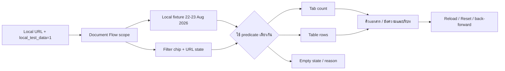

# Intake Local Fixture และ Filter Consistency

## ขอบเขต

- ชุดข้อมูลนี้ใช้เฉพาะ Local development เมื่อ URL มี `local_test_data=1` และไม่มีการเขียนหรืออ่านข้อมูล Production
- Fixture ครอบคลุมวันที่ `2026-08-22` และ `2026-08-23`, Intake/Filter/Posting/ปิดงาน, ความเสี่ยงต่ำ, ข้อมูลไม่ครบ, channel/room/sender/file/project/destination/ผู้รับผิดชอบ/next action/comment และรายการที่กรองจนเหลือศูนย์
- `loadQueuePage` เป็น source of truth เดียวสำหรับจำนวนหัว Tab และแถวตารางของคิวเอกสาร โดยใช้ predicate เดียวกัน
- ตัวกรองวันที่ใช้ช่วงเวลา Bangkok แบบ `[00:00, วันถัดไป 00:00)` เพื่อไม่ตัดข้อมูลปลายวัน
- Filter chip แสดงชื่อและค่า, URL เป็น state ที่ reload/back/forward ได้ และปุ่มล้างตัวกรองล้างค่าแล้วโหลดใหม่
- Banner `LOCAL TEST DATA` ระบุ dataset/date/count และมี Reload/Reset เพื่อไม่ให้ผู้ใช้เข้าใจว่าเป็นข้อมูลจริง

## สถานะและสิทธิ์

โหมดนี้เป็น read-only fixture สำหรับ Admin/local smoke test เท่านั้น ไม่มี transition, approval, migration หรือการส่งปลายทางจริง การทดสอบ production ต้องใช้ข้อมูลและสิทธิ์จริงแยกต่างหาก

## ตรวจสอบและ rollback

- ตรวจด้วย `scripts/document-flow-filter-consistency.test.ts`, browser smoke บน `http://127.0.0.1:5177/document-flows?...&local_test_data=1`, typecheck, lint และ build
- หากต้องย้อน ให้เอา query `local_test_data=1` ออกจาก URL; ไม่มีข้อมูลฐานข้อมูลหรือ Audit ที่ต้อง rollback
