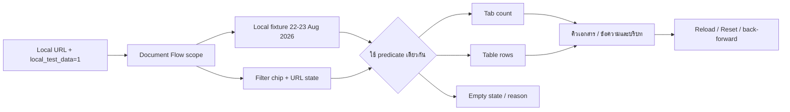
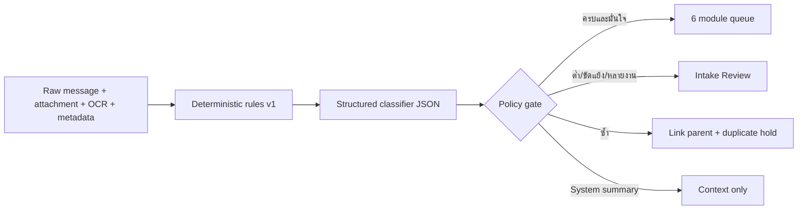

# Intake Local Fixture และ Filter Consistency

## ขอบเขต

- ชุดข้อมูลนี้ใช้เฉพาะ Local development เมื่อ URL มี `local_test_data=1` และไม่มีการเขียนหรืออ่านข้อมูล Production
- Fixture ครอบคลุมวันที่ `2026-08-22` และ `2026-08-23`, Intake/Filter/Posting/ปิดงาน, ความเสี่ยงต่ำ, ข้อมูลไม่ครบ, channel/room/sender/file/project/destination/ผู้รับผิดชอบ/next action/comment และรายการที่กรองจนเหลือศูนย์
- `loadQueuePage` เป็น source of truth เดียวสำหรับจำนวนหัว Tab และแถวตารางของคิวเอกสาร โดยใช้ predicate เดียวกัน
- ตัวกรองวันที่ใช้ช่วงเวลา Bangkok แบบ `[00:00, วันถัดไป 00:00)` เพื่อไม่ตัดข้อมูลปลายวัน
- Filter chip แสดงชื่อและค่า, URL เป็น state ที่ reload/back/forward ได้ และปุ่มล้างตัวกรองล้างค่าแล้วโหลดใหม่
- Banner `LOCAL TEST DATA` ระบุ dataset/date/count และมี Reload/Reset เพื่อไม่ให้ผู้ใช้เข้าใจว่าเป็นข้อมูลจริง

## HR Pending / Confirmation Gate

ข้อมูล Web Chat ที่ AI ประเมินว่าเกี่ยวกับ HR จะอยู่ในมุมมอง `HR Confirmation · ชุดยืนยันลงเวลา` ก่อน ไม่เข้าคิวสลิปหรือ Accounting โดยตรง แบ่งเป็น 4 กลุ่ม:

1. `Candidate` — ลงเวลาเข้า/ออกและข้อมูลช่างพร้อมให้ HR ยืนยัน
2. `Summary/System` — สรุปรายวัน/ข้อความระบบ เก็บเป็นบริบท ไม่สร้าง Job ใหม่
3. `Duplicate/Confirmed` — ไม่สร้างงานใหม่และมีลิงก์กลับต้นฉบับ
4. `Not HR/Low confidence` — ค้าง HR Pending/ส่งกลับ Intake เพื่อให้ตรวจเพิ่ม ห้ามเดาปลายทาง

แต่ละ Bundle แสดงสมาชิก, จำนวน, เวลาเข้า/ออกที่ขาด, duplicate/conflict, ผู้รับผิดชอบ และ next action พร้อม source/message ID และ confidence เดิม

## Intake Classification Gateway

โมดูลปลายทางคือ `accounting`, `hr_attendance`, `payroll`, `advance_finance`, `project_site` และ `intake_review`. ทุกผลมี category/destination/confidence/evidence/missing_fields/conflict_flags/reason/rule+model version; รายการหลายโมดูลต้องแตกเป็น linked child โดยคง parent/source เดิม

## สถานะและสิทธิ์

โหมดนี้เป็น read-only fixture สำหรับ Admin/local smoke test เท่านั้น ไม่มี transition, approval, migration หรือการส่งปลายทางจริง การทดสอบ production ต้องใช้ข้อมูลและสิทธิ์จริงแยกต่างหาก

## ตรวจสอบและ rollback

- ตรวจด้วย `scripts/document-flow-filter-consistency.test.ts`, browser smoke บน `http://127.0.0.1:5177/document-flows?...&local_test_data=1`, typecheck, lint และ build
- หากต้องย้อน ให้เอา query `local_test_data=1` ออกจาก URL; ไม่มีข้อมูลฐานข้อมูลหรือ Audit ที่ต้อง rollback
