# Master Data Governance & Retention Flow

```mermaid
flowchart LR
  A[Intake / LINE / document / Admin input] --> B[Master-data candidate]
  B --> S[Source Reference Gateway\nCandidate → Transaction → Message]
  S --> S2[Document Flow + Attachment\nEvent + Master Audit]
  S2 --> PG{Project-first Gate}
  PG -->|พบ Project เดิม| PE[Link Existing Project\ncompany-scoped + evidence]
  PG -->|ไม่พบ แต่ข้อมูลขั้นต่ำครบ| PC[Project Candidate\nawaiting_open_project]
  PG -->|ข้อมูลไม่ครบ| PI[Awaiting Information\nowner + reason + next action]
  PE --> C[Rules classification\nMaster + account/tax + project/site + context/history]
  PC --> C
  PI --> E
  C --> D{Policy gate}
  D -->|High confidence + 2 evidence\nno duplicate/conflict| AV[Auto Verified\nnot Final / not Locked]
  D -->|Unknown / duplicate / mismatch / conflict| E[Review Queue]
  AV --> E
  E -->|Admin correction| V[Append Version + Audit\nreturn Admin Reviewed]
  V --> E
  E -->|Confirm| G[Confirmed Data]
  E -->|Reject / request info| F[Hold with reason + audit]
  G --> R[Reports: Vendor / Employee-Technician\nCustomer / Company-Internal]
  G --> H[Employee / vendor / customer / project / bank-account reference]
  H --> I[Transactions and workflow routes]
  AV -.->|prohibited| X[No payment close / balance cut / Job close]
  A --> AM[Manual Admin Input]
  AM --> AB[Add Bank Account Drawer]
  AB --> AVC{Validation & duplicate check}
  AVC -->|ข้อมูลไม่ครบ / format ไม่ถูกต้อง| AD[Block save; show actionable message]
  AVC -->|ซ้ำในบริษัท| AE[Block save; แนะนำรายการเดิม]
  AVC -->|ผ่าน| AI[Insert master_bank_accounts as unverified]
  AI --> AR[Refresh list + show account row state]
  G --> J{Unused and no active reference?}
  J -->|Yes| K[Inactive then archive]
  J -->|No| H
  K --> L[Retention audit; restore only by Admin]
```

## Purpose

Create one company-scoped master-data path for people, vendors, customers, projects, work packages and bank-account evidence. New information is first classified from multiple independent evidence sources, becomes reusable only after approval, and is archived rather than deleted when its lifecycle ends.

## Inputs and outputs

- Inputs: extracted name/account facts from transfer evidence, AI/document classification, and authorised Admin entry, including manual bank-account onboarding fields.
- Outputs: candidate rows, verified aliases and bank accounts, links to the existing person/vendor/customer master, and append-only audit.
- Manual bank-account add uses dialog in Master Data Center where Admin supplies `owner_name`, `owner_type`, `bank_name`, and `account_last4`; duplicate detection is enforced before write, and saved rows remain visible as `master_bank_accounts` with `verification_status='unverified'`.
- Existing source documents, Intake IDs, transactions and document-flow rows remain canonical; a master candidate stores only a reference to evidence and never duplicates or deletes it.
- Before a candidate can be confirmed or locked, the Project-first Gate must either link one active Project in the same company or save a complete Project Candidate. A Project Candidate is only a request to open a project; it never creates a real `projects` row automatically. Every Gate command uses one `event_key`; replay returns the prior result and a conflicting reuse is rejected, so retries do not append duplicate Audit/Version rows.
- Project matching uses project/customer/site/reference/responsible evidence and the resolved Source Reference. A name by itself is not enough. Required Project Candidate fields are project name, customer/owner, site/location, responsible person, work type, approximate start date and Source/Document ID.
- The table and review Drawer consume the same `MasterSourceEvidence` object. For financial candidates, `source_id` is a Transaction ID and must be resolved through `financial_transactions.source_message_id`; it must never be labelled as a Message ID.
- The Source Reference Gateway then joins the Message ID to `document_flow_items`, `line_attachments`, `document_flow_events` and `master_data_audit`. Missing links are shown explicitly as incomplete evidence rather than guessed or replaced with another identifier.
- Classification types are `vendor`, `employee_technician`, `customer`, `company_internal` and `unknown_review`. A name alone is never sufficient: rules require evidence such as an existing Master match, account/tax identity, project/site, message context/history and the resolved Source Reference.
- `auto_verified` is a queue-relief state only. It requires confidence at least 0.95, two independent evidence groups, a resolved source and no conflict/duplicate; it never authorises payment posting, reserve deduction, payroll close or Job close.
- Review queues split pending, duplicate, name/account mismatch, conflict and Unknown/Needs Review. Confirmed reports split Vendor, Employee/Technician, Customer and Company/Internal and retain reviewer/date/source searchability. Queue and report counts are calculated after the same status/type/date and search predicates as the visible rows.
- Manual bank-account add does not run candidate classification and does not create candidate rows; it writes directly to account registry after validation.

## States, permissions and safeguards

- Data review state: `provisional`, `auto_verified`, `admin_reviewed`, `needs_review`, `confirmed`, `locked`, `rejected`, `archived`. Transaction states remain separate and are not inferred from a master-data review state.
- Master account state: `verified`, `unverified`, `inactive`, `archived`.
- Only a company Admin/Manager may approve, reject, archive, restore or edit a candidate/master account. Direct browser table writes are not allowed.
- Account numbers are stored only as a protected value in the central account registry; standard screens expose bank name, account owner and last four digits. Full account values must not be rendered in ordinary tables.
- Exact normalized matches may create a pending candidate automatically. They do not replace a verified account or enable payment automatically.
- On approval, an account fact is linked to an employee/profile only when exactly one active person has the same normalized name. Unknown or ambiguous names remain a verified-but-unlinked account for Admin resolution; no person is guessed.
- Manual bank-account add suggests active employee names from `employee_people` as UI helper only. It must still require explicit Admin action for save; no auto-link or auto-confirm occurs.
- Duplicate candidates are preserved as audit evidence and marked rejected/linked instead of being deleted.
- Admin correction changes derived candidate fields only. Raw/OCR/source evidence is unchanged; each correction appends before/after, actor, timestamp, reason, Source Reference and a candidate version, then returns to review as `admin_reviewed`.
- Project Gate state is stored with the derived candidate snapshot: `received → awaiting_project_classification → linked_existing_project` or `awaiting_new_project`; incomplete evidence becomes `awaiting_information`/`review`, and explicit approval becomes `confirmed`. Only `confirmed`/`approved`/`locked` leaves the pending queue.
- Drawer validation, RPC error and success feedback must be visible inside the active Drawer. Saving a correction is not confirmation; the UI keeps the row in Review Queue, explains the missing gate/fields, refreshes counts after success and offers the next item.

## Retention, failure and retry

- Candidates with no approved reference can be archived after the configured review period; referenced master records are never hard-deleted automatically.
- A master record is eligible to archive only when inactive and there is no active business reference. Restoring it is an Admin action and creates an audit event.
- Missing company, cross-company reference, an invalid target type, invalid account number (including non-4 digit last4), duplicate approval, permission failure, or version conflict is rejected atomically with a recoverable error.
- Duplicate/manual-add validation failures stay inside Dialog feedback without writing account rows.
- Owner: Company Admin owns quality and retention; Finance owns verified payment account evidence; HR owns employee identity confirmation; Procurement/Sales own vendor/customer confirmation.

## Change record

| Version | Date | Rationale / impact | Migration | Verification | Rollback |
|---|---|---|---|---|---|
| v1.6 | 26/8/2569 | เพิ่ม manual flow การเพิ่มบัญชีในทะเบียนกลาง (suggestion ชื่อ, validate เลขท้าย 4 หลัก, ตรวจซ้ำ owner/type/bank/last4, บันทึกเป็น unverified และ refresh table) | ไม่มี migration | Manual fixture + UI flow path + typecheck/lint/build + /master-data smoke | ลบ UI manual-add เพิ่มเติมและ validation โค้ด; candidate/source และ audit เดิมคงเดิม |
| v1.0 | 22/8/2569 | Establish central candidate, verified account, audit and retention foundations without replacing existing employee/vendor/project data | `20260821211435_master_data_governance.sql` | Schema/RLS/RPC, UI, lint/build/test and protected production route | Disable the Master Data UI/RPCs; source records, existing master records and audits remain |
| v1.1 | 22/8/2569 | Link an approved bank candidate to the active employee/technician master only for one exact normalized name match; ambiguous accounts remain safely unlinked | `20260821212940_master_bank_account_person_link.sql` | Function/backfill and RLS/schema verification | Restore previous review function; no source evidence or person record is deleted |
| v1.2 | 24/8/2569 | Correct misleading Message IDs and resolve the complete source chain consistently in both table and Drawer | No migration; read-only gateway over existing source records | Source resolver regression including missing-source case, typecheck/lint/build, `/master-data` Admin smoke | Revert the source gateway/UI mapping; raw source, candidates and audit are unchanged |
| v1.3 | 24/8/2569 | Add five-type classification, Auto Verified policy gate, separated Review Queue/Confirmed Reports and controlled Admin correction without changing raw evidence | `20260824010000_master_data_classification_review.sql` | Five-type fixture, conflict/unknown/duplicate, source parity, audit/version contract, typecheck/lint/build and Cloudflare Admin smoke | Revert UI/classifier and migration functions/triggers; preserve generated audit/version rows and return Auto/Admin Reviewed candidates to `needs_review` |
| v1.5 | 26/8/2569 | Improve Project Gate usability without weakening audit: allow Project link/candidate save without blocking on Decision reason, while keeping reason required for decision actions (approve/reject/request info/return) | No migration | `test:master-data-project-gate`, `test:master-data-candidate-review`, typecheck/lint/eslint/build + local drawer smoke | Revert UI/service reason-gating behavior and keep audit/version/raw/source evidence unchanged |
| v1.4 | 25/8/2569 | Add Project-first Gate so the 53-item Local regression queue can be linked to an existing Project or a complete Project Candidate before confirmation; surface Drawer validation and next-item flow | `20260825105559_master_data_project_first_gate.sql` (Local-first, not applied to Production) | 53→52 fixture reconciliation after explicit confirm, existing/new/missing Project cases, append-only audit/version contract, RLS, targeted lint/typecheck/build and authenticated browser smoke | Revert UI/service/migration before Production apply; after apply, disable the Gate RPC/trigger and preserve Project Candidate/Audit/Version rows for recovery—never delete Raw/OCR |
