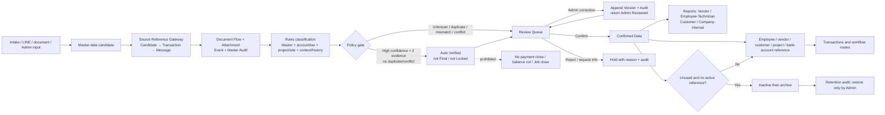

# Master Data Governance & Retention Flow

## Purpose

Create one company-scoped master-data path for people, vendors, customers, projects, work packages and bank-account evidence. New information is first classified from multiple independent evidence sources, becomes reusable only after approval, and is archived rather than deleted when its lifecycle ends.

## Inputs and outputs

- Inputs: extracted name/account facts from transfer evidence, AI/document classification, and authorised Admin entry.
- Outputs: candidate rows, verified aliases and bank accounts, links to the existing person/vendor/customer master, and append-only audit.
- Existing source documents, Intake IDs, transactions and document-flow rows remain canonical; a master candidate stores only a reference to evidence and never duplicates or deletes it.
- The table and review Drawer consume the same `MasterSourceEvidence` object. For financial candidates, `source_id` is a Transaction ID and must be resolved through `financial_transactions.source_message_id`; it must never be labelled as a Message ID.
- The Source Reference Gateway then joins the Message ID to `document_flow_items`, `line_attachments`, `document_flow_events` and `master_data_audit`. Missing links are shown explicitly as incomplete evidence rather than guessed or replaced with another identifier.
- Classification types are `vendor`, `employee_technician`, `customer`, `company_internal` and `unknown_review`. A name alone is never sufficient: rules require evidence such as an existing Master match, account/tax identity, project/site, message context/history and the resolved Source Reference.
- `auto_verified` is a queue-relief state only. It requires confidence at least 0.95, two independent evidence groups, a resolved source and no conflict/duplicate; it never authorises payment posting, reserve deduction, payroll close or Job close.
- Review queues split pending, duplicate, name/account mismatch, conflict and Unknown/Needs Review. Confirmed reports split Vendor, Employee/Technician, Customer and Company/Internal and retain reviewer/date/source searchability. Queue and report counts are calculated after the same status/type/date and search predicates as the visible rows.

## States, permissions and safeguards

- Data review state: `provisional`, `auto_verified`, `admin_reviewed`, `needs_review`, `confirmed`, `locked`, `rejected`, `archived`. Transaction states remain separate and are not inferred from a master-data review state.
- Master account state: `verified`, `unverified`, `inactive`, `archived`.
- Only a company Admin/Manager may approve, reject, archive, restore or edit a candidate/master account. Direct browser table writes are not allowed.
- Account numbers are stored only as a protected value in the central account registry; standard screens expose bank name, account owner and last four digits. Full account values must not be rendered in ordinary tables.
- Exact normalized matches may create a pending candidate automatically. They do not replace a verified account or enable payment automatically.
- On approval, an account fact is linked to an employee/profile only when exactly one active person has the same normalized name. Unknown or ambiguous names remain a verified-but-unlinked account for Admin resolution; no person is guessed.
- Duplicate candidates are preserved as audit evidence and marked rejected/linked instead of being deleted.
- Admin correction changes derived candidate fields only. Raw/OCR/source evidence is unchanged; each correction appends before/after, actor, timestamp, reason, Source Reference and a candidate version, then returns to review as `admin_reviewed`.

## Retention, failure and retry

- Candidates with no approved reference can be archived after the configured review period; referenced master records are never hard-deleted automatically.
- A master record is eligible to archive only when inactive and there is no active business reference. Restoring it is an Admin action and creates an audit event.
- Missing company, cross-company reference, an invalid target type, invalid account number, duplicate approval, permission failure, or version conflict is rejected atomically with a recoverable error.
- Owner: Company Admin owns quality and retention; Finance owns verified payment account evidence; HR owns employee identity confirmation; Procurement/Sales own vendor/customer confirmation.

## Change record

| Version | Date | Rationale / impact | Migration | Verification | Rollback |
|---|---|---|---|---|---|
| v1.0 | 22/8/2569 | Establish central candidate, verified account, audit and retention foundations without replacing existing employee/vendor/project data | `20260821211435_master_data_governance.sql` | Schema/RLS/RPC, UI, lint/build/test and protected production route | Disable the Master Data UI/RPCs; source records, existing master records and audits remain |
| v1.1 | 22/8/2569 | Link an approved bank candidate to the active employee/technician master only for one exact normalized name match; ambiguous accounts remain safely unlinked | `20260821212940_master_bank_account_person_link.sql` | Function/backfill and RLS/schema verification | Restore previous review function; no source evidence or person record is deleted |
| v1.2 | 24/8/2569 | Correct misleading Message IDs and resolve the complete source chain consistently in both table and Drawer | No migration; read-only gateway over existing source records | Source resolver regression including missing-source case, typecheck/lint/build, `/master-data` Admin smoke | Revert the source gateway/UI mapping; raw source, candidates and audit are unchanged |
| v1.3 | 24/8/2569 | Add five-type classification, Auto Verified policy gate, separated Review Queue/Confirmed Reports and controlled Admin correction without changing raw evidence | `20260824010000_master_data_classification_review.sql` | Five-type fixture, conflict/unknown/duplicate, source parity, audit/version contract, typecheck/lint/build and Cloudflare Admin smoke | Revert UI/classifier and migration functions/triggers; preserve generated audit/version rows and return Auto/Admin Reviewed candidates to `needs_review` |
