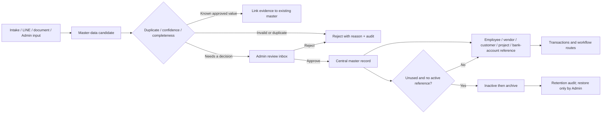

# Master Data Governance & Retention Flow

## Purpose

Create one company-scoped master-data path for people, vendors, customers, projects, work packages and bank-account evidence. New information is first a candidate, becomes reusable only after approval, and is archived rather than deleted when its lifecycle ends.

## Inputs and outputs

- Inputs: extracted name/account facts from transfer evidence, AI/document classification, and authorised Admin entry.
- Outputs: candidate rows, verified aliases and bank accounts, links to the existing person/vendor/customer master, and append-only audit.
- Existing source documents, Intake IDs, transactions and document-flow rows remain canonical; a master candidate stores only a reference to evidence and never duplicates or deletes it.

## States, permissions and safeguards

- Candidate state: `pending_review`, `approved`, `rejected`, `archived`.
- Master account state: `verified`, `unverified`, `inactive`, `archived`.
- Only a company Admin/Manager may approve, reject, archive, restore or edit a candidate/master account. Direct browser table writes are not allowed.
- Account numbers are stored only as a protected value in the central account registry; standard screens expose bank name, account owner and last four digits. Full account values must not be rendered in ordinary tables.
- Exact normalized matches may create a pending candidate automatically. They do not replace a verified account or enable payment automatically.
- On approval, an account fact is linked to an employee/profile only when exactly one active person has the same normalized name. Unknown or ambiguous names remain a verified-but-unlinked account for Admin resolution; no person is guessed.
- Duplicate candidates are preserved as audit evidence and marked rejected/linked instead of being deleted.

## Retention, failure and retry

- Candidates with no approved reference can be archived after the configured review period; referenced master records are never hard-deleted automatically.
- A master record is eligible to archive only when inactive and there is no active business reference. Restoring it is an Admin action and creates an audit event.
- Missing company, cross-company reference, an invalid target type, invalid account number, duplicate approval, permission failure, or version conflict is rejected atomically with a recoverable error.
- Owner: Company Admin owns quality and retention; Finance owns verified payment account evidence; HR owns employee identity confirmation; Procurement/Sales own vendor/customer confirmation.

## Change record

| Version | Date | Rationale / impact | Migration | Verification | Rollback |
|---|---|---|---|---|---|
| v1.0 | 22/8/2569 | Establish central candidate, verified account, audit and retention foundations without replacing existing employee/vendor/project data | `20260821211435_master_data_governance.sql` | Schema/RLS/RPC, UI, lint/build/test and protected production route | Disable the Master Data UI/RPCs; source records, existing master records and audits remain |
| v1.1 | 22/8/2569 | Link an approved bank candidate to the active employee/technician master only for one exact normalized name match; ambiguous accounts remain safely unlinked | `20260821212940_master_bank_account_person_link.sql` | Function/backfill and RLS/schema verification | Restore previous review function; no source evidence or person record is deleted |
