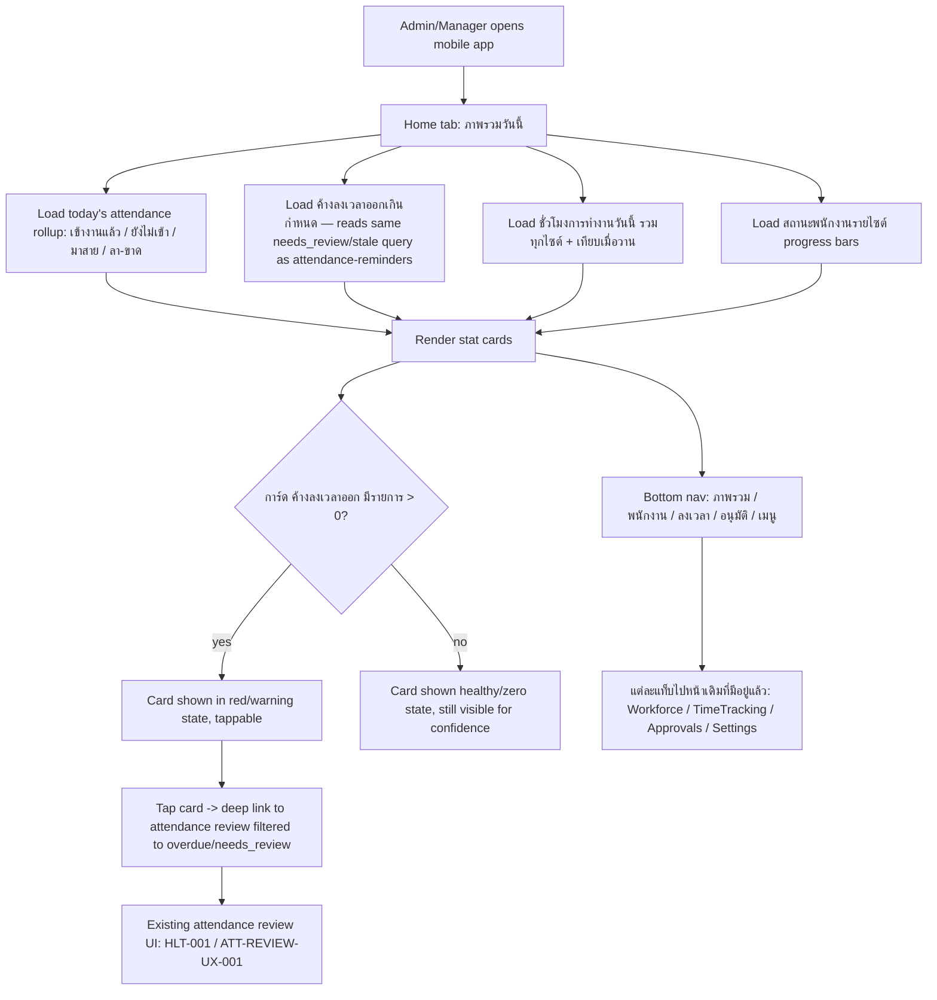

# Mobile Admin Overview Dashboard Flow

## Status of this document

**New Flow document (v1.0)** for a page that does not exist in the current codebase yet — registered before any code is written, per the Workflow Change Standard. This is not the same page as `PROJECT_DASHBOARD_FLOW.md` (that one is the desktop admin/manager cost & project dashboard at `/dashboard`). This document covers the **mobile home/"ภาพรวมวันนี้" overview screen** shown in the reviewed Wisdom Power mockup (12/9/2569), including the new overdue-clock-out alert card. Current mobile entry (`AppLauncher`, per `TIME_TRACKING_FLOW.md`) only offers two buttons (ลงเวลา, Web Chat) today — this flow is a superset that adds a proper home/overview tab plus bottom navigation to existing pages (Workforce, TimeTracking, Approvals, Settings). Code follows this document, not the other way around.

## Purpose

Give an admin/manager a single at-a-glance mobile home screen of today's workforce status (who's in, who's late, who's on leave), total hours worked across sites, per-site attendance completion, and — the fix this document adds — attendance sessions stuck without a clock-out past their SLA, without requiring a trip to Telegram or `/system-health`.

## Background: why the overdue-clock-out card exists

A live incident was found where an employee's session sat open (no clock-out) for 121+ hours. Investigation confirmed `attendance-reminders` and `health-monitor` already handle this correctly — a reminder fires, the session is auto-flagged `needs_review` after the configured grace period, and Telegram escalation repeats. The actual gap was visibility: nobody was watching that channel. This card closes that gap by surfacing the same already-computed data at the top of the screen an admin opens every day.

## Inputs and outputs

- **Inputs:** `attendance_sessions` for the active company/day (status, clock_in_at/clock_out_at, scheduled_end_at), the same stale/overdue computation `attendance-reminders` already performs (`needs_review` + still-open past `stale_after_shift_minutes`), `project_sites`/site rosters for the per-site progress bars, aggregated worked-hours for today vs. yesterday.
- **Outputs:** five stat cards (เข้างานแล้ว, ยังไม่เข้า, มาสาย, ลา/ขาด, **ค้างลงเวลาออกเกินกำหนด**), a worked-hours summary, and per-site completion bars. No mutation — this page is read-only, same as `PROJECT_DASHBOARD_FLOW.md`'s pattern.
- **Navigation output:** tapping the overdue card deep-links into the existing attendance review UI (`HLT-001`/`ATT-REVIEW-UX-001`) filtered to the overdue records — it does not duplicate that review UI.

## States

`loading → ready (with all five cards populated) → partial (one data source failed, others still shown with a warning, same pattern as PROJECT_DASHBOARD_FLOW.md) → refreshing (on realtime attendance change)`

## Roles and permissions

- Admin and manager only, same access boundary as the existing attendance review and health-monitor pages — this page shows aggregate company/site data, not a self-service employee view.
- Read-only: this page never writes attendance data; the overdue card only links out to the existing review action surface where admins already have permission to act.

## Module structure — the new card specifically

- **Input:** same query `attendance-reminders` uses for `stale_marked` (open session, no clock-out, past `scheduled_end_at + stale_after_shift_minutes`, or 18h fallback when no scheduled end) plus already-`needs_review` sessions.
- **Process:** count per company (and optionally per site) at page load and on realtime `attendance_sessions` change; zero-state is shown explicitly (not hidden) so an admin has confidence the check ran.
- **Decision/gate:** none — this is read/notify only; the actual decision (approve, correct, or escalate) happens in the existing review UI it links to.
- **Evidence:** the count and its filter criteria are the same numbers already driving `health_monitor_incidents`/Telegram, so this card and the Telegram alert can never disagree.
- **AS-IS/TO-BE/GAP:** AS-IS = this data only reaches admins via Telegram/`/system-health`, which can go unread for days (proven — the 121h case). TO-BE = same data also on the screen an admin opens daily. GAP closed = visibility latency, not detection (detection already worked).

## Failure and recovery

- If the overdue-count query fails, the card shows a neutral "ไม่สามารถโหลดข้อมูลได้" state rather than a false zero — a failed check must never look identical to "nothing overdue."
- Consistent with `PROJECT_DASHBOARD_FLOW.md`: one failed data source does not block the rest of the page from rendering.

## Audit and integrations

- No new audit events — this page only reads from tables that already have their own audit trail (`attendance_sessions`, `mutation_attempts` via the review UI it links to).
- Integrates with: `attendance_sessions`, the same stale/overdue logic as `attendance-reminders`, and existing review pages (`HLT-001`/`ATT-REVIEW-UX-001`). Does not integrate with or change `health-monitor`/Telegram.
- Bottom navigation (ภาพรวม/พนักงาน/ลงเวลา/อนุมัติ/เมนู) routes to existing pages (`Workforce`, `TimeTracking`, `Approvals`, `Settings`) — no new pages required for those four tabs; only "ภาพรวม" is new.

## Implementation note (v1.1, 13/09/2569) — phase 1 shipped, additive only

Phase 1 of this flow is implemented and committed to the real repository (branch `fix/work-command-center-error-banner-v2`):

- `src/pages/MobileOverview/index.tsx` (new) — the "ภาพรวมวันนี้" page. Ships 3 of the 5 originally-specified cards for this first pass (ลงเวลาวันนี้, รอตรวจสอบ/ค้างลงเวลาออก, พนักงานทั้งหมด) rather than all five, to keep this first slice small and reviewable; มาสาย/ลา-ขาด and the per-site progress bars are deferred to phase 2 (tracked below), not dropped.
- `src/components/MobileBottomNav.tsx` (new) — the 5-tab bar (ภาพรวม/พนักงาน/ลงเวลา/อนุมัติ/เมนู), rendered only inside the new page itself for now (`display: {xs:'block', sm:'none'}`), not yet made persistent across the other four existing pages.
- `src/router/index.tsx` (modified, additive only) — one new lazy import and one new route, `{ path: 'overview', element: managerOnly(<MobileOverviewPage />) }`, inserted next to the existing `time-tracking` route. No existing route, import, or role gate was changed. `AppLauncher` still remains the default `/` entry — this phase does **not** change what any current user sees today; the new page is reachable only by a manager/admin navigating to `/overview` directly.
- Overdue-card query: `attendance_sessions` where `company_id = current`, `clock_out_at is null`, `status = 'needs_review'` — this is the exact same signal `attendance-clock`/`attendance-reminders` already set server-side (per the corrected `ATTENDANCE_CLOCK_GPS_GEOFENCE_FLOW.md` v1.1 verification), so this card cannot disagree with the existing Telegram escalation.
- Theme: uses the app's real existing MUI theme (`src/theme.ts`, `primary.main:'#A65940'`) unchanged — confirmed with the user (13/09/2569) that the new screen should match the existing app's palette rather than the brighter orange/red used in the reference mockup images, so no theme change was made.

**Not yet done (open items, deferred to phase 2, pending user go-ahead):**
1. Persistent bottom nav across all 5 tabs (currently only shown on `/overview`).
2. มาสาย / ลา-ขาด stat cards and per-site (`project_sites`) progress bars.
3. Making `/overview` the default mobile landing page instead of `AppLauncher` (a real UX/rollout decision, not made unilaterally).

## Implementation note (v1.2, 13/09/2569) — live verification complete, two build/runtime bugs found and fixed

Phase 1 was visually confirmed running on real preview deployments (both `wisdom-ai` and `wisdomai-react` Vercel projects, branch `feature/mobile-admin-overview-dashboard`, PR #83) by the user, logged in as an Admin. The rendered screen matched the app's real theme (`primary.main:'#A65940'`) and this document's spec: the overdue-clock-out card rendered correctly with a live example (1 person, 127.1 hours overdue, name and site shown), and all three shipped stat cards populated with real counts.

Two bugs were found and fixed during this verification pass — neither was present in the original phase-1 design, both were introduced as side effects of the commit/patch process, not the feature logic itself:

1. **Build failure — unrelated `SystemBlueprintPage` route pulled into this PR's commit.** The user's local `src/router/index.tsx` had an uncommitted, in-progress reference to a separate, unrelated admin feature (`src/pages/SystemBlueprint/index.tsx`, never committed to git). Because that file already existed on disk when this feature's router edit was applied and then `git add`-ed as a whole file, the uncommitted `SystemBlueprintPage` import and `system-blueprint` route rode along into the same commit. Since the actual `SystemBlueprint` page was never pushed to git, Vercel's build failed with `TS2307: Cannot find module '../pages/SystemBlueprint'`. Fix: removed both unrelated lines from `router/index.tsx` in a follow-up commit (`fix: remove unintended SystemBlueprint route reference`) — this document's feature is unaffected; the `SystemBlueprint` feature remains untouched and un-registered (it has no Flow doc and was not part of this change).
2. **Runtime failure — ambiguous foreign key in the overdue-card query.** `attendance_sessions` has three foreign keys into `profiles` (`profile_id`, `reviewed_by`, `validation_overridden_by`), so the original implicit-embed query `profiles(full_name)` was ambiguous to PostgREST/Supabase and threw at runtime, showing "โหลดข้อมูลภาพรวมไม่สำเร็จ" instead of data. Fix: disambiguated to `profiles!attendance_sessions_profile_id_fkey(full_name)` (commit `fix: disambiguate profiles foreign key in overview query`) — confirmed against the live schema via Supabase MCP before and after the fix.

A separate, pre-existing deployment-configuration gap was also found and fixed (not a code bug): the `wisdomai-react` Vercel project had `VITE_SUPABASE_URL`/`VITE_SUPABASE_ANON_KEY` scoped to Production only, so its Preview deployments crashed before render with "Missing VITE_SUPABASE_URL or VITE_SUPABASE_ANON_KEY environment variable." Fixed by adding both to the Preview (and Development) environment scope in Vercel project settings. This affected only that project's preview builds, not the feature's code or the `wisdom-ai` project.

## Owner and change record

- **Owner:** Workforce/Attendance module owner for the overdue card's data; Platform/Mobile UX owner for the overview page and navigation shell.
- **Version:** v1.2 — phase 1 implemented and live-verified (see notes above); v1.1 was implementation without live verification; v1.0 was design-only.
- **Date:** v1.0 12/09/2569; v1.1 implementation 13/09/2569; v1.2 live verification + bugfixes 13/09/2569.
- **Rationale:** register this new mobile home page before implementation, per the Workflow Change Standard, and specify the overdue-clock-out card's exact data source so it cannot drift from what `attendance-reminders`/`health-monitor` already compute; ship the smallest additive, non-disruptive slice first so the live system is never put at risk.
- **Impact:** new page/route for mobile home ("ภาพรวม" tab), gated `managerOnly` like the existing dashboard/employees/approvals pages; no schema change (reads existing tables); no change to `attendance-reminders`, `health-monitor`, or any existing route/page. `AppLauncher` and all other current routes are byte-for-byte unchanged except the one new route line and one new import in `router/index.tsx`.
- **Migration:** none.
- **Verification:** source-level self-review done (query shape checked against live Supabase schema via MCP); **live on-screen verification complete (13/09/2569)** on real Vercel preview deployments, logged in as Admin — overdue card and all three stat cards confirmed rendering real data correctly. Local lint/build/typecheck on the user's machine still not separately confirmed (Vercel's own build step passing is the available proxy for this).
- **Rollback:** delete `src/pages/MobileOverview/`, `src/components/MobileBottomNav.tsx`, and the three added lines in `src/router/index.tsx` (`MobileOverviewPage` import + `overview` route from phase 1, none from the SystemBlueprint fix since that only removed lines). No other file is touched, so rollback cannot affect any existing page.
