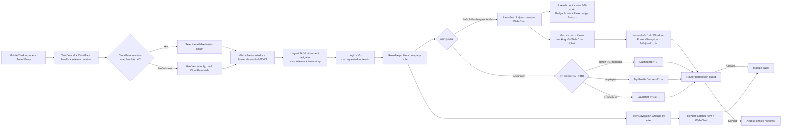

# Application Navigation Flow

## Purpose and scope

`src/utils/navigation.ts` is the single registry of visible menu items. `src/utils/authRouting.ts` chooses the first destination from device surface and effective role, while `Sidebar` renders permitted items and Router guards remain the authority for access. A menu item improves discoverability only; it never grants access.

In DEV only, `local_test_data=1` keeps `ProtectedRoute` and the role gate open for the local fixture paths used by Flow Registry and Document Flow UAT. That bypass does not exist in Production and does not change the normal login or permission boundary.

## Inputs, output, permission, failure and audit

- **Inputs:** Smart Entry target health/latency and release revision parity, PWA install/open request, Wisdom Power app icon assets versioned by release revision, device signals (`userAgent`, viewport, touch/coarse pointer), effective company role, requested path/ProtectedRoute `from`, allowed roles, platform-admin flag, and unread Web Chat count from membership/join time/read state/messages for the active company/profile.
- **Output:** Logout เปิด `/login?__release=<runtime>&signed_out_at=<time>` ด้วย full document navigation เพื่อรับ HTML/JavaScript ปัจจุบัน แล้วหลัง Password Login มือถือไป `/` Application Launcher เสมอ แม้ Route Guard จำ `/chat` หรือ deep route ไว้ โดยมีสองปุ่มระดับเดียวกันคือ `/time-tracking` และ `/chat`; Web Chat shows a red in-app unread badge/text and mirrors the total to an installed PWA icon when the platform supports it. Desktop ยังคืน safe internal requested route ได้ หรือ `admin/manager` defaults to `/dashboard`, `employee` defaults to `/my-profile`.
- **Permissions:** Sidebar filters by role for usability; the route itself also enforces the permission boundary. No financial, document, or HR data is loaded by navigation.
- **Failure/retry:** full Logout navigation มี timestamp กัน document cache และ Release Freshness Guard ตรวจ manifest ซ้ำ; manifest, favicon, Apple touch icon และรูปแบรนด์ในแอปเติม release revision ใน URL พร้อม cache revalidation เพื่อดึงไอคอนใหม่หลัง deploy. If device detection is uncertain, the system uses the desktop branch; external/protocol-relative requested paths are rejected to `/`; if profile data is unavailable, it stays at `/` and retries through the existing AuthContext refresh. Unread load failure clears a potentially stale count and retries through Realtime/30-second polling. Unsupported/denied OS badging silently falls back to the in-app badge. An unavailable or denied desktop destination follows its Router guard.
- **Audit/owner:** navigation has no business mutation or audit event. Platform UI owns device routing/labels/icons; each destination module owns its data and audit.

## Change record

| Version | Date | Change | Verification | Rollback |
|---|---|---|---|---|
| v1.0 | 21/8/2569 | Register navigation module and add the holder registry under Finance and Accounting | lint/build and production protected-route inspection | Remove its navigation registry item/icon; route/data remain |
| v1.1 | 22/8/2569 | Add Application Launcher as the outer entry point with Web Chat unread badge and icon-only Time Tracking entry | targeted lint, build, route/browser check, Supabase unread query path | Restore role-based post-login redirect; existing module routes remain |
| v1.2 | 22/8/2569 | Add pre-login Smart Entry for mobile/desktop to select the available fastest Vercel or Cloudflare origin | smart-entry test, lint, build and browser redirect check | Stop distributing `/start.html`; direct origins remain available |
| v1.3 | 22/8/2569 | Add one branded WisdomAI PWA icon (192/512 PNG) and make the installed icon open the outer launcher at `/` | manifest/icon asset checks, lint, build and browser/PWA route check | Restore `start_url` to `/time-tracking` and remove the branded icon links; routes/data remain |
| v1.4 | 23/8/2569 | Route the first authenticated page by device and effective role: mobile → Time Tracking, desktop manager/admin → Dashboard, desktop employee → My Profile | auth-routing tests, lint, build, route guard check and mobile/desktop browser verification | Restore `/` as the default post-login destination; keep the existing launcher and module routes intact |
| v1.5 | 23/8/2569 | Require Cloudflare fallback release revision to match Vercel before Smart Entry selects it | smart-entry/release tests, lint, build and both-host manifest check after deploy | Revert parity gate only after both hosts are rolled back to the same revision |
| v1.6 | 23/8/2569 | Keep mobile post-login at the Application Launcher so ลงเวลา and Web Chat remain separate same-level entry buttons | auth-routing test, launcher contract test, lint, build and mobile route verification | Restore direct mobile `/time-tracking` routing; launcher and module routes remain available |
| v1.7 | 23/8/2569 | Allow DEV-only `local_test_data=1` routes to open local fixture UAT through `ProtectedRoute` without changing Production login guards | flow-registry, document-flow and auth-routing tests, lint and build | Remove the local test query flag; production routes remain guarded |
| v1.8 | 31/8/2569 | Replace the mobile hamburger glyph with the Wisdom logo as the same navigation trigger and remove the duplicate clock shortcut from the top bar | auth-routing contract, typecheck, lint, build and mobile browser check | Restore the hamburger glyph and clock shortcut; launcher routes and permissions remain unchanged |
| v1.9 | 31/8/2569 | Make Launcher unread count membership-aware, show the count as badge/text, mirror it to supported installed PWA icons, and remove the duplicated Chat shortcut from focused mobile Time Tracking | launcher contract, attendance tests, typecheck, lint, build and authenticated mobile `/` + `/time-tracking` smoke | Revert App Badge sync and focused mobile UI; Chat/read-state/attendance data remain unchanged |
| v1.10 | 31/8/2569 | ป้องกัน Logout/Login บนมือถือคืน deep route `/chat` จาก ProtectedRoute state จนข้ามหน้ารวม 2 ไอคอน | auth-routing contract ครอบคลุม mobile remembered route, typecheck, lint, build และ authenticated Android logout/login smoke | revert login target resolver เพื่อคืน remembered route; route/สิทธิ์/ข้อมูลผู้ใช้เดิมไม่เปลี่ยน |
| v1.11 | 31/8/2569 | Production telemetry ยืนยัน Android Logout/Login ยังอยู่ใน SPA รุ่นเก่าที่ไม่มี release metadata จึงไม่รับ routing fix | Logout ใช้ full document navigation พร้อม release/timestamp; ตรวจ bundle ใหม่ก่อน Login ทุกครั้ง | auth-routing/cache-bust contract, typecheck, lint, build, revision parity และ Android session ต้องมี release metadata | revert hard navigation เป็น React navigation; Auth/session/data เดิมไม่เปลี่ยน |
| v1.12 | 31/8/2569 | เปลี่ยนชื่อและ App Icon เป็น Wisdom Power พร้อม version URL ตาม release เพื่อไม่ติด cache เดิมบนมือถือ | company-branding/auth-routing tests, build artifact, cache headers และ Production PWA/runtime smoke | คืน icon/label เดิมและถอด version plugin; route, session และข้อมูลเดิมไม่เปลี่ยน |
