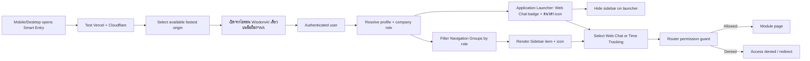

# Application Navigation Flow

## Purpose and scope

`src/utils/navigation.ts` is the single registry of visible menu items. `Sidebar` renders it with the matching icon, while Router permission guards remain the authority for access. A menu item improves discoverability only; it never grants access.

## Inputs, output, permission, failure and audit

- **Inputs:** Smart Entry target health/latency, PWA install/open request, the single WisdomAI app icon assets, item label, route, allowed roles, current profile role, company role, platform-admin flag, current location, and unread Web Chat count for the active company/profile.
- **Output:** One installable WisdomAI app icon opens the Application Launcher at `/`, which shows the Web Chat unread badge and Time Tracking icon; the launcher hides the desktop Sidebar until a module is selected, while other routes show only permitted navigation items.
- **Permissions:** Sidebar filters by role for usability; the route itself also enforces the permission boundary. No financial, document, or HR data is loaded by navigation.
- **Failure/retry:** an unavailable or denied route follows its Router guard; if unread loading fails, the launcher keeps both icons and retries by Realtime event/30-second refresh. If an installed icon is stale, reinstalling the PWA/refreshing its cache picks up the versioned PNG without changing route access; refreshing the page rebuilds navigation from the current session.
- **Audit/owner:** navigation has no business mutation or audit event. Platform UI owns labels/icons; each destination module owns its data and audit.

## Change record

| Version | Date | Change | Verification | Rollback |
|---|---|---|---|---|
| v1.0 | 21/8/2569 | Register navigation module and add the holder registry under Finance and Accounting | lint/build and production protected-route inspection | Remove its navigation registry item/icon; route/data remain |
| v1.1 | 22/8/2569 | Add Application Launcher as the outer entry point with Web Chat unread badge and icon-only Time Tracking entry | targeted lint, build, route/browser check, Supabase unread query path | Restore role-based post-login redirect; existing module routes remain |
| v1.2 | 22/8/2569 | Add pre-login Smart Entry for mobile/desktop to select the available fastest Vercel or Cloudflare origin | smart-entry test, lint, build and browser redirect check | Stop distributing `/start.html`; direct origins remain available |
| v1.3 | 22/8/2569 | Add one branded WisdomAI PWA icon (192/512 PNG) and make the installed icon open the outer launcher at `/` | manifest/icon asset checks, lint, build and browser/PWA route check | Restore `start_url` to `/time-tracking` and remove the branded icon links; routes/data remain |
