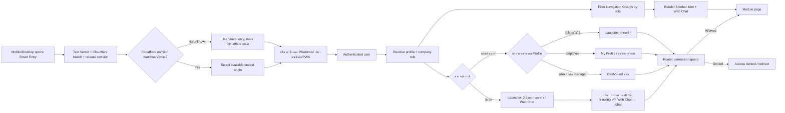

# Application Navigation Flow

## Purpose and scope

`src/utils/navigation.ts` is the single registry of visible menu items. `src/utils/authRouting.ts` chooses the first destination from device surface and effective role, while `Sidebar` renders permitted items and Router guards remain the authority for access. A menu item improves discoverability only; it never grants access.

In DEV only, `local_test_data=1` keeps `ProtectedRoute` and the role gate open for the local fixture paths used by Flow Registry and Document Flow UAT. That bypass does not exist in Production and does not change the normal login or permission boundary.

## Inputs, output, permission, failure and audit

- **Inputs:** Smart Entry target health/latency and release revision parity, PWA install/open request, the single WisdomAI app icon assets, device signals (`userAgent`, viewport, touch/coarse pointer), effective company role, requested path, allowed roles, platform-admin flag, and unread Web Chat count for the active company/profile.
- **Output:** Mobile defaults to `/` Application Launcher with two same-level buttons: `/time-tracking` and `/chat`; desktop `admin/manager` defaults to `/dashboard`; desktop `employee` defaults to `/my-profile`. The launcher is a safe fallback while profile data is unavailable.
- **Permissions:** Sidebar filters by role for usability; the route itself also enforces the permission boundary. No financial, document, or HR data is loaded by navigation.
- **Failure/retry:** if device detection is uncertain, the system uses the desktop branch; if profile data is unavailable, it stays at `/` and retries through the existing AuthContext refresh. An unavailable or denied destination follows its Router guard. If an installed icon is stale, reinstalling the PWA/refreshing its cache picks up the versioned PNG without changing route access.
- **Audit/owner:** navigation has no business mutation or audit event. Platform UI owns device routing/labels/icons; each destination module owns its data and audit.

## Mobile interaction contract

On 320–768px screens, the top bar opens a full-height mobile Drawer that reuses the same role/platform-filtered navigation registry as Desktop. Selecting a destination closes the Drawer and uses the existing Router guard; it does not grant new access or load another company's data. The top bar keeps the active company, user, and role visible while page-specific Project context remains owned by the destination page.

## Change record

| Version | Date | Change | Verification | Rollback |
|---|---|---|---|---|
| v1.0 | 21/8/2569 | Register navigation module and add the holder registry under Finance and Accounting | lint/build and production protected-route inspection | Remove its navigation registry item/icon; route/data remain |
| v1.1 | 22/8/2569 | Add Application Launcher as the outer entry point with Web Chat unread badge and icon-only Time Tracking entry | targeted lint, build, route/browser check, Supabase unread query path | Restore role-based post-login redirect; existing module routes remain |
| v1.2 | 22/8/2569 | Add pre-login Smart Entry for mobile/desktop to select the available fastest Vercel or Cloudflare origin | smart-entry test, lint, build and browser redirect check | Stop distributing `/start.html`; direct origins remain available |
| v1.3 | 22/8/2569 | Add one branded WisdomAI PWA icon (192/512 PNG) and make the installed icon open the outer launcher at `/` | manifest/icon asset checks, lint, build and browser/PWA route check | Restore `start_url` to `/time-tracking` and remove the branded icon links; routes/data remain |
| v1.4 | 23/8/2569 | Route the first authenticated page by device and effective role: mobile → Time Tracking, desktop manager/admin → Dashboard, desktop employee → My Profile | auth-routing tests, lint, build, route guard check and mobile/desktop browser verification | Restore `/` as the default post-login destination; keep the existing launcher and module routes intact |
| v1.5 | 23/8/2569 | Require Cloudflare fallback release revision to match Vercel before Smart Entry selects it | smart-entry/release tests, lint, build and both-host manifest check after deploy | Revert parity gate only after both hosts are rolled back to the same revision |
| v1.6 | 23/8/2569 | Keep mobile post-login at the Application Launcher so ลงเวลา and Web Chat remain separate same-level entry buttons | auth-routing test, launcher contract test, lint, build and mobile route verification | Restore direct mobile `/time-tracking` routing; launcher and module routes remain available |
| v1.7 | 23/8/2569 | Allow DEV-only `local_test_data=1` routes to open local fixture UAT through `ProtectedRoute` without changing Production login guards | flow-registry, document-flow and auth-routing tests, lint and build | Remove the local test query flag; production routes remain guarded |
| v1.8 | 4/9/2569 | Replace the small-screen inline details menu with a full-screen mobile Drawer using the same permission-filtered navigation content as Desktop; keep company/user/role context visible in the TopBar | mobile responsive contract, targeted lint, typecheck and desktop/mobile navigation smoke | revert MainLayout/TopBar/Sidebar mobile navigation wiring; route permissions and data remain unchanged |
