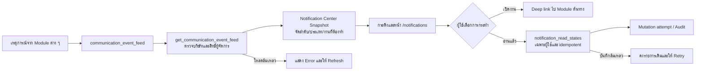

# Notification Center Flow

## คำอธิบาย

ศูนย์การแจ้งเตือนเป็นมุมมองรวมแบบอ่านข้อมูลจากเหตุการณ์กลาง ไม่คัดลอกหรือเปลี่ยนสถานะงานต้นทาง แต่ช่วยให้ Admin/ผู้จัดการบริษัทเห็นเหตุการณ์ งานที่ต้องทำ เจ้าของ SLA และเปิดกลับไปยัง Module ต้นทางได้ การกด “อ่านแล้ว” บันทึกเฉพาะสถานะการอ่านของผู้ใช้ จึงไม่ถือเป็นการอนุมัติหรือปิดงาน

## Input, output และเจ้าของ

| หัวข้อ | รายละเอียด |
| --- | --- |
| Input | `communication_event_feed` จาก HR, Accounting, Advance, System และ Module อื่น พร้อม `event_id`, บริษัท, เวลา, สถานะ, source/reference และ work key |
| Validation | Frontend ส่ง `company_id` ไป RPC `get_communication_event_feed`; RPC บังคับ authenticated session และ `is_company_manager` ก่อนคืนข้อมูล |
| Output | Snapshot สูงสุด 100 เหตุการณ์, จำนวนยังไม่อ่าน, จำนวนงานที่ต้องทำ, Priority, Owner, SLA, Deep link และ Source Reference |
| Data write | เฉพาะการกดอ่านแล้ว: upsert `notification_read_states(profile_id, notification_key, read_at)`; ไม่เขียนทับเหตุการณ์ต้นทาง |
| Owner | เจ้าของข้อมูลคือ Module ต้นทาง; เจ้าของการตรวจ Notification Center คือ Admin/ผู้จัดการบริษัท; ผู้ใช้แต่ละคนเป็นเจ้าของ read state ของตน |

## States และการกระทำ

- `unread` มาจากการไม่มีคู่ `profile_id + notification_key` ใน `notification_read_states`.
- `read` เกิดจากการ upsert แบบ idempotent; การกดซ้ำไม่สร้างรายการซ้ำ และไม่ลดจำนวนงานที่ต้องทำเพราะไม่ได้ปิดงานต้นทาง.
- `actionable` เป็นเหตุการณ์ชนิด `incident/repeat/approval_required/review_required`, สถานะ failed/pending/queued/review/blocked หรือมี error; แยกชนิดงานออกจากสถานะ Delivery เพื่อไม่ให้ข้อความ incident ที่ส่งสำเร็จถูกนับเป็นข้อมูลทั่วไป ผู้ใช้ต้องเปิด Module ต้นทางเพื่อดำเนินงานจริง.
- `informational` เป็นข้อมูล/ผลสำเร็จ ไม่สร้าง Job ใหม่และไม่ปิด Job เดิม.
- Filter `all/unread/actionable/system` และ Module เก็บใน URL เพื่อ refresh/back/forward ได้สอดคล้องกัน.

## สิทธิ์และการแยกบริษัท

หน้าและกระดิ่งแสดงเฉพาะผู้ที่ผ่าน `canManageCompany`. การอ่าน feed ผ่าน tenant-guarded RPC เท่านั้น; ห้ามอ่าน view โดยตรง. Read state มี RLS `profile_id = auth.uid()` จึงอ่านและแก้ได้เฉพาะของตนเอง. Local fixture เปิดได้เฉพาะ development พร้อมป้ายชัดเจนและไม่เรียก Production.

## Failure, retry และ recovery

- โหลด feed ล้มเหลว: แสดง Error, ไม่แสดงข้อมูลจำลองแทน Production และให้กด Refresh/รอ polling 30 วินาที.
- โหลด read state ล้มเหลว: แสดง warning และคง feed เพื่อให้ผู้ใช้ยังเปิดงานได้.
- บันทึกอ่านแล้วล้มเหลว: ไม่แก้ state บนหน้าจอ, แสดงข้อความให้ลองใหม่ และบันทึก failure ผ่าน mutation-attempt/central error.
- Deep link ปลายทางผิดหรือ Module ไม่พร้อม: เหตุการณ์ต้นทางยังคงอยู่; ผู้ดูแลย้อนจาก Source Reference และ Audit ของ Module เดิมได้.

## Audit และการตรวจสอบ

เหตุการณ์ต้นทางเก็บ audit ที่ Module เจ้าของ ส่วนการกดอ่านแล้วผ่าน `runWithMutationAttempt` และใช้ `event_id` เป็น notification key. การตรวจต้องครอบคลุม tenant permission, unread/actionable count, URL filters, refresh, read idempotency, deep link, Desktop/Tablet/Mobile และ console error.

## Change log

| Version | Date | Rationale | Impact | Migration | Verification | Rollback |
| --- | --- | --- | --- | --- | --- | --- |
| v1.0 | 24/8/2569 | รวมเหตุการณ์และงานที่ต้องทำไว้จุดเดียวโดยไม่สร้างข้อมูลซ้ำ | เพิ่มกระดิ่ง, `/notifications`, URL filter, read state และ deep link | ไม่มี; ใช้ schema/RPC เดิม | Contract, typecheck, lint, build, Local fixture และ Cloudflare Admin smoke | คืน route/page เดิมและซ่อนกระดิ่ง; เก็บ read state และเหตุการณ์ต้นทางไว้ ไม่ลบข้อมูล |
| v1.1 | 24/8/2569 | Production UAT พบ incident/repeat ถูกตีความจาก Delivery status จึงไม่ขึ้นคิวงาน | แยก business event type ออกจาก delivery status และนับเหตุการณ์ที่ต้องจัดการถูกต้อง | ไม่มี | Contract, typecheck, lint, build และ Cloudflare count/filter smoke | ย้อน classifier v1.1; ไม่กระทบ event/read state ต้นทาง |
| v1.2 | 24/8/2569 | การอ่านแจ้งเตือนไม่ใช่การปิดงานและต้องไม่ลด actionable count | แยก unread count ออกจากงานที่ต้องทำทั้งหมด | ไม่มี | อ่านหนึ่งรายการแล้ว unread ลด แต่งานต้องทำและ filter count คงเดิมหลัง refresh | ย้อน count projection; ไม่กระทบ source/read state |
