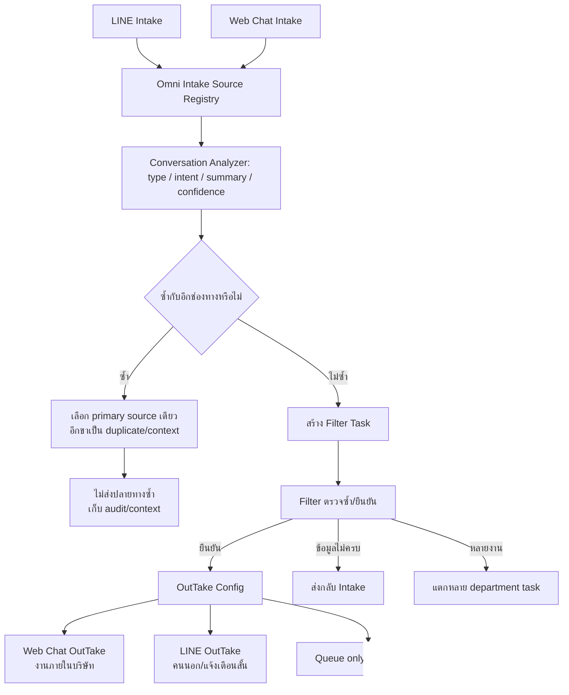

# OMNI CHANNEL INTAKE / OUTTAKE FLOW — LINE + Web Chat

## วัตถุประสงค์

ทำให้ LINE และ Web Chat เป็นได้ทั้งขาเข้าและขาออก โดยใช้ config กลางตัดสินเส้นทาง ไม่ให้ระบบผูกตายกับ LINE และลดปัญหา LINE เต็ม 3,000 ด้วยการย้ายงานภายในไป Web Chat/Queue เป็นหลัก

## Inputs

- `line_messages` และ `line_attachments` จาก LINE webhook
- `chat_messages` จาก Web Chat ที่ผู้ใช้ภายในส่งเอง
- ข้อมูลบริษัท ห้อง ผู้ส่ง เวลา ข้อความ ไฟล์แนบ และ project hint

## Outputs

- `omni_intake_sources`: ทะเบียนกลางของข้อความ/ไฟล์ทุกช่องทาง พร้อม summary, type, intent, confidence และ dedupe status
- `omni_filter_tasks`: งานให้ Filter ตรวจซ้ำ/ยืนยันปลายทาง
- `omni_channel_routes`: config ว่าช่องทางไหนรับเข้า/ส่งออกไป Web Chat, LINE, queue-only หรือไม่ส่ง
- `omni_outtake_delivery_events`: ledger สำหรับ outtake ในระยะถัดไป

## States

- Dedupe: `primary`, `duplicate`, `possible_duplicate`, `context`
- Filter: `queued`, `confirmed`, `needs_review`, `returned`, `duplicate`, `dismissed`
- OutTake: `not_ready`, `ready`, `sent`, `failed`, `suppressed`
- Confidence: `auto` (≥ 90%), `review` (70–89%), `needs_review` (< 70%)
- Intake review: `pending`, `approved`, `rejected`

## Roles / Permissions

- Company manager/Admin อ่านและจัดการ config, Filter task และ source registry ของบริษัทตนเอง
- สมาชิกแผนกอ่าน task ตามสิทธิ์ department เดิม
- Trigger ฝั่ง DB เขียน source registry ได้ แต่ไม่เปิด insert/update ตรงให้ client ทั่วไป

## Integrations

- LINE → trigger `omni_register_line_message_trigger`
- Web Chat → trigger `omni_register_chat_message_trigger`
- Analyzer → `omni_analyze_conversation`
- Dedupe + queue → `omni_register_source`
- Backfill → `omni_backfill_recent_sources`

## Failure / Retry

- ถ้าวิเคราะห์/ลงทะเบียน source ล้มเหลว trigger จะ warning และไม่ทำให้ข้อความต้นทางหาย
- ถ้า source ซ้ำกับอีกช่องทาง ระบบไม่ลบข้อมูล แต่ suppress outtake ของตัวซ้ำ
- ถ้าความมั่นใจต่ำ ให้ค้าง Filter/Intake ไม่ส่งปลายทางสุดท้าย
- OutTake จริงต้องอิง `omni_channel_routes` และบันทึก delivery event ก่อนส่ง

## Audit Events

- `omni_source_registered`
- `omni_source_duplicate_detected`
- `omni_filter_task_created`
- `omni_filter_confirmed`
- `omni_outtake_suppressed_duplicate`
- `omni_outtake_delivery_failed`

## Owner

ทีมระบบเป็น owner ของ schema/trigger/analyzer; Admin/Filter owner เป็นผู้ยืนยันประเภท ปลายทาง และ primary source เมื่อข้อมูลซ้ำ

## Change Record

### v1.0 — 22/8/2569

- เหตุผล: ให้ LINE/Web Chat เป็น Intake และ OutTake ได้ทั้งคู่ โดยมี config กลางและกันเอกสาร/ข้อความซ้ำระหว่างสองขา
- ผลกระทบ: เพิ่ม `omni_channel_routes`, `omni_intake_sources`, `omni_filter_tasks`, `omni_outtake_delivery_events`, trigger จาก LINE/Web Chat และ rule-based analyzer รุ่นแรก
- Migration: `202608220002_omni_channel_intake_outtake.sql`
- Verification: migration contract test, Supabase schema/trigger verification, lint, build และตรวจ Flow Registry
- Rollback: drop trigger/table ชุด `omni_*`; ไม่ลบ LINE/Web Chat/Document Flow เดิม และไม่กระทบ HR Chat event stream

### v1.1 — 22/8/2569

- เหตุผล: ให้ผู้ใช้เห็นคิวกลาง Omni บนหน้าโปรแกรมจริง ไม่ใช่มีเฉพาะ backend
- ผลกระทบ: หน้า `Document Flow Center` เพิ่มแท็บ `Omni Filter` แสดงต้นทาง LINE/Web Chat, ห้อง/ผู้ส่ง, ผลวิเคราะห์ AI, ปลายทาง, สถานะซ้ำ และสรุปข้อความสำหรับ Filter
- Migration: ไม่มี schema ใหม่เพิ่มเติมจาก `202608220002_omni_channel_intake_outtake.sql`
- Verification: migration contract test, lint, build และตรวจหน้า `/document-flows`
- Rollback: ซ่อนแท็บ `Omni Filter`; backend registry ยังทำงานต่อและไม่กระทบ document flow เดิม

### v1.2 — 23/8/2569

- เหตุผล: ให้ Admin เห็นข้อความ LINE/Web Chat ในขา Intake โดยไม่ทำให้ข้อความสนทนาทุกข้อความกลายเป็นเอกสาร และตรวจบริบทพร้อมรูป/ไฟล์ได้จากจุดเดียว
- ผลกระทบ: Intake Room เพิ่มแท็บ `ข้อความและบริบท`; Drawer แสดงข้อความในห้องเดียวกันช่วงก่อน–หลัง 2 ชั่วโมง, ลิงก์เปิดรูป/ไฟล์แบบ signed URL และคำสั่ง `Approve`/`Reject`
- การบันทึก: `review_omni_intake_source` เปลี่ยน `filter_status` อย่างมีสิทธิ์, ปรับ Filter task ที่เกี่ยวข้อง และเขียน immutable audit ที่ `omni_intake_review_events`
- Migration: `20260822192231_omni_intake_review_actions.sql`
- Verification: ทดสอบ migration/TypeScript/lint/build, ตรวจ RLS และตรวจหน้า `/document-flows`
- Rollback: ซ่อนแท็บข้อความและ Drawer ได้โดยไม่ลบ `omni_intake_sources`, ข้อความ LINE/Web Chat หรือประวัติ audit
