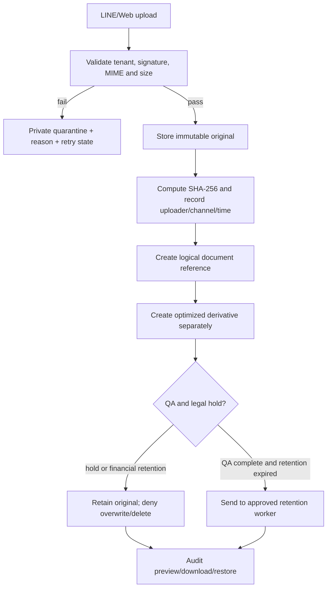

# Original Quarantine & Chain of Custody Flow

## Scope

The original is the evidence source. It is stored in a private tenant-scoped location, never optimized in place, and linked to every logical message/document reference. Derivatives may be regenerated; the original hash and bytes remain unchanged.

## Required metadata

Record SHA-256, tenant/company, uploader, channel, received time, storage bucket/path, content type, size, retention class, retain-until date, legal-hold state, and immutable audit events. Financial originals retain at least 30 days; general originals at least 7 days, subject to legal hold and approved policy.

## Roles and failure handling

Ingestion service writes quarantine/original metadata. Platform Storage owns bucket policy and hash verification. Admin/Compliance owns legal holds and retention approval. Temporary failures may retry idempotently by external attachment id/hash; validation or malware failures remain quarantined and never reach OCR or business destinations.

## Current implementation boundary

Existing `line_attachments`/`line_attachment_blobs` already carry hash, tenant, retention, original-size and lifecycle metadata. This change registers the custody contract; adding or backfilling fields requires a separate reviewed migration and production evidence. No object, row or policy was changed by this document.

## Change record

### v1.0 — 7/9/2569

- Rationale: close the DOC-INGEST-003 Flow Registry gap and make original evidence/retention rules explicit.
- Verification: Production schema inspection confirmed the required metadata fields; no data mutation performed.
- Rollback: remove this document and registry entry; existing originals and audits remain unchanged.
