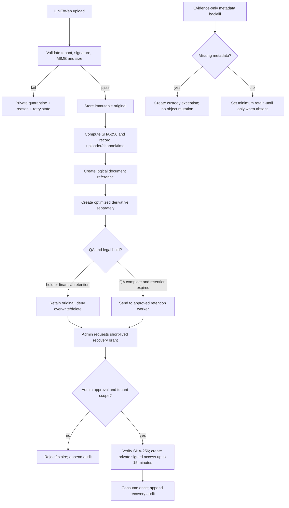

# Original Quarantine & Chain of Custody Flow

## Scope

The original is the evidence source. It is stored in a private tenant-scoped location, never optimized in place, and linked to every logical message/document reference. Derivatives may be regenerated; the original hash and bytes remain unchanged.

## Required metadata

Record SHA-256, tenant/company, uploader, channel, received time, storage bucket/path, content type, size, retention class, retain-until date, legal-hold state, and immutable audit events. Financial originals retain at least 30 days; general originals at least 7 days, subject to legal hold and approved policy.

## Roles and failure handling

Ingestion service writes quarantine/original metadata. Platform Storage owns bucket policy and hash verification. Admin/Compliance owns legal holds and retention approval. Temporary failures may retry idempotently by external attachment id/hash; validation or malware failures remain quarantined and never reach OCR or business destinations.

## Current implementation boundary

Existing `line_attachments`/`line_attachment_blobs` already carry hash, tenant, retention, original-size and lifecycle metadata. This change registers the custody contract; adding or backfilling fields requires a separate reviewed migration and production evidence. No object, row or policy was changed by this document.

## Change record

## Approved retention and recovery policy

The Admin-approved default policy is:

- Financial slips and accounting originals: retain for 7 years from the end of the accounting period; never overwrite the original.
- General originals: retain for 2 years unless a longer legal or contractual period applies.
- Quarantine or unreadable uploads: retain for 30 days with the validation failure reason and audit trail.
- Thumbnails and regenerated derivatives: retain for 90 days; they may be deleted and recreated from the original.
- Legal hold: indefinite retention until an Admin/Compliance owner records a release decision.
- Recovery drill: quarterly, to an encrypted temporary location; verify SHA-256, record the audit event, then securely remove the temporary copy.

Retention Worker may delete only expired records with no legal hold. Every preview, download, recovery, release, and deletion remains append-only in Audit. These defaults are operational controls; tax/accounting exceptions still take precedence.

### v1.2 — 8/9/2569

- Rationale: add tenant-scoped, short-lived recovery grants and an evidence-only retention metadata backfill path without changing raw objects.
- Verification: migration is additive; recovery requests/decisions/consumption are append-only audited and restricted to Admin/Manager/Document Operations roles.
- Integration/failure: `document-original-recovery` authenticates the caller, rechecks tenant/role through RLS, verifies the stored bytes against SHA-256, creates a private HTTPS signed URL no longer than the approved grant, then consumes the grant once. Missing objects/hashes, mismatches, expired grants and concurrent reuse fail closed without returning the URL.
- Rollback: revoke the new RPC grants and disable the migration; existing originals, hashes, and lifecycle state remain unchanged.

### v1.1 — 7/9/2569

- Rationale: record the Admin-approved retention, legal-hold, and controlled recovery defaults so the custody flow can be operated consistently.
- Verification: Production schema and Storage object/hash integrity were checked read-only; no business or evidence data was changed.
- Rollback: revert this policy section and registry version; existing originals and audit history remain unchanged.

### v1.0 — 7/9/2569

- Rationale: close the DOC-INGEST-003 Flow Registry gap and make original evidence/retention rules explicit.
- Verification: Production schema inspection confirmed the required metadata fields; no data mutation performed.
- Rollback: remove this document and registry entry; existing originals and audits remain unchanged.
