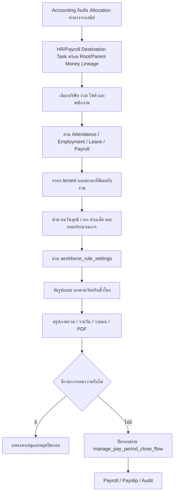

# Payroll and Attendance Reporting Flow

## คำอธิบาย

- Input: company, period/month, site, employee, attendance sessions, employment policy, leave, payroll และ `workforce_rule_settings`
- Output: ตารางงวด, รายละเอียดรายวัน/รายคน, เวลาเฉลี่ยต่อวัน, ยอดค่าแรง/เงินเดือน และสถานะปิดรอบ
- State: รายงานเป็น read model; การปิดรอบใช้ `open/review → closed → paying → paid` ผ่าน RPC กลางเท่านั้น
- Roles/permissions: company admin/manager; Platform Admin ตาม permission กลาง โดย query ทุกชุดต้องจำกัด company
- Integrations: Supabase attendance/employment/payroll tables, `formatWorkTime`, PDF/CSV export และ `manage_pay_period_close_flow`
- Failure/retry: query ใดล้มต้องแจ้งสาเหตุโดยไม่แสดงยอดบางส่วนเป็นยอดครบ; ข้อมูลรอตรวจบล็อกปิดรอบ; refresh อ่าน source เดิมซ้ำได้
- Audit: การดูรายงานไม่ mutate; การแก้เวลา ปรับวัน ปิดรอบ และจ่ายเงินผ่าน Mutation Attempt/RPC audit
- Owner: HR/Payroll Admin; ทีมระบบเป็นเจ้าของสูตร การจัดรูปแบบ และ reconciliation
- Allocation ค่าแรงสร้าง HR destination task และเก็บเส้นเงินกลับถึงสลิป/กองเงิน แต่ยังไม่ถือว่าเป็น Payroll ที่อนุมัติหรือจ่ายแล้วจนกว่า HR จะจับคู่พนักงาน/งวดและผ่าน Flow ปิดรอบเดิม

## Change record

| Version | Date | Rationale | Impact | Migration | Verification | Rollback |
| --- | --- | --- | --- | --- | --- | --- |
| v1.0 | 23/8/2569 | ลงทะเบียน flow และคืนการใช้ display setting/ค่าเฉลี่ยที่ source อ่านค่าไว้แต่ไม่ได้แสดงผล | Reports summary, daily/project time rendering และ tests | ไม่มี; ใช้ schema เดิม | focused tests, full tests, lint, build และหน้า Reports | คืน renderer เดิมได้โดยไม่เปลี่ยนสูตร Payroll หรือข้อมูล |
| v1.1 | 26/8/2569 | ให้ค่าแรงจากสลิปมีเส้นทางตรวจสอบกลับถึงกองเงินและส่ง HR เป็นงานรอตรวจ โดยไม่สร้าง Payroll อัตโนมัติ | Accounting Allocation → HR destination task และ Root/Parent Lineage | `20260826220000_transfer_slip_money_allocations_v2.sql` | money allocation contract, task idempotency, lint/typecheck/build และ HR queue smoke | ปิด v2 routing; Payroll/Attendance เดิมไม่ถูกแก้หรือลบ |
