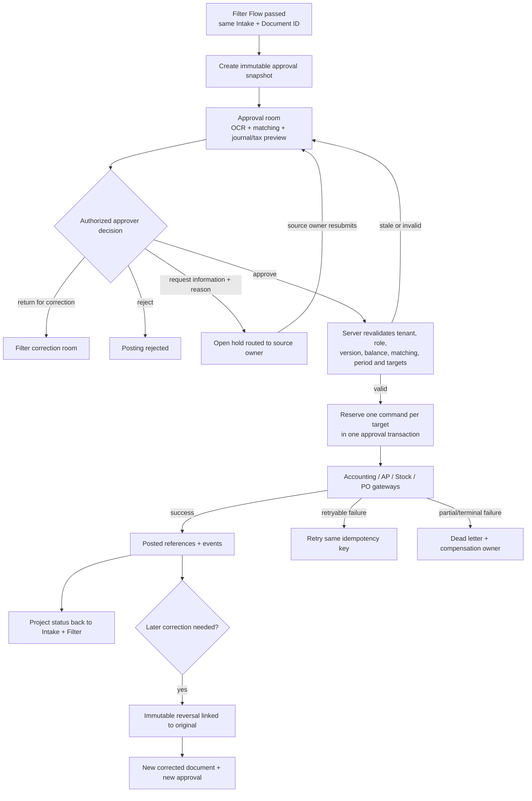
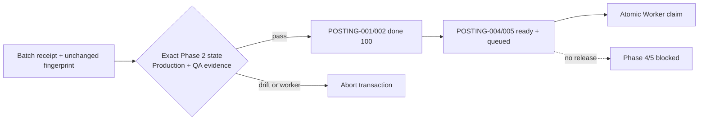
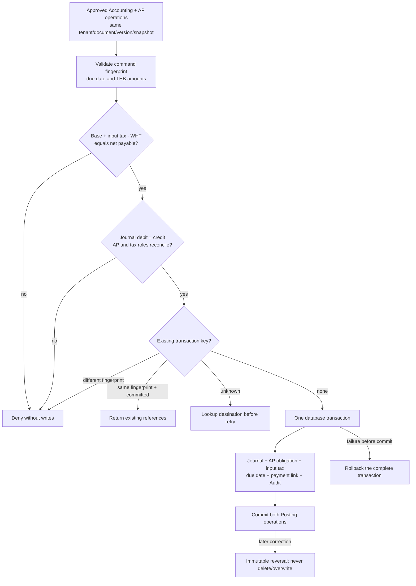

## Phase 2 approval-room implementation

The Posting queue now opens a same-route approval drawer backed by the existing tenant-scoped Accounting Document RLS. It shows the complete Intake ID and Accounting Document ID, secure source image/PDF preview, OCR confidence, vendor and tax identity, project, item lines, tax totals, matching state, and draft journal debit/credit totals. The persistent warning **“รออนุมัติ — ยังไม่ลงบัญชี/Stock”** stays visible until the source state is posted.

Approval is not offered as a quick table action. The drawer enables it only when the Accounting Document has lines, a non-empty balanced draft journal, `matching_status = complete`, and is not already posted. The server RPC remains authoritative for tenant, role, version, state transition, idempotency, and Audit. Return-for-correction and rejection require a reason and pass that note to the existing audited transition.

`request_information` is now a distinct, non-terminal hold. A Posting approver must enter a reason; the server resolves the source owner from `accounting_documents.created_by` (falling back to the existing assignee), keeps the item in Posting as `information_requested`, and exposes it to that owner within the same company. Only that owner (or a platform-admin recovery actor) may resubmit with a note. Resubmission returns the same item to `awaiting_approval`, increments its version, and appends a second Audit event. Neither action creates Posting, Accounting, AP, Stock, or PO side effects.

# Posting approval and transaction contract

This is the canonical Phase 1 contract for `POSTING-FLOW-001`, implementing the contract boundary requested by `FILTER-007` and `FILTER-008`. It defines what later UI, RPC, gateway, correction, and monitoring phases must implement. It does not connect a live gateway, mutate Production data, or grant permissions.

## Inputs and outputs

The only valid input is a company-scoped document that has a versioned `passed` decision from Filter Flow and is currently `posting / awaiting_approval`. The approval room must render one immutable approval snapshot containing the original evidence references, OCR fields, vendor/project/lines, matching references, before/after corrections, document and tax totals, journal debit/credit preview, target systems, source versions, and a content hash. The visible badge is **“รออนุมัติ — ยังไม่ลงบัญชี”** until server-side approval succeeds.

Approval output is an append-only approval event and one deterministic command for each selected target: `accounting`, `ap`, `stock`, or `purchase_order`. A successful gateway output contains its durable reference and projects the same result back to the Intake and Filter timeline using the original Intake ID. Previewing or approving never directly inserts business ledger, AP, Stock, or PO rows from the browser.

## States and transitions

The canonical path is `awaiting_approval → approved_waiting_gateway → posting → posted`. The information loop is `awaiting_approval → information_requested → awaiting_approval`; the record remains open and each transition increments the optimistic version. A stale snapshot, failed final validation, expired/delegated approval, or changed source version remains `awaiting_approval` with a precise reason and requires a refreshed snapshot. `request_correction` returns to `filter / needs_correction`; `reject` is terminal until an explicitly audited retry/reopen action. Gateway failures use `failed → retry_wait → processing`, or `dead_letter → compensating → compensated`.

The approval transaction must atomically record the approval event, transition the document-flow version, and reserve all intended commands. If all command reservations cannot be made, none may become executable. Gateway execution may span systems; partial success must be recorded per command and recovered or compensated, never hidden by a single aggregate “posted” state.

## Approval snapshot and final validation

Approval is bound to `company_id`, `intake_id`, `document_id`, document version, Filter decision version, snapshot hash, approver, decision/event key, and intended targets. The server is authoritative and must repeat tenant/role/policy, approval limit, segregation-of-duties, duplicate, accounting period, master data, debit=credit, document/line/tax totals, matching tolerance, PO/receipt remaining quantity, and destination readiness checks immediately before reservation.

The executable TypeScript preflight in `src/services/postingFlowContract.ts` defines the shared minimum and always marks server authorization, atomic reservation, and append-only Audit as required. Client preflight can disable an invalid action but cannot authorize posting.

## Roles and permissions

- Filter reviewer may pass or return a document but cannot post it merely by passing Filter Flow.
- Posting viewer may read only company-scoped snapshots and evidence allowed by existing document/evidence policies.
- Approver must satisfy the server-side company, document type, project, amount limit, approval sequence, delegation/expiry, and segregation-of-duties policy at action time.
- A company manager/Posting approver may request information. Only the recorded source owner may resubmit; company and item identity are checked before an idempotent replay is returned, preventing cross-tenant event-key probing.
- Gateway/service role is the only actor allowed to reserve/execute commands and write destination references.
- Audit/compliance roles receive read-only timelines; cross-company reads and actions are denied.

Phase 1 defines these checks but creates no new role, grant, RLS policy, or approval authority. Those changes require a later explicitly approved phase and independent security QA.

## Approval policy matrix

Phase 2 adds an executable policy resolver in `src/services/postingApprovalPolicy.ts`. A policy is tenant-owned and matches an exact company, one or more document types, an optional project allow-list, and an inclusive amount band. Project-specific rules outrank company-wide rules; two equally specific rules at the same version are rejected as ambiguous instead of choosing silently. Invalid, inactive, out-of-range, or missing policies deny the action.

Every policy contains a contiguous, one-based sequence of approval stages. Each stage names the required role and whether delegation is allowed. Existing approval evidence must use the same company, policy ID/version, and strict stage order. The final Posting transition remains blocked until the last stage is authorized; a partial approval only identifies the next stage.

Segregation-of-duties is mandatory: the preparer, source owner, and anyone who approved an earlier stage cannot approve another stage. Every persisted approval records both the acting approver and `delegatedFrom` principal when delegation was used; both identities remain prohibited at every later stage. A delegated principal is checked against the same prohibited actors, so delegation cannot be used to bypass maker-checker or reuse an earlier approver. Actor company, policy company, snapshot company, approval history, and delegation company must all match; cross-tenant actions fail closed.

Delegation is explicit and time-bounded. It identifies principal, delegate, principal role, company, optional policy/stage scope, start, and expiry. It is accepted only when the current stage permits delegation, is active at decision time, and expires no later than the approval request. The request itself expires after the policy-defined number of hours and must restart with a new snapshot rather than extending old authority.

The resolver returns policy ID/version, tenant, actor, stage, delegation source, decision time, expiry, approval-request ID, document ID/version, and immutable snapshot hash as authorization evidence. A completed decision also carries equal `finalStage` and `totalStages`. `evaluatePostingApproval` binds every field to the exact request and snapshot and verifies `authorizedAt <= decisionAt <= expiresAt`; expired, replayed, cross-document, cross-version, changed-snapshot, or partial-stage evidence cannot reserve destination commands. Policy validation first partitions by tenant, document type, and project: malformed unrelated or other-tenant definitions cannot suppress a valid candidate, while any malformed in-scope candidate fails closed before ranking. This phase defines and tests the decision contract only; it does not add database policy rows, roles, grants, RLS, or Production data.

## Idempotency and transaction boundary

Create commands use the stable identity `posting-v1:{company}:{intake}:{document}:{posting_type}`. The database still enforces `(company_id, idempotency_key)` uniqueness and rejects reuse for a different command. Double-click, refresh, timeout, and worker retry must return the original operation and status. The approval snapshot hash and document version are command evidence; they must match the reserved command and may not be silently replaced.

Each destination command has its own status and reference. “Posted” at document level means every required target is posted, or an explicitly defined business-safe compensation outcome has completed. A timeout is unknown, not failed: query the destination by the same idempotency identity before retrying.

## Correction and reversal

Before posting, edits return to Filter Flow, increment the source version, and require a new snapshot and approval. After posting, original business rows and Audit events are immutable. A reversal command must reference the original operation, use a distinct deterministic `...:reversal:{original_operation_id}` key, and create balanced inverse Accounting/AP/Stock effects as applicable. A correction creates a new document/version linked to the original and follows Filter and approval again. No overwrite-in-place is permitted.

The existing posting ledger cannot yet represent reversal command types or an atomic multi-target approval bundle; those are explicit implementation dependencies for later phases, not implied Phase 1 completion.

## Failure, retry and recovery

Retry keeps the same command and idempotency key, increments bounded attempts, records heartbeat/error/next retry, and never creates a second destination record. Exhaustion routes to dead letter with an owner, source/destination evidence, and compensation plan. Recovery must distinguish no-effect, committed, partially committed, and unknown outcomes. Intake/Filter remain visibly synchronized with the safest known state; they must not show `posted` while any required target is unresolved.

## Audit events

Events are append-only and uniquely keyed. The minimum vocabulary is `snapshot_created`, `approval_requested`, `approved`, `returned_for_correction`, `rejected`, `command_reserved`, `command_started`, `command_posted`, `command_failed`, `retry_scheduled`, `dead_lettered`, `reversal_requested`, `reversal_posted`, `compensation_started`, and `compensated`. Each event records company, Intake/document/operation IDs, source and result versions, actor/service identity, reason, timestamp, snapshot hash, from/to state, target, destination reference, and correlation/event key.

## Existing-data reconciliation

Before later runtime activation, inventory all `document_flow_items` in Posting states and all `posting_operations`; classify missing Filter evidence, stale versions, duplicate identities, partial target sets, and orphan gateway references. Legacy rows must be reported and held for review rather than backfilled as approved or posted. Phase 1 performs no Production data mutation.

## Verification and acceptance for later phases

Required coverage includes happy path, unauthorized/cross-company approver, maker-checker violation, stale snapshot, imbalance, matching failure, closed period, overbilling, duplicate click, refresh, timeout/unknown outcome, partial multi-target failure, retry exhaustion, correction, reversal, and Intake/Filter/Audit projection. Runtime completion also requires migration replay and safety guard, targeted tests, typecheck, lint, build, authenticated approval-room smoke for relevant roles, destination reconciliation, and Production revision verification.

## Owner

Posting Flow / Accounting owns the business contract. Platform owns transaction/idempotency/recovery. Security owns approval policy and tenant boundaries. Accounting, AP, Stock, and Purchasing own their gateway invariants. Compliance owns correction/reversal and immutable Audit.

## Rollback and recovery

Phase 1 is contract-only: rollback removes the TypeScript/document/test additions and the registry entry. It does not delete existing `posting_operations`, events, document-flow history, or destination records. Later runtime rollback must disable new command intake, keep ledgers/events, reconcile in-flight operations, and use explicit reversal/compensation rather than deleting posted data.

## Change record

| Version | Date | Rationale | Impact | Migration | Verification | Rollback |
| --- | --- | --- | --- | --- | --- | --- |
| v1.0 | 16/9/2569 | Define the canonical approval/transaction boundary before implementing UI and gateways | Contract, Flow document, test; no runtime routing or permission change | None | Contract test, typecheck, lint, build; runtime/deployment deferred to approved phases 2–5 | Revert contract files and registry entry; retain all existing ledgers and Audit |
| v1.1 | 16/9/2569 | Implement the approval snapshot and transaction preview without bypassing server authority | Posting drawer, tenant-scoped preview reads, guarded decisions, explicit hold blocker | None | Posting-room contract, Filter runtime contract, typecheck, lint, build | Revert UI/gateway/test/docs; no business rows or Audit history are removed |
| v1.2 | 16/9/2569 | Add the approved request-information policy and source-owner return loop | New open state, owner fields, company-scoped owner visibility, audited request/resubmit RPC actions, drawer controls | `202609160009_posting_request_information.sql` | Migration safety/replay, request-information and Posting-room contracts, typecheck, lint, build, authenticated role smoke | Hide actions and restore the prior RPC/queue function; retain state/owner columns and Audit rows for recovery, then move held rows back to `awaiting_approval` only through an audited repair |
| v2.0 | 16/9/2569 | Define tenant, document-type, project, amount, stage, delegation, expiry, and segregation-of-duties policy | Executable resolver and final-approval binding; no schema, role, permission, data, or runtime routing change | None | Positive/negative/cross-tenant policy tests, Posting contract test, typecheck, lint, build | Revert resolver and contract binding; preserve all approval, document-flow, Posting, and Audit records |
| v2.1 | 16/9/2569 | Close final-authorization replay, delegated-principal reuse, and unrelated malformed-policy denial gaps | Evidence is bound to request/document/version/snapshot/final stage and decision time; approval history retains delegate principal | None | Replay/expiry/cross-document, principal↔delegate reuse, malformed scoped/unrelated policy tests plus full local gates | Revert v2.1 contract/source/tests; preserve approval, Posting, and Audit records |

## Phase 3 guarded activation — v2.2 (16/9/2569)

Migration `202609160010_activate_posting_phase3.sql` locks the complete approved batch and verifies the original receipt, recomputed scope fingerprints, approval, no worker, dependencies, and exact Phase 2 states. It records exact Production commits/revisions and independent-QA evidence before completing POSTING-001/002. Only POSTING-004/005 enter the approved execution queue; Phase 4/5 stay blocked. Exact final-state replay is a no-op and partial/drifted state aborts. A clean foundation replay, where Phase 2 still has no Worker execution history, is also an explicit no-op so replay never fabricates Production/QA evidence or releases Phase 3. Platform Operations owns the flow. Recovery uses a new guarded forward migration only while Phase 3 is unclaimed/unstarted; Audit is retained.

| v2.2 | 16/9/2569 | Release Phase 3 only after exact Phase 2 Production and independent-QA evidence | POSTING-001/002 close; POSTING-004/005 become claimable; Phase 4/5 remain blocked | `202609160010_activate_posting_phase3.sql` | Contract, migration safety/replay, typecheck, lint, build, real control-plane state after release | Guarded forward migration before any Phase 3 claim; retain Audit |

## Accounting/AP gateway command — v3.0 (17/9/2569)

`src/services/accountingApGatewayContract.ts` defines the migration-free command boundary for `POSTING-004`. It accepts only the approved `accounting` and `ap` operation pair when company, Intake, document, version, approval event, and snapshot hash are identical. It produces deterministic journal, payable, payment-link, Audit, and operation-status keys under one transaction key. This prevents the two Posting operations from drifting or being executed for different approval evidence.

Amounts use two-decimal reconciliation: `taxable base + input tax - withholding tax = net payable`. Journal roles must independently reconcile base debit, input-tax debit, AP credit, and withholding-tax credit, in addition to total debit equalling total credit. The due date cannot precede the document date; only THB is enabled by this version. A payment link is a durable internal reference owned by the AP obligation, not a browser-generated payment or an external transfer instruction.

Retry uses the same transaction/idempotency identity. A committed matching fingerprint returns the original durable references; an unknown outcome requires lookup-before-retry; a reused key with a changed fingerprint is denied. Any error before commit rolls back journal, AP, tax, link, Audit, and both operation state changes together. After commit, rows and Audit are immutable and recovery requires a linked reversal command under `POSTING-008`, never delete or overwrite.

Migration `202609170001_accounting_ap_gateway_persistence.sql` implements the approved write plan as additive tenant ledgers and one server-only transaction. The RPC locks and binds the two reserved operations to the same company, Intake and document; requires the live Posting item to remain `approved_waiting_gateway` at the approved version and approval event; revalidates dates, currency, amount equation, journal balance and role totals; then inserts immutable transaction/journal/AP/payment-link/Audit rows and advances both operations, the document flow, and Accounting document together. Matching retry returns the original references; a changed fingerprint or scope fails closed. Authenticated Accounting/manager roles receive tenant-scoped read visibility only; client writes remain revoked.

Independent-QA hardening captures an immutable canonical snapshot inside the approval-event transaction for future approvals, including source version, vendor, dates, amounts, ordered journal and every required destination. Caller payloads and deterministic transaction/payment keys must exactly match it. Each destination has a tenant-bound result row; the aggregate Flow/Accounting document reaches `posted` only when no required target remains pending. Started/posted operation events retain snapshot hash, source/result versions and immutable-reversal recovery evidence. Existing approvals created before this migration have no authoritative snapshot and intentionally fail with `accounting_ap_canonical_snapshot_missing_reapproval_required`; they require separate human re-approval or explicitly authorized reconciliation and are never backfilled from mutable current data.

QA v3.2 derives required destinations from the actual reserved/active Posting operation set at approval time, including `purchase_order`; item classification is not used as a proxy. Snapshot identity uses SHA-256. The gateway requires an explicit open row in the new tenant-scoped `accounting_periods` authority immediately before execution, otherwise it fails `accounting_ap_open_period_required`. Because Production previously had no canonical Accounting period table, an authorized period-opening decision/data load is required before any future Accounting/AP execution; the migration does not infer or backfill periods. Partial completion projects the real `posting / posting / posting_partial_targets` values into the Document Flow event, while complete target sets project the completed values.

P1 v3.3 removes the ordering gap entirely. `approve_posting_bundle` starts with a locked `awaiting_approval` item and no pre-existing operation, verifies active-company manager authority, optimistic version, confirmed Accounting source, maker-checker separation, and an exact unique target list, then—in one transaction—reserves every target operation, advances the Flow, writes the approval event, captures the SHA-256 snapshot and creates target-result rows. Any invalid target, permission, source, version, policy or snapshot rolls back all effects. Repeating the same event key returns the approved item without duplicating commands. The real Document Flow service routes only Posting `approve` through this bundle; every other transition remains on the existing state-machine RPC. No executable Posting command exists before approval.

P1 v3.4 removes caller target authority. The bundle has no target-list parameter. It derives Accounting/AP unconditionally from the confirmed Accounting source, adds Stock only when canonical document lines contain `item_type=stock`, and adds Purchase Order only when the canonical document type is `quotation`; a missing document type fails closed. The exact derived set is stored in both the approval event and immutable snapshot and is the only set reserved. The UI cannot omit Stock/PO or spuriously add either destination.

Semantic correction v3.5 keeps quotations entirely outside Posting. `approve_posting_bundle` rejects `document_type=quotation` with `quotation_owned_by_quotation_decision_workflow` and creates no operation/event/snapshot. Existing `process_quotation_decision_with_project` remains the sole owner: only persisted `order_full`/`order_partial` decisions and selected quantities create PO lines; `not_ordered`, `reference_only`, `expired`, and `cancelled` never create PO and quotations remain `posting_status=not_posted`. For actual-posting document types, Accounting/AP remain required and Stock is added only when a canonical Stock line exists. The bundle never creates a Purchase Order target.

Document-type authority v3.6 replaces that broad “actual-posting” assumption with an explicit server whitelist grounded in the current Accounting catalog and AP routes: `invoice`, `billing_note`, `receipt`, `cash_receipt`, `tax_invoice_full`, `tax_invoice_abbreviated`, `invoice_tax_invoice`, `receipt_tax_invoice`, and `receipt_tax_invoice_abbreviated`. Only these types may reserve Accounting/AP, with Stock added solely when their canonical lines contain `item_type=stock`. Quotation retains its specific quotation-workflow refusal; Purchase Order, Stock-owned receipt/delivery documents, transfer slips, withholding certificates, payroll, reference/archive classifications, unknown values and every other non-whitelisted type fail before any operation, event or snapshot is written.

| Version | Date | Rationale | Impact | Migration | Verification | Rollback |
| --- | --- | --- | --- | --- | --- | --- |
| v3.0 | 17/9/2569 | Define the approved Accounting/AP command and close balance, tax/AP, retry, and rollback ambiguity before persistence | New typed command planner and deterministic atomic write plan; no runtime/schema/security change | None | Focused positive/negative/replay/unknown/conflict tests, prior Posting contracts, typecheck, lint, build | Revert source/test/docs; no ledger, AP, tax, payment-link, or Audit rows were created |
| v3.1 | 17/9/2569 | Persist the approved command atomically to a canonical tenant ledger | Additive Accounting/AP transaction, journal, obligation, payment-link and Audit tables; server-only idempotent RPC; destination state transition | `202609170001_accounting_ap_gateway_persistence.sql` | Contract, migration safety/replay, tenant/write grants, typecheck, lint, build; authenticated destination/Audit smoke after release | Revert before apply; after apply disable executor and use a guarded forward migration/reversal—never delete committed finance/Audit rows |
| v3.2 | 17/9/2569 | Close aggregate projection, operation-set, period, tenant-FK and Audit identity gaps | SHA-256 canonical snapshot, operation-derived targets including PO, open-period fail-closed gate, exact partial/complete projection, composite tenant references | Same additive migration | Executable PostgreSQL tamper/concurrency/replay/cross-tenant/period/PO-partial/Audit tests plus full gates | Stop executor; preserve evidence and use guarded forward recovery/reversal |
| v3.3 | 17/9/2569 | Remove approval/reservation ordering hazard | One authoritative approval bundle creates event, operations, snapshot, targets and transition atomically; UI approve routes through bundle | Same additive migration | PostgreSQL no-preseed success, invalid-target rollback, replay/idempotency, no-preapproval operation; service contract and full gates | Disable bundle route and preserve Audit; no partial bundle state can exist |
| v3.4 | 17/9/2569 | Remove caller authority over Posting destinations | Server derives exact Accounting/AP/Stock/PO set from confirmed document type and lines; UI sends no targets | Same additive migration | PostgreSQL proves quotation+stock creates all four targets and invalid version creates none; service contract forbids target parameter | Disable bundle route; retain immutable approval evidence |
| v3.5 | 17/9/2569 | Preserve quotation reference/PO workflow ownership | Posting bundle refuses quotations; existing quotation decision RPC alone creates PO from persisted action and quantities; Stock derives only for actual-posting types | Same additive migration | PostgreSQL quotation refusal/no side effects, actual invoice+Stock exact targets, quotation workflow regression suite, full gates | Revert bundle semantic guard only if a separately approved unified quotation architecture replaces the existing owner |
| v3.6 | 17/9/2569 | Prevent unsupported document classifications from defaulting into Accounting/AP | Explicit server whitelist for nine catalog-backed Accounting/AP types; all non-posting, separately-owned and unknown types fail before side effects | Same additive migration | Table-driven PostgreSQL coverage for all nine supported types plus unsupported/unknown zero-side-effect cases; full gates | Disable approval bundle or restore the prior function only under approved routing authority; retained evidence is immutable |
