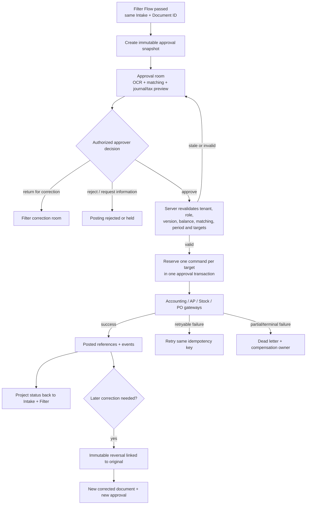

# Posting approval and transaction contract

This is the canonical Phase 1 contract for `POSTING-FLOW-001`, implementing the contract boundary requested by `FILTER-007` and `FILTER-008`. It defines what later UI, RPC, gateway, correction, and monitoring phases must implement. It does not connect a live gateway, mutate Production data, or grant permissions.

## Inputs and outputs

The only valid input is a company-scoped document that has a versioned `passed` decision from Filter Flow and is currently `posting / awaiting_approval`. The approval room must render one immutable approval snapshot containing the original evidence references, OCR fields, vendor/project/lines, matching references, before/after corrections, document and tax totals, journal debit/credit preview, target systems, source versions, and a content hash. The visible badge is **“รออนุมัติ — ยังไม่ลงบัญชี”** until server-side approval succeeds.

Approval output is an append-only approval event and one deterministic command for each selected target: `accounting`, `ap`, `stock`, or `purchase_order`. A successful gateway output contains its durable reference and projects the same result back to the Intake and Filter timeline using the original Intake ID. Previewing or approving never directly inserts business ledger, AP, Stock, or PO rows from the browser.

## States and transitions

The canonical path is `awaiting_approval → approved_waiting_gateway → posting → posted`. A stale snapshot, failed final validation, expired/delegated approval, or changed source version remains `awaiting_approval` with a precise reason and requires a refreshed snapshot. `request_correction` returns to `filter / needs_correction`; `reject` is terminal until an explicitly audited retry/reopen action. Gateway failures use `failed → retry_wait → processing`, or `dead_letter → compensating → compensated`.

The approval transaction must atomically record the approval event, transition the document-flow version, and reserve all intended commands. If all command reservations cannot be made, none may become executable. Gateway execution may span systems; partial success must be recorded per command and recovered or compensated, never hidden by a single aggregate “posted” state.

## Approval snapshot and final validation

Approval is bound to `company_id`, `intake_id`, `document_id`, document version, Filter decision version, snapshot hash, approver, decision/event key, and intended targets. The server is authoritative and must repeat tenant/role/policy, approval limit, segregation-of-duties, duplicate, accounting period, master data, debit=credit, document/line/tax totals, matching tolerance, PO/receipt remaining quantity, and destination readiness checks immediately before reservation.

The executable TypeScript preflight in `src/services/postingFlowContract.ts` defines the shared minimum and always marks server authorization, atomic reservation, and append-only Audit as required. Client preflight can disable an invalid action but cannot authorize posting.

## Roles and permissions

- Filter reviewer may pass or return a document but cannot post it merely by passing Filter Flow.
- Posting viewer may read only company-scoped snapshots and evidence allowed by existing document/evidence policies.
- Approver must satisfy the server-side company, document type, project, amount limit, approval sequence, delegation/expiry, and segregation-of-duties policy at action time.
- Gateway/service role is the only actor allowed to reserve/execute commands and write destination references.
- Audit/compliance roles receive read-only timelines; cross-company reads and actions are denied.

Phase 1 defines these checks but creates no new role, grant, RLS policy, or approval authority. Those changes require a later explicitly approved phase and independent security QA.

## Idempotency and transaction boundary

Create commands use the stable identity `posting-v1:{company}:{intake}:{document}:{posting_type}`. The database still enforces `(company_id, idempotency_key)` uniqueness and rejects reuse for a different command. Double-click, refresh, timeout, and worker retry must return the original operation and status. The approval snapshot hash and document version are command evidence; they must match the reserved command and may not be silently replaced.

Each destination command has its own status and reference. “Posted” at document level means every required target is posted, or an explicitly defined business-safe compensation outcome has completed. A timeout is unknown, not failed: query the destination by the same idempotency identity before retrying.

## Correction and reversal

Before posting, edits return to Filter Flow, increment the source version, and require a new snapshot and approval. After posting, original business rows and Audit events are immutable. A reversal command must reference the original operation, use a distinct deterministic `...:reversal:{original_operation_id}` key, and create balanced inverse Accounting/AP/Stock effects as applicable. A correction creates a new document/version linked to the original and follows Filter and approval again. No overwrite-in-place is permitted.

The existing posting ledger cannot yet represent reversal command types or an atomic multi-target approval bundle; those are explicit implementation dependencies for later phases, not implied Phase 1 completion.

## Failure, retry and recovery

Retry keeps the same command and idempotency key, increments bounded attempts, records heartbeat/error/next retry, and never creates a second destination record. Exhaustion routes to dead letter with an owner, source/destination evidence, and compensation plan. Recovery must distinguish no-effect, committed, partially committed, and unknown outcomes. Intake/Filter remain visibly synchronized with the safest known state; they must not show `posted` while any required target is unresolved.

## Audit events

Events are append-only and uniquely keyed. The minimum vocabulary is `snapshot_created`, `approval_requested`, `approved`, `returned_for_correction`, `rejected`, `command_reserved`, `command_started`, `command_posted`, `command_failed`, `retry_scheduled`, `dead_lettered`, `reversal_requested`, `reversal_posted`, `compensation_started`, and `compensated`. Each event records company, Intake/document/operation IDs, source and result versions, actor/service identity, reason, timestamp, snapshot hash, from/to state, target, destination reference, and correlation/event key.

## Existing-data reconciliation

Before later runtime activation, inventory all `document_flow_items` in Posting states and all `posting_operations`; classify missing Filter evidence, stale versions, duplicate identities, partial target sets, and orphan gateway references. Legacy rows must be reported and held for review rather than backfilled as approved or posted. Phase 1 performs no Production data mutation.

## Verification and acceptance for later phases

Required coverage includes happy path, unauthorized/cross-company approver, maker-checker violation, stale snapshot, imbalance, matching failure, closed period, overbilling, duplicate click, refresh, timeout/unknown outcome, partial multi-target failure, retry exhaustion, correction, reversal, and Intake/Filter/Audit projection. Runtime completion also requires migration replay and safety guard, targeted tests, typecheck, lint, build, authenticated approval-room smoke for relevant roles, destination reconciliation, and Production revision verification.

## Owner

Posting Flow / Accounting owns the business contract. Platform owns transaction/idempotency/recovery. Security owns approval policy and tenant boundaries. Accounting, AP, Stock, and Purchasing own their gateway invariants. Compliance owns correction/reversal and immutable Audit.

## Rollback and recovery

Phase 1 is contract-only: rollback removes the TypeScript/document/test additions and the registry entry. It does not delete existing `posting_operations`, events, document-flow history, or destination records. Later runtime rollback must disable new command intake, keep ledgers/events, reconcile in-flight operations, and use explicit reversal/compensation rather than deleting posted data.

## Change record

| Version | Date | Rationale | Impact | Migration | Verification | Rollback |
| --- | --- | --- | --- | --- | --- | --- |
| v1.0 | 16/9/2569 | Define the canonical approval/transaction boundary before implementing UI and gateways | Contract, Flow document, test; no runtime routing or permission change | None | Contract test, typecheck, lint, build; runtime/deployment deferred to approved phases 2–5 | Revert contract files and registry entry; retain all existing ledgers and Audit |
