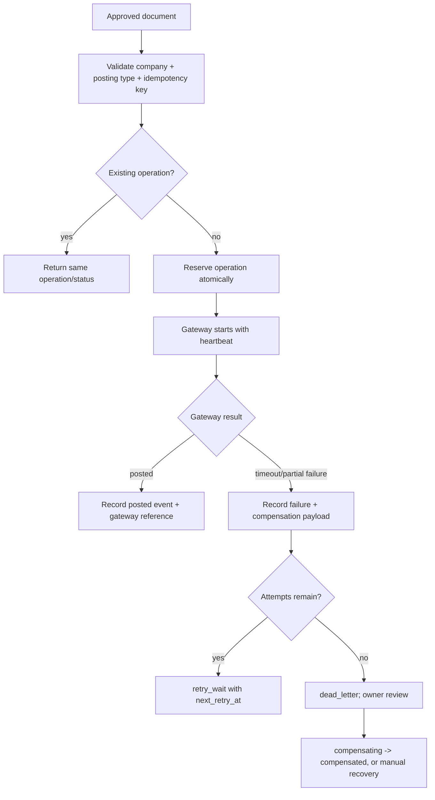

# Posting idempotency and recovery

ขอบเขตนี้เป็นด่านกลางก่อน Accounting/AP/Stock/PO Gateway ไม่สร้างรายการบัญชีหรือสต็อกเอง

- Input: บริษัท, Intake/Document ID, Posting Type และ idempotency key
- Output: operation เดิมที่ระบุสถานะ, gateway reference, retry/dead-letter และ Audit event
- States: reserved → processing → posted หรือ failed → retry_wait/dead_letter → compensating/compensated
- สิทธิ์: client อ่านได้เฉพาะผู้ดูแลบริษัท; การ reserve ให้ service role/gateway เท่านั้น
- Idempotency: `(company_id, idempotency_key)` unique; double-click, refresh และ retry คืน operation เดิม
- Failure: timeout/partial failure เก็บ error และ compensation payload; ไม่สร้างธุรกรรมซ้ำ
- Recovery: retry ตาม `next_retry_at` จนครบ `max_attempts`; จากนั้น dead-letter ให้เจ้าของตรวจและชดเชยแบบมี Audit
- Audit: ทุก transition ใช้ event key ไม่ซ้ำและ append-only
- Rollback: ปิด gateway/RPC ใหม่ได้ โดยคง operation/event ledger ไว้เพื่อกู้คืน

## Change record

| Version | Date | Rationale | Impact | Migration | Verification | Rollback |
| --- | --- | --- | --- | --- | --- | --- |
| v1.0 | 9/9/2569 | กัน posting ซ้ำและรองรับ timeout/partial failure | เพิ่ม ledger กลางก่อน gateway | `202609090001_posting_idempotency_recovery.sql` | contract, migration replay, RLS, gateway integration และ authenticated Posting smoke | revoke RPC/ปิด gateway; เก็บ ledger/event เดิม |
