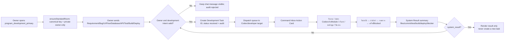

# Program Development Room Flow

## Purpose

Provide one private Web Chat room for the system owner to send development requirements to the Codex/developer queue without mixing business messages into the development loop.

## Inputs, outputs, roles, and permissions

- Input is a Web Chat message in room key `program_development_primary`. The canonical display name is `00 | Program Development` and the room is private.
- Only the single system owner may read, send, provision, transition tasks, and view task/audit/dispatch records. The owner is the active company member with `company_role='company_admin'` and `profiles.role='admin'`.
- Provisioning adds only the owner membership required to open the private room; it never bulk-adds members. A membership guard rejects every other profile.
- Accepted development intents contain one of Requirement, Bug, UI, Flow, Database, API, Test, Build, Deploy (including Thai equivalents). Other messages remain in Chat but are audited as rejected and do not create a task.
- A valid message creates one idempotent `development_tasks` row and one `development_task_dispatches` row targeting the Codex/developer queue. `source_message_id` and `event_key` prevent duplicates.
- Task states are `received`, `in_progress`, `waiting_review`, `completed`, and `blocked`. A System Result is a status/result projection containing task ID, files/commit, test/build/deploy evidence, and blocker; it is never re-ingested as a new task.
- The owner sees a Command Inbox Action Card for every task with Task ID, intent, owner, timestamps, dispatch target/status, and result evidence. Actions call owner-checked RPCs: receive (`received`), start (`in_progress`), request information (`waiting_review`), close (`completed`), and dispatch to Codex or developer queue. “ดูผลลัพธ์” opens stored result fields without changing task state.

## Failure, retry, and audit

- Room creation uses a company-scoped advisory lock and unique `(company_id, room_key)`. A failed provision remains `pending_retry` in the room audit; no fallback room is selected.
- Permission failures, non-development text, duplicate source message, invalid status transition, and dispatch failures are explicit audit events. Retry reuses the same task ID/event key.
- The business Program Loop never targets this room. Advance/attendance System Confirmations are rejected from this room and `system_result` is ignored by task routing.

## Change record

| Version | Date | Change | Migration | Rollback |
|---|---|---|---|---|
| v1.0 | 23/8/2569 | Add owner-only canonical development room, task/audit/dispatch queue, status transitions, and System Result guard | `20260823035207_program_development_room.sql` (Production baseline) | Disable the route trigger/RPCs and hide the room; retain chat, tasks, and audit for recovery |
| v1.1 | 23/8/2569 | Add owner-visible Command Inbox Action Cards for task transitions, Codex/Module dispatch and result drill-down; System Result remains display-only | `20260823043451_program_development_actions.sql` | Hide Action Cards and revoke the action RPC; retain chat, tasks, dispatch records and audit |
| v1.2 | 24/8/2569 | Keep non-development messages as Chat-only context and hide the shared Operational Core panel in this private room so business work cannot appear as a pending development task | None | Revert the room filter/UI guard; no data rollback is required |
