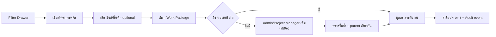
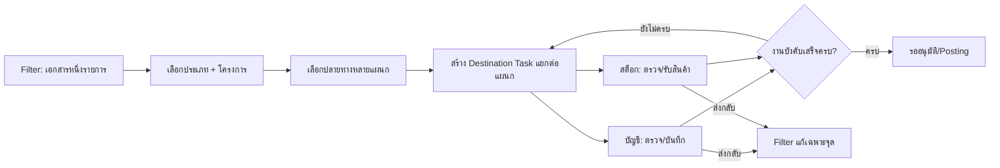

# Project Work Package: โครงสร้างงานย่อยหลายชั้น

## Multi-destination document flow — v1.1

- 1 Document Flow Item มีไฟล์ต้นฉบับ, Intake ID, โครงการ และ Timeline ชุดเดียว; `document_flow_destination_tasks` คือใบงานแยกของแต่ละแผนก ไม่ใช่สำเนาเอกสาร.
- Filter เลือกหลายปลายทางและกำหนดได้ว่างานใด **บังคับ**; งาน optional ไม่ขวางการปิดงานหลัก.
- งานแต่ละแผนกเป็น `queued → claimed → completed` หรือ `returned/cancelled`; ผู้รับงานทำได้เฉพาะแผนกของตน. Admin/Manager เห็นภาพรวมและจัดการได้.
- ระหว่างมี task ปลายทางที่ยังไม่เสร็จ เอกสารหลักอยู่สถานะ `destination_in_progress`; เมื่อทุก task บังคับ `completed` ระบบย้ายเอกสารหลักไปรออนุมัติ. ถ้ามี `returned` ต้องแก้เฉพาะ task นั้นและมี audit event ทั้งงานย่อยและงานหลัก.
- บิลเงินสดมีบัญชีเป็นปลายทางบังคับโดยค่าเริ่มต้น; สต็อกเป็นตัวเลือกเมื่อมีสินค้า/รับเข้า ไม่บังคับทุกใบ.
- ทุกห้องอ่าน `data_review_status` เดียวกัน: `complete`, `incomplete`, `recheck_required`, `rechecked`. เมื่อแก้ข้อมูลที่กระทบปลายทาง ให้เปิด task ของแผนกนั้นเป็นรอตรวจซ้ำเท่านั้น; เมื่อ task บังคับผ่านครบ ระบบบันทึก `rechecked`.

## Data and authority

- `projects` คือโครงการหลัก, `project_sites` คือไซต์/พื้นที่, `project_work_packages` คือขอบเขตงานที่ซ้อนได้หลายชั้นผ่าน `parent_id`.
- Document Flow ผูก `project_id` และ `work_package_id`; รวมต้นทุนจากลูกขึ้นงานแม่ทำในรายงาน ไม่ทำซ้ำเอกสาร.
- Admin/Project Manager สร้างงานย่อยได้; ผู้คัดแยกเลือกได้เฉพาะงานที่ active.
- RPC ตรวจ project/company เดียวกัน, parent เดียวกัน, ชื่อซ้ำภายใต้ parent และบันทึกผู้สร้าง/เวลา.
- Failure: ชื่อว่าง, parent ต่างโครงการ, งานซ้ำ, หรือไม่มีสิทธิ์ ต้องปฏิเสธพร้อมข้อความ; ผู้ใช้เลือกงานเดิมหรือเสนอให้ผู้ดูแลสร้างได้.
- Drawer แสดงทะเบียนงานกลางเป็นต้นไม้พับ/ขยายตาม `โครงการ → งานหลัก → งานย่อย`; การเลือกหรือเพิ่มงานไม่ขึ้นกับแผนกปลายทาง จึงใช้รายการเดียวกันได้ทั้งช่าง, บัญชี, สต็อก, จัดซื้อ และ HR.
- เมื่อบันทึกไม่สำเร็จ UI ต้องแปล error กลางเป็นสาเหตุที่ทำงานต่อได้: สิทธิ์ไม่พอ, โครงการ/งานย่อยคนละบริษัท, งานแม่ไม่ตรงโครงการ, ชื่อซ้ำ หรือ version conflict. ทุกกรณีไม่สร้างข้อมูลซ้ำและให้รีเฟรช/เลือกรายการเดิมตามความเหมาะสม.

## Change record

| Version | วันที่ | เหตุผล | Migration | Rollback |
|---|---|---|---|---|
| v1.0 | 19/8/2569 | เพิ่ม WBS หลายชั้นเพื่อผูกเอกสารกับขอบเขตงานที่ถูกต้อง | `202608190016_cash_receipt_and_work_packages.sql` | ซ่อน UI และไม่สร้างรายการใหม่; ไม่ลบข้อมูลที่ถูกใช้งาน |
| v1.1 | 19/8/2569 | แตกงานหลายปลายทางจากเอกสารชุดเดียว พร้อมสถานะแยกต่อแผนกและกติกาปิดงานบังคับ | `202608190017_document_flow_multi_destination.sql` | หยุดสร้าง task ใหม่; task/audit เดิมยังอ่านได้ |
| v1.2 | 20/8/2569 | เพิ่มสถานะข้อมูลกลางและ recheck task เฉพาะแผนกที่กระทบ | `202608200001_document_flow_data_review_status.sql` | ปิด UI สถานะ; ไม่ลบ audit เดิม |
| v1.3 | 20/8/2569 | ทำให้สถานะงานหลายปลายทางที่กำลังทำงานถูกต้องตามกฎทะเบียนกลาง จึง route ได้โดยไม่สร้างรายการซ้ำ | `20260820082024_document_flow_multi_destination_state_fix.sql` | หยุดสร้าง task ใหม่ชั่วคราว; task/audit ที่มีอยู่ยังอ่านได้ |
| v1.4 | 20/8/2569 | แสดงทะเบียนงานกลางเป็นต้นไม้ใน Drawer และแปลความผิดพลาดการบันทึกให้แก้ไขได้ทันที โดยไม่แยกงานย่อยตามแผนก | ไม่มี migration | คืน UI แบบ select เดิม; ข้อมูล/สิทธิ์/RPC ไม่เปลี่ยน |
