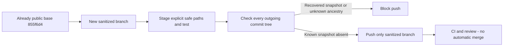

# Public release handoff - SYS-CICD-001

User decision 2026-09-05: keep recovered Production SQL local; publish only safe
code and documentation. Repository visibility was verified as public.

Branch `codex/supabase-sanitized-review` starts at the already-published
855f6d4. It does not descend from the local recovered-history commits. Do not
merge or cherry-pick those commits into this branch, push all refs, or push tags.
The original local worktree and commits are preserved for private review.

Before pushing, run `npm run test:public-release` and, after committing,
`npm run check:public-release`. The guard checks every outgoing commit tree,
including deleted snapshot history and an exact snapshot blob under a renamed
path. It is a scoped safeguard, not a general secret/DLP scanner: modified or
encoded content under another path requires human review. Never copy original
SQL into public code, fixtures or logs. Tests use synthetic strings only.

App/CLI source remains based on 855f6d4, whose application CI and full migration
replay passed. Production linked dry-run and history reconciliation remain
blocked; a clean public-release check does not approve migration or deploy.
No database state, RLS or business record changes are included here.

Owner: Platform. Evidence: task branch commit, local tests and public-release
guard output. Failure: stop before push, retain local work. Rollback: revert
the safe task commit; no database rollback. If private data has already been
published, removing a file is insufficient: escalate repository-history cleanup
and credential review rather than force-pushing without approval.

Local verification: public-release fixtures and workflow contracts passed;
the actual private checkpoint was rejected without printing its contents.
Typecheck, full lint and build passed. Dependencies were reused from the
unchanged lockfile through a local node_modules junction, not committed.
Public-release guard must run again after the final commit and before push.
