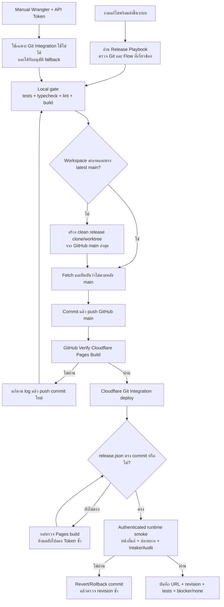

# Release and Deployment Incident Playbook

## เป้าหมาย

เอกสารนี้เป็นเส้นทางกลางสำหรับทุกห้องสนทนาและทุกงานพัฒนา ป้องกันการวนแก้ปัญหาเดิมเรื่อง Cloudflare Token, dirty worktree, revision ไม่ตรง และการประกาศว่า deploy สำเร็จก่อนตรวจหน้าจริง

## เส้นทางหลักที่ต้องใช้

Production frontend ใช้เส้นทางเดียวเป็นค่าเริ่มต้น:

`clean tested commit → GitHub main → GitHub verification → Cloudflare Git Integration → release.json → authenticated runtime smoke`

- ห้ามใช้ `CLOUDFLARE_API_TOKEN` ใน `.env.local` เป็นเงื่อนไขของการ deploy ปกติ
- Direct Wrangler (`npm run deploy:cloudflare`) เป็น emergency fallback เท่านั้น
- ถ้า workspace หลักมีงานอื่นค้าง ให้สร้าง clean release clone/worktree จาก GitHub `main` ล่าสุด ห้ามรวม/ลบ/รีเซ็ตงานของผู้อื่น
- ก่อน push ต้อง fetch GitHub และยืนยัน release commit ไม่ตามหลัง `main`
- หลัง push ต้องตรวจ GitHub workflow และ Cloudflare `release.json`; CI ผ่านอย่างเดียวไม่เท่ากับ Production พร้อมใช้

## Inputs, outputs และสถานะ

- Inputs: commit ที่ผ่าน Local gate, GitHub `main`, workflow result, Cloudflare Pages build, `release.json`, session ของบทบาทจริง และ Flow/Audit ของโมดูล
- Outputs: URL Production, revision ที่ตรงกับ commit, ผล smoke test, หลักฐานข้อมูลปลายทาง/Intake/Audit และ rollback commit
- States: `local_verified`, `pushed`, `ci_running`, `ci_failed`, `pages_building`, `deployed`, `runtime_verified`, `blocked`, `rolled_back`

## สิทธิ์และเจ้าของ

- ผู้พัฒนา/Release Owner รับผิดชอบ Local gate, commit, push, revision และ runtime smoke
- GitHub/Cloudflare credentials เก็บในระบบ Secret/Pages Integration ไม่ใส่ในเอกสาร, commit, log หรือข้อความสนทนา
- Token ใหม่หรือการเปลี่ยนสิทธิ์ Cloudflare ต้องได้รับจากเจ้าของบัญชีเท่านั้น และใช้เฉพาะ fallback ที่ได้รับอนุมัติ
- เจ้าของข้อมูลธุรกิจยังเป็น Module Owner; การ deploy ห้ามปิดหรือแก้รายการเงินจริงเพื่อทำให้ smoke test ดูผ่าน

## วิธีรับมือปัญหาที่เกิดซ้ำ

| อาการ | สาเหตุที่ต้องตรวจ | การดำเนินการมาตรฐาน |
| --- | --- | --- |
| `401 Unauthorized` จาก Token | Token หมดอายุ/ถูกยกเลิก/ไม่ใช่ Account Pages token | ถ้า Git Integration ปกติ ให้ใช้เส้นทาง Git ต่อและบันทึกว่า manual fallback ใช้ไม่ได้; ห้ามลอง Token เดิมซ้ำ |
| Working tree ไม่สะอาด | มีงานหลาย Module หรือไฟล์ของผู้ใช้อยู่ | สร้าง clean release clone/worktree จาก latest main; ห้าม reset/delete งานเดิม |
| GitHub CI ผ่านแต่ Cloudflare ยังรุ่นเก่า | Pages build ยังไม่เสร็จ/cache manifest | ตรวจ workflow และ poll `release.json` แบบ no-cache จน revision ตรง หรือรายงาน Pages blocker |
| `origin/main`, local HEAD และ Production ไม่ตรง | push/deploy คนละ revision | fetch latest main, rebase/cherry-pick ใน release cloneอย่างปลอดภัย, ทดสอบใหม่ แล้ว push commit เดียว |
| หน้าเปิดได้แต่ Flow ไม่ครบ | ตรวจเฉพาะ HTTP/build | ใช้ authenticated session ตรวจ source → UI/action → destination/Intake → Audit/Retry |

## Verification contract

ก่อนปิดงานต้องมีหลักฐานต่อไปนี้:

1. Targeted tests, typecheck, lint และ build ผ่านจาก release commit เดียวกัน
2. GitHub `main` ชี้ไป release commit และ workflow ของ commit นั้นผ่าน
3. Cloudflare `/release.json` แสดง revision เดียวกัน
4. หน้าที่แก้เปิดด้วย session จริงและเห็นพฤติกรรมใหม่
5. ข้อมูลเดิม/Intake/Audit ยังอยู่และจำนวนไม่ถูกซ่อนหรือลบ
6. ระบุ blocker ว่า `none found` หรือระบุจุดติดเดียวพร้อมหลักฐานและสิทธิ์ที่ต้องการ

## Retry, recovery และ rollback

- CI fail: แก้บน commit ใหม่แล้วรัน Local gate ใหม่ ห้าม rerun เพื่อซ่อน test ที่ยัง fail
- Pages build ช้า: รอและตรวจ manifest; ไม่เปลี่ยนไป manual deploy เพียงเพราะยังไม่ทันอัปเดต
- Runtime fail: revert release commit บน `main`, รอ Git Integration deploy revision rollback แล้ว smoke test ซ้ำ
- Database migration ไม่ถูกย้อนพร้อม frontend โดยอัตโนมัติ ต้องใช้ rollback note ของ Flow นั้นและห้าม drop/reset ข้อมูล

## Audit ที่ต้องบันทึกในรายงานส่งมอบ

- Git commit และ parent revision
- GitHub workflow URL/status
- Production URL, host, revision และ build time
- รายการ test/typecheck/lint/build
- หน้าจอ/บทบาทที่ smoke test และผลข้อมูลปลายทาง
- blocker หรือ `none found`
- rollback/recovery path

## Owner

Platform / Release Management Owner

## Change record

| Version | Date | Rationale | Impact | Migration | Verification | Rollback |
| --- | --- | --- | --- | --- | --- | --- |
| v1.0 | 24/8/2569 | ทำเส้นทางแก้ปัญหา deploy กลางให้ทุกห้องใช้เหมือนกัน และหยุดพึ่ง local Token ในเส้นทางปกติ | AGENTS, Release Flow, Cloudflare deployment docs และ contract test | ไม่มี | contract test, typecheck, lint, build, GitHub workflow, Cloudflare revision และ authenticated Chat/Intake smoke | revert เอกสาร/contract; runtime และข้อมูลธุรกิจไม่เปลี่ยน |
