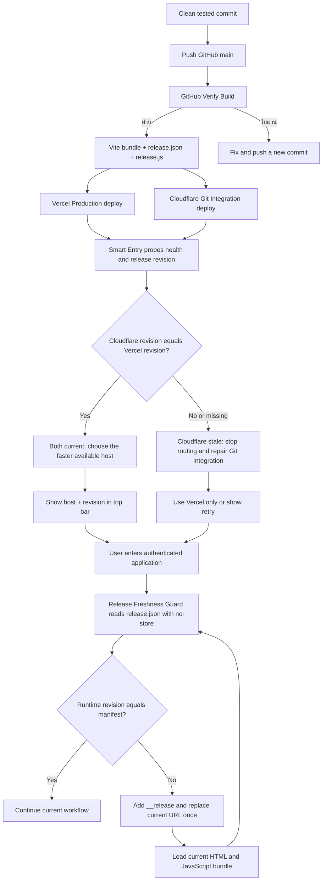

# Release Parity Flow

## Purpose

รักษาให้ Vercel Production เป็นระบบหลักและ Cloudflare Pages เป็นระบบสำรองที่ใช้ได้เฉพาะเมื่อ frontend artifact มาจาก Git revision เดียวกัน ผู้ใช้จึงไม่ถูกพาไปใช้หน้าเก่าแม้ Cloudflare จะตอบเร็วกว่า

## Inputs, outputs and states

- **Inputs:** Git revision, Vite release metadata, `health-check.svg`, `release.json`, `release.js`, deployment result ของ Vercel และ Cloudflare
- **Outputs:** การเลือก host ที่ปลอดภัย, revision ที่ตรวจแล้วใน Smart Entry, ป้าย `Vercel`/`Cloudflare` พร้อม revision บน Top Bar และ JavaScript runtime ที่ตรง manifest
- **States:** `building`, `deployed`, `probing`, `current`, `stale`, `unknown`, `selected`, `reloading`, `guarded`, `blocked`

## Roles and permissions

- Smart Entry และ release manifest เป็นข้อมูลสาธารณะก่อน Login และไม่มีข้อมูลบริษัท, ผู้ใช้ หรือ token
- Platform Owner เป็นผู้ deploy/reconcile host; ผู้ใช้ทั่วไปเห็นเฉพาะชื่อ host กับ revision ใน Top Bar
- Authentication, route guard และสิทธิ์ข้อมูลยังคงทำงานตามระบบเดิม ไม่มีการขยายสิทธิ์

## Integrations

- Vite สร้าง `release.json` และ `release.js` พร้อม bundle ทุกครั้ง
- Vercel รับ deployment จาก `main`; Cloudflare Pages ต้อง deploy artifact/revision เดียวกัน
- `public/_headers` ป้องกัน Cloudflare cache ของ manifest เพื่อให้ Smart Entry เห็น revision ล่าสุด
- Release Freshness Guard อ่าน `release.json` แบบ `no-store` เมื่อเริ่มแอป, กลับจาก bfcache, กลับมาออนไลน์ และเมื่อกลับเข้าหน้าหลังช่วงตรวจขั้นต่ำ

## Failure, retry and recovery

- Smart Entry ตรวจ health 3 รอบและอ่าน `release.js` จากทั้งสอง host
- ถ้า Cloudflare ไม่มี Release ID หรือ revision ไม่ตรง Vercel: สถานะ `stale`/`unknown`, ไม่ถูกเลือกอัตโนมัติและปิดลิงก์เลือกเอง
- ถ้า Vercel ตอบได้แต่ Cloudflare stale: ใช้ Vercel เท่านั้น
- ถ้าไม่มี host ที่ผ่านเงื่อนไข: แสดงปุ่มลองใหม่ ไม่ redirect วน และต้องแก้ deployment ก่อนเปิด fallback
- ถ้า runtime revision ไม่ตรง manifest: ใส่ `__release=<revision>` แล้วใช้ `location.replace` เพื่อโหลด HTML/JavaScript ล่าสุด; `sessionStorage` จำกัดการ refresh ซ้ำของ revision เดียวภายใน 2 นาที
- ถ้าอ่าน manifest ไม่ได้หรือ offline: ไม่บล็อก Login/งานที่กำลังทำ และตรวจใหม่เมื่อ online/visibility เปลี่ยนหรือถึงรอบถัดไป
- การกู้คืนคือ deploy Cloudflare จาก commit เดียวกับ Vercel แล้วตรวจ `release.json` อีกครั้ง; ไม่ต้องเปลี่ยน database หรือข้อมูลธุรกิจ

## Cloudflare Production release path

- เส้นทางหลักคือ clean release commit → GitHub `main` → GitHub verification → Cloudflare Git Integration; อ่านขั้นตอนเต็มจาก `docs/RELEASE_INCIDENT_PLAYBOOK.md`
- Working tree ต้องสะอาดและ release commit ต้องไม่ตามหลัง GitHub `main`; ถ้า workspace หลักมีงานอื่นค้าง ให้ใช้ clean clone/worktree โดยไม่ reset หรือลบงานเดิม
- ก่อน push ต้องผ่าน targeted tests, lint, typecheck และ build จาก commit เดียวกัน
- หลัง push ต้องตรวจ workflow ของ commit นั้น, remote `release.json` และ authenticated UAT หน้า Module/ปลายทาง/Intake/Audit ที่เปลี่ยน
- `npm run verify:cloudflare-production` ใช้รอและตรวจ revision จาก Automatic Deployment เท่านั้น ไม่ build หรือ upload artifact จากเครื่อง
- หาก Git Integration ขัดข้อง ให้แก้ Integration หรือ rollback ไป deployment ที่ Cloudflare build จาก GitHub สำเร็จ ห้ามอัปโหลด `dist` จากเครื่อง
- Environment อยู่ใน Cloudflare Secret ชุดกลาง; ห้ามคัดลอกมาไว้ใน Git, log, เอกสาร หรือข้อความสนทนา

## Audit and owner

- Smart Entry และ Freshness Guard เก็บผลตรวจ/refresh guard เฉพาะใน `sessionStorage`: เวลา, host, latency, revision, parity state และปลายทางที่เลือก
- `session_start` และ `page_view` บันทึก `release_revision`/`release_host` เพื่อแยกปัญหา runtime เก่าโดยไม่เก็บชื่อไฟล์หรือข้อมูลธุรกิจ
- ไม่มีการส่งข้อมูลส่วนบุคคลหรือ secret ออกไปในการตรวจ
- **Owner:** Platform / Release Management Owner

## Change record

| Version | Date | Rationale | Impact | Migration | Verification | Rollback |
|---|---|---|---|---|---|---|
| v1.0 | 23/8/2569 | แก้ปัญหา Vercel/Cloudflare แสดง frontend คนละรุ่นโดยไม่ชัดเจน | เพิ่ม manifest, parity gate, ป้าย host/revision และ no-cache header ของ Cloudflare | ไม่มี schema/data migration | release/smart-entry tests, lint/build, ตรวจ manifest และ deployment ทั้งสอง host | rollback ทั้งสอง host ไป revision เดียวกัน หรือ revert parity gate ชั่วคราว; ข้อมูลผู้ใช้ไม่ถูกกระทบ |
| v1.1 | 23/8/2569 | ป้องกัน User Token ผ่าน verify แต่ deploy Pages ไม่ได้ และป้องกัน clean worktree build โดยไม่มี `.env` จนหน้าขาว | เพิ่มคำสั่ง deploy กลาง, Account Token/Pages preflight, environment/release/runtime gates | ไม่มี | contract test, lint, typecheck, build และ Cloudflare revision smoke | ใช้ revision ก่อนหน้าที่ผ่าน smoke test หรือ deploy commit เดิมผ่านคำสั่งกลาง; ไม่กระทบฐานข้อมูล |
| v1.2 | 24/8/2569 | ยุติความสับสนจากการพยายามใช้ local credential ซ้ำ ทั้งที่ Production ใช้ Git Integration | กำหนด GitHub main/Git verification/Cloudflare Git Integration เป็นเส้นทางมาตรฐาน | ไม่มี | release playbook contract, GitHub workflow, Cloudflare revision และ authenticated runtime smoke | revert เอกสาร/contract และใช้ release revision ก่อนหน้า; ไม่กระทบข้อมูลธุรกิจ |
| v1.3 | 26/8/2569 | ป้องกัน local artifact ข้ามค่ากลางของ Cloudflare | บังคับ Git Integration เป็นเส้นทางเดียวและเปลี่ยน deploy command เป็น revision verifier | ไม่มี | deployment contract, typecheck, lint, release revision smoke | rollback ไป Git-built deployment ก่อนหน้า; ไม่กระทบข้อมูลธุรกิจ |
| v1.4 | 31/8/2569 | มือถือคง SPA runtime เก่าแม้ Production revision ใหม่ ทำให้ Attachment UI รุ่นใหม่ไม่ทำงาน | เพิ่ม Release Freshness Guard, cache-busted one-time replace และ revision telemetry | ไม่มี schema/data migration | release freshness/chunk recovery/attachment tests, typecheck, lint, build, revision parity และ authenticated mobile retry | revert guard/telemetry; ผู้ใช้ยังเปิด URL พร้อม `__release=<revision>` เพื่อกู้คืนได้และข้อมูลธุรกิจไม่ถูกเปลี่ยน |
